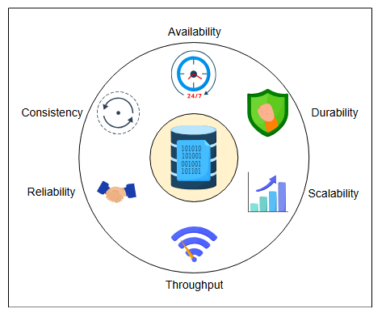

# Оценка проектирования Blob-хранилища

Рассмотрим, как наш проект blob-хранилища выполняет свои требования.

Давайте оценим, как наш проект помогает нам достичь наших требований.

## Доступность

Репликация в нашем проекте обеспечивает доступность системы. Для чтения данных мы храним четыре реплики для каждого blob-объекта. Имея реплики, мы можем распределять нагрузку запросов. Если один узел выходит из строя, другой узел-реплика может обслужить запрос. Более того, наша стратегия размещения реплик справляется со сбоем целого дата-центра и даже может справиться с ситуацией недоступности региона из-за **стихийных бедствий**. Мы гарантируем, что в любой момент времени доступно достаточное количество реплик, используя нашу службу мониторинга, которая своевременно создает копию данных, если количество отказавших реплик превышает указанный порог.

Для запросов на запись мы реплицируем данные внутри кластера отказоустойчивым способом и быстро отвечаем пользователю, делая систему доступной для запросов на запись.

Чтобы поддерживать доступность управляющего узла, мы храним резервную копию его состояния. В случае сбоя управляющего узла мы запускаем новый экземпляр управляющего узла, инициализируя его из сохраненного состояния.

## Долговечность

Службы репликации и мониторинга обеспечивают долговечность данных. Данные, однажды загруженные, синхронно реплицируются внутри кластера хранения. Если происходит потеря данных на одном узле, мы можем восстановить данные с других узлов. Служба мониторинга отслеживает диски хранения. Если какой-либо диск выходит из строя, служба мониторинга предупреждает администраторов о необходимости замены диска и отправляет сообщения управляющему узлу для копирования содержимого этого диска на другой доступный диск или на новый добавленный диск. Затем управляющий узел соответствующим образом обновляет сопоставление.

## Масштабируемость

Партиционирование и разделение blob-объектов на чанки небольшого размера помогает нам масштабироваться для миллиардов запросов к blob-объектам. Blob-объекты партиционируются на отдельные диапазоны и обслуживаются разными серверами партиций. Сопоставления партиций указывают, какой сервер партиций будет обслуживать запросы к какому конкретному диапазону blob-объектов. Партиционирование также обеспечивает автоматическую балансировку нагрузки между серверами партиций для удовлетворения потребностей в трафике blob-объектов.

Наша система горизонтально масштабируется для хранения. По мере возникновения потребности в хранилище мы добавляем больше узлов данных. Однако в какой-то момент наш управляющий узел может стать узким местом. Один управляющий узел может обрабатывать 10 000 запросов в секунду (QPS).

> **Вопрос для размышления:**
>
> Как мы можем дальше масштабироваться, когда наш управляющий сервер достигает своих пределов, и мы не можем улучшить его вычислительные возможности путем вертикального масштабирования?
> 

>  
<b>Показать</b>

> Мы можем создать два независимых экземпляра нашей системы. У каждого экземпляра будет свой собственный управляющий узел и набор узлов данных. Было показано, что развертывание системы, подобной нашей, может достигать нескольких петабайт. Поэтому создание дополнительных экземпляров может помочь нам в дальнейшем масштабировании.
>
> Для дальнейшего масштабирования внутри одного экземпляра нам нужен новый, более сложный дизайн.
>  

## Пропускная способность

Мы сохраняем чанки blob-объекта на разных узлах данных, что распределяет запросы к blob-объекту на несколько машин. Параллельное извлечение чанков с нескольких узлов данных помогает нам достичь высокой пропускной способности.

Кроме того, кэширование на разных уровнях — на стороне клиента, на фронтенд-серверах и на управляющем узле — улучшает нашу пропускную способность и снижает задержку.

## Надежность

Мы достигаем надежности с помощью наших методов мониторинга. Например, протокол heartbeat информирует управляющий узел о состоянии узлов данных. Это позволяет управляющему узлу запрашивать данные только у надежных узлов. Кроме того, он принимает необходимые меры для обеспечения надежной работы сервиса. Например, сбой узла заставляет управляющий узел запрашивать дополнительный узел-реплику.

Службы мониторинга также предупреждают администраторов о необходимости замены неисправного оборудования, такого как вышедшие из строя диски или поврежденные сетевые каналы или коммутаторы. Для обеспечения надежной работы сервиса управляющий узел отслеживает доступное пространство на диске. Если доступное пространство достигает определенного порога, администраторам отправляется предупреждение о необходимости добавления новых дисков.

## Согласованность

Мы синхронно реплицируем блоки данных на диске внутри кластера хранения по запросу на запись, делая данные строго согласованными внутри кластера хранения. Это делается на критическом пути пользователя. Мы обслуживаем последующие запросы на чтение этих данных из того же кластера хранения, пока не реплицируем эти данные в другой дата-центр или на другие кластеры хранения.

После ответа на запрос на запись и репликации данных внутри кластера хранения мы асинхронно реплицируем blob-объекты в дата-центрах, расположенных далеко, или в других регионах для обеспечения доступности.

> Какие методы вы бы использовали, чтобы сделать blob-хранилище **безопасным**? Напишите свой ответ в виджете ниже.

> 

>  
<b>Показать</b>

> Чтобы защитить данные в хранилище больших двоичных объектов, вы должны использовать методы шифрования, такие как AES, для защиты данных в состоянии покоя, что делает их нечитаемыми без ключа расшифровки. Что касается передаваемых данных, то использование протокола HTTPS (HTTP через SSL/TLS) шифрует связь между клиентами и хранилищем, обеспечивая конфиденциальность и целостность. Кроме того, внедрение контроля доступа на основе ролей (RBAC) помогает ограничить доступ только авторизованным пользователям, а проверки целостности данных, такие как контрольные суммы или хэш-функции, позволяют убедиться, что данные остаются неизменными во время хранения и передачи.
>  

## Заключение

Мы увидели, что blob-хранилище предназначено для хранения крупноразмерных и неструктурированных данных. Blob-хранилище помогает приложениям хранить изображения, видео, аудио и т. д. В настоящее время оно используется многими приложениями, такими как YouTube, Facebook, Instagram, Twitter и другие. Мы спроектировали систему, в которой пользователи могут выполнять основные функции blob-хранилища. Наконец, мы оценили наш проект на основе наших нефункциональных требований.