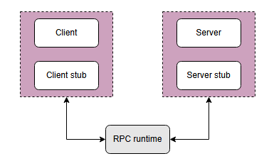
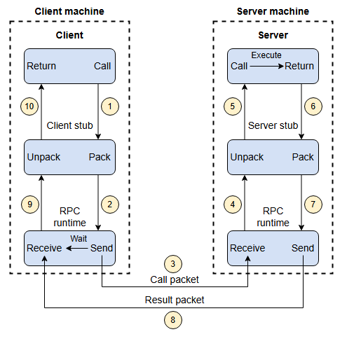

### Сетевые абстракции: Удалённые вызовы процедур

Рассмотрим, что такое удалённые вызовы процедур и как они помогают разработчикам.

Удалённые вызовы процедур (RPC) предоставляют разработчикам абстракцию локального вызова процедуры, скрывая сложности, связанные с упаковкой и отправкой аргументов функции на удалённый сервер, получением возвращаемых значений и управлением повторными сетевыми запросами.

#### Что такое RPC?

RPC — это протокол межпроцессного взаимодействия, широко используемый в распределённых системах. В модели сетевого взаимодействия OSI, RPC охватывает транспортный и прикладной уровни.

Механизмы RPC применяются, когда компьютерная программа вызывает исполнение процедуры или подпрограммы в отдельном адресном пространстве.

**Примечание:** Процедура или подпрограмма пишется как обычный/локальный вызов процедуры, и программисту не нужно явно прописывать детали удалённого взаимодействия.

#### Как работает RPC?

Когда мы совершаем удалённый вызов процедуры, вызывающая среда приостанавливается, а параметры процедуры отправляются по сети в среду, где процедура должна быть выполнена.

Когда выполнение процедуры завершается, результаты возвращаются в вызывающую среду, где исполнение возобновляется, как после обычного вызова процедуры.

Чтобы понять, как это работает, рассмотрим пример клиент-серверной программы. В программе RPC задействовано пять основных компонентов, как показано на следующей иллюстрации:

Клиент, заглушка клиента (client stub) и один экземпляр среды выполнения RPC (RPC runtime) работают на клиентской машине. Сервер, заглушка сервера (server stub) и один экземпляр среды выполнения RPC работают на серверной машине.

В процессе RPC происходят следующие шаги:

1.  Клиент инициирует процесс заглушки клиента, передавая ей параметры как при обычном вызове. Заглушка клиента хранится в адресном пространстве клиента.
2.  Заглушка клиента преобразует параметры в стандартизированный формат и упаковывает их в сообщение. После упаковки параметров в сообщение заглушка клиента обращается к локальной среде выполнения RPC с запросом доставить сообщение на сервер.
3.  Среда выполнения RPC на клиенте доставляет сообщение на сервер по сети. После отправки сообщения на сервер она ожидает ответного сообщения с результатом.
4.  Среда выполнения RPC на сервере получает сообщение и передаёт его заглушке сервера.

    **Примечание:** Среда выполнения RPC отвечает за передачу сообщений между клиентом и сервером по сети. В обязанности среды выполнения RPC также входят повторная передача, подтверждение и шифрование.
5.  Заглушка сервера распаковывает сообщение, извлекает из него параметры и вызывает нужную серверную процедуру через локальный вызов для выполнения требуемых действий.

6.  После того как серверная процедура выполнена с заданными параметрами, результат возвращается заглушке сервера.
7.  Заглушка сервера упаковывает полученный результат в сообщение и отправляет его среде выполнения RPC на сервере на транспортном уровне.
8.  Среда выполнения RPC на сервере возвращает упакованный результат среде выполнения RPC на клиенте по сети.
9.  Среда выполнения RPC на клиенте, которая ожидала результат, теперь получает его и передаёт заглушке клиента.
10. Заглушка клиента распаковывает результат, и в этот момент процесс выполнения возвращается к вызывающей стороне.

**Примечание:** Бэкенд-сервисы используют RPC в качестве основного механизма коммуникации из-за его высокой производительности и простой абстракции вызова удалённого кода как локальных функций.

#### Примеры использования в реальном мире:

RPC используются во многих реальных сервисах. Взгляните на примеры ниже:

*   **Google:** Google использует RPC в различных частях своей распределённой инфраструктуры. Они разработали gRPC, фреймворк с открытым исходным кодом, который использует RPC для создания эффективных и высокопроизводительных распределённых систем. Он применяется в таких сервисах, как Google Search, YouTube и др., где позволяет Google поддерживать связь и обмен данными между различными компонентами их сервисов, что необходимо для достижения производительности в реальном времени.

*   **Uber:** Uber использует RPC для различных функций, включая отслеживание местоположения в реальном времени, подбор поездок и связь между водителями и пассажирами. RPC позволяет Uber предоставлять быстрые и отзывчивые сервисы, облегчая обмен данными между приложением пользователя и сервером.

*   **Facebook:** Большинство сервисов в Facebook написаны с использованием Thrift для RPC, а некоторые системы хранения данных используют Thrift для сериализации записей на диске. Это даёт Facebook несколько преимуществ. Например, это обеспечивает совместимость (interoperability) между различными языками, например, когда клиент на Python взаимодействует с сервером на C++.

### Итог

Метод RPC похож на вызов локальной процедуры, за исключением того, что вызываемая процедура обычно выполняется в другом процессе и на другом компьютере.

RPC позволяет разработчикам создавать приложения на базе распределённых систем. Разработчики могут использовать метод RPC, не вникая в детали сетевого взаимодействия. В результате они могут сосредоточиться на аспектах проектирования, а не на особенностях аппаратного и коммуникационного уровней.