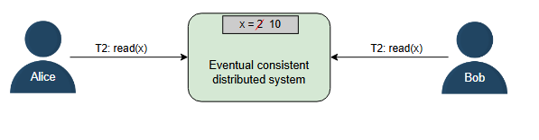
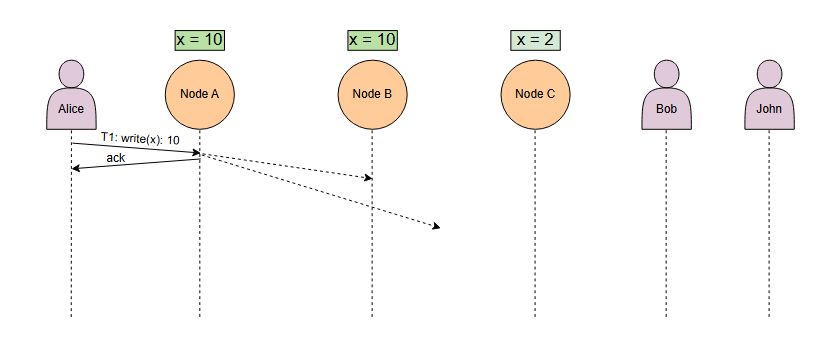

### Спектр моделей согласованности (consistency models)

Изучим модели согласованности и посмотрим, какая из них подходит под требования нашего приложения.

#### Что такое согласованность (consistency)?

В распределённых системах согласованность может означать многое. Одно из значений — каждая реплика (узел-реплика) имеет одинаковое
представление данных в определённый момент времени. Другое — каждый запрос на чтение получает значение самой последней записи. Это не
единственные определения согласованности, так как существует множество её форм. Обычно модели согласованности предоставляют нам абстракции
для анализа корректности распределённой системы, выполняющей параллельные операции чтения, записи и изменения данных.

Если нам нужно спроектировать или создать приложение, для которого требуется стороннее хранилище, такое как S3 или Cassandra, мы можем
изучить гарантии согласованности, предоставляемые S3, чтобы решить, использовать его или нет. Давайте рассмотрим различные типы
согласованности.

Два края спектра согласованности:

* **Сильнейшая согласованность (Strongest consistency)**
* **Слабейшая согласованность (Weakest consistency)**

Между этими двумя крайностями существуют и другие модели согласованности, некоторые из которых показаны на следующей иллюстрации:

Существует разница между согласованностью в свойствах **ACID** и согласованностью в **теореме CAP**.

В основе согласованности **ACID** лежат правила базы данных. Если схема указывает, что значение должно быть уникальным, согласованная
система обеспечит уникальность этого значения во всех операциях. Если внешний ключ указывает, что удаление одной строки приведёт к удалению
связанных строк, согласованная система гарантирует, что состояние не будет содержать связанные строки после удаления основной.

Согласованность в **CAP** гарантирует, что в распределённой системе каждая реплика одного и того же логического значения всегда имеет одно и
то же точное значение. Стоит отметить, что это логическая, а не физическая гарантия. Из-за скорости света репликация значений по кластеру
может занимать некоторое время. Запрещая клиентам доступ к разным значениям на разных узлах, кластер тем не менее может предоставить
логически целостную картину.

#### Согласованность в конечном счёте (Eventual consistency)

Согласованность в конечном счёте — это самая слабая модель согласованности. Эту модель выбирают приложения, у которых нет строгих требований
к упорядочиванию и которым не нужно, чтобы операции чтения возвращали результат самой последней записи. Согласованность в конечном счёте
гарантирует, что все реплики сойдутся к конечному значению через конечное время и при условии, что новых записей больше не поступает. Если
новые записи продолжают поступать, реплики в системе с согласованностью в конечном счёте могут никогда не прийти к единому состоянию. Пока
реплики не сойдутся, разные реплики могут возвращать разные значения.

Согласованность в конечном счёте обеспечивает высокую доступность (high availability).

**Пример**

Система доменных имён (DNS) — это высокодоступная система, которая обеспечивает поиск имён для сотен миллионов устройств в интернете. Она
использует модель согласованности в конечном счёте и не обязательно отражает самые последние значения.

**Примечание:** Cassandra — это высокодоступная NoSQL база данных, которая обеспечивает согласованность в конечном счёте.

#### Причинная согласованность (Causal consistency)

Причинная согласованность работает путём разделения операций на зависимые и независимые. Зависимые операции также называют
причинно-связанными. Причинная согласованность сохраняет порядок причинно-связанных операций.

На следующей иллюстрации процесс P1 записывает значение `a` в ячейку `x`. Чтобы процесс P2 записал значение `b` в ячейку `y`, ему сначала
нужно вычислить `b`. Поскольку `b = x + 5`, операция чтения `x` должна быть выполнена перед записью `b` в ячейку `y`. Вот почему `read(x)a`
и `write(y)b` являются причинно-связанными.

Эта модель не гарантирует упорядочивание для операций, которые не являются причинно-связанными. Эти операции могут быть видны в разных
возможных порядках.

Причинная согласованность в целом слабее, но строже, чем согласованность в конечном счёте. Она используется для предотвращения
неинтуитивного поведения.

**Пример**

Модель причинной согласованности используется в системах комментирования. Например, для ответов на комментарий к посту в Facebook мы хотим
отображать ответы после того комментария, на который они отвечают. Это происходит потому, что существует причинно-следственная связь между
комментарием и ответами на него.

**Примечание:** Существует много других моделей согласованности, помимо четырёх, рассмотренных в этом уроке, и всё ещё есть место для новых.
Исследователи разработали новые модели согласованности. Например, Уайатт Ллойд и соавторы (Wyatt Lloyd, et al.) предложили модель causal+
consistency для ускорения некоторых специфических типов транзакций.

#### Последовательная согласованность (Sequential consistency)

Последовательная согласованность строже, чем причинная. Она сохраняет порядок, определённый программой каждого клиента. Однако
последовательная согласованность не гарантирует, что записи становятся видимыми мгновенно или в том же порядке, в котором они произошли
согласно неким глобальным часам.

**Пример**

В приложениях социальных сетей обычно нам не важен порядок, в котором появляются посты некоторых наших друзей. Однако мы всё же ожидаем, что
посты одного конкретного друга будут появляться в том порядке, в котором они были созданы. Точно так же мы ожидаем, что комментарии наших
друзей к посту будут отображаться в том порядке, в котором они были отправлены. Последовательная согласованность отражает все эти
особенности.

#### Строгая согласованность, или линеаризуемость (Strict consistency aka linearizability)

Строгая согласованность, или линеаризуемость — это самая сильная модель согласованности. Эта модель гарантирует, что запрос на чтение с
любой реплики получит значение самой последней записи. Как только клиент получает подтверждение о выполнении операции записи, другие клиенты
могут прочитать это значение.

Линеаризуемости сложно достичь в распределённой системе. Среди причин таких сложностей — переменные сетевые задержки и сбои. Следующие
слайды показывают, как переменные сетевые задержки делают возможным, что разные стороны видят разные значения.

_Существует три пользователя системы, состоящей из трёх узлов (реплик), и каждый узел изначально имеет значение x, равное 2._

Обычно синхронная репликация является одним из компонентов для достижения строгой согласованности, хотя сама по себе она недостаточна. Для
достижения строгой согласованности нам могут понадобиться алгоритмы консенсуса, такие как Paxos и Raft.

Линеаризуемость влияет на доступность системы, поэтому она используется не всегда. Приложения с высокими требованиями к согласованности
используют такие методы, как репликация на основе кворума, для повышения доступности системы.

**Пример**

Обновление пароля учётной записи требует строгой согласованности. Например, если мы подозреваем подозрительную активность на нашем
банковском счёте, мы немедленно меняем пароль, чтобы посторонние пользователи не могли получить доступ к нашему счёту. Если бы из-за
отсутствия строгой согласованности можно было получить доступ к нашему счёту с помощью старого пароля, то смена пароля была бы бесполезной
стратегией безопасности.

**Примечание:** База данных Google Spanner заявляет о линеаризуемости для многих своих операций.

### Итог

Линеаризуемые сервисы выглядят так, как будто выполняют транзакции/операции в последовательном порядке в реальном времени. Они упрощают
создание корректных приложений на своей основе, ограничивая набор значений, которые сервисы могут возвращать прикладным процессам.

В обмен на свои строгие гарантии линеаризуемые сервисы имеют более низкие показатели производительности, чем сервисы с более слабой
согласованностью. Представьте себе операцию чтения в хранилище «ключ-значение», которая возвращает значение, записанное параллельной
операцией записи. Если хранилище «ключ-значение» имеет слабую согласованность, эта операция чтения не накладывает никаких ограничений на
будущие чтения.

Программистам приложений приходится идти на компромисс между производительностью и доступностью, если они используют сервисы со строгими
моделями согласованности. В обмен на повышенную производительность эти модели могут нарушать инварианты приложений, построенных на их
основе.