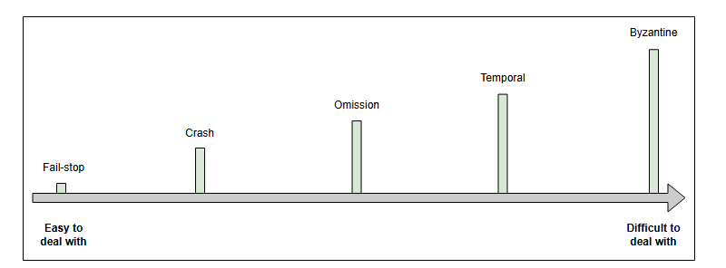

### Спектр моделей отказов

Изучим отказы в распределённых системах и сложность борьбы с ними.

Отказы — это неотъемлемая часть мира распределённых систем, и они могут проявляться различными способами. Они могут возникать и исчезать или же сохраняться в течение длительного периода.

Модели отказов предоставляют нам основу для анализа последствий отказов и возможных способов борьбы с ними.

Ниже представлена иллюстрация, показывающая спектр различных моделей отказов:

_Это спектр моделей отказов. Уровень сложности борьбы с отказом возрастает по мере продвижения вправо._

#### Fail-stop (Отказ с оповещением)

При этом типе отказа узел в распределённой системе останавливается навсегда. Однако другие узлы могут обнаружить, что этот узел отказал, при попытке связаться с ним.

С точки зрения разработчиков распределённых систем, отказы типа fail-stop — самые простые и удобные для обработки.

#### Crash (Аварийный отказ)

При этом типе отказа узел в распределённой системе останавливается «молча» (без оповещения), и другие узлы не могут обнаружить, что он прекратил работу.

#### Omission failures (Отказы из-за пропуска)

При отказах из-за пропуска узел не может отправить или получить сообщения. Существует два типа таких отказов. Если узел не может ответить на входящий запрос, это называется **отказом отправки (send omission)**. Если узел не может получить запрос и, следовательно, не может его подтвердить, это называется **отказом приёма (receive omission)**.

#### Temporal failures (Временны́е отказы)

При временны́х отказах узел выдаёт правильные результаты, но слишком поздно, чтобы они были полезны. Такой отказ может быть вызван плохими алгоритмами, неудачной стратегией проектирования или потерей синхронизации между тактовыми генераторами процессоров.

#### Byzantine failures (Византийские отказы)

При византийских отказах узел демонстрирует произвольное поведение: например, передаёт произвольные сообщения в произвольное время, выдаёт неверные результаты или останавливается на полпути. В основном это происходит из-за атаки злоумышленника или ошибки в программном обеспечении. Византийский отказ — это самый сложный тип отказа, с которым приходится иметь дело.