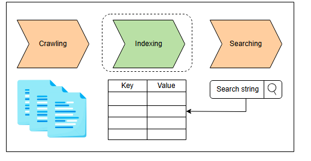

# Проектирование систем: Распределенный поиск

Узнайте, как работает поисковая система, и поймите наш высокоуровневый план проектирования распределенной поисковой системы.

## Зачем нужна поисковая система?

В наши дни мы видим строку поиска почти на каждом веб-сайте. Мы используем эту строку поиска, чтобы выбрать релевантный контент из огромного количества контента, доступного на этом сайте. Строка поиска позволяет нам быстро находить то, что мы ищем. Например, на сайте Educative представлено множество курсов. Если бы у нас не было функции поиска, пользователям пришлось бы пролистывать множество страниц и читать название каждого курса, чтобы найти тот, который им нужен.

Возьмем другой пример. На YouTube загружены и хранятся миллиарды видео. Представьте, если бы YouTube не предоставлял нам строку поиска. Как бы мы нашли конкретное видео среди миллионов роликов, размещенных на YouTube за многие годы? Потребовались бы месяцы, чтобы просмотреть все эти видео и найти нужное. Пользователям сложно находить то, что они ищут, просто прокручивая страницы.

Поисковые системы — еще более масштабный пример. В интернете существуют миллиарды веб-сайтов. Каждый сайт содержит множество веб-страниц, и на каждой из них — масса контента. При таком объеме контента интернет был бы практически бесполезен без поисковых систем, и пользователи бы просто затерялись в море нерелевантной информации. По сути, поисковые системы — это фильтры для огромного количества доступных данных. Они позволяют пользователям быстро получать информацию, представляющую реальный интерес, без необходимости просеивать слишком много ненужных веб-страниц.

За каждой строкой поиска стоит поисковая система.

## Что такое поисковая система?

**Поисковая система** — это система, которая принимает от пользователя текстовый ввод (поисковый запрос) и возвращает релевантный контент за несколько секунд или меньше. Существует три основных компонента поисковой системы:

*   **Краулер** (crawler), который извлекает контент и создает **документы**.
>Для поисковой системы документ состоит из текста, извлеченного с веб-страницы. На веб-странице магазина фильмов документом может быть объект в формате JSON, содержащий названия, описания и другие метаданные видеороликов, по которым мы хотим выполнить поисковые запросы. Документы могут быть в формате JSON или любом другом подходящем формате. Документы хранятся в распределенном хранилище, таком как S3 или HDFS.
*   **Индексатор** (indexer), который создает поисковый индекс.
*   **Поисковик** (searcher), который отвечает на поисковые запросы, выполняя их по *индексу*, созданному *индексатором*.

*Три фазы работы поисковой системы*

> **Примечание:** У нас есть отдельная глава, посвященная объяснению компонента-краулера. В этой главе мы сосредоточимся на индексации.

## Как мы будем проектировать распределенную поисковую систему?

Мы разделили проектирование распределенной поисковой системы на пять уроков:

1.  **Требования:** В этом уроке мы перечислим функциональные и нефункциональные требования к распределенной поисковой системе. Мы также оценим ресурсы нашей системы, такие как серверы, хранилище и пропускную способность, необходимые для обслуживания определенного количества запросов.
2.  **Индексация:** Этот урок дает базовые знания о процессе индексации на примере. После обсуждения индексации мы также рассмотрим централизованную архитектуру распределенных поисковых систем.
3.  **Первоначальный дизайн:** Этот урок включает высокоуровневый дизайн нашей системы, ее API, а также детали процесса индексации и поиска.
4.  **Окончательный дизайн:** В этом уроке мы оцениваем наш предыдущий дизайн и дорабатываем его, чтобы сделать более масштабируемым.
5.  **Оценка:** Этот урок объясняет, как спроектированная нами распределенная поисковая система соответствует своим требованиям.

Давайте начнем с понимания требований к проектированию распределенной поисковой системы.