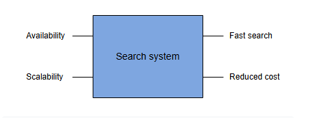
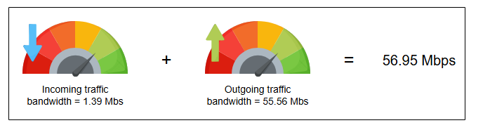

# Требования к проектированию распределенной поисковой системы

Давайте определим требования к распределенной поисковой системе и наметим необходимые ресурсы.
S

## Требования

Давайте разберемся в функциональных и нефункциональных требованиях к распределенной поисковой системе.

### Функциональные требования

Ниже приведено функциональное требование к распределенной поисковой системе:

* **Поиск**: Пользователи должны получать релевантный контент на основе своих поисковых запросов.

### Нефункциональные требования

Вот нефункциональные требования к распределенной поисковой системе:

* **Доступность (Availability)**: Система должна быть высокодоступной для пользователей.
* **Масштабируемость (Scalability)**: Система должна иметь возможность масштабироваться по мере увеличения объема данных. Другими словами,
  она должна быть способна индексировать большое количество данных.
* **Быстрый поиск по большим данным (Fast search on big data)**: Пользователь должен быстро получать результаты, независимо от того, сколько
  контента он ищет.
* **Снижение затрат (Reduced cost)**: Общая стоимость создания поисковой системы должна быть невысокой.

## Оценка ресурсов

Давайте оценим общее количество серверов, объем хранилища и пропускную способность, которые требуются для распределенной поисковой системы.
Мы рассчитаем эти числа на примере поиска на YouTube.

### Оценка количества серверов

Чтобы оценить количество серверов, нам нужно знать число ежедневных активных пользователей функции поиска YouTube. Предположим, у нас 150
миллионов ежедневных активных пользователей, использующих функцию поиска. Учитывая наше допущение об
использовании количества ежедневных активных пользователей в качестве прокси для оценки количества серверов, мы можем предположить, что
для числа запросов в секунду, чтобы определить количество серверов для пиковых нагрузок, мы получаем 150 миллионов запросов в секунду. Затем
мы используем следующую формулу для расчета количества серверов:

`Необходимое количество серверов при пиковой нагрузке = (Количество запросов в секунду) / (RPS одного сервера)`

Используя 64 000 в качестве оценочного RPS сервера из главы Приблизительные расчеты, необходимое количество серверов оценивается следующим
образом:

`Необходимое количество серверов при пиковой нагрузке = 150 миллионов / 64 000 = 2343.75 ≈ 2350 серверов`

> **Примечание:** Одновременные запросы значительно влияют на необходимое количество серверов по сравнению с запросами, распределенными во
> времени.

### Оценка хранилища

Метаданные каждого видео хранятся в отдельном JSON-документе. Каждый документ уникально идентифицируется по ID видео. Эти метаданные
содержат название видео, его описание, название канала и транскрипт. Мы принимаем следующие допущения для оценки хранилища, необходимого для
индексации одного видео:

* Размер одного JSON-документа составляет 200 КБ.
* Количество уникальных терминов или ключей, извлеченных из одного JSON-документа, составляет 1000.
* Объем дискового пространства, необходимого для добавления одного термина в таблицу индекса, составляет 100 байт.

Для вычисления объема хранилища, необходимого для индексации одного видео, используется следующая формула:

`Общий_объем_хранилища/видео = Объем_хранилища/документ + (Количество_терминов/документ × Объем_хранилища/термин)`

#### Общий объем хранилища, необходимый для индексации одного видео на YouTube

| Хранилище на JSON-документ (КБ) | Кол-во терминов на документ | Хранилище на термин (Байт) | Общий объем на видео (КБ) |
|:--------------------------------|:----------------------------|:---------------------------|:--------------------------|
| 200                             | 1000                        | 100                        | 300                       |

В таблице выше мы рассчитываем хранилище, необходимое для индексации одного видео. Мы уже видели, что общий объем хранилища на видео
составляет 300 КБ. Предполагая, что в среднем количество видео, загружаемых на YouTube в день, составляет 6000, давайте рассчитаем общий
объем хранилища, необходимый для индексации видео, загружаемых за день. Для вычисления объема хранилища, необходимого для индексации видео,
загружаемых на YouTube за один день, используется следующая формула:

`Общий_объем_хранилища/день = Количество_видео/день × Общий_объем_хранилища/видео`

#### Общий объем хранилища, необходимый для индексации видео в день на YouTube

| Кол-во видео в день | Общий объем на видео (КБ) | Общий объем в день (ГБ) |
|:--------------------|:--------------------------|:------------------------|
| 6000                | 300                       | 1.8                     |

Общий объем хранилища, необходимый для индексации 6000 видео, загружаемых в день на YouTube, составляет 1.8 ГБ. Эта потребность в хранилище
является лишь оценкой для YouTube. Потребность в хранилище возрастет, если мы предоставим распределенную поисковую систему как услугу для
нескольких арендаторов.

### Оценка пропускной способности

Данные передаются между пользователем и сервером при каждом поисковом запросе. Мы оцениваем пропускную способность, необходимую для
входящего трафика на сервер и исходящего трафика с сервера. Вот формула для расчета необходимой пропускной способности:

`Общая_пропускная_способность = Общее_количество_запросов_в_секунду × Общий_размер_запроса`

**Входящий трафик**

Для оценки пропускной способности входящего трафика мы принимаем следующие допущения:

* Количество поисковых запросов в день — 150 миллионов.
* Размер поискового запроса — 100 байт.

Мы можем использовать приведенную выше формулу для расчета пропускной способности, необходимой для входящего трафика.

#### Пропускная способность, необходимая для входящих поисковых запросов в секунду

| Кол-во запросов в секунду | Размер запроса (Байт) | Пропускная способность (Мбит/с) |
|:--------------------------|:----------------------|:--------------------------------|
| 1736.11                   | 100                   | 1.39                            |

**Исходящий трафик**

**Исходящий трафик** — это ответ, который сервер возвращает пользователю на поисковый запрос. Мы предполагаем, что количество предложенных
видео в ответ на поисковый запрос равно 80, а одно предложение имеет размер 50 байт. Предложения состоят из упорядоченного списка ID видео.

Для оценки пропускной способности исходящего трафика мы принимаем следующие допущения:

* Количество поисковых запросов в день — 150 миллионов.
* Размер ответа — 4000 байт.

Мы можем использовать ту же формулу для расчета пропускной способности, необходимой для исходящего трафика.

#### Пропускная способность, необходимая для исходящего трафика в секунду

| Кол-во запросов в секунду | Размер ответа (Байт) | Пропускная способность (Мбит/с) |
|:--------------------------|:---------------------|:--------------------------------|
| 1736.11                   | 4000                 | 55.56                           |

> **Примечание:** Требования к пропускной способности относительно скромны, поскольку мы предполагаем текстовые результаты. Многие поисковые
> сервисы могут возвращать небольшие миниатюры и другие медиафайлы для улучшения страницы поиска. Потребности в пропускной способности на
> страницу намеренно низки, чтобы сервис мог предоставлять клиенту результаты практически в реальном времени.

## Компоненты, которые мы будем использовать

В нашем дизайне нам понадобится распределенное хранилище. Поэтому мы можем
использовать хранилище больших двоичных объектов (blob store),
ранее обсуждавшийся компонент, для хранения данных, подлежащих индексации, и самого индекса. Мы будем использовать общий термин
«распределенное хранилище» вместо конкретного термина «blob store».

*Распределенное хранилище: Blob store*

В заключение, мы объяснили требования к поисковой системе. Мы сделали оценку ресурсов. И, наконец, мы упомянули компонент, который будем
использовать в нашем дизайне распределенной поисковой системы.