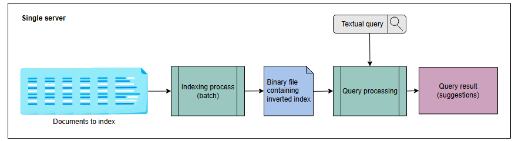

# Индексация в распределенном поиске

Узнайте об индексации и ее использовании в распределенном поиске.

Сначала мы опишем, что такое индексация, а затем перейдем к распределению индексов по многим узлам.

## Индексация

**Индексация** — это организация и обработка данных, которые выполняются для обеспечения быстрого и точного извлечения информации.

### Создание поискового индекса

Самый простой способ создать поисковый индекс — это присвоить каждому документу уникальный ID и хранить его в таблице базы данных, как
показано в следующей таблице. Первый столбец в таблице — это ID текста, а второй — текст из каждого документа.

#### Простой индекс документов

| **ID** | **Содержимое документа**                                                                           |
|:-------|:---------------------------------------------------------------------------------------------------|
| 1      | Elasticsearch — это распределенный движок для аналитики, основанный на REST API.                   |
| 2      | Elasticsearch — это поисковый движок, основанный на библиотеке Lucene.                             |
| 3      | Elasticsearch — это распределенный поисковый и аналитический движок, построенный на Apache Lucene. |

Размер приведенной выше таблицы будет варьироваться в зависимости от количества имеющихся у нас документов и их размера. Таблица выше — это
всего лишь пример, и содержимое каждого документа состоит всего из одного-двух предложений. В реальном примере содержимое каждого документа
в таблице может занимать несколько страниц. Это сделает нашу таблицу довольно большой. Выполнение поискового запроса по приведенному выше
индексу на уровне документов — процесс небыстрый. При каждом поисковом запросе нам приходится обходить все документы и подсчитывать
вхождения искомой строки в каждом из них.

> **Примечание:** Для **нечеткого поиска** нам также необходимо выполнять различные запросы на сопоставление с образцом. Многие строки в
> документах будут так или иначе соответствовать искомой строке. Сначала мы должны найти уникальные строки-кандидаты, обойдя все документы.
> Затем мы должны выделить наиболее приближенную совпадающую строку из этих строк. Нам также нужно найти количество вхождений наиболее
> совпадающей строки в каждом документе. Это означает, что каждый поисковый запрос занимает много времени.

Время ответа на поисковый запрос зависит от нескольких факторов:

* Стратегия организации данных в базе данных.
* Размер данных.
* Скорость обработки и объем оперативной памяти машины, которая используется для построения индекса и обработки поискового запроса.

Выполнение поисковых запросов по миллиардам документов, которые проиндексированы на уровне документов, будет медленным процессом, который
может занять много минут или даже часов. Давайте рассмотрим другую технику организации и обработки данных, которая помогает сократить время
поиска.

#### Инвертированный индекс

**Инвертированный индекс** — это структура данных, подобная HashMap, которая использует матрицу "документ-термин". Вместо того чтобы хранить
полный документ как есть, она разбивает документы на отдельные слова. После этого **матрица "документ-термин"** идентифицирует уникальные
слова и отбрасывает часто встречающиеся слова, такие как "в", "они", "этот", "является" и так далее. Часто встречающиеся слова, подобные
этим, называются **терминами**. Матрица "документ-термин" поддерживает **индекс на уровне терминов** путем идентификации уникальных слов и
удаления ненужных терминов.

Для каждого термина индекс вычисляет следующую информацию:

* Список документов, в которых появился термин.
* Частота, с которой термин появляется в каждом документе.
* Позиция термина в каждом документе.

#### Инвертированный индекс

| **Термин**    | **Сопоставление ( [док], [частота], [[поз]] )** |
|:--------------|:------------------------------------------------|
| elasticsearch | ( [1, 2, 3], [1, 1, 1], [[1], [1], [1]] )       |
| distributed   | ( [1, 3], [1, 1], [[4], [4]] )                  |
| restful       | ( [1], [1], [[5]] )                             |
| search        | ( [1, 2, 3], [1, 1, 1], [[6], [4], [5]] )       |
| analytics     | ( [1, 3], [1, 1], [[8], [7]] )                  |
| engine        | ( [1, 2, 3], [1, 1, 1], [[9], [5], [8]] )       |
| heart         | ( [1], [1], [[12]] )                            |
| elastic       | ( [1], [1], [[15]] )                            |
| stack         | ( [1], [1], [[16]] )                            |
| lucene        | ( [2, 3], [1, 1], [[9], [12]] )                 |
| library       | ( [2], [1], [[10]] )                            |
| Apache        | ( [3], [1], [[11]] )                            |

В таблице выше столбец «Термин» содержит все уникальные термины, извлеченные из всех документов. Каждая запись в столбце «Сопоставление»
состоит из трех списков:

* Список документов, в которых появился термин.
* Список, подсчитывающий частоту появления термина в каждом документе.
* Двумерный список, указывающий позицию термина в каждом документе. Термин может появляться несколько раз в одном документе, поэтому
  используется двумерный список.

> **Примечание:** Вместо списков сопоставления могут быть представлены в виде кортежей — например, док, частота и поз.

**Инвертированный индекс** — один из самых популярных механизмов индексации, используемых при поиске документов. Он позволяет эффективно
реализовывать **логический (boolean)**, **расширенный логический (extended boolean)**, **поиск по близости (proximity)**, **релевантный (
relevance)** и многие другие типы поисковых алгоритмов.
> 

>  
<b>Логический поиск (boolean)</b>

>Логический поиск (boolean) основан на методе символической логики, разработанном английским математиком Джорджем Булем. Он позволяет ограничить, расширить или конкретизировать поиск, комбинируя слова и словосочетания со словами AND, OR и NOT (также известными как логические операторы).
>  

> 

>  
<b>Расширенный логический  (extended boolean)</b>

> Расширенный логический  (extended boolean) поиск устраняет недостатки логического поиска. Основным недостатком логического поиска является то, что он не учитывает веса терминов в логических запросах, что приводит либо к слишком малому, либо к слишком большому набору результатов. Расширенный логический поиск использует частичное совпадение и веса терминов. Он присваивает оценку сходству между запросами и документами. Таким образом, документ может быть релевантным, если он соответствует части искомых терминов и возвращается в результате, в то время как в логическом поиске его не было.
>  

> 

>  
<b>Поиск по близости (proximity)</b>

>  Позволяет найти документы, в которых два или более совпадающих по отдельности термина находятся на определенном расстоянии, где расстояние - это количество промежуточных слов или символов
>  

> 

>  
<b>Поиск по релевантности  (relevance)</b>

> Поиск по релевантности  (relevance) измеряет точность взаимосвязи между поисковым запросом и результатами поиска
>  

**Преимущества использования инвертированного индекса**

* Инвертированный индекс облегчает **полнотекстовый поиск**.
* Инвертированный индекс сокращает время подсчета вхождений слова в каждом документе во время выполнения, поскольку у нас есть сопоставления
  для каждого термина.

**Недостатки использования инвертированного индекса**

* Возникают дополнительные затраты на хранение инвертированного индекса наряду с фактическими документами. Однако мы сокращаем время поиска.
* Затраты на обслуживание (обработку) при добавлении, обновлении или удалении документа. Чтобы добавить документ, мы извлекаем из него
  термины. Затем для каждого извлеченного термина мы либо добавляем новую строку в инвертированный индекс, либо обновляем существующую, если
  для этого термина уже есть запись в инвертированном индексе. Аналогично, для удаления документа мы выполняем обработку, чтобы найти записи
  в инвертированном индексе для терминов удаленного документа и соответствующим образом обновить инвертированный индекс.

#### Поиск по инвертированному индексу

Рассмотрим систему, которая имеет следующие сопоставления, когда мы ищем фразу "search engine" (поисковый движок):

| **Термин** | **Сопоставление**                         |
|:-----------|:------------------------------------------|
| search     | ( [1, 2, 3], [1, 1, 1], [[6], [4], [5]] ) |
| engine     | ( [1, 2, 3], [1, 1, 1], [[9], [5], [8]] ) |

Оба этих слова найдены в документах 1, 2 и 3. Оба слова встречаются один раз в каждом документе.

Слово "search" находится на позиции 6 в документе 1, на позиции 4 в документе 2 и на позиции 5 в документе 3.

Слово "engine" находится на позиции 9 в документе 1, на позиции 5 в документе 2 и на позиции 8 в документе 3.

Один термин может появляться в миллионах документов. Таким образом, список документов, возвращаемых по поисковому запросу, может быть очень
длинным.

> **Вопрос:** Будет ли этот метод работать, если по одному термину находится слишком много документов?
>
> 

>  
<b>Показать</b>

> Вероятно, вернуть все найденные документы не получится. Вместо этого мы должны отсортировать их по релевантности поисковому запросу. Пользователю должны быть возвращены лучшие результаты, а не все документы.
>  

### Факторы проектирования индекса

Вот некоторые факторы, которые следует учитывать при проектировании индекса:

* **Размер индекса**: Сколько компьютерной памяти (RAM) требуется для хранения индекса. Мы храним индекс в RAM для обеспечения низкой
  задержки поиска.
* **Скорость поиска**: Насколько быстро мы можем найти слово в инвертированном индексе.
* **Обслуживание индекса**: Насколько эффективно можно обновлять индекс при добавлении или удалении документа.
* **Отказоустойчивость**: Насколько критично для сервиса оставаться надежным. Здесь следует учитывать вопросы, связанные с повреждением
  индекса, возможностью изолированной обработки **некорректных данных**, работой с неисправным оборудованием, партиционированием и
  репликацией.
* **Устойчивость**: Насколько система устойчива к попыткам манипулировать системой и защищена от схем поисковой оптимизации (SEO), поскольку
  мы возвращаем лишь небольшое количество релевантных результатов на поисковый запрос.

В свете перечисленных факторов проектирования, давайте рассмотрим некоторые проблемы, связанные с созданием индекса в централизованной
системе.

## Индексация в централизованной системе

В **централизованной поисковой системе** все компоненты поисковой системы работают на одном узле, который обладает достаточно высокой
вычислительной мощностью. Архитектура централизованной поисковой системы показана на следующей иллюстрации:

*Архитектура централизованной поисковой системы*

* **Процесс индексации** принимает документы на вход и преобразует их в инвертированный индекс, который хранится в виде двоичного файла.
* **Процесс обработки запросов** или **поиска** интерпретирует двоичный файл, содержащий инвертированный индекс. Он также вычисляет
  пересечение инвертированных списков для данного запроса, чтобы вернуть результаты поиска.

Вот проблемы, которые возникают при архитектуре централизованной поисковой системы:

* SPOF (единая точка отказа)
* Перегрузка сервера
* Большой размер индекса

**SPOF**: Централизованная система является единой точкой отказа. Если она выйдет из строя, никакие поисковые операции выполняться не будут.

**Перегрузка сервера**: Если множество пользователей выполняет запросы, и запросы сложные, это создает нагрузку на сервер (узел).

**Большой размер индекса**: Размер инвертированного индекса увеличивается с количеством документов, создавая нагрузку на ресурсы одного
сервера. Чем больше компьютерная система, тем выше стоимость и сложность ее управления.

> **Примечание:** В распределенной системе используются недорогие компьютерные системы, что в целом является экономически выгодным.

Инвертированный индекс необходимо загружать в основную память при добавлении документа или выполнении поискового запроса. Для эффективности
большая часть инвертированного индекса должна помещаться в RAM машины.

Согласно аналитике Google на 2022 год, существует сотни миллиардов
веб-страниц, общий размер которых составляет около 100 петабайт. Если мы создадим поисковую систему для всемирной паутины, размер
инвертированного индекса также будет исчисляться петабайтами. Это означает, что нам придется загружать петабайты данных в RAM. Непрактично и
неэффективно увеличивать ресурсы одной машины для индексации миллиарда страниц вместо перехода на распределенную систему и использования
мощи распараллеливания. Выполнение поискового запроса по одному большому инвертированному индексу приводит к медленному времени ответа.

> **Примечание:** Искать книгу на полке, где сто книг, проще, чем искать книгу на полке, где миллион книг. Время поиска увеличивается с
> объемом данных, по которым мы ищем.

Атаки на централизованную индексацию могут иметь более серьезные последствия, чем атаки на распределенную систему индексации. Кроме того,
вероятность возникновения узких мест (которые могут возникнуть в пропускной способности сервера или RAM) также ниже в распределенном
индексе.

В этом уроке мы узнали об индексации и рассмотрели проблемы индексации в централизованной системе. В следующем уроке будет представлено
решение для распределенной индексации.