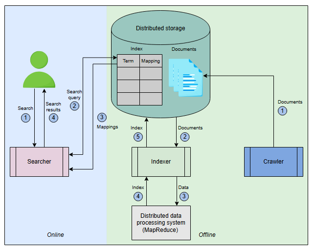
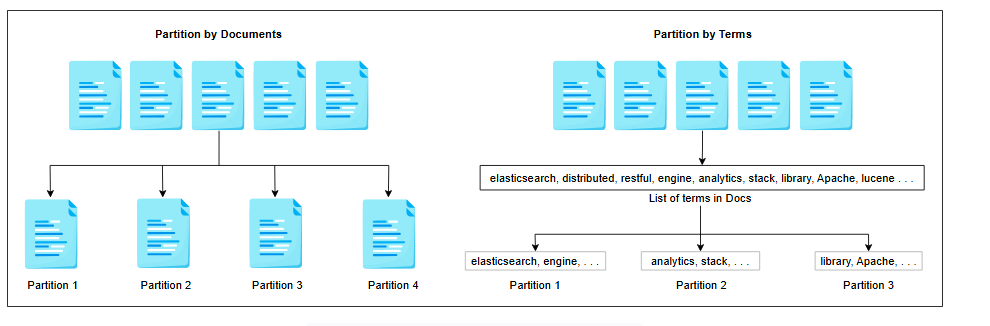
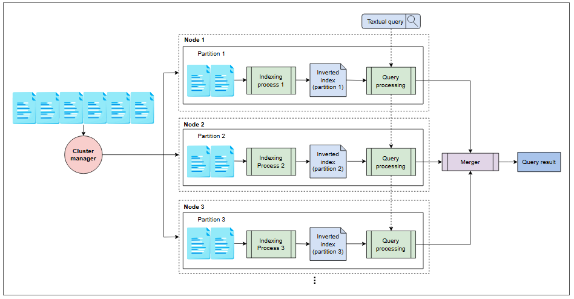
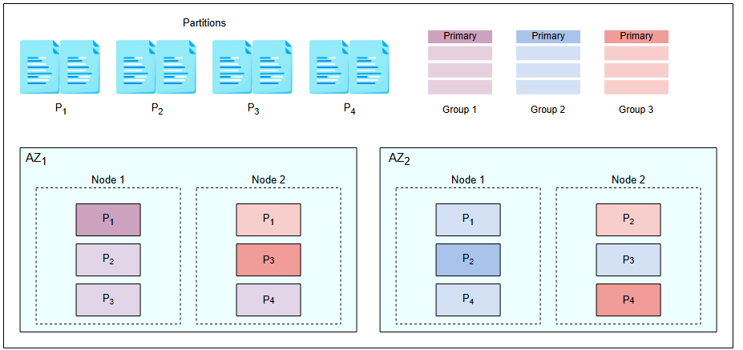

# Проектирование распределенного поиска

Получите обзор проектирования распределенной поисковой системы, которая обрабатывает большое количество запросов в секунду.


## Высокоуровневое проектирование

Давайте сформируем общий дизайн распределенной поисковой системы, прежде чем переходить к детальному обсуждению. Такая система имеет две фазы, как показано на иллюстрации ниже. **Офлайн-фаза** включает в себя сбор данных (crawling) и индексацию, в которой пользователь ничего не делает. **Онлайн-фаза** состоит из поиска результатов по поисковому запросу пользователя.



*Высокоуровневое проектирование распределенной поисковой системы*

*   **Краулер (Crawler)** собирает контент из целевого источника. Например, если мы создаем поиск для приложения YouTube, краулер обойдет все видео на YouTube и извлечет текстовый контент для каждого видео. Контент может включать название видео, его описание, название канала или даже аннотации к видео, чтобы обеспечить интеллектуальный поиск не только по названию и описанию, но и по содержанию этого видео. Краулер форматирует извлеченный контент для каждого видео в JSON-документ и сохраняет эти JSON-документы в распределенном хранилище.
*   **Индексатор (Indexer)** извлекает документы из распределенного хранилища и индексирует их с использованием **MapReduce**, который работает на распределенном кластере из стандартных машин. Индексатор использует **систему распределенной обработки данных**, такую как MapReduce, для параллельного и распределенного построения индекса. Созданная **таблица индекса** сохраняется в распределенном хранилище.
*   **Распределенное хранилище** используется для хранения документов и индекса.
*   **Пользователь** вводит поисковую строку, содержащую несколько слов, в поле поиска.
*   **Поисковик (Searcher)** разбирает поисковую строку, ищет сопоставления в индексе, хранящемся в распределенном хранилище, и возвращает пользователю наиболее подходящие результаты. Поисковик интеллектуально сопоставляет слова с ошибками в поисковой строке с наиболее близкими словами из словаря. Он также ищет документы, которые включают все слова, и ранжирует их.

## Проектирование API

Поскольку пользователь отправляет запросы только в виде строки, дизайн API довольно прост.

**Поиск:** Функция `search` выполняется, когда пользователь запрашивает у системы поиск какого-либо контента.

```
search(query)
```

| **Параметр** | **Описание** |
| :--- | :--- |
| `query` | Текстовый запрос, введенный пользователем в строку поиска, на основе которого находятся результаты. |

## Подробное обсуждение

Поскольку индексатор является основным компонентом поисковой системы, мы обсудили технику индексации и проблемы, связанные с централизованной индексацией, в предыдущем уроке. В этом уроке мы рассмотрим распределенное решение для индексации и поиска.

### Распределенная индексация и поиск

Давайте посмотрим, как мы можем разработать распределенную систему индексации и поиска. Мы понимаем, что на вход системы индексации поступают документы, которые мы создали во время сканирования. Чтобы разработать индекс распределенным образом, мы используем большое количество недорогих машин (узлов) и разделяем (партиционируем) документы в зависимости от имеющихся у них ресурсов. Все узлы соединены между собой. Группа узлов называется **кластером**.

> **Совет:** Мы используем множество небольших узлов для индексации для достижения экономической эффективности. Этот процесс требует от нас партиционирования или разделения входных данных (документов) между этими узлами. Однако необходимо решить ключевой вопрос: как мы будем выполнять это партиционирование?

Два наиболее распространенных метода, используемых для партиционирования данных в распределенной индексации, приведены ниже:

*   **Партиционирование по документам**: При партиционировании по документам все документы, собранные веб-краулером, делятся на подмножества документов. Каждый узел затем выполняет индексацию на назначенном ему подмножестве документов.
*   **Партиционирование по терминам**: Словарь всех терминов делится на подмножества, каждое из которых находится на одном узле. Например, подмножество документов обрабатывается и индексируется узлом, содержащим термин «поиск».



A *Типы партиционирования данных в распределенном поиске*

При партиционировании по терминам поисковый запрос отправляется на узлы, которые соответствуют терминам запроса. Это обеспечивает большую конкурентность, поскольку поток поисковых запросов с разными терминами будет обслуживаться разными узлами. Однако на практике партиционирование по терминам оказывается сложной задачей. Многословные запросы требуют отправки длинных списков сопоставлений между группами узлов для слияния, что может быть дороже, чем выгоды от повышенной конкурентности.

При партиционировании по документам каждый запрос распределяется по всем узлам, и результаты с этих узлов объединяются перед тем, как быть показанными пользователю. Этот метод партиционирования требует меньшего обмена данными между узлами. В нашем дизайне мы используем партиционирование по документам.

Следуя партиционированию по документам, давайте рассмотрим распределенный дизайн для построения и запроса индекса, который показан на иллюстрации ниже. Мы используем кластер, состоящий из нескольких недорогих узлов и менеджера кластера. Менеджер кластера использует программную модель MapReduce для распараллеливания вычислений индекса на каждой партиции. MapReduce может работать со значительно большими наборами данных, которые трудно обработать на одном большом сервере.



*Распределенная индексация и поиск параллельным образом на нескольких узлах в кластере из стандартных машин*

Описанная выше система работает следующим образом:

**Индексация**

*   У нас есть набор документов, уже собранный краулером.
*   **Менеджер кластера** разделяет входной набор документов на `N` партиций, где `N` на иллюстрации выше равно трем. Размер каждой партиции определяется менеджером кластера с учетом размера данных, вычислительных и памятных ограничений, а также количества узлов в кластере. Все узлы могут быть доступны не всегда по разным причинам. Менеджер кластера отслеживает состояние каждого узла с помощью **периодических heartbeat-сигналов**. Для назначения документа одной из `N` партиций может использоваться **хэш-функция**.
*   После создания партиций менеджер кластера запускает алгоритмы индексации для всех `N` партиций одновременно на `N` узлах в кластере. Каждый процесс индексации создает небольшой инвертированный индекс, который хранится в локальном хранилище узла. Таким образом, мы создаем `N` небольших инвертированных индексов вместо одного большого.

**Поиск**

*   На этапе поиска, когда поступает запрос пользователя, мы запускаем параллельный поиск по каждому небольшому инвертированному индексу, хранящемуся в локальном хранилище узлов, генерируя N запросов.
*   Результатом поиска из каждого инвертированного индекса является список сопоставлений для запрашиваемого термина (мы предполагаем запрос пользователя из одного слова/термина). **Объединитель (merger)** агрегирует эти списки сопоставлений.
*   После агрегации списков сопоставлений объединитель сортирует список документов из агрегированного **списка сопоставлений** на основе частоты термина в каждом документе.
*   Отсортированный список документов возвращается пользователю в качестве результата поиска. Документы показываются пользователю в отсортированном (по возрастанию) порядке.

> **Примечание:** Мы спроектировали поисковую систему, в которой использовали распределенную систему и распараллелили процессы индексации и поиска. Это помогло нам обрабатывать большие наборы данных, работая с меньшими партициями документов. Следует отметить, что и поиск, и индексация выполняются на одном и том же узле. Мы называем эту идею **колокацией (colocation)**.

Предлагаемый дизайн работает, и мы можем реплицировать его по всему миру в различных дата-центрах для обслуживания всех пользователей. Таким образом, мы можем достичь следующих преимуществ:

*   Наш дизайн не будет подвержен единой точке отказа (SPOF).
*   Задержка для всех пользователей останется небольшой.
*   Будет возможно обслуживание и обновление в отдельных дата-центрах.
*   Масштабируемость (обслуживание большего числа пользователей в секунду) нашей системы будет улучшена.

### Репликация

Мы создаем реплики узлов индексации, которые производят инвертированные индексы для назначенных партиций. Мы можем отвечать на запрос с нескольких наборов узлов с репликами. Общая концепция проста. Мы продолжаем использовать ту же архитектуру, что и раньше, но вместо одной группы узлов у нас есть `R` групп узлов для ответа на запросы пользователей. `R` — это количество реплик. Количество реплик может увеличиваться или уменьшаться в зависимости от количества запросов, и каждая группа узлов имеет все партиции, необходимые для ответа на каждый запрос.

Каждая группа узлов размещается в разных **зонах доступности (availability zones)** для лучшей производительности и доступности системы в случае отказа дата-центра.
>Зоны доступности (AZs) - это изолированные местоположения в регионах центров обработки данных, где запускаются и эксплуатируются общедоступные облачные сервисы. Регионы - это географические местоположения, в которых расположены центры обработки данных поставщиков общедоступных облачных сервисов.

> **Примечание:** Компонент балансировщика нагрузки необходим для распределения запросов по разным группам узлов и повторных попыток в случае любой ошибки.

### Коэффициент репликации и распределение реплик

Обычно достаточно коэффициента репликации равного трем. Коэффициент репликации три означает, что три узла содержат одну и ту же партицию и создают для нее индекс. Один из трех узлов становится основным (primary), а два других — репликами. Каждый из этих узлов создает индексы в одном и том же порядке, чтобы достичь одинакового состояния.

Для иллюстрации разделим данные (набор документов) на четыре партиции. Поскольку коэффициент репликации равен трем, одна партиция будет размещена на трех узлах. Предположим, что у нас есть две зоны доступности (`AZ₁` и `AZ₂`). И в каждой зоне доступности у нас есть два узла. Каждый узел выступает в качестве основного только для одной партиции (например, Узел 1 в `AZ₁` является основным узлом для партиции `P₁`). Три копии (оранжевая, синяя и фиолетовая) для партиции распределяются между двумя экземплярами `AZ` так, что две копии находятся в одной зоне, а третья — в другой. Три цвета представляют три реплики каждой партиции. Например, для партиции `P₄` верно следующее:

*   Первая реплика, представленная оранжевым цветом, размещена на Узле 2 в `AZ₂`
*   Вторая реплика, представленная синим цветом, размещена на Узле 1 в `AZ₂`
*   Третья реплика, представленная фиолетовым цветом, размещена на Узле 2 в `AZ₁`

Каждая группа на иллюстрации ниже состоит из одной реплики от каждой из четырех партиций (`P₁`, `P₂`, `P₃`, `P₄`).



*Распределение реплик: каждый узел содержит одну основную партицию и две реплики*

На иллюстрации выше основная реплика для `P₁` обозначена темно-фиолетовым цветом, основная реплика для `P₂` — темно-синим, а основные реплики для `P₃` и `P₄` — темно-оранжевым.

Теперь, когда мы завершили репликацию, давайте посмотрим, как в этих репликах выполняются индексация и поиск.

**Индексация с репликами**

Из приведенной выше диаграммы мы предполагаем, что каждая партиция направляется каждой реплике для вычисления индекса. Давайте рассмотрим пример, где мы хотим проиндексировать партицию `P₁`. Это означает, что одна и та же партиция будет направлена всем трем репликам в обеих зонах доступности. Следовательно, каждый узел будет вычислять индекс одновременно и достигнет того же состояния.

Преимущество этой стратегии в том, что операция индексации не пострадает в случае сбоя основного узла.

**Поиск с репликами**

У нас есть три копии индекса каждой партиции. Балансировщик нагрузки выбирает одну из трех копий каждой партиции для выполнения запроса. Увеличенное количество копий повышает масштабируемость и доступность системы. Теперь система может обрабатывать в три раза больше запросов за то же время.

## Резюме

В этом уроке мы узнали, как обрабатывать большое количество данных и большое количество запросов с помощью следующих стратегий:

*   Параллельная индексация и поиск, где оба эти процесса размещаются на одних и тех же узлах.
*   Репликация каждой партиции, что означает, что мы также реплицируем процесс индексации и поиска.

Мы успешно спроектировали систему, которая масштабируется с операциями чтения (поиск) и записи (индексация), размещенными на одном узле. Но этот метод масштабирования имеет некоторые недостатки. Мы рассмотрим эти недостатки и их решения в следующем уроке.