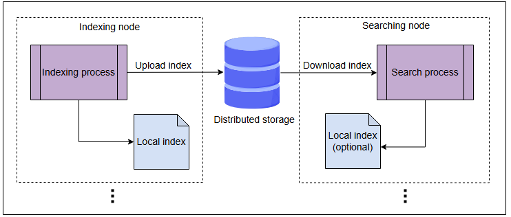
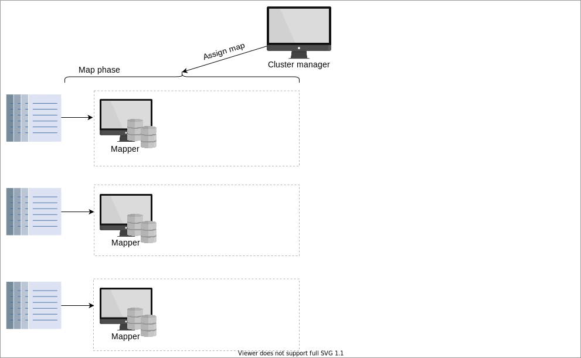
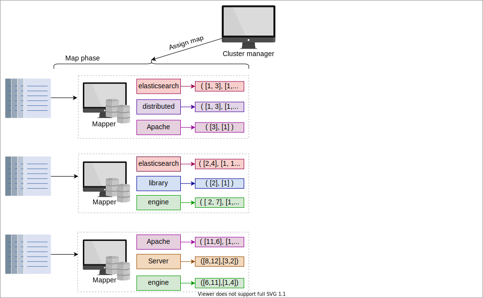
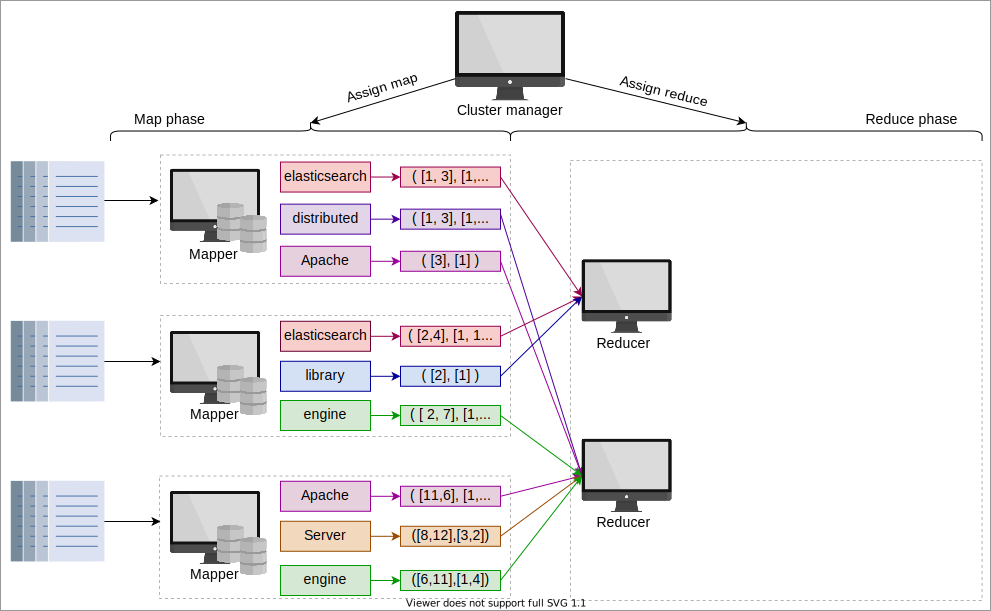
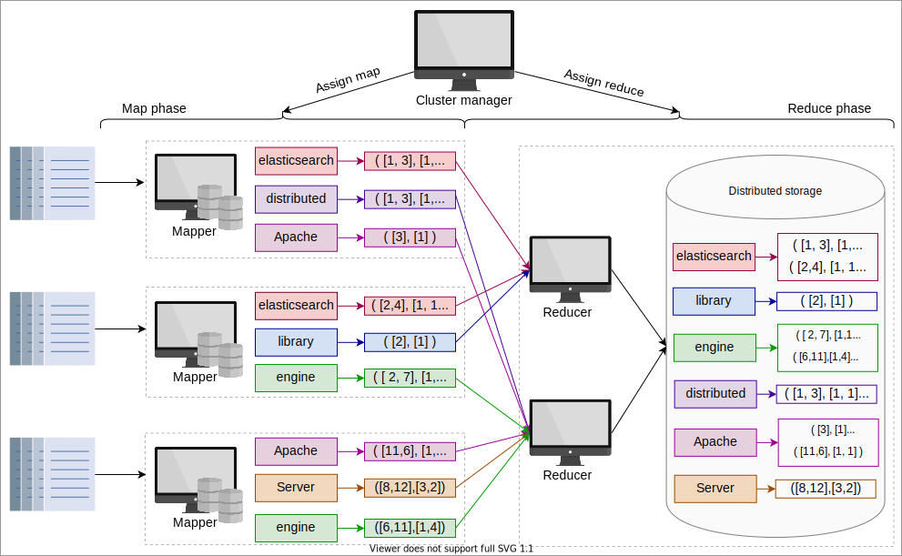

# Масштабирование поиска и индексации

Узнайте об эффективном способе масштабирования индексации и поиска в поисковой системе.

## Проблемы с предложенным дизайном

Хотя предложенный в предыдущем уроке дизайн кажется разумным, у него все же есть пара серьезных недостатков. Мы обсудим эти недостатки ниже:

1. **Совмещенные индексация и поиск (колокация)**: Мы создали систему, в которой индексация и поиск размещаются на одном и том же узле. Хотя
   это кажется эффективным использованием ресурсов, у этого есть и свои минусы. И поиск, и индексация — ресурсоемкие операции. Обе операции
   влияют на производительность друг друга. Кроме того, такой совмещенный дизайн неэффективно масштабируется при изменении нагрузки на
   индексацию и поиск со временем. Совмещение обеих этих операций на одной машине может привести к дисбалансу и проблемам с
   масштабируемостью.
2. **Повторное вычисление индекса**: Мы предполагаем, что каждая реплика будет вычислять индекс индивидуально, что приводит к неэффективному
   использованию ресурсов. Более того, вычисление индекса — это ресурсоемкая задача с возможно сотнями этапов конвейерной обработки. Таким
   образом, повторное вычисление одного и того же индекса на разных репликах требует мощных машин. Вместо этого логичный подход — вычислить
   индекс один раз и реплицировать его по зонам доступности.

Из-за этих ключевых причин мы рассмотрим альтернативный подход к распределенной индексации и поиску.

## Решение

Вместо того чтобы пересчитывать индекс на каждой реплике, мы вычисляем инвертированный индекс только на основном узле. Затем мы передаем
инвертированный индекс (в виде двоичного файла/блоба) на реплики. Ключевое преимущество этого подхода заключается в том, что он позволяет
избежать дублирования затрат ЦП и памяти на индексацию на репликах.

> ### Вопрос для размышления
>
> 1. Каковы недостатки предложенного выше решения?
>
> 

>  
<b>Показать</b>

> Поскольку инвертированный индекс будет передан в реплики, это приведет к задержке передачи для копирования инвертированного индексного файла, поскольку размер индексного файла может быть очень большим.
>
> Когда основной узел получает новые операции индексации, инвертированный индексный файл изменяется. Каждая реплика должна получать
> последнюю версию файла после того, как определенное количество операций индексации достигнет определенного порогового значения.
>  

## Разделение индексации и поиска

С появлением сетевых и виртуализационных технологий облачные вычисления стали успешной технологией. В такой технологии у нас есть доступ к
огромной пропускной способности (до 100 Гбит/с) и масштабируемому распределенному хранилищу. Эти достижения позволяют четко разделить
индексацию и поиск без негативных последствий в виде задержки индексации. Благодаря этому разделению индексация не будет влиять на
масштабируемость поиска и наоборот. Кроме того, вместо повторного вычисления индекса на узлах-репликах, что является пустой тратой ресурсов,
мы можем просто реплицировать файлы индекса.

Мы будем использовать эти технологии для перепроектирования нашей распределенной системы индексации и поиска. В этом дизайне поисковой
системы участвуют три компонента:

1. **Индексатор (Indexer)**: Состоит из группы узлов для вычисления индекса.
2. **Распределенное хранилище**: Эта система используется для хранения партиций и вычисленного индекса.
3. **Поисковик (Searcher)**: Состоит из ряда узлов для выполнения поиска.

Иллюстрация ниже изображает генерацию и передачу инвертированного индекса между узлом индексатора и узлом поисковика:

*Индексы, созданные узлами индексации, хранятся в распределенном хранилище, а узлы, участвующие в поиске, читают индексы из распределенного
хранилища для получения результата по запросу пользователя.*

На приведенной выше иллюстрации для каждой операции индексации и поиска показан один узел. Но в действительности на этапе индексации
будет `N` узлов, по одному узлу на каждую партицию (набор документов), которые создают инвертированные индексы. Инвертированный индекс
хранится в виде двоичных файлов в локальном хранилище узлов. Кэширование этих блоб-файлов приведет к улучшению производительности. Эти
двоичные файлы также отправляются в распределенное хранилище. В случае сбоя оборудования добавляется новая машина поисковика или
индексатора, и копия данных извлекается из распределенного хранилища.

После завершения загрузки узлы поисковика скачивают файлы индекса. В зависимости от поисковых паттернов пользователей, узлы поиска будут
поддерживать кэш часто задаваемых запросов и обслуживать данные из оперативной памяти. Поисковый запрос пользователя будет распространен на
все узлы поисковика, которые сгенерируют ответы в соответствии со своими индексами. Узел-объединитель на фронтенд-серверах объединит все
результаты поиска и представит их пользователю.

Процесс индексации индексирует новые документы по мере их поступления. В то же время узлы поисковика получают обновленные индексы для
предоставления улучшенных результатов поиска.

## Объяснение индексации

До сих пор мы объясняли разработку высокомасштабируемого и производительного дизайна с использованием недорогих узлов. Однако мы не знаем
внутренностей узлов индексации. В этом разделе мы узнаем, как индексация выполняется с помощью распределенной модели MapReduce и фреймворка
параллельной обработки.

**Фреймворк MapReduce** реализуется с помощью менеджера кластера и набора рабочих узлов, классифицированных как Mappers (сопоставители) и
Reducers (свертчики). Как следует из названия, MapReduce состоит из двух фаз:

1. Фаза Map (сопоставления)
2. Фаза Reduction (свертки)

Кроме того, на вход MapReduce подается несколько партиций, или наборов документов, а его выходом является агрегированный инвертированный
индекс.

Давайте разберемся в назначении вышеуказанных компонентов:

* **Менеджер кластера**: Менеджер инициирует процесс, назначая набор партиций Mappers. Как только Mappers заканчивают работу, менеджер
  кластера назначает вывод Mappers Reducers.
* **Mappers**: Этот компонент извлекает и фильтрует термины из назначенных ему менеджером кластера партиций. Эти машины параллельно выводят
  инвертированные индексы, которые служат входом для Reducers.
* **Reducers**: Reducer объединяет сопоставления для различных терминов, чтобы сгенерировать обобщенный индекс.

Менеджер кластера обеспечивает эффективное использование всех рабочих узлов в кластере. MapReduce создан для работы в условиях частичных
сбоев. Если один узел выходит из строя, он перераспределяет работу на другой узел.

Обратите внимание, что Reducers не могут начаться, пока работают Mappers. Это означает, что менеджер кластера может использовать один и тот
же узел как Mapper, так и Reducer.

Слайды ниже изображают упрощенную схему того, как MapReduce может использоваться для генерации инвертированного индекса:

1) Менеджер кластеров и разделы документов
   

2) Начинается этап сопоставления, и менеджер кластера назначает разделы документоXв незанятым узлам в кластере. Мы называем эти узлы
   Mappers
   

3) Mappers извлекают термины из назначенных документов и создают N меньших инвертированных индексов
   

4) Начинается фаза сокращения, менеджер кластера определяет незанятые узлы для выполнения функции сокращения и распределяет работу между
   восстановителями
   

5) reducers объединяют похожие термины из назначенных терминов из всех Mappers и помещают все записи для термина вместе в
   распределенное хранилище
   

Для простоты мы показали только два показателя для каждого термина на приведенной выше иллюстрации: список документов, в которых появляется
термин, и список частоты термина в каждом документе (подробнее см. в Индексации).
> Примечание: Приведенная выше настройка MapReduce является упрощенной версией того, что происходит на практике. Для управления сложностями
> реальной поисковой системы требуется сложный конвейер фреймворка MapReduce. Однако основные принципы те же, что мы представили здесь.

Резюме

В этом уроке мы решили две ключевые проблемы масштабируемости (из-за совмещенной индексации и поиска) и неэффективного использования
ресурсов (из-за повторного вычисления индекса), используя выделенные узлы для индексации и поиска. Обе операции зависят от распределенного
хранилища. Кроме того, мы представили упрощенное описание фреймворка MapReduce для распараллеливания процесса индексации.