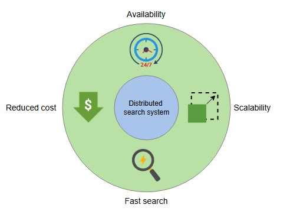

# Оценка проектирования распределенного поиска

Проанализируем, как наш дизайн соответствует требованиям.

## Доступность

Мы использовали распределенное хранилище для хранения следующих элементов:

*   Документы, собранные индексатором.
*   Инвертированные индексы, сгенерированные узлами индексации.

Данные реплицируются в нескольких регионах в распределенном хранилище, что упрощает развертывание индексации и поиска в разных регионах. Группу узлов индексации и поиска нужно просто реплицировать в разных зонах доступности. Таким образом, мы развертываем кластер узлов индексации и поиска в разных зонах доступности. Поэтому, если в одном месте произойдет сбой, мы сможем обрабатывать запросы из другого кластера. Несколько групп узлов индексации и поиска помогают достичь высокой доступности индексации и поиска. Более того, в каждом кластере, если узел выходит из строя, его место может занять другой.

Индексация выполняется в офлайн-режиме, не на критическом пути пользователя. Нам не нужно синхронно реплицировать операции индексации. Нет необходимости отвечать на поисковые запросы пользователей с использованием самых последних данных, которые только что были добавлены в индекс. Таким образом, нам не нужно ждать репликации нового индекса для ответа на поисковые запросы. Это обеспечивает доступность поиска для пользователей.

> **Примечание:** Как только мы реплицируем последние данные во всех группах узлов индексации и узлы поиска загрузят их, поисковые запросы будут выполняться по последним данным.

## Масштабируемость

Партиционирование — это важный компонент поисковых систем для масштабирования. Увеличивая количество партиций и добавляя больше узлов в кластеры индексации и поиска, мы можем масштабироваться с точки зрения индексации данных и обработки запросов.

Четкое разделение процессов индексации и поиска помогает им масштабироваться независимо и динамически.

## Быстрый поиск по большим данным

Мы использовали несколько узлов, каждый из которых выполняет поисковые запросы параллельно на меньших инвертированных индексах. Результат с каждого узла поиска затем объединяется и возвращается пользователю.

## Снижение затрат

Мы использовали более дешевые машины для вычисления индексов и выполнения поиска. Если один узел выходит из строя, нам не нужно пересчитывать весь индекс. Вместо этого нужно будет заново проиндексировать лишь часть документов.

## Заключение

Поисковая система требуется почти для каждого приложения. Мы увидели, что невозможно разработать поисковую систему, которая могла бы работать на одном узле. Мы использовали фреймворк для параллельных вычислений и недорогие машины для создания поисковой системы, которая является доступной, масштабируемой и высокопроизводительной.