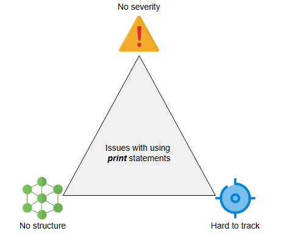

# Проектирование систем: Распределенное логгирование

Давайте разберемся в основах проектирования распределенной системы логгирования.

## Логгирование

**Лог-файл** (журнал) записывает детали событий, происходящих в программном приложении. Детали могут включать информацию о микросервисах, транзакциях, действиях сервисов или что-либо, что может помочь в отладке потока событий в системе. Логгирование имеет решающее значение для мониторинга потока работы приложения.

## Необходимость логгирования

Логгирование необходимо для понимания потока событий в распределенной системе. Это может показаться утомительной задачей, но при сбое или нарушении безопасности логгирование помогает точно определить, когда и как система вышла из строя или была скомпрометирована. Оно также может помочь выяснить первопричину сбоя или взлома. Это сокращает **среднее время до восстановления** (meantime to repair) системы.

Почему бы нам просто не использовать операторы вывода (print), чтобы понимать поток работы приложения? Это возможно, но не идеально. Простые операторы вывода не позволяют отслеживать уровень серьезности сообщения. Вывод функций `print` обычно направляется в терминал, в то время как нам может потребоваться сохранять такие данные в локальном или удаленном хранилище. Более того, у нас могут быть миллионы операторов вывода, поэтому лучше их правильно структурировать и хранить.

Одновременная активность сервиса, работающего на многих узлах, может потребовать информации о причинно-следственных связях, чтобы правильно собрать корректный поток событий. Мы должны быть осторожны при работе с причинно-следственными связями в распределенной системе. Мы используем сервис логгирования для надлежащего управления диагностическими и исследовательскими данными нашего распределенного программного обеспечения.

Логгирование позволяет нам понимать наш код, обнаруживать непредвиденные ошибки, исправлять выявленные ошибки и визуализировать производительность приложения. Таким образом, мы знаем, как работает продакшн, и как в системе выполняются процессы.

Анализ логов помогает нам в следующих сценариях:

*   Для устранения неполадок в приложениях, на узлах или в сети.
*   Для соблюдения внутренних политик безопасности, внешних нормативных актов и требований.
*   Для распознавания и реагирования на утечки данных и другие проблемы безопасности.
*   Для понимания действий пользователей с целью предоставления данных для рекомендательной системы.

> ℹ️
> **Вопрос для размышления:**
>
> Какие проблемы безопасности следует учитывать при проектировании распределенной системы логгирования? Как бы вы их смягчили?
> 

>  
<b>Показать</b>

> **Проблема:** Раскрытие конфиденциальных данных  
> **Смягчение:** Избегайте логирования персонально идентифицируемой информации (ПИИ) или конфиденциальных данных. Если логирование необходимо, маскируйте или шифруйте конфиденциальные поля для предотвращения неправомерного использования.
>
> **Проблема:** Несанкционированный доступ к логам  
> **Смягчение:** Внедрите строгую аутентификацию и детализированный контроль доступа, чтобы ограничить доступ к логам только доверенным пользователям или системам.
>
> **Проблема:** Уязвимости системы логирования  
> **Смягчение:** Укрепите инфраструктуру логирования путем защиты конечных точек, регулярного применения патчей и соблюдения принципа наименьших привилегий.
>
> **Проблема:** Незащищенная передача или хранение логов  
> **Смягчение:** Шифруйте данные логов как при передаче, так и при хранении (in transit and at rest) для защиты от перехвата или утечек данных.
>
> **Проблема:** Отсутствие видимости неправомерного использования системы логирования  
> **Смягчение:** Проводите регулярные аудиты и включите мониторинг для обнаружения аномалий, несанкционированного доступа или подозрительной активности в конвейере логирования.
>
>  

## Как мы будем проектировать распределенную систему логгирования?

Мы разделили проектирование распределенной системы логгирования на следующие два урока:

1.  **Введение**: Мы обсудим, как работает логгирование на распределенном уровне. Мы также покажем, как можно ограничить огромный размер лог-файла и как его структурировать. Этот урок поможет нам определить требования, которые следует учитывать при логгировании информации о системе.

2.  **Проектирование**: В этом уроке мы определим требования, дизайн API и детальный дизайн нашей распределенной системы логгирования.