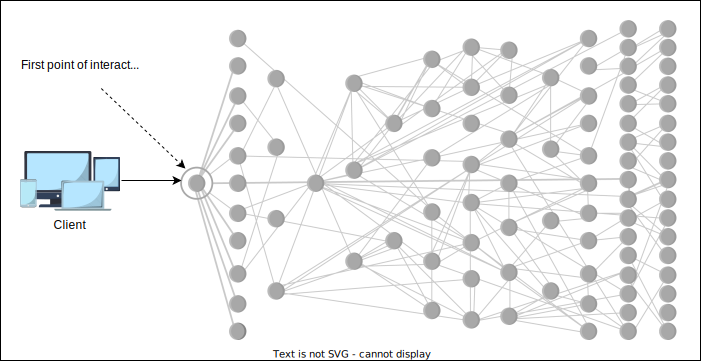
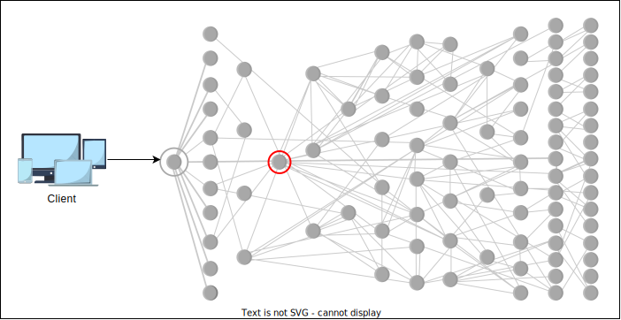
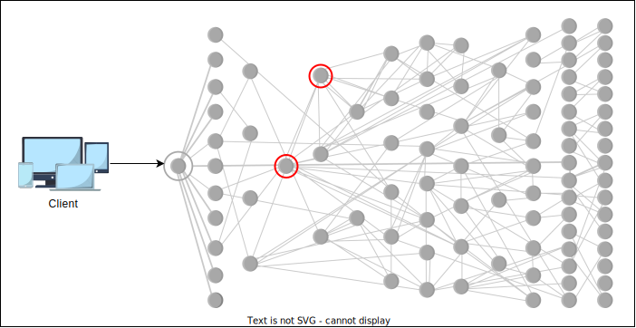
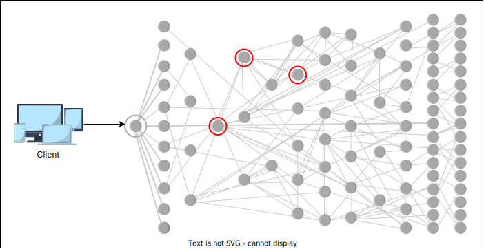
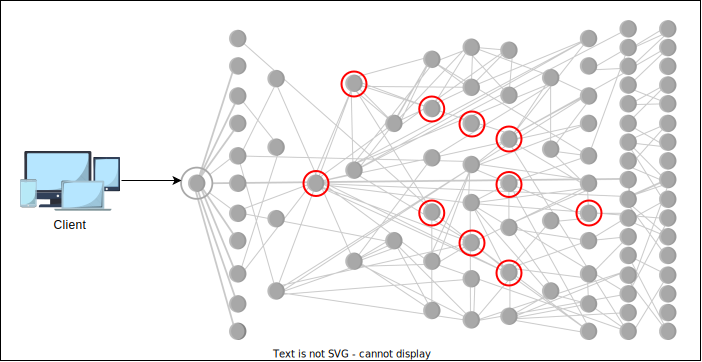
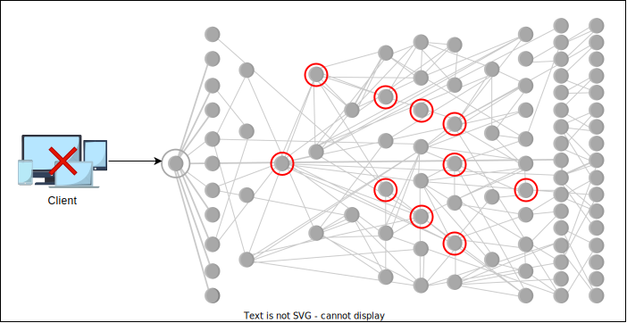
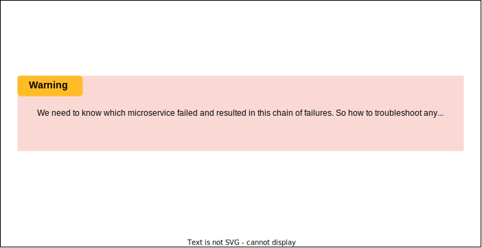

# Введение в распределенное логгирование

Узнайте, почему нам необходимо логгирование в распределенной системе.


## <a id="logging-in-a-distributed-system"></a>Логгирование в распределенной системе

В современном мире все больше систем переходит от монолитной архитектуры к микросервисной. В микросервисной архитектуре логи каждого микросервиса накапливаются на соответствующей машине. Если мы хотим узнать о определенном событии, которое было обработано несколькими микросервисами, становится сложно заходить на каждый узел, выяснять поток выполнения и просматривать сообщения об ошибках. Однако становится очень удобно, если мы можем отследить лог для любого конкретного потока от начала до конца.

Более того, не обязательно, что микросервис развернут только на одном узле. Он может быть развернут на тысячах узлов. Рассмотрим следующий пример, где сотни микросервисов взаимозависимы, и сбой одного сервиса может привести к сбоям других. И если у нас нет логов, мы можем не определить первопричину сбоя. Это подчеркивает необходимость логгирования.
1.  *Первая точка взаимодействия клиента в распределенных системах*
    

2.  *Сбой сервиса в распределенной системе*
    

3.  *Другой сервис, зависевший от предыдущего, также вышел из строя*
    

4.  *Другой сервис, зависевший от предыдущего, также вышел из строя*
    

5.  *Аналогично выходят из строя и другие зависимые сервисы*
    

6.  *Цепочка сбоев в распределенных системах оставляет клиента в неопределенном/нерабочем состоянии*
    

7.  *Предупреждение!*
    

## <a id="restrain-the-log-size"></a>Ограничение размера логов

Количество логов со временем растет. В какой-то момент времени могут требовать записи сотни одновременных сообщений. Но вопрос в том, все ли они достаточно важны для логирования? Чтобы решить эту проблему, логи должны быть структурированы. Нам нужно решить, что логировать в систему на уровне приложения или на уровне логирования.

### <a id="use-sampling"></a>Использование семплирования (выборки)

При этом подходе мы определим, какие сообщения следует записывать в систему. Представьте ситуацию, когда у нас много сообщений от одного и того же набора событий. Например, люди комментируют пост: Человек X прокомментировал пост Человека Y, затем Человек Z прокомментировал пост Человека Y и так далее. Вместо того чтобы логировать всю информацию, мы можем использовать **сервис семплирования**, который записывает только меньший набор сообщений из большого объема. Таким образом, мы можем выбрать наиболее важные сообщения для логирования.

> **Примечание:** Для крупных систем, таких как Facebook, где в секунду происходят миллиарды событий, логировать их все нецелесообразно. Необходимы подходящий порог и стратегия семплирования для выборочного отбора репрезентативного набора данных.

Мы также можем классифицировать типы сообщений и применить фильтр, который определяет важные сообщения и записывает только их в систему.

> #### Вопрос для размышления
> 1.  В каком сценарии подход с семплированием не сработает?
> <details>
>  <summary><b>Показать</b></summary>
> Рассмотрим приложение, которое обрабатывает финансовую транзакцию в банкомате. Оно задействует различные сервисы, такие как обнаружение мошенничества, проверка срока действия, валидация карты и многие другие. Если мы начнем пропускать логирование какого-либо из сервисов, мы не сможем отследить сквозной (end-to-end) поток операции, что затруднит отладку в случае возникновения ошибки. Использование семплирования в этом случае нецелесообразно и приводит к потере полезных данных.
>  последнюю версию файла после того, как определенное количество операций индексации достигнет определенного порогового значения.
>  </details>

### <a id="use-categorization"></a>Использование категоризации

Давайте рассмотрим поддержку логирования, предоставляемую различными языками программирования. Например, есть log4j и модуль `logging` в Python. В логировании обычно используются следующие уровни серьезности:

*   `DEBUG`
*   `INFO`
*   `WARNING`
*   `ERROR`
*   `FATAL/CRITICAL`

Обычно логи в продакшене настроены на вывод сообщений с уровнем серьезности `WARNING` и выше. Но для более детального отслеживания потока выполнения уровни серьезности можно установить на `DEBUG` и `INFO`.

```python
import logging as log

log.basicConfig(level=log.DEBUG)

for i in range(6):
    if i == 0:
        log.debug("Debug level")
    elif i == 1:
        log.info("Info level")
    elif i == 2:
        log.warning("Warning level")
    elif i == 3:
        log.error("Error level")
    elif i == 4:
        log.critical("Critical level")
    elif i == 5:
        print("Uncomment the following to view a system generated error:")
        #print(3/0)
```

> Вывод будет примерно таким:
> ```
> DEBUG:root:Debug level
> INFO:root:Info level
> WARNING:root:Warning level
> ERROR:root:Error level
> CRITICAL:root:Critical level
> Uncomment the following to view a system generated error:
> ```

Давайте раскомментируем **строку 17**, чтобы увидеть сгенерированную системой ошибку деления целого числа на ноль. Python сам выведет ошибку в консоль.

## <a id="structure-the-logs"></a>Структурирование логов

Приложения могут свободно выбирать структуру своих лог-данных. Например, приложение может записывать логи в двоичном или текстовом формате, но часто полезно применять некоторую структуру. Первое преимущество структурированных логов — лучшая совместимость между системами, которые пишут и читают логи. Во-вторых, структура может облегчить работу системы обработки логов.

> **Примечание:** Структурирование логов — это сама по себе обширная тема. Мы отсылаем заинтересованных читателей к диссертации Райана Брауда под названием "Отладка распределенных систем на основе запросов" (*Query-based debugging of distributed systems*).

## <a id="points-to-consider-while-logging"></a>Что следует учитывать при логгировании

Мы должны быть осторожны при логировании. Информация в логах должна содержать только релевантные данные и не нарушать требований безопасности. Для защищенных данных следует логировать зашифрованную информацию. При логировании следует учитывать следующие моменты:

*   Избегайте логирования персонально идентифицируемой информации (ПИИ), такой как имена, адреса, электронные почты и т.д.
*   Избегайте логирования конфиденциальной информации, такой как номера кредитных карт, пароли и т.д.
*   Избегайте избыточной информации. Логирование всей информации не нужно. Это только занимает больше места и влияет на производительность. Логирование, будучи операцией с интенсивным использованием ввода-вывода, имеет свои недостатки в производительности.
*   Механизм логирования должен быть безопасным и не уязвимым, поскольку логи содержат информацию о потоке работы приложения, и небезопасный механизм логирования уязвим для хакеров.

> ℹ️
> **Вопрос для размышления:**
>
> Каковы проблемы использования традиционного логирования в распределенной системе?
> <details>
>  <summary><b>Показать</b></summary>
>
>  *  Сложность отслеживания логов по нескольким сервисам и узлам, что усложняет отладку комплексных проблем.
>
>  *  Огромный объем генерируемых логов, приводящий к сложностям с их управлением и хранением.
> 
>  * Обеспечение безопасности и конфиденциальности чувствительных данных, содержащихся в логах.
> 
>  * Обеспечение доступности, консистентности (согласованности) и возможности поиска по логам в глобально распределенных системах.
>  </details>

### <a id="vulnerability-in-logging-infrastructure"></a>Уязвимость в инфраструктуре логгирования

В ноябре 2021 года была обнаружена **уязвимость нулевого дня** в Log4j, известном фреймворке для логирования на Java. Log4j содержал скрытую уязвимость Log4Shell (CVE-2021-44228) с 2013 года. Apache присвоил Log4Shell самый высокий доступный балл по шкале серьезности CVSS — 10. Эксплойт прост в исполнении и затрагивает сотни миллионов устройств. Эксперты по безопасности убеждены, что эта уязвимость может привести к разрушительным кибератакам на международном уровне, поскольку она позволяет злоумышленникам выполнять вредоносный код и получать контроль над машиной.