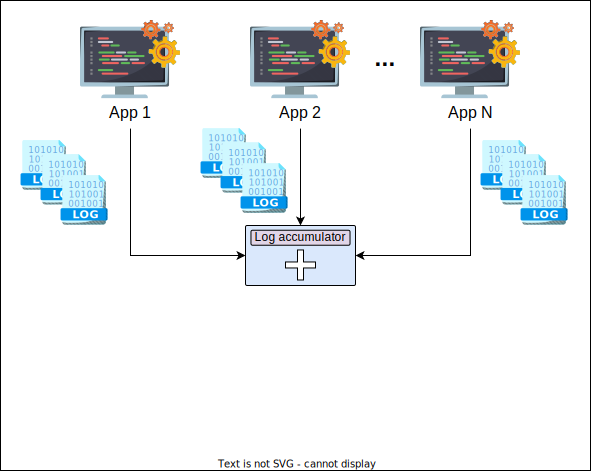
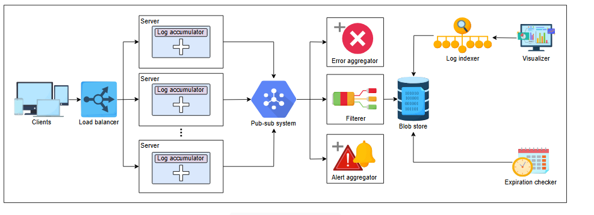

# Проектирование распределенного сервиса логгирования

Узнайте, как спроектировать распределенный сервис логгирования.

Сейчас мы спроектируем распределенную систему логгирования. Наша система должна записывать все действия или сообщения (мы не будем включать возможность семплирования в наш дизайн).

## <a id="requirements"></a>Требования

Давайте перечислим требования для проектирования распределенной системы логгирования:

### <a id="functional-requirements"></a>Функциональные требования

Функциональные требования нашей системы следующие:

*   **Запись логов**: Сервисы распределенной системы должны иметь возможность записывать данные в систему логгирования.
*   **Поиск по логам**: Система должна обеспечивать простой поиск по логам. Аналогично, отслеживание потока выполнения приложения от начала до конца также должно быть простым.
*   **Хранение логов**: Логи должны храниться в распределенном хранилище для легкого доступа.
*   **Централизованный визуализатор логов**: Система должна предоставлять единое представление логов от глобально распределенных сервисов.

### <a id="non-functional-requirements"></a>Нефункциональные требования

Нефункциональные требования нашей системы следующие:

*   **Низкая задержка (Low latency)**: Логгирование — это операция, интенсивно использующая ввод-вывод, которая часто намного медленнее операций процессора. Нам нужно спроектировать систему так, чтобы логгирование не находилось на критическом пути выполнения приложения.
*   **Масштабируемость**: Мы хотим, чтобы наша система логгирования была масштабируемой. Она должна справляться с растущими объемами логов со временем и с увеличением числа одновременных пользователей.
*   **Доступность**: Система логгирования должна быть высокодоступной для записи данных.

## <a id="building-blocks-we-will-use"></a>Компоненты, которые мы будем использовать

При проектировании распределенной системы логгирования будут использоваться следующие компоненты:

*   **Система "издатель-подписчик" (Pub-sub)**: Мы будем использовать систему pub-sub для обработки огромного объема логов.
*   **Распределенный поиск**: Мы будем использовать распределенный поиск для эффективного выполнения запросов к логам.


## <a id="api-design"></a>Дизайн API

Дизайн API для этой задачи представлен ниже:

**Запись сообщения**

Вызов API для выполнения записи должен выглядеть так:
```
write(unique_ID, message_to_be_logged)
```

| **Параметр**           | **Описание**                                                              |
| ---------------------- | ------------------------------------------------------------------------- |
| `unique_ID`              | Числовой ID, содержащий `application-id`, `service-id` и временную метку. |
| `message_to_be_logged` | Сообщение лога, сохраняемое по уникальному ключу.                         |

**Поиск лога**

Вызов API для поиска данных должен выглядеть так:
```
searching(keyword)
```
Этот вызов возвращает список логов, содержащих ключевое слово.

| **Параметр** | **Описание**                                   |
| -------------- | ---------------------------------------------- |
| `keyword`      | Используется для поиска логов, содержащих `keyword`. |

## <a id="initial-design"></a>Первоначальный дизайн

В распределенной системе клиенты по всему миру генерируют события, запрашивая сервисы у различных обслуживающих узлов. Узлы генерируют логи при обработке каждого из запросов. Эти логи накапливаются на соответствующих узлах.

В дополнение к основным компонентам, давайте перечислим основные составляющие нашей системы:

*   **Сборщик логов (Log accumulator)**: Агент, который собирает логи с каждого узла и сбрасывает их в хранилище. Таким образом, если мы хотим узнать о конкретном событии, нам не нужно заходить на каждый узел, мы можем получить их из нашего хранилища.
*   **Хранилище**: Логи нужно где-то хранить после сбора. Мы выберем blob-хранилище для сохранения наших логов.
*   **Индексатор логов (Log indexer)**: Растущее число лог-файлов влияет на возможность поиска. Индексатор будет использовать распределенный поиск для эффективного поиска.
*   **Визуализатор**: Визуализатор используется для предоставления единого представления всех логов.

Дизайн этого метода выглядит так:


В распределенной системе миллионы серверов, и использование одного сборщика логов серьезно сказывается на масштабируемости. Давайте узнаем, как мы будем масштабировать нашу систему.

## <a id="logging-at-various-levels"></a>Логгирование на различных уровнях

Давайте рассмотрим, как система логгирования работает на разных уровнях.

### <a id="in-a-server"></a>На сервере

В этом разделе мы узнаем, как различные сервисы, принадлежащие разным приложениям, будут вести логирование на сервере.

Рассмотрим ситуацию, когда на одном сервере у нас есть несколько разных приложений, таких как Приложение 1, Приложение 2 и так далее. У каждого приложения также работают различные микросервисы. Например, у приложения электронной коммерции могут одновременно работать сервисы аутентификации пользователей, получения корзины и другие. Каждый сервис создает логи. Мы используем ID с `application-id`, `service-id` и его временной меткой для уникальной идентификации различных сервисов множества приложений. Временные метки могут помочь нам определить причинно-следственную связь событий.

Каждый сервис будет отправлять свои данные в сервис **Сборщика логов**. Он отвечает за следующие действия:

*   Получение логов.
*   Локальное хранение логов.
*   Отправка логов в систему **pub-sub**.

Мы используем систему pub-sub для решения проблемы масштабируемости. Теперь у каждого сервера есть свой сборщик логов (или несколько сборщиков), который отправляет данные в pub-sub. Система pub-sub способна управлять огромным количеством логов.

Чтобы выполнить еще одно требование — низкую задержку, мы не хотим, чтобы логгирование влияло на производительность других процессов, поэтому мы отправляем логи асинхронно через поток с низким приоритетом. Таким образом, наша система не мешает производительности других и обеспечивает доступность.

1.  *Несколько приложений, работающих на сервере, и у каждого приложения есть различные микросервисы.*
    

2.  *Каждый сервис создает логи и отправляет их сборщику логов.*
    

3.  *Сборщик логов отправляет логи в систему pub-sub.*
    

Мы должны помнить, что данные могут быть потеряны в процессе логгирования огромного количества сообщений. Существует компромисс между задержкой, воспринимаемой пользователем, и гарантией сохранения данных логов. Для меньшей задержки сервисы логгирования часто хранят данные в оперативной памяти и сохраняют их асинхронно. Кроме того, мы можем минимизировать потерю данных, добавив избыточные сборщики логов для обработки растущего числа одновременных пользователей.

> #### Вопрос для размышления
> 1.  Как меняется логгирование, когда мы размещаем наш сервис в многопользовательском облаке (например, AWS) по сравнению с тем, когда организация имеет эксклюзивный контроль над инфраструктурой (например, Facebook), особенно в части логов?
> <details>
>  <summary><b>Показать</b></summary>
> Безопасность — это один из аспектов, отличающий многопользовательские (multi-tenant) среды от однопользовательских (single-tenant). Шифрование всех логов и обеспечение сквозной (end-to-end) безопасности сервиса логгирования не бесплатны и влекут за собой снижение производительности. Кроме того, для многопользовательской среды требуется строгое разделение логов, тогда как в однопользовательской среде мы можем оптимизировать использование хранилища и ресурсов для обработки данных.
>
> Возьмем, к примеру, Facebook (принадлежит Meta). У них миллионы машин, генерирующих логи, и объем этих логов может достигать нескольких петабайт в час. Поэтому каждая машина отправляет свои логи в систему pub-sub под названием Scribe. Scribe хранит данные в течение нескольких дней, а различные другие системы обрабатывают информацию, находящуюся в **Scribe**. Они также хранят логи в распределенном хранилище. Управление логами может быть специфичным для каждого приложения.
>
> С другой стороны, для многопользовательских сред нам нужен отдельный экземпляр (instance) системы pub-sub для каждого клиента (tenant) (или для каждого приложения) для обеспечения строгого разделения логов.
>  </details>


> **Примечание:** Для таких приложений, как банковские и финансовые, логи должны быть очень защищены, чтобы хакеры не могли украсть данные. Обычной практикой является шифрование данных перед записью в лог. Таким образом, никто не сможет расшифровать зашифрованную информацию, используя данные из логов.

### <a id="at-datacenter-level"></a>На уровне дата-центра

Все серверы в дата-центре отправляют логи в систему pub-sub. Поскольку мы используем горизонтально масштабируемую систему pub-sub, можно управлять огромными объемами логов. Мы можем использовать несколько экземпляров системы pub-sub на один дата-центр. Это делает нашу систему масштабируемой и позволяет избежать узких мест. Затем система pub-sub отправляет данные в blob-хранилище.


s*Сборщик логов отправляет данные в систему pub-sub*

Данные не хранятся в pub-sub вечно и удаляются через несколько дней после сохранения в архивное хранилище. Однако мы можем использовать данные, пока они доступны в системе pub-sub. Следующие сервисы будут работать с данными из pub-sub:

*   **Фильтр (Filterer)**: Он определяет приложение и сохраняет логи в blob-хранилище, зарезервированном для этого приложения, так как мы не хотим смешивать логи разных приложений.
*   **Агрегатор ошибок (Error aggregator)**: Крайне важно как можно быстрее выявлять ошибки. Мы используем сервис, который извлекает сообщения об ошибках из системы pub-sub и информирует соответствующего клиента. Это избавляет нас от необходимости искать ошибки в логах.
*   **Агрегатор оповещений (Alert aggregator)**: Оповещения также имеют решающее значение. Поэтому важно узнавать о них как можно раньше. Этот сервис выявляет оповещения и уведомляет соответствующие стороны при обнаружении фатальной ошибки или отправляет сообщение в инструмент мониторинга.

Обновленный дизайн представлен ниже:


*Добавление фильтра, агрегатора ошибок и агрегатора оповещений*

> #### Вопрос для размышления
> 1.  Храним ли мы логи вечно?
> <details>
>  <summary><b>Показать</b></summary>
> Логи также имеют срок хранения. Обычные логи мы можем удалять через несколько дней или месяцев. Логи, связанные с соблюдением нормативных требований (compliance logs), обычно хранятся от трех до пяти лет. Все зависит от требований приложения.
>  </details>

В нашем дизайне мы определили еще один компонент, называемый **проверкой срока хранения (expiration checker)**. Он отвечает за следующие задачи:

*   Проверка логов, которые должны быть удалены.
*   Проверка логов для хранения в **холодном хранилище (cold storage)**.

Более того, наши компоненты, индексатор логов и визуализатор, работают с blob-хранилищем, чтобы обеспечить хороший опыт поиска для конечного пользователя. Ниже мы можем увидеть окончательный дизайн сервиса логгирования:



*Дизайн сервиса логгирования*

> #### Вопрос для размышления
> 1.  Ранее мы узнали, что простой вызов API на уровне пользователя к крупному сервису может включать сотни внутренних микросервисов и тысячи узлов. Как мы можем связать логи от начала до конца для одного запроса с сохранением причинно-следственной связи?
> <details>
>  <summary><b>Показать</b></summary>
> Большинство сложных сервисов используют фронтенд-сервер для обработки запросов конечных пользователей. При получении запроса фронтенд-сервер может получить уникальный идентификатор с помощью секвенсора. Этот уникальный идентификатор будет добавляться ко всем последующим вызовам сервисов. Каждое лог-сообщение, сгенерированное в любой части системы, также будет содержать этот уникальный идентификатор.
>
> Позже мы можем отфильтровать (или предварительно обработать) логи на основе этих уникальных идентификаторов. На этом шаге мы можем собрать все логи от всех микросервисов, относящиеся к одному уникальному запросу. В компоненте «Секвенсор» мы обсуждали, что можем получать уникальные идентификаторы, которые сохраняют причинно-следственную связь «произошло до» (happens-before). Такой идентификатор обладает свойством, что если ID 1 меньше ID 2, то ID 1 представляет момент времени, который произошел раньше, чем ID 2. Теперь каждая запись в логе может использовать временную метку, и мы можем отсортировать записи логов для конкретного запроса в хронологическом порядке (по возрастанию).
>
> Правильное упорядочивание логов в хронологическом (или причинно-следственном) порядке упрощает их анализ.
>  </details>

> **Примечание:** Система хранения Windows Azure (WAS) использует обширную инфраструктуру логгирования в своей разработке. Она хранит логи на локальных дисках и, учитывая большой объем логов, не отправляет их в распределенное хранилище. Вместо этого они используют утилиту типа grep, которая работает как распределенный поиск. Таким образом, у них есть единое представление глобально распределенных данных логов.

Могут быть разные способы проектирования распределенного сервиса логгирования, но это полностью зависит от требований нашего приложения.

## <a id="conclusion"></a>Заключение

*   Мы узнали, насколько важно логгирование для понимания потока событий в распределенной системе. Оно помогает сократить среднее время до восстановления (MTTR), направляя нас к первопричинам проблем.
*   Логгирование — это операция, интенсивно использующая ввод-вывод, которая является трудоемкой и медленной. Важно обращаться с ней осторожно и не влиять на критический путь выполнения других сервисов.
*   Логгирование необходимо для мониторинга, поскольку данные, извлекаемые из логов, помогают контролировать состояние приложения. (Этой цели служат агрегаторы оповещений и ошибок.)