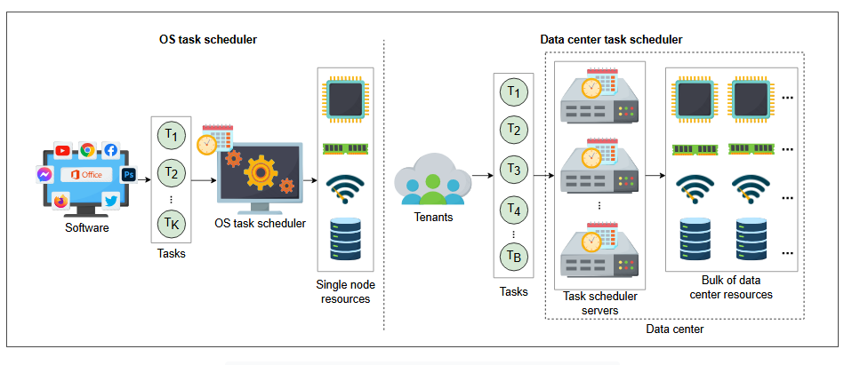

# Проектирование систем: Распределенный планировщик задач

Узнайте об основах проектирования распределенного планировщика задач.

## Что такое планировщик задач?

**Задача** — это часть вычислительной работы, которая требует ресурсов (время ЦП, память, хранилище, пропускная способность сети и т. д.) в течение определенного времени. Например, загрузка фото или видео в Facebook или Instagram состоит из следующих фоновых задач:

1.  Кодирование фото или видео в нескольких разрешениях.
2.  Проверка фото или видео на предмет авторских прав для монетизации контента и многого другого.

Успешное выполнение всех вышеперечисленных задач делает фото или видео видимым. Однако загрузчику фото и видео не нужно дожидаться завершения этих задач.

Другой пример — когда мы публикуем комментарий в Facebook. Мы не задерживаем пользователя, пока комментарий не будет доставлен всем подписчикам. Эта доставка делегируется асинхронному планировщику задач для выполнения в автономном режиме.

В системе множество задач борются за ограниченные вычислительные ресурсы. Система, которая выступает посредником между задачами и ресурсами, интеллектуально распределяя ресурсы между задачами таким образом, чтобы достигались цели на уровне задач и на уровне системы, называется **планировщиком задач**.

## Когда использовать планировщик задач

Планировщик задач — это критически важный компонент системы для эффективного выполнения работы. Он позволяет выполнять большое количество задач, используя ограниченные ресурсы. Он также помогает в полной мере использовать ресурсы системы, обеспечивает пользователям непрерывный опыт выполнения и так далее. Ниже приведены некоторые случаи использования планирования задач:

*   **Узел на базе одной ОС:** В нем много процессов или задач, которые борются за ограниченные вычислительные ресурсы узла. Поэтому мы можем использовать локальный планировщик задач ОС, который эффективно распределяет ресурсы между задачами. Он использует многоуровневые очереди с обратной связью для выбора задач и их запуска на определенном процессоре.

*   **Облачные вычислительные сервисы:** Там, где много распределенных ресурсов и различных задач от множества арендаторов (tenants), существует острая необходимость в планировщике задач для эффективного использования ресурсов облачных вычислений и удовлетворения потребностей арендаторов. Локального планировщика задач ОС для этой цели недостаточно, потому что количество задач исчисляется миллиардами, источник задач не один, а управляемые ресурсы не находятся на одной машине. Нам нужно прибегнуть к распределенному решению.

*   **Крупные распределенные системы:** В таких системах множество задач выполняется в фоновом режиме в ответ на один запрос пользователя. Представьте, что у популярной системы, такой как Facebook, WhatsApp или Instagram, миллионы или миллиарды пользователей. Этим системам требуется планировщик задач для обработки миллиардов задач. Facebook планирует свои задачи в ответ на миллиарды параллельных асинхронных запросов от своих пользователей с помощью Async.

> **Примечание:** Async — это собственный распределенный планировщик задач Facebook, который планирует все его задачи. Некоторые задачи более чувствительны ко времени, например, задачи, которые должны уведомить пользователей о начале прямой трансляции события. Было бы бессмысленно, если бы пользователи получили уведомление о прямой трансляции после ее окончания. Некоторые задачи могут быть отложены, например, задачи, которые предлагают пользователям друзей. Async планирует задачи на основе соответствующих приоритетов.

## Распределенное планирование задач

Процесс принятия решений и своевременного назначения ресурсов задачам называется **планированием задач**. Визуальное различие между планировщиком задач на уровне ОС и планировщиком задач на уровне центра обработки данных показано на следующей иллюстрации:

*Планировщик задач на уровне ОС в сравнении с планировщиком задач на уровне центра обработки данных*

Планировщик задач ОС планирует локальные задачи или процессы узла на вычислительных ресурсах этого узла. В то же время планировщик задач центра обработки данных планирует миллиарды задач, поступающих от множества арендаторов, которые используют ресурсы центра обработки данных.

Наша цель — спроектировать планировщик задач, аналогичный планировщику на уровне центра обработки данных, где учитывается следующее:

*   Задачи будут поступать из множества различных источников, от арендаторов и из подсистем.
*   Множество ресурсов будет рассредоточено в центре обработки данных (или, возможно, в нескольких центрах обработки данных).

Два вышеуказанных требования делают проблему планирования задач сложной. Мы спроектируем распределенный планировщик задач, который сможет обрабатывать все эти задачи, сделав его масштабируемым, надежным и отказоустойчивым.

## Как мы будем проектировать систему планирования задач?

Мы разделили проектирование планировщика задач на четыре урока:

1.  **Требования:** В этом уроке мы определим функциональные и нефункциональные требования к системе планирования задач.
2.  **Проектирование:** В этом уроке мы обсудим проектирование нашей системы планирования задач и рассмотрим компоненты системы и схему базы данных.
3.  **Аспекты проектирования:** В этом уроке мы выделим некоторые факторы проектирования, такие как приоритизация задач, оптимизация ресурсов и так далее.
4.  **Оценка:** Мы оценим наш проект планировщика задач на основе наших требований.

Давайте начнем с понимания требований к системе планирования задач.