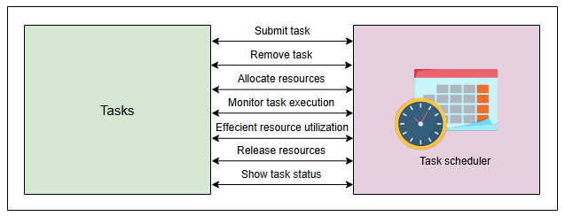
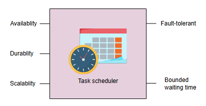
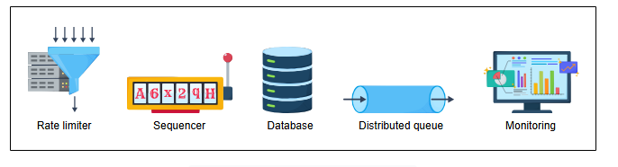

# Требования к проектированию распределенного планировщика задач

Узнайте о функциональных и нефункциональных требованиях к планировщику задач.

## Требования

Давайте начнем с понимания функциональных и нефункциональных требований к проектированию планировщика задач.

### Функциональные требования

Функциональные требования к распределенному планировщику задач следующие:

*   **Отправка задач**: Система должна позволять пользователям отправлять свои задачи на выполнение.
*   **Выделение ресурсов**: Система должна быть способна выделять необходимые ресурсы для каждой задачи.
*   **Удаление задач**: Система должна позволять пользователям отменять отправленные задачи.
*   **Мониторинг выполнения задач**: Выполнение задач должно адекватно отслеживаться и перепланироваться, если задача не выполняется.
*   **Эффективное использование ресурсов**: Ресурсы (ЦП и память) должны использоваться эффективно с точки зрения времени, стоимости и справедливости. Эффективность означает, что мы не тратим ресурсы впустую. Например, если мы выделяем "тяжелый" ресурс для "легкой" задачи, которая легко может быть выполнена на дешевом ресурсе, это означает, что мы неэффективно использовали наши ресурсы. Справедливость — это способность всех арендаторов (tenants) получать ресурсы с одинаковой вероятностью в определенном классе затрат.
*   **Освобождение ресурсов**: После успешного выполнения задачи система должна забрать обратно ресурсы, назначенные задаче.
*   **Отображение статуса задачи**: Система должна показывать пользователям текущий статус задачи.

*Функциональные требования к распределенному планировщику задач*

### Нефункциональные требования

Нефункциональные требования к распределенному планировщику задач следующие:

*   **Доступность (Availability):** Система должна быть высокодоступной для планирования и выполнения задач.
*   **Надежность (Durability):** Задачи, полученные системой, должны быть надежно сохранены и не должны теряться.
*   **Масштабируемость (Scalability):** Система должна быть способна планировать и выполнять постоянно растущее количество задач в день.
*   **Отказоустойчивость (Fault-tolerance):** Система должна быть отказоустойчивой, предоставляя услуги без перебоев, несмотря на сбои в одном или нескольких ее компонентах.
*   **Ограниченное время ожидания (Bounded waiting timeS):** Это время, которое задача должна ждать перед началом выполнения. Мы не должны выполнять задачи намного позже, чем ожидалось. Пользователи не должны ждать бесконечно. Если время ожидания для пользователей превышает определенный порог, они должны быть уведомлены.

*Нефункциональные требования к распределенному планировщику задач*

Итак, в этом уроке мы узнали о планировщиках задач в целом, различили централизованные и распределенные планировщики задач. Наконец, мы перечислили требования к системе распределенного планировщика задач.

## Строительные блоки, которые мы будем использовать

Мы будем использовать следующие строительные блоки при проектировании нашей системы планирования задач:

*Строительные блоки планировщика задач*

*   **Ограничитель скорости (Rate limiter)** необходим для ограничения количества задач, чтобы наша система была надежной.
*   **Секвенсор (A sequencer)** необходим для уникальной идентификации задач.
*   **База(ы) данных** используются для хранения информации о задачах.
*   **Распределенная очередь** необходима для упорядочивания задач в порядке их выполнения.
*   **Мониторинг** важен для проверки состояния ресурсов и обнаружения сбойных задач для предоставления надежного сервиса пользователям.

Мы определили требования к планировщику задач. В следующем уроке мы спроектируем нашу систему планирования задач в соответствии с этими требованиями.