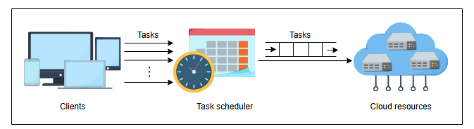
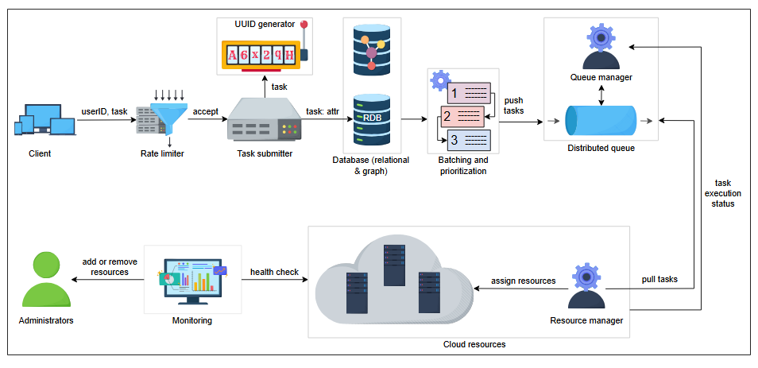

# Проектирование распределенного планировщика задач

Изучите и свяжите компоненты проектирования распределенного планировщика задач.

Давайте определим компоненты, используемые в этом проекте:

## Компоненты

Мы можем рассматривать планирование на многих уровнях. Нас могут попросить спроектировать планирование, которое выполняется внутри
организации для запуска задач на собственном кластере машин. В этом случае им нужно найти достаточные ресурсы и решить, какую задачу
запускать первой.

С другой стороны, нас также могут попросить спроектировать планирование, которое использует облачный провайдер для планирования задач,
поступающих от множества клиентов. Облачным провайдерам необходимо решить, какую задачу запускать первой и каких клиентов обслуживать
первыми, чтобы обеспечить надлежащую изоляцию между различными арендаторами (tenants).

Итак, в общем, основные компоненты нашей системы:

* **Клиенты:** Они инициируют выполнение задачи.
* **Ресурсы:** Задача выполняется на этих компонентах.
* **Планировщик (Scheduler):** Планировщик выполняет процессы между клиентами и ресурсами и решает, какая задача должна получить ресурсы
  первой.

*Планировщик помещает задачи в очередь для выделения ресурсов*

Как показано на иллюстрации выше, необходимо помещать поступающие задачи в **очередь**. Это делается по следующим причинам:

* У нас может не быть достаточных ресурсов в данный момент.
* Существует зависимость задач, и некоторым задачам нужно дождаться других.
* Нам нужно отделить клиентов от выполнения задач, чтобы они могли передать работу нашей системе. Наша система затем ставит ее в очередь на
  выполнение.

Давайте спроектируем систему планирования задач, которая должна быть способна планировать любую задачу. Часто многие задачи относительно
недолговечны — от секунд до минут. Для длительных задач нам может потребоваться возможность периодического создания контрольных сумм и
восстановления на уровне приложения для восстановления после возможных сбоев.

Предположим, что один сервер в нашем парке может удовлетворить вычислительные потребности каждой задачи. Для задач, требующих множество
серверов, либо приложению придется разбивать их на более мелкие задачи для нашей системы, либо использовать долгосрочное приобретение
ресурсов у менеджера кластера.

## Проектирование

Когда задача поступает на планирование, она должна содержать следующую информацию:

* **Требования к ресурсам:** Требования включают, сколько ядер ЦП ей нужно, сколько ОЗУ требуется для выполнения этой задачи, сколько
  дискового пространства требуется, какой должна быть скорость доступа к диску (операций ввода-вывода в секунду, или IOPS), и сколько
  TCP-портов требуется задаче для выполнения, и так далее. Но клиентам сложно количественно определить эти требования. Чтобы исправить эту
  ситуацию, у нас есть разные уровни ресурсов, такие как базовый, обычный и премиум. Клиент может указать требование в терминах этих
  уровней.
* **Зависимость:** В широком смысле задачи могут быть двух типов: зависимые и независимые.
    * **Зависимые задачи** требуют выполнения одной или нескольких дополнительных задач для их полного завершения. Эти задачи должны
      выполняться последовательно. Для зависимой задачи клиент должен предоставить список задач, от которых зависит данная задача.
    * **Независимые задачи** не зависят от выполнения какой-либо другой задачи. Независимые задачи могут выполняться параллельно.
      Нам следует знать, является ли задача зависимой или независимой. Информация о зависимостях помогает выполнять как зависимые задачи по
      порядку, так и независимые задачи параллельно для эффективного использования ресурсов.

Проект планировщика задач показан на следующей иллюстрации:

*Проект планировщика задач*

* **Клиенты**: Клиентами облачных провайдеров являются частные лица или организации, от малого до крупного бизнеса, которые хотят выполнять
  свои задачи.
* **Ограничитель скорости (Rate limiter)**: Ресурсы, доступные клиенту, зависят от стоимости, которую они платят. Важно ограничивать
  количество задач для надежности нашего сервиса. Например, в систему разрешено входить *X* задач в час. Остальные получат сообщение вроде "
  Лимит превышен", вместо того чтобы принимать задачу и отвечать с задержкой. Ограничитель скорости ограничивает количество задач, которые
  клиент может запланировать, в зависимости от его подписки. Если лимит превышен, он возвращает клиенту сообщение об ошибке о превышении
  лимита скорости.
* **Отправитель задач (Task submitter)**: Отправитель задач принимает задачу, если она успешно проходит через ограничитель скорости. У нас
  нет одного отправителя задач. Вместо этого у нас есть кластер узлов, которые принимают растущее количество задач.
* **Генератор уникальных ID**: Он присваивает уникальные идентификаторы вновь принятым задачам.
* **База данных**: Все задачи, принятые отправителем задач, хранятся в распределенной базе данных. Для каждой задачи у нас есть некоторые
  атрибуты, и все атрибуты, кроме одного, хранятся в реляционной базе данных.
    * **Реляционная база данных (РБД)**: Реляционная база данных хранит идентификаторы задач, идентификаторы пользователей, требуемые
      ресурсы, лимиты на выполнение, общее количество попыток, сделанных клиентом, допустимую задержку и так далее, как показано в следующей
      таблице.
    * **Графовая база данных (ГБД)**: Это нереляционная база данных, которая использует структуру данных графа для хранения данных. Мы
      используем ее для построения и хранения направленного ациклического графа (DAG) зависимых задач, топологически отсортированного
      отправителем задач, чтобы мы могли планировать задачи в соответствии с этим DAG.

### Схема Базы Данных

| Имя столбца          | Тип данных | Описание                                                                                                                                                                                               |
|----------------------|------------|--------------------------------------------------------------------------------------------------------------------------------------------------------------------------------------------------------|
| TaskID               | Integer    | Уникально идентифицирует каждую задачу.                                                                                                                                                                |
| UserID               | Integer    | Это ID владельца задачи.                                                                                                                                                                               |
| SchedulingType       | VarChar    | Может быть разовым, ежедневным, еженедельным, ежемесячным или ежегодным.                                                                                                                               |
| TotalAttempts        | Integer    | Максимальное количество повторных попыток в случае сбоя выполнения задачи.                                                                                                                             |
| ResourceRequirements | VarChar    | Клиенты должны указать тип предлагаемых категорий ресурсов, таких как Базовый, Обычный или Премиум. Указанная категория ресурсов сохраняется в виде строки в РБД.                                      |
| ExecutionCap         | Time       | Максимальное время, разрешенное для выполнения задачи. (Это время начинается, когда задаче выделяется ресурс.)                                                                                         |
| Status               | VarChar    | Может быть: ожидание, в процессе, выполнено или сбой.                                                                                                                                                  |
| DelayTolerance       | Time       | Указывает, какую задержку мы можем выдержать перед началом задачи.                                                                                                                                     |
| ScriptPath           | VarChar    | Путь к скрипту, который необходимо выполнить. Скрипт — это файл, размещенный в файловой системе. Файл должен быть доступен для выполнения, так же как мы монтируем Google Drive в Google Colaboratory. |

> **Примечание:** Если мы используем геореплицированные хранилища данных, мы можем запускать несколько экземпляров нашей системы
> планирования задач в разных центрах обработки данных для достижения еще большего масштаба и более высокой утилизации ресурсов.

* **Пакетная обработка и приоритизация**: После того как мы сохраняем задачи в РБД, они группируются в пакеты. Приоритизация основана на
  атрибутах задач, таких как допустимая задержка или задачи с коротким лимитом на выполнение и так далее. *K* задач с наивысшим приоритетом
  помещаются в распределенную очередь, где *K* ограничивает количество элементов, которые мы можем поместить в очередь. Значение *K* зависит
  от многих факторов, таких как текущие доступные ресурсы, приоритет клиента или задачи и уровень подписки.

  
К размышлению

  
1. Почему мы храним задачи в базе данных? Почему бы не отправлять задачи напрямую в очередь?

  

    
Показать ответ

    

     Данные хранятся в очереди не постоянно. Мы платим за обслуживание очереди, которое используем. Поэтому мы просто помещаем в очередь те задачи, которые готовы к выполнению в ближайшее время. Успешно выполненные задачи необходимо удалить из очереди. Кроме того, существуют различные типы планирования. Задание может быть запланировано один раз, ежедневно, еженедельно, ежемесячно или ежегодно. Поэтому мы должны сохранить задание где-нибудь в нашем хранилище.

  

* **Распределенная очередь**: Она состоит из очереди и менеджера очередей. Менеджер очередей добавляет, обновляет или удаляет задачи в
  очереди. Он отслеживает типы очередей, которые мы используем. Он также отвечает за хранение задачи в очереди до ее успешного выполнения. В
  случае сбоя выполнения задачи, эта задача снова становится видимой в очереди. Менеджер очередей знает, какую очередь запускать в часы пик,
  а какую — в часы низкой нагрузки.
* **Менеджер очередей**: Менеджер очередей удаляет задачу из очереди, если она успешно выполняется. Он также делает задачу видимой, если ее
  предыдущее выполнение завершилось сбоем. Он повторяет попытки выполнения задачи в течение разрешенного количества раз в случае сбоя.
* **Менеджер ресурсов**: Менеджер ресурсов знает, какие ресурсы свободны. Он извлекает задачи из распределенной очереди и назначает им
  ресурсы. Менеджер ресурсов отслеживает выполнение каждой задачи и отправляет их статусы обратно менеджеру очередей. Если задача превышает
  обещанное или требуемое использование ресурсов, эта задача будет прервана, и статус будет отправлен обратно отправителю задач, который
  уведомит клиента о прекращении задачи через сообщение об ошибке.
* **Сервис мониторинга**: Он отвечает за проверку работоспособности менеджера ресурсов и самих ресурсов. Если какой-то ресурс выходит из
  строя, он оповещает администраторов для его ремонта или добавления новых ресурсов при необходимости. Если ресурсы не используются, он
  оповещает администраторов об их удалении или
  отключении.

## Отправитель задач

Как мы видели выше, каждый компонент, который мы используем в проектировании распределенного планировщика задач, является распределенным и,
следовательно, масштабируемым и доступным. Но отправитель задач может стать единой точкой отказа. Чтобы справиться с этим, мы используем
кластер узлов. Каждый узел должен принимать задачи, отправлять их в генератор уникальных ID для присвоения идентификатора, а затем сохранять
задачу вместе с ID задачи в распределенной базе данных.

Существует менеджер кластера, которому каждый узел отправляет heartbeat-сигнал, указывающий на то, что узел работает корректно. Каждый узел
информирует менеджера кластера о принятых задачах. Менеджер кластера поддерживает список задач и ID узла, который принял эту задачу. В
случае сбоя выполнения задачи узлом, менеджер кластера передает эту задачу другому узлу в кластере. Сам менеджер кластера реплицируется.

Выше мы спроектировали систему планирования задач. В следующем уроке мы обсудим аспекты проектирования нашего планировщика задач.