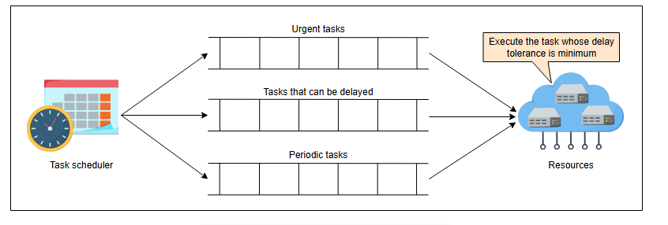

# Аспекты проектирования распределенного планировщика задач

Узнайте об аспектах проектирования распределенного планировщика задач.

## Очереди

Распределенная очередь является основным строительным блоком, используемым планировщиком. Самый простой подход к планированию — это помещать
задачи в очередь по принципу **«первым пришел — первым обслужен» (first-come, first-served)**. Если в кластере (облаке) есть 10 000 узлов (
ресурсов), планировщик задач быстро извлекает задачи из очереди и планирует их на узлах. Но если все ресурсы в данный момент заняты, то
задачам придется ждать в очереди, и маленьким задачам, возможно, придется ждать дольше.

Этот механизм планирования может повлиять на надежность системы, ее доступность и приоритет задач. Могут быть случаи, когда нам требуется
срочное выполнение задачи — например, задачи, уведомляющей пользователя о том, что в его учетную запись вошли с неопознанного устройства.
Поэтому мы не можем полагаться только на принцип «первым пришел — первым обслужен» для планирования задач. Вместо этого мы классифицируем
задачи и устанавливаем соответствующие приоритеты. У нас есть следующие три категории для наших задач:

* Задачи, которые нельзя откладывать.
* Задачи, которые можно отложить.
* Задачи, которые необходимо выполнять периодически (например, каждые 5 минут, каждый час или каждый день).

*Несколько очередей на основе категорий задач*

Наша система гарантирует, что задачи в несрочных очередях не будут «голодать». Как только лимит задержки какой-либо задачи подходит к концу,
она перемещается в очередь срочных задач, чтобы получить обслуживание. Позже в этом уроке мы увидим, как планировщик реализует приоритеты.

Давайте рассмотрим некоторые параметры, которые помогают планировщику эффективно использовать ресурсы и предоставлять надежный сервис
пользователям.

## Лимит на выполнение

Некоторые задачи выполняются очень долго и занимают ресурс, блокируя другие задачи. **Лимит на выполнение (execution cap)** — важный
параметр, который следует учитывать при планировании задач. Если мы полностью выделим ресурс одной задаче и будем ждать ее завершения,
некоторые задачи могут никогда не остановиться из-за ошибки в скрипте задачи, которая не позволяет ей завершиться. Мы позволяем клиентам
устанавливать лимит на выполнение для своих задач. По истечении указанного времени мы должны остановить выполнение задачи, освободить ресурс
и выделить его следующей задаче в очереди. Если выполнение задачи останавливается из-за лимита на выполнение, наша система уведомляет
соответствующих клиентов об этих случаях. Клиенту необходимо предпринять соответствующие меры для таких случаев.

Если клиенты не устанавливают лимит на выполнение, планировщик использует свое значение по умолчанию для максимального разрешенного времени,
чтобы прервать задачу. Предположим, задача на самом деле занимает больше времени — например, если мы обучаем модель машинного обучения. В
этом случае планировщику может потребоваться многократно приостанавливать и возобновлять задачу, чтобы учесть другие задачи. Было бы
несправедливо по отношению к короткой задаче, которой пришлось бы ждать два дня, чтобы использовать ресурс на две секунды.

Облачные провайдеры не могут позволить задаче выполняться неограниченное время на базовом (бесплатном) аккаунте, потому что использование их
ресурсов стоит провайдерам определенных денег. Для таких случаев клиентов информируют о максимальных лимитах использования, чтобы они могли
справляться с длительным выполнением задач. Например, клиенты могут спроектировать свои задачи таким образом, чтобы они создавали
контрольные точки (checkpoint) через некоторое время и загружались из этого состояния для возобновления прогресса в случае, если ресурсы
отбираются у клиента из-за лимита использования.

  
К размышлению

  
Что, если длительная задача выполнена на 90%, но прежде чем она завершится, машина, которая ее выполняла, выходит из строя?

  

    
Показать ответ

    

    Планировщик задач повторно выполнит задачу на каком-либо другом компьютере. Задачи должны быть либо идемпотентными, что обсуждается далее на уроке, либо они должны иметь возможность восстанавливать свое состояние с предыдущей контрольной точки. Как только состояние сохранено, мы можем возобновить выполнение этой задачи на любом другом компьютере. Это делает нашу систему отказоустойчивой и экономит наши ресурсы.

  

## Приоритизация

Существуют задачи, требующие срочного выполнения. Например, в социальном приложении, таком как Facebook, пользователи могут отмечать себя в
безопасности во время чрезвычайной ситуации, например, землетрясения. Задачи, выполняющие это действие, должны выполняться своевременно,
иначе эта функция будет бесполезна для пользователей Facebook. Отправка электронного письма клиентам о списании определенной суммы с их
счета — еще один пример задач, требующих срочного выполнения.

Для приоритизации задач планировщик поддерживает параметр **допустимой задержки (delay tolerance)** для каждой задачи и выполняет задачу
близко к ее допустимой задержке. **Допустимая задержка** — это максимальное время, на которое может быть отложено выполнение задачи. Задача
с наименьшим временем допустимой задержки выполняется первой. Используя параметр допустимой задержки, мы можем откладывать задачи с большими
значениями допустимой задержки, чтобы освободить место для срочных задач в часы пик.

  
К размышлению

  
Как мы определяем значение допустимой задержки?

  

    
Показать ответ

    

Поскольку в различных приложениях существуют разные категории задач, владельцы приложений или клиенты могут самостоятельно устанавливать или автоматизировать значения в зависимости от категории задачи. Например, в приложении для социальных сетей, таком как Facebook, мы можем создавать новостную ленту, предлагать друзей, позволять пользователям отмечать себя в безопасности после стихийного бедствия, отправлять уведомления о событии в прямом эфире и многое другое. Из перечисленных задач приоритетными должны быть обеспечение безопасности человека во время землетрясения и отправка уведомлений о событиях в прямом эфире. Клиенты могут снизить допустимые значения задержки для этих задач до миллисекунд или нескольких секунд, в то время как выполнение таких задач, как приглашение друзей, может быть отложено на несколько дней.
Система планирования задач сама может устанавливать допустимое значение задержки в зависимости от категории задачи и ее серьезности.
Для разных приоритетов существуют разные затраты (например, для высокоприоритетных задач затраты обычно выше), так что клиенты могут
тщательно классифицировать свои задачи.

## Оптимизация емкости ресурсов

Может наступить время, когда ресурсы близки к порогу перегрузки (например, загрузка выше 80%). Это называется **часом пик**. Тот же ресурс
может простаивать в часы низкой нагрузки. Поэтому мы должны подумать о лучшем использовании ресурсов в часы низкой нагрузки и о том, как
сохранить доступность ресурсов в часы пик.

Существуют задачи, которые не требуют срочного выполнения. Например, в социальном приложении, таком как Facebook, предложение друзей не
является срочной задачей. Мы можем создать отдельную очередь для таких задач и выполнять их в часы низкой нагрузки. Если у нас постоянно
больше работы, чем доступных ресурсов, у нас может быть проблема с емкостью, и для ее решения нам следует ввести в эксплуатацию больше
ресурсов. Облачный провайдер должен иметь целевое соотношение **ресурсы-к-спросу**. Когда спрос начинает расти, соотношение будет двигаться
к 0. Если соотношение со временем начинает меняться, провайдер может решить ввести в эксплуатацию больше или меньше ресурсов.

## Идемпотентность задач

Если задача выполняется успешно, но по какой-то причине машина не может отправить подтверждение, планировщик запланирует задачу снова.
Задача будет выполнена повторно, и мы получим неверный результат, что означает, что задача была неидемпотентной. Пример неидемпотентности
показан на следующей иллюстрации:

    
Неидемпотентная операция

    <ol>
        <li><b>Начало:</b> У клиента A 20 долларов, у клиента B 0 долларов.</li>
        <li><b>Запрос:</b> A отправляет запрос на перевод 10 долларов клиенту B.</li>
        <li><b>Выполнение:</b> Сервер выполняет перевод, теперь у A 10 долларов, у B 10 долларов.</li>
        <li><b>Сбой подтверждения:</b> Сервер не может отправить подтверждение клиенту A из-за сетевой ошибки.</li>
        <li><b>Повторная попытка:</b> A, не получив подтверждения, повторяет тот же запрос.</li>
        <li><b>Повторное выполнение:</b> Сервер, не зная о предыдущей попытке, снова выполняет перевод.</li>
        <li><b>Результат:</b> У A 0 долларов, у B 20 долларов. Деньги списаны дважды.</li>
    </ol>

Мы не хотим, чтобы конечный результат менялся при повторном выполнении задачи. Это критически важно в финансовых приложениях при переводе
денег. Мы требуем, чтобы задачи были **идемпотентными**. Идемпотентная задача дает один и тот же результат, независимо от того, сколько раз
мы ее выполняем. Выполнение идемпотентной задачи показано на следующей иллюстрации:

    
Идемпотентная операция

    <ol>
        <li><b>Начало:</b> У клиента A 20 долларов, у клиента B 0 долларов.</li>
        <li><b>Запрос:</b> A отправляет запрос на перевод 10 долларов клиенту B, прикрепив уникальный ключ идемпотентности (например, `tx_12345`).</li>
        <li><b>Выполнение:</b> Сервер проверяет, видел ли он этот ключ. Не видел. Он выполняет перевод (у A 10, у B 10) и сохраняет результат, связанный с ключом `tx_12345`.</li>
        <li><b>Сбой подтверждения:</b> Сервер не может отправить подтверждение клиенту A.</li>
        <li><b>Повторная попытка:</b> A повторяет тот же запрос с тем же ключом `tx_12345`.</li>
        <li><b>Проверка:</b> Сервер проверяет ключ `tx_12345`, видит, что он уже обработан, и не выполняет операцию снова.</li>
        <li><b>Результат:</b> Сервер возвращает сохраненный результат. У A 10 долларов, у B 10 долларов. Повторного списания не произошло.</li>
    </ol>

Давайте сделаем задачу загрузки видео в базу данных идемпотентной операцией. Мы не хотим, чтобы видео дублировалось в базе данных в случае,
если загрузчик не получил подтверждение. Идемпотентность гарантирует, что видео не будет дублировано. Это свойство добавляется в реализацию
разработчиками, где они идентифицируют видео по чему-либо (например, по его имени) и перезаписывают старое. Таким образом, независимо от
того, сколько раз кто-то его загружает, конечный результат будет одинаковым. Идемпотентность позволяет нам просто повторно выполнять
неудачную задачу.

  
К размышлению

  
Как нам следует обрабатывать выполнение задачи, которое никогда не может быть завершено из-за бесконечного цикла в полезной нагрузке этой задачи?

  

    
Показать ответ

    

    Нам нужно помечать такие задачи и удалять их. Для этой цели мы можем установить временные ограничения. Если на выполнение требуется больше указанного лимита, мы можем закрыть задачу. Но сложно отличить задачу с ошибками от задачи с длительным сроком выполнения. Мы можем справиться с этим на уровне приложения, где клиенты выполняют длительные задачи, сохраняя состояние в разное время. Клиенты также могут возобновить работу из этого состояния, если планировщик задач завершит выполнение этой задачи, предполагая, что задача содержит бесконечный цикл.

  

## Планирование и выполнение недоверенных задач

Прежде чем продолжить, давайте зададим себе вопрос: что такое недоверенные задачи и как мы должны ими управлять?
 

  <summary">Показать подсказку

 Ненадежные задачи - это задачи, в сценарии выполнения которых есть вероятность наличия вредоносных инструкций, которые могут повлиять на выполнение других задач. Уязвимые задачи могут принадлежать другим пользователям. Ненадежные задачи также могут нанести вред операционной системе или ресурсу, на котором они выполняются.

Программы могут содержать скрытые ошибки и иметь вредоносные намерения. При использовании планировщиков задач мы должны быть осторожны, чтобы одна задача не оказывала негативного влияния на другие. Если мы предоставляем инфраструктуру как услугу, безопасность является важным компонентом. Это связано с тем, что арендаторам становится легче вредить задачам друг друга, выполняя вредоносный код в общей среде. Выполнение вредоносного кода также может повредить нашу инфраструктуру. Поэтому нам необходимо учитывать следующие соображения:

      <ul>
        <li>Использовать соответствующую аутентификацию и авторизацию ресурсов.</li>
        <li>Рассмотреть возможность "песочницы" (sandboxing) для кода с использованием Docker или виртуальных машин.</li>
        <li>Использовать изоляцию производительности между задачами, отслеживая использование ресурсов задачами и ограничивая (или завершая) плохо ведущие себя задачи.</li>
      </ul>

  
К размышлению

  
Что происходит, когда одна и та же задача терпит неудачу несколько раз?

  

    
Показать ответ

    

    Мы можем использовать систему "мертвой очереди", чтобы изолировать постоянно выполняющиеся задачи.

  

Теперь давайте оценим дизайн нашего распределенного планировщика задач в следующем уроке.