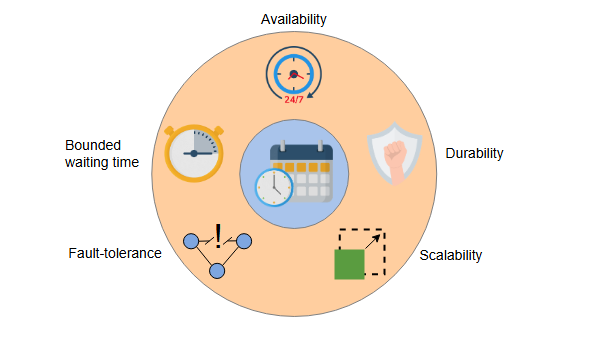

# Оценка проекта распределенного планировщика задач

Оцените предложенную систему планировщика задач на основе наших требований.

## Доступность

Первым компонентом в нашем проекте был ограничитель скорости (rate limiter), который надлежащим образом реплицирован и обеспечивает доступность. Отправка задач выполняется несколькими узлами. Если узел, отправляющий задачу, выходит из строя, его место занимают другие узлы. Очередь, в которую мы помещаем задачи, также является распределенной, что обеспечивает доступность. У нас всегда есть доступные ресурсы, потому что мы постоянно отслеживаем, нужно ли нам добавлять или удалять ресурсы. Каждый компонент в проекте распределен, что делает всю систему доступной.

## Надежность

Мы храним задачи в постоянной распределенной базе данных и помещаем их в очередь незадолго до времени их выполнения. После отправки задача находится в базе данных до ее выполнения.

## Масштабируемость

Наш планировщик задач обеспечивает масштабируемость, потому что отправитель задач в нашем проекте является распределенным. Мы можем добавлять больше узлов в кластер для отправки растущего числа задач. Затем задачи сохраняются в распределенную реляционную базу данных, которая также масштабируема. Задачи из РБД затем помещаются в распределенную очередь, которая может масштабироваться с увеличением количества задач. Мы можем добавлять больше очередей для разных типов задач. Мы также можем добавлять больше ресурсов в зависимости от соотношения ресурсов к спросу.

*Нефункциональные требования, выполненные нашей системой планировщика задач*

## Отказоустойчивость

Задача не удаляется из очереди при первой отправке на выполнение. Если выполнение завершается неудачей, мы повторяем попытку максимальное количество разрешенных раз. Если задача содержит бесконечный цикл, мы прерываем ее выполнение по истечении определенного времени и уведомляем пользователя.

## Ограниченное время ожидания

Мы не заставляем пользователей ждать бесконечно. У нас есть лимит на максимальное время ожидания. Если лимит достигнут, и мы не можем запланировать задачу по какой-либо причине, мы уведомляем пользователей и просим их повторить попытку позже.

> ### Дизайн-задача
>
> Вы проектируете планировщик задач для облачного приложения для обмена фотографиями с миллионами ежедневных загрузок. После загрузки фотографии должны быть обработаны такие задачи, как создание миниатюр, модерация контента, индексация метаданных и наложение водяных знаков. Эти задачи *независимы*, но должны выполняться в *определенном порядке*. Критически важные задачи (например, модерация) должны иметь приоритет. Если задача завершается неудачей, ее следует повторить до трех раз; после этого пользователь должен быть уведомлен.
>
> **Вопросы:**
>
> *   Как бы вы спроектировали планировщик задач для обработки приоритетов, зависимостей и распределения ресурсов?
> *   Как бы вы управляли сбоями и повторными попытками выполнения задач?
> *   Как бы вы обеспечили масштабируемость и высокую доступность?

## Заключение

Мы обсудили разницу между планировщиком задач на уровне ОС и на уровне центра обработки данных. Мы объяснили, что планирование задач на уровне центра обработки данных требует распределенного решения из-за множества арендаторов и рассредоточенных ресурсов. Мы узнали, что очередь является основным строительным блоком планировщика задач. Мы также использовали распределенные очереди, которые позволяют масштабироваться с увеличением количества задач для использования растущего числа ресурсов.

Этот урок помог нам оценить проблемы с очередью FIFO. Было отмечено, что основная работа планировщика задач — устанавливать приоритеты задач, для чего мы использовали параметр допустимой задержки. Мы обсудили, как планировщик задач определяет значение допустимой задержки, и использовали различные распределенные базы данных для хранения деталей задач. Мы обеспечили выполнение зависимых задач в правильном порядке, запуская их в соответствии с DAG, хранящимся в графовой базе данных. В зависимости от количества задач (или спроса) мы добавляли или удаляли ресурсы для оптимизации емкости. В конце мы использовали сервис мониторинга, который оповещает администраторов в случае необходимости добавления или удаления ресурсов.