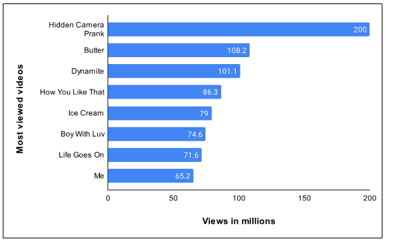
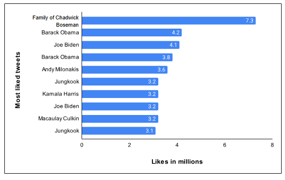

# Проектирование систем: Шардированные счетчики

Знакомство с шардированными счетчиками.

## Постановка задачи

Приложения реального времени, такие как Facebook, Twitter и YouTube, имеют высокий пользовательский трафик. Пользователи взаимодействуют с приложениями и выполняют множество операций (просмотр, лайк, комментарий и т. д.) в зависимости от структуры приложения. Например, изображение публикуется на странице Facebook, у которой миллионы подписчиков, и количество лайков поста быстро растет каждую миллисекунду. Здесь может быть легко посчитать лайки для этого одного изображения, но что мы будем делать, когда тысячи таких изображений или видео загружаются одновременно многими знаменитостями, у каждой из которых миллионы подписчиков. Эта проблема известна как **проблема «тяжеловесов» (heavy hitters problem)**.

Вышеописанный сценарий показывает, как простая операция подсчета становится сложной для управления с точки зрения точности и производительности. На следующем рисунке показаны видео на YouTube, которые были просмотрены миллионами пользователей за 24 часа в августе 2021 года:

*Просмотры видео на YouTube за 24 часа*

В среднем в Twitter отправляется шесть тысяч твитов в секунду, что равно 360 000 твитов в минуту и около 500 миллионам твитов в день. Сложная задача — обработать миллиарды лайков на этих 500 миллионах твитов в день. В следующей таблице показаны самые популярные твиты за один день по состоянию на 2022 год:

*Самые популярные твиты за один день*

Как мы будем обрабатывать миллионы запросов на запись, поступающих на лайки тысяч твитов в минуту? Проблема в том, что запись занимает больше времени, чем чтение, а одновременная активность усложняет эту проблему. По мере увеличения числа одновременных записей для некоторого счетчика (который может быть переменной, находящейся в памяти узла), конкуренция за блокировку (lock contention) возрастает нелинейно. В какой-то момент мы можем потратить большую часть времени на получение блокировки, чтобы безопасно обновить счетчик.

## Как мы будем проектировать шардированные счетчики?

Мы разделили проектирование шардированных счетчиков на три урока:

1.  **Крупноуровневое проектирование**: В этом уроке мы обсудим крупноуровневое проектирование шардированных счетчиков. Кроме того, мы также кратко объясним проектирование API.
2.  **Детальное проектирование**: Этот урок будет посвящен глубокому изучению проектирования шардированных счетчиков. Более того, мы также оценим наш предложенный дизайн.
3.  **Тест**: Мы повторим основные концепции проектирования шардированных счетчиков с помощью теста.

Давайте начнем с наброска высокоуровневого решения для шардированных счетчиков.