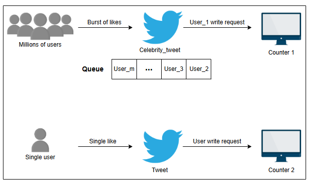
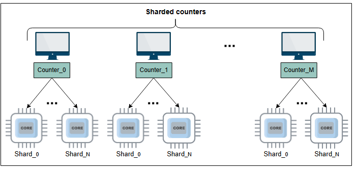

# Крупноуровневое проектирование шардированных счетчиков

Давайте разберемся и спроектируем шардированные счетчики.

## Крупноуровневый набросок решения

Управление миллионами лайков твитов требует множества счетчиков, работающих на многих узлах. Для управления этими счетчиками нам нужна эффективная система, которая может обеспечить высокую производительность и масштабируемость по мере роста числа пользователей.

Что произойдет, когда один твит в Twitter получит миллион лайков, и сервер приложения получит запрос на запись для каждого лайка, чтобы увеличить соответствующий счетчик? Эти миллионы запросов в конечном итоге сериализуются в очередь для обеспечения согласованности данных. Такая сериализация — один из способов справиться с одновременной активностью, хотя и за счет дополнительной задержки. Приложения реального времени стремятся поддерживать высокое качество обслуживания, обеспечивая минимально возможную задержку для конечного пользователя.

Давайте посмотрим на иллюстрацию ниже, чтобы понять эту проблему:



*Твит знаменитости против твита обычного человека*

Одного счетчика для каждого твита, опубликованного знаменитостью, недостаточно для обработки миллионов пользователей. Решением этой проблемы является **шардированный счетчик**, также известный как распределенный счетчик, где каждый счетчик имеет определенное количество шардов по мере необходимости. Эти шарды работают на разных вычислительных блоках параллельно. Мы можем улучшить производительность и уменьшить конкуренцию, распределяя миллионы запросов на запись по шардам.

Сначала запрос на запись перенаправляется на указанный счетчик твита, когда пользователь лайкает этот твит. Затем система выбирает доступный шард указанного счетчика твита для увеличения счетчика лайков. Давайте посмотрим на иллюстрацию ниже, чтобы понять шардированные счетчики с указанным количеством шардов:



*Счетчики и их шарды, работающие на разных вычислительных блоках*

На приведенной выше иллюстрации общее количество шардов на счетчик равно `(N+1)`. Мы будем использовать подходящее значение для `N` в соответствии с нашими потребностями. Давайте рассмотрим пример, чтобы понять, как шардированные счетчики обрабатывают миллионы запросов на запись и чтение для одного поста.

Предположим, что известный YouTube-канал с миллионами подписчиков загружает новое видео. Сервер получает всплеск запросов на запись для просмотров видео от пользователей со всего мира. Сначала для нового загруженного видео инициализируется новый счетчик. Сервер перенаправляет запрос на соответствующий счетчик, и наша система случайным образом выбирает шард и обновляет его значение, которое изначально равно нулю. В отличие от этого, когда сервер получает запросы на чтение, он складывает значения всех шардов счетчика, чтобы получить текущую общую сумму.

Мы можем использовать шардированный счетчик для любого сценария, где нам нужен масштабируемый подсчет (например, посты в Facebook и видео на YouTube).

## Проектирование API для шардированных счетчиков

В этом разделе обсуждаются API, которые будут вызываться для шардированных счетчиков. Наш дизайн API поможет нам понять взаимодействия между шардированными счетчиками и их вызывающими сторонами. Чтобы сделать наше обсуждение конкретным, мы обсудим каждую функцию API в контексте Twitter. Давайте разработаем API для каждой из следующих функций:

*   Создание счетчика
*   Запись в счетчик
*   Чтение счетчика

Хотя приведенный выше список функций API не является исчерпывающим, он представляет некоторые из наиболее важных.

### Создание счетчика

API `createCounter` инициализирует распределенный счетчик для использования. API `createCounter` приведен ниже:

```
createCounter(counter_id, number_of_shards)
```

| Параметр           | Описание                                                                                                                                                |
| ------------------ | ------------------------------------------------------------------------------------------------------------------------------------------------------- |
| `counter_id`       | Представляет уникальный ID счетчика. Вызывающая сторона этого API может использовать секвенсор для получения уникального идентификатора.                   |
| `number_of_shards` | Указывает количество шардов для счетчика.                                                                                                               |

Мы можем использовать подходящее хранилище данных для хранения наших метаданных, которые включают идентификаторы счетчиков, количество их шардов и сопоставление шардов с физическими машинами.

Давайте рассмотрим Twitter в качестве примера, чтобы понять, как приложение использует вышеуказанный API. API `createCounter` используется, когда пользователь публикует что-то в социальных сетях. Например, если пользователь публикует твит в Twitter, сервер приложения вызывает API `createCounter`.

Чтобы найти подходящее значение для `number_of_shards`, мы можем использовать следующие эвристики:

*   Параметр `followers_count` обозначает количество подписчиков пользователя, который публикует твит.
*   Параметр `post_type` указывает, является ли пост публичным или защищенным. Защищенные твиты предназначены только для подписчиков, и в этом случае у нас есть лучший предиктор для количества шардов.

### Запись в счетчик

API `writeCounter` используется, когда мы хотим увеличить (или уменьшить) значение счетчика. На самом деле, увеличивается или уменьшается значение определенного шарда счетчика, и наш сервис принимает это решение на основе нескольких факторов, которые мы обсудим позже. API `writeCounter` приведен ниже:

```
writeCounter(counter_id, action_type)
```

| Параметр        | Описание                                                                                                                           |
| --------------- | ---------------------------------------------------------------------------------------------------------------------------------- |
| `counter_id`    | Это уникальный идентификатор (предоставленный во время создания счетчика).                                                         |
| `action_type`   | Указывает предполагаемое действие (увеличение или уменьшение значения счетчика). Мы извлекаем необходимую информацию о счетчике из нашего хранилища данных. |

В нашем примере с Twitter API `writeCounter` используется, когда пользователи совершают действия (лайкают, отвечают и т. д.) с чужим или своим постом.

### Чтение счетчика

API `readCounter` используется, когда мы хотим узнать текущее значение счетчика. Наша система извлекает соответствующую информацию из хранилища данных, чтобы собрать значения со всех шардов. API `readCounter` приведен ниже:

```
readCounter(counter_id)
```

| Параметр     | Описание                                                                                                                                                                                                                          |
| ------------ | --------------------------------------------------------------------------------------------------------------------------------------------------------------------------------------------------------------------------------- |
| `counter_id` | Это уникальный идентификатор (предоставленный во время создания счетчика). Для Twitter `counter_id` будет определяться на основе `tweet_id` (уникальный ID твита). Мы можем использовать `tweet_id`, чтобы получить `counter_id` для всех счетчиков функций (лайки, ретвиты и т. д.). |

API `readCounter` вызывается, когда пользователи хотят увидеть количество лайков или просмотров определенного твита. Обычно этот API запускается другим API, когда пользователи хотят увидеть свою домашнюю ленту или ленту пользователя.

В следующем разделе мы обсудим, что происходит в бэкенд-системе при вызове всех вышеперечисленных API.