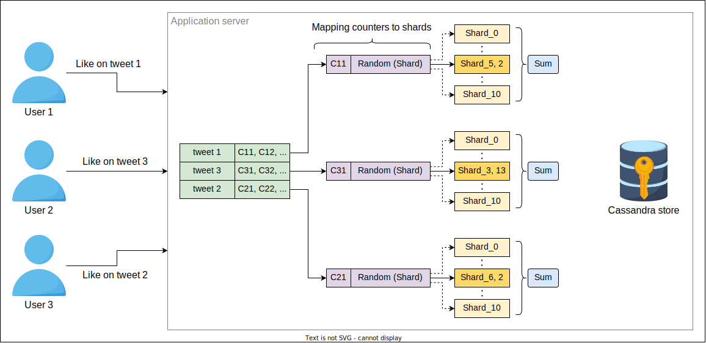

# Детальное проектирование шардированных счетчиков

Узнайте о детальном проектировании шардированных счетчиков.

## Детальное проектирование

Теперь мы подробно обсудим три основные функции шардированного счетчика — создание, запись и чтение. Мы ответим на многие важные вопросы,
используя Twitter в качестве примера. Эти вопросы включают:

* Сколько шардов следует создавать для каждого нового твита?
* Как будет увеличиваться значение шарда для конкретного твита?
* Что будет происходить в системе, когда от конечных пользователей поступят запросы на чтение?

### Создание шардированного счетчика

Как мы обсуждали ранее, когда пользователь публикует твит в Twitter, вызывается API `createCounter`. Система создает несколько счетчиков для
каждого нового поста пользователя. Ниже приведен список основных счетчиков, создаваемых для каждого нового твита:

* Счетчик лайков твита
* Счетчик ответов на твит
* Счетчик ретвитов
* Счетчик просмотров твита, если твит содержит видео

Теперь вопрос в том, как система определяет количество шардов в каждом счетчике? Количество шардов имеет решающее значение для хорошей
производительности. Если количество шардов мало для конкретной рабочей нагрузки на запись, мы сталкиваемся с высокой конкуренцией за запись,
что приводит к медленным записям. С другой стороны, если количество шардов слишком велико для определенного профиля записи, мы сталкиваемся
с более высокими накладными расходами на операцию чтения. Причина медленных чтений заключается в сборе значений из разных шардов, которые
могут находиться на разных узлах в географически распределенных центрах обработки данных. Стоимость чтения значения счетчика линейно
возрастает с количеством шардов, поскольку значения всех шардов соответствующего счетчика суммируются. Записи масштабируются линейно по мере
добавления новых шардов из-за увеличения количества запросов. Таким образом, существует компромисс между ускорением записей и
производительностью чтения. Мы обсудим, как можно улучшить производительность чтения позже.

Решение о количестве шардов зависит от многих факторов, которые в совокупности пытаются предсказать нагрузку на запись для конкретного
счетчика в краткосрочной перспективе. Для твитов эти факторы включают количество подписчиков. Твит пользователя с миллионами подписчиков
получает больше шардов, чем твит пользователя с небольшим количеством подписчиков в Twitter, потому что есть вероятность, что их твиты
получат много, часто миллионы, лайков. Иногда твит знаменитости включает один или несколько хэштегов. Система также создает шардированный
счетчик для этого хэштега, потому что у него есть высокий шанс стать трендом.

Многие человеко-ориентированные действия часто имеют длинный хвост активности, где многие люди сосредоточены на относительно небольшом
наборе действий. Возможно, здесь играет роль сокращенное время концентрации внимания. Это означает, что через некоторое время шквал лайков
утихнет, и нам, возможно, больше не понадобится столько шардов для счетчика, сколько требовалось раньше. Аналогично, наш первоначальный
прогноз будущих записей может оказаться неверным, и нам может понадобиться больше шардов для обработки запросов на запись. Мы требуем, чтобы
наша система могла динамически расширять или сокращать количество шардов в зависимости от текущей потребности.

Нам необходимо отслеживать нагрузку на запись для всех шардов, чтобы соответствующим образом направлять запросы к определенным шардам,
возможно, с помощью балансировщиков нагрузки. Такой механизм обратной связи также может помочь нам решить, когда закрывать некоторые шарды
для счетчика, а когда добавлять дополнительные. Этот процесс не только обеспечивает хорошую производительность для конечного пользователя,
но и использует наши ресурсы на почти оптимальном уровне.

  
К размышлению

  
Что произойдет, если пост пользователя с небольшим количеством подписчиков станет вирусным в Twitter?

  

    
Показать ответ

    

    Система должна обнаруживать такие случаи, когда счетчик неожиданно начинает получать очень высокий трафик на запись. Мы будем динамически увеличивать количество сегментов поврежденного счетчика, чтобы смягчить ситуацию.

  

### Всплеск запросов на запись

Как мы упоминали ранее, миллионы пользователей взаимодействуют с твитом нашей знаменитости, что в конечном итоге вызывает всплеск запросов
на запись в систему. Система назначает каждый запрос на запись доступным шардам указанного счетчика конкретного твита. Как система выбирает
эти шарды, работающие на разных вычислительных блоках (узлах), для назначения запросов на запись? Мы можем использовать три подхода:

#### Циклический выбор (Round-robin)

Один из способов решить вышеуказанную проблему — использовать циклический выбор шардов. Например, предположим, что количество шардов равно
100. Система начинает с shard_1, затем shard_2 и так далее, пока не достигнет shard_100. Обычно циклическое распределение работы либо
перегружает, либо недоиспользует ресурсы, поскольку планирование выполняется без учета текущих условий нагрузки. Однако, если каждый запрос
похож (и требует примерно одинакового времени на обслуживание), циклический подход может быть использован и привлекателен своей простотой.

Следующая серия слайдов показывает выбор шарда с использованием циклической техники. Мы предполагаем, что запросы пользователей сначала
передаются на соответствующий сервер балансировщиком нагрузки. Затем каждый такой сервер использует собственное циклическое планирование для
использования шарда. Для простоты мы показали один сервер, но сервер шарда может получать запросы от многих серверов одновременно и может
быть перегружен, что вызывает задержки для запроса конкретного сервера, что можно увидеть на следующем слайде.

1) Сервер назначает запрос на запись первому свободному сегменту, shard_1, со значением счетчика 12, но shard_1 еще не выполнил свой
   предыдущий запрос, и он увеличит свой счетчик, как только запрос будет полностью обработан.
   

2) Сервер назначает другой запрос на запись следующему свободному сегменту, shard_2, со значением счетчика 66, но shard_2 еще не выполнил
   свой предыдущий запрос, и он увеличит свой счетчик, как только запрос будет полностью обработан.
   

3) Сервер назначает другой запрос на запись следующему свободному сегменту, shard_3, со значением счетчика 31, но shard_3 еще не выполнил
   свой предыдущий запрос, и он увеличит свой счетчик, как только запрос будет полностью обработан.
   

4) Сервер назначает другой запрос на запись следующему свободному сегменту, shard_4, со значением счетчика 65, но shard_4 еще не выполнил
   свой предыдущий запрос, и он увеличит свой счетчик, как только запрос будет полностью обработан.
   

5) Сервер не может выполнить следующий запрос на запись, пока shard_1 не будет занят; хотя shard_3 выполняется с увеличением его счетчика и
   свободен, мы не можем использовать его из-за циклического действия, которому мы здесь следуем.
   

#### Случайный выбор

Другой простой подход — равномерный и случайный выбор шарда для записи. Проблема как с циклическим, так и со случайным выбором заключается в
изменяющейся нагрузке на узлах (где размещены шарды). Трудно адекватно распределить нагрузку на доступные шарды. Изменчивость нагрузки на
узлах является обычным явлением, поскольку физический узел часто используется для нескольких целей.

#### Выбор на основе метрик

Третий подход — это выбор шарда на основе конкретных метрик. Например, выделенный узел (балансировщик нагрузки) управляет выбором шардов,
считывая их статус. Следующие слайды показывают, как создаются шардированные счетчики:

1) Пользователь создает твит.
   

2) Пользователь запрашивает счетчик, используя API create.
   

3) Сервер приложений вычисляет количество сегментов на основе некоторых показателей.
   

4) Запросы на создание сегментов для указанного счетчика с использованием createCounter API отправляются на географически распределенные
   серверы.
   

### Управление запросами на чтение

Когда пользователь отправляет запрос на чтение, система агрегирует значения всех шардов указанного счетчика, чтобы вернуть общее количество
для данной функции (например, лайка или ответа). Накопление значений со всех шардов при каждом запросе на чтение приведет к низкой
пропускной способности чтения и высокой задержке чтения.

Решение о том, когда система будет суммировать значения всех шардов, также очень важно. Если наблюдается высокий трафик на запись наряду с
чтениями, может быть практически невозможно получить реальное текущее значение, потому что к тому времени, как мы сообщим значение чтения
клиенту, оно уже изменится. Поэтому периодическое чтение всех шардов счетчика и их кэширование должно подходить для большинства случаев
использования. Сокращая период накопления, мы можем повысить точность считываемых значений.

  
К размышлению

  
Можете ли вы придумать случай использования, где шардированные счетчики с вышеупомянутой моделью согласованности могут быть неподходящими?

  

    
Показать ответ

    

    Мы могли бы не использовать сегментированные счетчики с упрощенной моделью согласованности, где нам нужна строгая согласованность. Примером могут служить сценарии чтения-записи, в которых нам сначала нужно получить точное значение чего-либо, прежде чем принимать решение об изменении (на самом деле, такой сценарий потребует поддержки транзакций).

  

## Использование шардированных счетчиков для задачи Top K

В этом разделе мы обсудим, как можно использовать шардированные счетчики для решения реальной проблемы, известной как задача **Top K**. Мы
продолжим использовать в качестве примера приложение реального времени Twitter, где вычисление трендов является одной из задач Top K для
Twitter. Здесь `K` представляет количество главных трендов. Многие пользователи используют различные хэштеги в своих твитах. Это огромная
проблема — управлять подсчетом миллионов хэштегов, чтобы показывать их в лентах трендов отдельных пользователей на основе их местоположения.

Шардированный счетчик — ключ к решению вышеуказанной проблемы. Как обсуждалось ранее, в Twitter система создает счетчики для каждого хэштега
и определяет количество шардов в зависимости от количества подписчиков пользователя, который использовал хэштег в твите. Когда пользователи
в Twitter снова используют тот же хэштег в своем твите, подсчет ведется в том же счетчике, который был создан при первом использовании этого
хэштега.

Twitter показывает тренды в основном на основе популярности конкретного хэштега в регионе пользователя. Twitter будет поддерживать отдельный
счетчик для каждой обсуждаемой метрики вместе с глобальным счетчиком хэштега. Давайте обсудим каждую из метрик ниже:

* **Подсчет хэштегов по регионам** указывает на количество твитов с одним и тем же хэштегом, использованным в определенном географическом
  регионе. Например, тысячи твитов с одинаковыми тегами из Нью-Йорка предполагают, что пользователи в районе Нью-Йорка могут увидеть этот
  хэштег в своей ленте трендов.
* **Временное окно** указывает на промежуток времени, в течение которого публикуются твиты с определенными тегами.

*Система подсчитывает количество использований указанного хэштега за 24 часа*

Ниже приведены более подробные сведения о приведенной выше иллюстрации:

* **Глобальный счетчик хэштегов** представляет собой сумму всех счетчиков по местоположению.
* **Счетчики по местоположению** представляют свой текущий подсчет, когда система достигает установленного порога в указанное время, и
  хэштег становится трендом для некоторых пользователей. Например, Twitter устанавливает порог в 10 000. Когда количество использований
  хэштега в определенном месте достигает 10 000, Twitter показывает эти хэштеги в ленте трендов пользователей соответствующей страны.
  Указанный хэштег может отображаться по всему миру, если его использование увеличится во всех странах.

Далее мы обсудим Top K твитов в домашней ленте пользователя. Top K твитов включают аккаунты, на которые подписан пользователь, твиты,
которые пользователь лайкнул, и ретвиты аккаунтов, на которые подписан пользователь. Твиты получают приоритет в задачах Top K на основе
количества подписчиков и времени. Twitter также показывает рекламные твиты и некоторые твиты аккаунтов, на которые пользователь не подписан,
в домашней ленте пользователя, в зависимости от популярности и местоположения твита.

> **Примечание:** Twitter также использует другие метрики для оптимизации выбора Top K, но здесь мы обсудили основные.

## Размещение шардированных счетчиков

Важным вопросом является то, где мы должны размещать шардированные счетчики. Должны ли они находиться на тех же узлах, что и серверы
приложений, на отдельных узлах в центре обработки данных, на узлах CDN на краю сети рядом с конечными пользователями? Точный ответ на этот
вопрос зависит от нашего конкретного случая использования. Для Twitter мы можем вычислять подсчеты, размещая шардированные счетчики рядом с
пользователем, что также может помочь эффективно решать проблемы "тяжеловесов" и Top K.

  
Тест

  
Следует ли нам блокировать все шарды счетчика перед суммированием их значений?

  

    
Показать ответ

    

    Нет. Операции чтения могут выполняться одновременно с записью без необходимости блокировки по всем сегментам. Эта блокировка снизит производительность записи, что является первоначальной причиной, по которой мы использовали сегментированные счетчики. При упрощенной модели согласованности, когда значение счетчика может не отражать точное текущее значение, нет необходимости в одновременных блокировках чтения во всех сегментах.
Однако, в зависимости от конкретного случая использования, такой механизм может использоваться при очень низкой частоте чтения.

  

Чтения могут хранить значения счетчиков в соответствующих хранилищах данных и полагаться на них для масштабируемости чтения. Хранилище *
*Cassandra** может использоваться для поддержания счетчиков просмотров, лайков, комментариев и многих других для пользователей в указанном
регионе. Эти счетчики представляют последнюю вычисленную сумму всех шардов определенного счетчика.

Когда пользователи генерируют ленту, запросы на чтение перенаправляются на ближайшие серверы, и затем для ответа могут использоваться
сохраненные в хранилище значения. Это хранилище также помогает показывать региональные тренды Top K. Список локальных трендов Top K
отправляется на сервер приложений, а затем сервер приложений сортирует все списки, чтобы составить список глобальных трендов Top K. В
конечном итоге сервер приложений отправляет все детали счетчиков в кэш.

Нам также необходимо хранилище для шардированных счетчиков, которое хранит всю информацию о них вместе с метаданными. Серверы Redis или
Memcache могут сыграть здесь важную роль. Например, уникальный ID каждого твита может стать ключом, а значением этого ключа может быть ID
счетчика или список ID счетчиков (счетчик лайков, счетчик ответов и т. д.). Кроме того, каждый ID счетчика имеет свое собственное хранилище
ключ-значение, где ID счетчика является ключом, а значением — список назначенных шардов.

Задача идентификации соответствующего счетчика и сопоставления всех запросов на запись с соответствующим счетчиком в шардированных счетчиках
может выполняться параллельно. Мы сопоставляем все запросы на запись с соответствующим счетчиком, а затем каждый счетчик случайным образом
выбирает шард на основе некоторых метрик для выполнения инкрементов и декрементов. В отличие от этого, мы периодически выполняем агрегацию,
чтобы суммировать значения всех шардов конкретного счетчика. Затем эти значения счетчиков могут быть сохранены в хранилище Cassandra.

1) Пользователи отправляют запросы на запись на сервер приложений.
   

2) Сервер приложений определяет соответствующие счетчики для твитов в хранилище ключей и значений Redis.
   

3) Сервер приложений случайным образом выбирает сегменты по счетчикам в хранилище ключей и значений Redis.
   

4) Выделенные фрагменты будут выделены.
   

5) Вычисляется сумма значений всех сегментов.
   

6) Все вычисленные суммы хранятся в хранилище Cassandra.
   

## Оценка шардированных счетчиков

В этом разделе мы оценим шардированные счетчики и объясним, как они повышают производительность, обеспечивая высокую доступность и
масштабируемость.

### Доступность

Один счетчик для любой функции (например, лайка, просмотра или ответа) имеет высокий риск единой точки отказа. Шардированные счетчики
устраняют единую точку отказа, запуская множество шардов для конкретного счетчика. Система остается доступной, даже если некоторые шарды
выходят из строя или испытывают сбой. Таким образом, шардированные счетчики обеспечивают высокую доступность.

### Масштабируемость

Шардированные счетчики обеспечивают высокую горизонтальную масштабируемость по мере необходимости. Шарды, работающие на дополнительных
узлах, могут быть легко добавлены в систему для увеличения нашей операционной мощности. В конечном итоге эти дополнительные шарды также
повышают производительность системы.

### Надежность

Еще одной основной целью шардированных счетчиков является снижение нагрузки от массовых запросов на запись путем сопоставления каждого
запроса на запись с определенным шардом. Каждый запрос на запись обрабатывается по мере поступления, и нет запросов, ожидающих в очереди.
Благодаря этому коэффициент попаданий (hit ratio) увеличивается, и надежность системы также возрастает. Кроме того, система периодически
сохраняет вычисленные значения в стабильное хранилище — в данном случае, в Cassandra.

## Заключение

В настоящее время шардированные счетчики являются ключевым элементом в улучшении общей производительности гигантских сервисов. Они
обеспечивают высокую масштабируемость, доступность и надежность. Шардированные счетчики решили важные проблемы, включая проблемы "
тяжеловесов" и Top K, которые очень распространены в крупномасштабных приложениях.