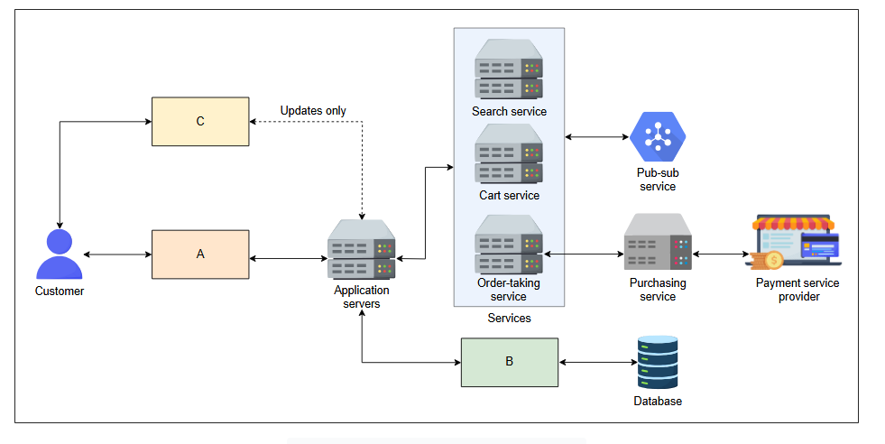

# Оценка с помощью ИИ структурных блоков в платформе для электронной коммерции

Позвольте ИИ оценить ваше понимание структурных блоков на примере абстрактного проектирования системы для платформы электронной коммерции.

---

## Платформа для электронной коммерции

В этом уроке мы оценим наше понимание структурных блоков с помощью интерактивного виджета с ИИ. Давайте начнем!

Рассмотрим представленную ниже абстрактную и упрощенную схему проектирования платформы для электронной коммерции. Схема включает различные компоненты, которые взаимодействуют для выполнения разнообразных задач. Клиент взаимодействует с несколькими сервисами, такими как поиск, корзина покупок и сервис приема заказов. Хотя детали для каждого компонента и сервиса в схеме предоставлены, некоторые недостающие компоненты не описаны. Ваша задача — определить эти недостающие компоненты и кратко описать их функции, используя интерактивный виджет с ИИ, представленный в конце урока.

*Высокоуровневая схема платформы для электронной коммерции*

Различные компоненты в схеме описаны ниже:

1.  **Серверы приложений (Application servers):** Они предоставляют промежуточные сервисы (middleware), обеспечивая связь между различными компонентами приложения. Они также перенаправляют запросы пользователей к соответствующим сервисам.
2.  **Сервис поиска (Search service):** Этот компонент обрабатывает поисковые запросы от пользователей.
3.  **Сервис корзины (Cart service):** Этот сервис управляет корзиной покупок, куда клиенты добавляют различные товары для покупки.
4.  **Сервис приема заказов (Order-taking service):** Этот сервис инициирует заказы клиентов, запуская сервис покупок по запросу пользователя.
5.  **Поставщик платежных услуг (Payment service provider - PSP):** PSP безопасно обрабатывает платежные транзакции, взаимодействуя с внешними платежными шлюзами.
6.  **База данных (Database):** Она постоянно хранит информацию о пользователях и продуктах, такую как изображения, цены, описания и другие метаданные.

> **Ваша задача:** определить недостающие компоненты A, B и C в приведенной выше схеме. Вам необходимо предоставить свой ответ в правильном порядке (A, затем B, и затем C) вместе с кратким описанием.

> 

>  
<b>Ответ</b>

> Компонент A - это балансировщик нагрузки, который равномерно распределяет входящие запросы клиентов по нескольким серверам приложений для обеспечения надежности и масштабируемости.
>
> Компонент B - это уровень кэширования или распределенный кэш, в котором хранятся часто используемые данные для ускорения времени отклика и снижения нагрузки на базу данных.
>
> Компонент C - это сеть доставки контента (CDN), которая доставляет статический контент, такой как изображения и таблицы стилей, с серверов, расположенных ближе к клиентам, что сокращает время загрузки и повышает удобство работы пользователей.
>
>  
