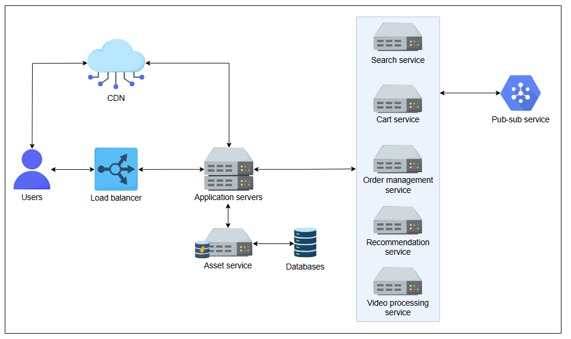

S# Оценка с помощью ИИ структурных блоков в системе онлайн-образования

Позвольте ИИ оценить ваше понимание структурных блоков на примере абстрактного проектирования системы онлайн-образования.

---

## Система онлайн-образования

Ниже представлена высокоуровневая схема проектирования системы онлайн-образования, которая предоставляет различные виды видеоуроков по разным предметам. Пользователи выбирают курсы для покупки и просмотра видеоуроков. Изучите архитектуру, чтобы ответить на приведенные ниже вопросы. Также даны подробности о различных типах сервисов, включенных в схему.

> 💡 **В системе каждый сервис описан ниже:**
>
> *   **Серверы приложений (Application servers):** Серверы приложений получают запросы пользователей и перенаправляют их соответствующим сервисам. Их основная цель — размещать, управлять и выполнять приложения, обрабатывать запросы пользователей и управлять соединениями с базами данных и другими сервисами.
> *   **Сервис поиска (Search service):** Этот сервис помогает пользователям находить релевантные курсы на платформе.
> *   **Сервис корзины (Shopping cart service):** Этот сервис отвечает за хранение курсов, выбранных пользователями для покупки.
> *   **Сервис управления заказами (Order management service):** Этот сервис отвечает за весь процесс, от размещения заказа до его выполнения. Он включает такие задачи, как проверка заказов, обработка платежей, обработка возвратов и возмещений, а также предоставление поддержки клиентам.
> *   **Сервис рекомендаций (Recommendation service):** Этот сервис предоставляет персонализированные рекомендации по контенту для пользователей на основе их предпочтений, поведения и учебных целей.
> *   **Сервис обработки видео (Video processing service):** Этот сервис выполняет задачи по транскодированию, загрузке и потоковой передаче видео по запросу для видеоуроков. Его основными пользователями являются администраторы, которые используют его для загрузки образовательных видео.
> *   **Сеть доставки контента (Content delivery network - CDN):** CDN распространяет веб-контент, состоящий из HTML-страниц, JavaScript-файлов, изображений, видео и других медиафайлов, пользователям в различных географических точках.
> *   **Сервис "Издатель-подписчик" (Pub-sub service):** Сервис Pub-sub разделяет различные сервисы и обеспечивает асинхронную связь между ними.

*Абстрактная схема проектирования системы онлайн-образования*

Как мы видим, представленная схема упрощена, но в системе есть определенные проблемы, которые мы перечислили ниже. В этом упражнении ваша задача — определить структурные блоки, которые, будучи включенными в систему, могут устранить эти проблемы для оптимальной работы системы.

> **Проблемы, с которыми в настоящее время сталкивается система:**
>
> 1.  Если определенные пользователи постоянно отправляют чрезмерное количество запросов (возможно, это атака типа "отказ в обслуживании"), система может перегрузить наши серверные ресурсы. Необходимо смягчить такие всплески запросов, чтобы предотвратить любое негативное влияние на серверную инфраструктуру. Какой компонент, по вашему мнению, может помочь решить эту проблему?
> 2.  Предположим, мы управляем базой в 200 миллионов пользователей, и они генерируют огромный объем запросов в различных категориях, например, загрузка видео, комментарии, обсуждения на форумах и добавление модулей. Управление и различение этих активностей в системе может быть сложной задачей. Для эффективного решения этой проблемы и уникальной идентификации каждого запроса какой компонент или структурный блок необходим?
> 3.  Инженерная команда в настоящее время тратит значительное количество времени на выявление и устранение сбоев в системе. Чтобы упростить этот процесс, крайне важно интегрировать соответствующий структурный блок или сервис в проектирование системы. Какой компонент вы бы порекомендовали для выявления и устранения сбоев в системе?
> 4.  Помимо недостатков, мы хотим добавить функцию, позволяющую пользователям видеть количество просмотров каждого видеоурока. По сути, нам нужен счетчик для подсчета большого количества просмотров видео. Какой подход вы бы предложили для эффективной оценки приблизительного количества просмотров в этой среде с высокой нагрузкой?
>
> **Примечание:** Пожалуйста, предоставляйте ответы в том же порядке, в котором заданы вопросы.

> 

>  
<b>Ответ</b>

> Для управления и снижения нагрузки на внутренние серверы из-за огромного количества входящих запросов мы должны внедрить ограничитель скорости с подходящим алгоритмом ограничения скорости. Это помогает предотвратить перегрузки, контролируя поток запросов.
>
> Чтобы присвоить уникальные идентификаторы различным запросам и событиям, происходящим в системе, мы должны использовать модуль sequencer. Это гарантирует, что каждый запрос будет иметь отдельный идентификатор, что упрощает отслеживание и управление.
>
> Система должна включать в себя службу мониторинга, чтобы сократить время, необходимое для выявления проблем и устранения неполадок. Она предоставляет аналитическую информацию и оповещения о системных сбоях.
>
> Для эффективной оценки количества просмотров в средах с интенсивным трафиком нам необходим модульный счетчик, известный как сегментированный счетчик. Это позволяет производить приблизительный подсчет с высокой производительностью и минимальной конкуренцией.
>
>  
