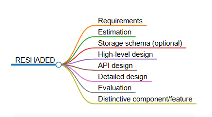
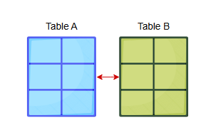
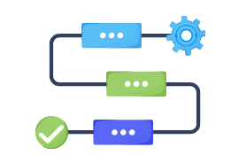
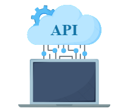

# Подход RESHADED к проектированию систем

Давайте используем наш подход RESHADED для анализа задачи проектирования.

---

## Введение

Задачи по проектированию систем не являются прямолинейными. У нас нет универсальной формулы, которую можно было бы применить ко всем задачам проектирования. Однако мы можем использовать общую высокоуровневую стратегию, чтобы задать тон для хорошего решения любой задачи проектирования. Мы называем это подходом **RESHADED**. Как правило, все наши задачи по проектированию решаются с учетом этой стратегии. RESHADED — это руководство, которое мы будем использовать для решения различных задач проектирования. Хотя универсального решения не существует, использование этого подхода имеет свои преимущества, как мы увидим.

*Расшифровка каждой буквы в подходе RESHADED*

## Преимущества RESHADED

Прежде чем мы рассмотрим каждое слово в RESHADED, давайте обсудим преимущества нашего общего подхода. Ниже приведены некоторые из ключевых преимуществ этого подхода:

1.  Подход RESHADED помогает нам запомнить ключевые шаги для решения каждой задачи проектирования. Это означает, что в любой момент времени у нас всегда будет определен следующий шаг.
2.  Решение, которое мы получим, будет содержать все основные компоненты, необходимые для решения любой задачи проектирования. Более того, решение, предложенное с помощью подхода RESHADED, будет систематичным и продуманным.

## Изучение RESHADED

Ниже мы описываем, какие шаги мы предпринимаем для каждого слова в RESHADED:

**R - Requirements (Требования)**: На этом этапе мы собираем все требования к задаче проектирования и определяем ее рамки. Требования включают понимание того, что представляет собой сервис, как он работает и каковы его основные функции. Наша цель на этом этапе — собрать функциональные и нефункциональные требования к сервису, который мы собираемся проектировать.

**E - Estimation (Расчет)**: Как следует из названия, на этом этапе рассчитываются ресурсы, необходимые для предоставления сервиса определенному числу пользователей. Под ресурсами мы подразумеваем аппаратные или инфраструктурные ресурсы.

Некоторые примеры вопросов для расчета:

1.  Сколько серверов нам потребуется для обеспечения бесперебойной работы сервиса для 500 миллионов ежедневных активных пользователей (DAU)?
2.  Сколько хранилища нам понадобится, если нам нужно хранить 125 миллионов твитов в день, и 20% твитов содержат медиафайлы?

Расчеты важны, потому что они помогают нам понять масштаб системы, которую мы будем проектировать. Мы будем принимать ключевые решения на основе этой оценки. Например, мы решим, какой тип базы данных использовать для хранения наших данных, какая структура данных обеспечит оптимальную производительность и так далее.

**S - Storage schema (Схема хранения) (необязательно)**: Этот шаг включает в себя формулирование нашей модели данных, то есть мы определяем, какие таблицы нам нужны и какие поля являются частью каждой таблицы. Однако это необязательный шаг, и мы можем не выполнять эту работу в каждой задаче проектирования.

**H - High-level design (Высокоуровневое проектирование)**: Этот шаг включает в себя определение основных компонентов и строительных блоков, которые мы будем использовать для проектирования нашей системы. Мы делаем это, основываясь на наших функциональных и нефункциональных требованиях. Это считается первым шагом к полному проектированию нашей системы и, следовательно, требует дальнейших итераций и улучшений. В первую очередь, этот раздел будет сосредоточен на выполнении функциональных требований.

**A - API design (Проектирование API)**: Цель на этом этапе — создать интерфейсы для нашего сервиса. Используя эти интерфейсы, пользователи могут вызывать различные сервисы внутри нашей системы. Эти интерфейсы представлены в виде вызовов API и, как правило, являются переводом наших функциональных требований.

**D - Detailed design (Детальное проектирование)**: Детальное проектирование начинается с выявления ограничений высокоуровневого проектирования. Мы будем использовать эти ограничения для развития нашего дизайна. На этом этапе мы завершим наше проектирование, упомянув все компоненты и строительные блоки, которые мы будем использовать. Мы также определяем рабочий процесс нашего дизайна и использование различных технологий. Детальное проектирование направлено на выполнение как функциональных, так и нефункциональных требований задачи.

**E - Evaluation (Оценка)**: Этот шаг оценивает эффективность нашего решения. Другими словами, мы обосновываем, как наш дизайн выполняет функциональные и нефункциональные требования. Мы обсуждаем различные компромиссы, на которые мы пошли в нашем решении, а также определяем возможности для улучшения.

**D - Distinctive component/feature (Отличительный компонент/особенность)**: В начале этого урока мы обсуждали, что универсального решения не существует. Этот шаг заключается в том, чтобы определить уникальный аспект для каждой задачи проектирования и обсудить его. Например, в задаче проектирования Uber уникальными особенностями являются платежный сервис и обнаружение мошенничества. В отличие от этого, у Google Docs есть контроль параллелизма, который необходим, когда разные пользователи хотят одновременно редактировать один и тот же раздел документа.

Далее мы применим наше руководство (RESHADED) ко многим задачам проектирования.