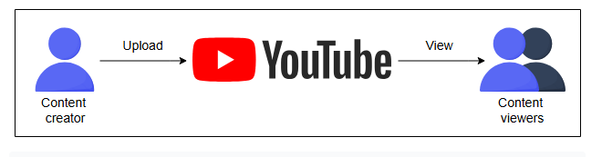
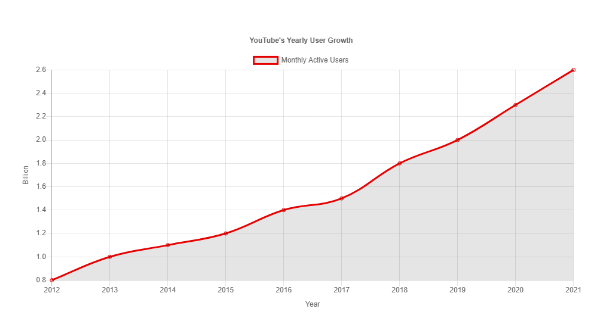

# Проектирование систем: YouTube

Давайте разберемся в основных деталях, необходимых для проектирования сервиса YouTube.

## Что такое YouTube?

YouTube — это популярный сервис потокового видео, где пользователи могут загружать, просматривать, искать, комментировать, делиться видео, а
также ставить им лайки и дизлайки. Как крупные компании, так и частные лица ведут каналы, на которых размещают свои видео. YouTube позволяет
бесплатно размещать видеоконтент для пользователей по всему миру. YouTube считается основным источником развлечений, особенно среди
молодежи, и по состоянию на 2022 год, по данным Википедии, он является вторым по посещаемости
веб-сайтом в мире после Google.

*Изображение, показывающее, как создатель контента загружает видео на YouTube, которое затем просматривают множество зрителей*

## Популярность YouTube

Вот некоторые из причин, по которым YouTube приобрел популярность за эти годы:

* **Простота**: YouTube имеет простой, но мощный интерфейс.
* **Богатый контент**: Простой интерфейс и бесплатный хостинг привлекли большое количество создателей контента.
* **Постоянное совершенствование**: Команда разработчиков YouTube неустанно работала над удовлетворением требований к масштабируемости.
  Кроме того, в 2007 году Google приобрел YouTube, что добавило ему авторитета.
* **Источник дохода**: YouTube запустил партнерскую программу, которая позволила создателям контента зарабатывать деньги на своем вирусном
  контенте.

Помимо вышеуказанных причин, YouTube также заключил партнерские соглашения с такими гигантами рынка, как CNN и NBC, чтобы укрепить свои
позиции.

## Рост YouTube

Давайте посмотрим на некоторые интересные статистические данные о YouTube и его популярности.

С момента своего создания в феврале 2005 года количество пользователей YouTube многократно возросло. На данный момент у YouTube более 2,5
миллиардов активных пользователей в месяц. Давайте посмотрим на график ниже, чтобы увидеть, как росло число пользователей YouTube за
последнее десятилетие.

*(Представлен график, показывающий рост числа активных пользователей YouTube в месяц по годам)*

YouTube является вторым по популярности стриминговым сайтом после Netflix. Каждую минуту на YouTube просматривается **694 000 часов
видеоконтента**!

> ### Оцените свои знания
>
> Давайте оценим ваше понимание строительных блоков, необходимых для проектирования YouTube. Основываясь на приведенных ниже функциональных
> и нефункциональных требованиях, определите три ключевых строительных блока, необходимых для создания дизайна YouTube.
>
> * **Функциональные требования:**
>     * Потоковая передача видео
>     * Загрузка видео
>     * Поиск видео по названию
>     * Возможность ставить лайки и дизлайки
>     * Добавление комментариев к видео
>     * Просмотр миниатюр (thumbnails)
>
> * **Нефункциональные требования:**
  >   * Высокая доступность
>   * Масштабируемость
>   * Хорошая производительность
>
> Вам следует сосредоточиться на строительных блоках, необходимых для **внутреннего хранения данных (back-end storage) и эффективной их
передачи** конечным пользователям. Пожалуйста, укажите также причины выбора того или иного строительного блока.
> 

>  
<b>Показать</b>

>  Базы данных для хранения метаданных: сведений о видео, комментариев и информации о пользователях.
>
> BLOB-хранилище для хранения самих видеофайлов.
>   
> CDN (сеть доставки контента) для эффективной доставки материалов пользователям, что позволяет уменьшить задержки и нагрузку на сервер.
> 

## Как мы будем проектировать YouTube?

Мы разделили процесс проектирования YouTube на пять уроков:

1. **Требования**: Здесь мы
   определяем функциональные и нефункциональные требования. Мы также оцениваем ресурсы, необходимые для обслуживания миллионов пользователей
   каждый день. Этот урок отвечает на вопросы, например, сколько места для хранения понадобится YouTube для 500 часов видео, загружаемых на
   платформу каждую минуту.

2. **Проектирование (Design)**: В этом уроке мы
   объясняем, как мы будем проектировать сервис YouTube. Мы также кратко описываем дизайн API и схемы баз данных. Наконец, мы вкратце
   рассмотрим, как работает поиск на YouTube.

3. **Оценка (Evaluation)**: Этот урок
   объясняет, как YouTube способен выполнить все требования с помощью предложенного дизайна. Также рассматривается, как масштабирование в
   будущем может повлиять на систему и какие решения необходимы для решения проблем масштабирования.

4. **Реальность сложнее**: В этом
   уроке мы рассмотрим различные техники, которые YouTube использует для эффективной доставки контента клиенту и избежания перегрузок сети.

5. **Тест (Quiz)**: Мы закрепляем основные
   концепции, изученные при проектировании YouTube, рассматривая, как можно было бы спроектировать систему Netflix. Наше обсуждение
   использования различных строительных блоков в дизайне будет ограниченным, поскольку мы уже подробно их изучили в
   главе о строительных блоках.