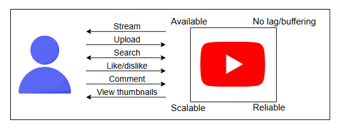
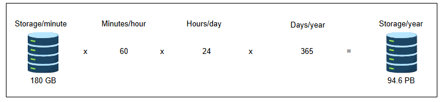
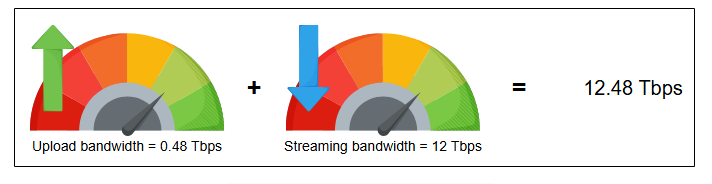
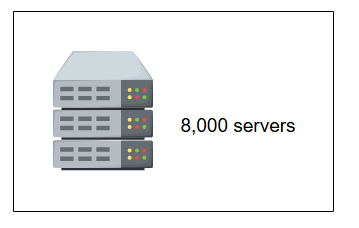
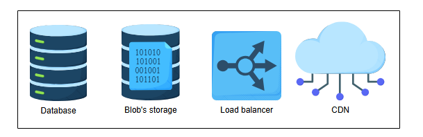
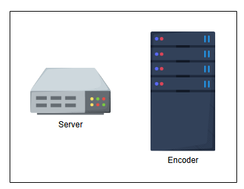

# Требования к архитектуре YouTube

Изучите требования и оценку ресурсов для проектирования YouTube.

## Требования

Начнем с требований к проектированию системы типа YouTube.

### Функциональные требования

Наша система должна выполнять следующие функции:

1.  Транслировать (стримить) видео
2.  Загружать видео
3.  Искать видео по названию
4.  Ставить лайки и дизлайки видео
5.  Добавлять комментарии к видео
6.  Просматривать миниатюры

### Нефункциональные требования

Важно, чтобы наша система также отвечала следующим требованиям:

*   **Высокая доступность (Availability)**: Система должна быть высокодоступной. Это требует хорошего процента времени безотказной работы (uptime). Обычно аптайм 99% и выше считается хорошим.
*   **Масштабируемость (Scalability)**: По мере роста числа пользователей следующие аспекты не должны становиться узкими местами: хранилище для загружаемого контента, пропускная способность для одновременного просмотра, а также количество одновременных запросов пользователей не должны перегружать наш сервер приложений/веб-сервер.
*   **Хорошая производительность (Good performance)**: Плавная потоковая передача видео ведет к лучшей общей производительности.
*   **Надежность (Reliability)**: Контент, загруженный в систему, не должен быть утерян или поврежден.

Для проекта YouTube нам не требуется строгая согласованность данных (strong consistency). Рассмотрим пример, когда автор загружает видео. Не все подписчики канала автора должны немедленно получать уведомление о загруженном контенте.

Подводя итог, функциональные требования — это функции и возможности, которые получит пользователь, тогда как нефункциональные требования — это ожидания от системы с точки зрения производительности.

Основываясь на этих требованиях, мы оценим необходимые ресурсы и спроектируем нашу систему.

## Оценка ресурсов

Оценка требует определения важных ресурсов, которые понадобятся системе.

Каждую минуту на YouTube загружаются сотни минут видеоконтента. Также большое количество пользователей будет одновременно смотреть контент, что означает необходимость в следующих ресурсах:

*   **Ресурсы хранения** для загруженного и обработанного контента.
*   Большое количество запросов можно обработать с помощью **параллельной обработки**. Это означает, что для обслуживания этих пользователей должны быть веб/серверы приложений.
*   Для обслуживания миллионов пользователей потребуется значительная **пропускная способность** как на загрузку, так и на скачивание.

Чтобы перевести эти ресурсы в конкретные цифры, примем следующие допущения:

*   Общее число пользователей YouTube: 1,5 миллиарда.
*   Ежедневно активные пользователи (смотрят или загружают видео): 500 миллионов.
*   Средняя продолжительность видео: 5 минут.
*   Размер среднего 5-минутного видео до обработки/кодирования (сжатие, изменение формата и т.д.): 600 МБ.
*   Размер среднего видео после кодирования (с использованием различных алгоритмов для разных разрешений, таких как MPEG-4 и VP9): 30 МБ.

### Оценка хранилища

Чтобы определить потребности YouTube в хранилище, мы должны оценить общее количество и длительность видео, загружаемых на YouTube в минуту. Допустим, за одну минуту загружается контент общей длительностью 500 часов. Поскольку каждое видео размером 30 МБ длится 5 минут, нам требуется `30 / 5` = 6 МБ для хранения 1 минуты видео.

Представим это в виде формулы, используя следующие переменные:

`Total_storage`: Общая потребность в хранилище.

`Total_upload/min`: Общий объем загружаемого контента (в минутах) в минуту.
*   Пример: за одну минуту загружается видео на 500 часов.
    `Storage_min`: Объем хранилища, необходимый для одной минуты контента.

Тогда для расчета хранилища используется следующая формула:
`Total_storage = Total_upload/min × Storage_min`

**Требуемое хранилище для контента, загружаемого на YouTube в минуту**

| Кол-во часов видео в минуту | Минут в час | МБ в минуту | Хранилище в минуту (ГБ) |
| :--- | :--- | :--- | :--- |
| 500 | 60 | 6 | 180 |

Вышеупомянутые цифры относятся к сжатой версии видео. Однако нам нужно транскодировать видео в различные форматы по причинам, которые мы рассмотрим в следующих уроках. Следовательно, нам потребуется больше места для хранения, чем было оценено выше.

> **Примечание:** В реальном сценарии для архитектуры YouTube требуется хранилище для миниатюр, данных пользователей, метаданных видео, информации о каналах пользователей и так далее. Поскольку требования к хранилищу для этих наборов данных будут незначительными по сравнению с видеофайлами, мы пренебрегаем ими для простоты.

---
> **Вопрос:**
>
> Предполагая, что YouTube хранит видео в пяти разных качествах, а средний размер минутного видео составляет 6 МБ, каковы будут оценочные требования к хранилищу в минуту?
>
> 

>  
<b>Показать</b>

>
> Поскольку нам требуется 6 МБ в минуту и необходимо хранить файлы в пяти разных форматах, общая потребность составляет `5 × 6 МБ = 30 МБ`.
>
> Далее рассчитаем следующее значение:
>
> (Количество часов, загружаемых на YouTube в минуту) × (Количество минут в часе) × (требование к хранилищу в минуту) = 500 (часов/мин) × 60 (минут/час) × 30 (МБ/мин) = **900 (ГБ/мин)**
>
> 

---

### Оценка пропускной способности

Для потоковой передачи и загрузки видео на YouTube потребуется передача большого объема данных. Поэтому нам также необходимо рассчитать оценку пропускной способности. Предположим, что соотношение `загрузка:просмотр` составляет `1:300` — то есть на каждое загруженное видео приходится 300 просмотров в секунду. Мы также должны помнить, что при загрузке видео не сжато, в то время как просматриваемые видео могут быть разного качества. Давайте оценим пропускную способность, необходимую для загрузки видео.

**Требуемая пропускная способность для загрузки видео на YouTube**

| Кол-во часов видео в минуту | Минут в час | МБ в минуту | Требуемая пропускная способность (Гбит/с) |
| :--- | :--- | :--- | :--- |
| 500 | 60 | 120 | 480 |

 
Мы рассчитываем пропускную способность в битах в секунду (бит/с), как было показано выше. Ниже приведен подробный расчет для получения значения 480 Гбит/с.
 
Сначала преобразуем числа в соответствующие единицы измерения:
 
*   Количество часов видео в минуту = 500 часов
*   Количество видеоминут в минуту = 500 * 60 = 30 000 минут
*   Размер среднего 5-минутного видео до обработки/кодирования: 600 МБ.
*   Следовательно, размер видео за одну минуту составляет: `600 МБ / 5 минут` = `120` МБ/минуту.
*   МБ в секунду = 120 / 60 = 2 МБ/секунду
 
**Пропускная способность = 30 000 (минут/минуту) × 2 (МБ/секунду) × 8 (бит/Байт) = 480 000 Мбит/с = 480 Гбит/с**
 
Множитель 8 используется для перевода байтов в биты. По соглашению, пропускная способность измеряется в битах в секунду.

> **Вопрос:**
>
> Если для загрузки требуется 480 Гбит/с, какая пропускная способность потребуется для потоковой передачи видео? Предположим, что каждая минута видео в среднем требует 10 МБ пропускной способности.
> **Подсказка:** Учтите соотношение `загрузка:просмотр`.
>
> 

>  
<b>Показать</b>

>
>  На каждое загруженное видео приходится 300 просмотров. Следовательно, уравнение выглядит так:
>
> (общее количество часов просмотра в минуту) × (размер каждой минуты в МБ) × (коэффициент просмотров) = 500 (часов/мин) × 60 (минут/час) × 10 (МБ/мин) × 300 = 90 (ТБ/мин) × 8 бит = 720 (Тбит/мин) = **12 Тбит/с**
> 
> 

#### Оценка количества серверов

Предположим, у нас 500 миллионов ежедневно активных пользователей YouTube. Используя наше допущение об использовании ежедневно активных пользователей как показателя количества запросов в секунду для определения числа серверов в пиковые моменты нагрузки, мы получаем 500 миллионов запросов в секунду. Затем мы используем следующую формулу для расчета количества серверов:

`Серверы_при_пиковой_нагрузке = (Количество_запросов/секунду) / (RPS_одного_сервера)`

`Серверы_при_пиковой_нагрузке = 500,000,000 / 64,000 = 7812.5 ≈ 8000 серверов`

> **Примечание:** Одновременные запросы значительно влияют на количество требуемых серверов по сравнению с запросами, распределенными во времени. Для более глубокого изучения уточнения предположений о пиковой нагрузке обратитесь к главе «Приблизительные расчеты».

## Основные компоненты, которые мы будем использовать

Теперь, когда мы завершили оценку ресурсов, давайте определим основные компоненты, которые станут неотъемлемой частью нашего проекта системы YouTube. Ключевые компоненты приведены ниже:

*   **Базы данных** необходимы для хранения метаданных видео, миниатюр, комментариев и информации о пользователях.
*   **BLOB-хранилище** важно для хранения всех видеофайлов на платформе.
*   **CDN (сеть доставки контента)** используется для эффективной доставки контента конечным пользователям, снижая задержки и нагрузку на серверы.
*   **Балансировщики нагрузки** необходимы для распределения миллионов входящих клиентских запросов между доступными серверами.

Помимо этих основных компонентов, мы предполагаем использование следующих элементов в нашей высокоуровневой архитектуре:

*   **Серверы** — базовое требование для запуска логики приложения и обработки запросов пользователей.
*   **Кодировщики (encoders)** и транскодеры (transcoders) сжимают видео и преобразуют их в различные форматы и качества для поддержки множества устройств с учетом их разрешения экрана и пропускной способности.

