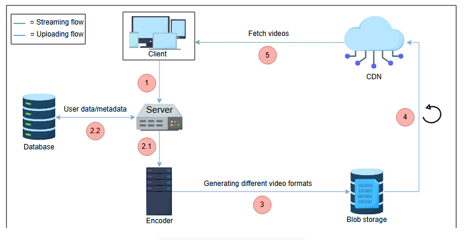
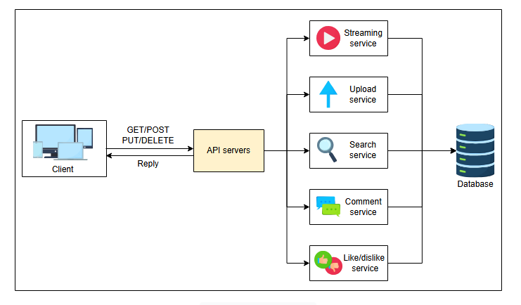
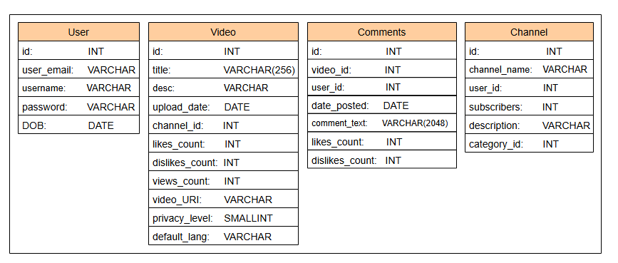
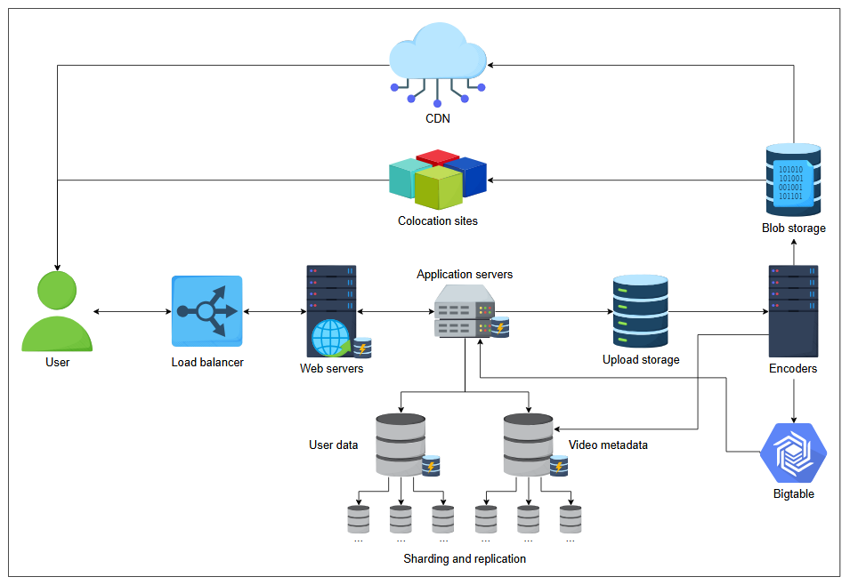
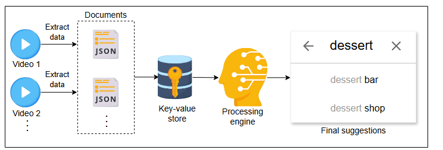

# Архитектура YouTube

Давайте подробно разберем архитектуру YouTube.


## Высокоуровневая архитектура

Высокоуровневая архитектура показывает, как мы свяжем различные компоненты, определенные в предыдущем уроке. С помощью этой архитектуры мы начали разрабатывать решение, поддерживающее функциональные и нефункциональные требования.




Процесс работы для этой абстрактной архитектуры представлен ниже:

1.  Пользователь загружает видео на сервер.
2.  Сервер сохраняет метаданные и сопутствующие данные пользователя в базу данных и одновременно передает видео кодировщику для кодирования (см. шаги 2.1 и 2.2 на иллюстрации выше).
3.  Кодировщик вместе с транскодером сжимает видео и преобразует его в несколько разрешений (например, 2160p, 1440p, 1080p и т.д.). Видео хранятся в BLOB-хранилище (аналогичном GFS или S3).
4.  Некоторые популярные видео могут быть переданы в CDN, который выступает в роли кэша.
5.  CDN, благодаря своей близости к пользователю, позволяет ему смотреть видео с низкой задержкой. Однако CDN — не единственная инфраструктура для доставки видео конечному пользователю, что мы увидим в детализированной архитектуре.

---
> **Вопрос:**
>
> Почему мы не загружаем видео напрямую в кодировщик вместо сервера? Разве текущая стратегия не создает дополнительную задержку?
>
> <details>
>  <summary><b>Показать</b></summary>
>
>  Есть несколько причин, почему стоит разместить сервер между кодировщиком и клиентом:
>
>  *   Клиент может быть вредоносным и злоупотреблять ресурсами кодировщика.
>  *   Если загружаемое видео является дубликатом, сервер может его отфильтровать.
>  *   Кодировщики будут доступны по частным IP-адресам внутри сети YouTube и не будут открыты для публичного доступа.
>
> </details>

---

## Проектирование API

Давайте разберемся в проектировании API с точки зрения функциональности, которую мы предоставляем. Мы спроектируем API для перевода нашего набора функций в технические спецификации. В данном случае для простоты и скорости можно использовать REST API. Раздел проектирования API поможет нам понять, как клиент будет запрашивать услуги у бэкенд-приложения YouTube. Давайте разработаем API для каждой из следующих функций:

*   Загрузка видео
*   Потоковая передача видео
*   Поиск видео
*   Просмотр миниатюр
*   Лайки или дизлайки к видео
*   Комментирование видео




### Загрузка видео

Метод POST можно использовать для загрузки видео через API `/uploadVideo`:

```
uploadVideo(user_id, video_file, category_id, title, description, tags, default_language, privacy_settings)
```

Давайте рассмотрим описание следующих параметров.

| **Параметр** | **Описание** |
| :--- | :--- |
| `user_id` | Пользователь, который загружает видео. |
| `video_file` | Видеофайл, который пользователь хочет загрузить. |
| `category_id` | Категория, к которой относится видео. Типичные категории: «Развлечения», «Инженерия», «Наука» и т. д. |
| `title` | Название видео. |
| `description` | Описание видео. |
| `tags` | Конкретные темы, которые освещаются в видео. `tags` могут улучшить результаты поиска. |
| `default_language` | Язык по умолчанию, который будет отображаться на странице при потоковой передаче видео. |
| `privacy_settings` | Настройки конфиденциальности видео. Обычно видео могут быть общедоступными или частными для загрузившего. |

> Видеофайл разбивается на небольшие пакеты и загружается на сервер по порядку. В случае сбоя YouTube может хранить данные в течение ограниченного времени и возобновить загрузку, если пользователь повторит попытку. Чтобы понять эту концепцию подробнее, прочитайте об **асинхронных API**.
>
> API-интерфейсы, при которых сервер не может выполнить запрос немедленно, либо из-за слишком большого объема данных, либо из-за того, что данные недоступны. В этом случае клиент получает немедленный ответ о том, что сервер принял запрос, в то время как сервер отвечает данными позже. Такой механизм экономит процессор и пропускную способность сети и не заставляет клиента ждать.

### Потоковая передача видео

Метод GET лучше всего подходит для API `/streamVideo`:

```
streamVideo(user_id, video_id, screen_resolution, user_bitrate, device_chipset)
```

Некоторые новые параметры, введенные в этом случае:

| **Параметр** | **Описание** |
| :--- | :--- |
| `screen_resolution` | Сервер может наилучшим образом оптимизировать видео, если известно разрешение экрана пользователя. |
| `user_bitrate` | Пропускная способность пользователя необходима, чтобы понять, какого качества фрагменты видео следует передавать клиенту или пользователю. |
| `device_chipset` | Многие пользователи YouTube смотрят контент на портативных устройствах, поэтому важно знать возможности этих устройств для лучшего обслуживания пользователей. |

> Сервер будет хранить видео одного и того же качества в своем хранилище и обслуживать пользователей в зависимости от их скорости передачи данных.

### Поиск видео

API `/searchVideo` использует метод GET:

```
searchVideo(user_id, search_string, length, quality, upload_date)
```

| **Параметр** | **Описание** |
| :--- | :--- |
| `search_string` | Строка, используемая для поиска видео по названию. |
| `length` (необязательно) | Используется для фильтрации видео по их длительности во времени. |
| `quality` (необязательно) | Используется для фильтрации видео по разрешению, например, 2048p, 1440p, 1080p и т. д. |
| `upload_date` (необязательно) | Используется для фильтрации видео по дате их загрузки на YouTube. |

### Просмотр миниатюр

Мы можем использовать метод GET для доступа к API `/viewThumbnails`:

```
viewThumbnails(user_id, video_id)
```

| **Параметр** | **Описание** |
| :--- | :--- |
| `video_id` | Указывает уникальный идентификатор видео, связанного с миниатюрами. |

Этот API вернет последовательность миниатюр для видео.

### Лайки и дизлайки к видео

API для лайков и дизлайков использует метод POST для регистрации лайка/дизлайка. Как показано ниже, это довольно просто.

```
likeDislike(user_id, video_id, like)
```

Мы можем использовать один и тот же API для функциональности лайков и дизлайков. В зависимости от того, что передается в качестве параметра в поле `like`, мы можем соответствующим образом обновить базу данных — то есть `0` для лайка и `1` для дизлайка.

> ℹ️ Поле `like` также может принимать другое значение, например `none`, для удаления ранее зарегистрированного пользователем лайка/дизлайка.

### Комментирование видео

Как и в случае с API для лайков и дизлайков, нам нужно только передать строку комментария в API. Этот API также будет использовать метод POST.

```
commentVideo(user_id, video_id, comment_text)
```

| **Параметр** | **Описание** |
| :--- | :--- |
| `comment_text` | Текст, который пользователь вводит к конкретному видео. |

---

## Схема хранения данных

Каждая из вышеупомянутых функций в проектировании API требует поддержки со стороны базы данных — нам нужно будет хранить указанные выше детали в нашей схеме хранения, чтобы предоставлять услуги шлюзу API.



> **Примечание:** Многие детали, касающиеся таблиц базы данных, которые можно сопоставить с услугами, предоставляемыми YouTube, были опущены для простоты. Например, одно видео может иметь разное качество, и это не упоминается в таблице «Video».

---

## Детальная архитектура

Теперь давайте вернемся к нашей высокоуровневой архитектуре и посмотрим, можем ли мы дальше исследовать ее части. В частности, следующие области требуют дополнительного обсуждения:

*   **Интеграция компонентов:** Мы рассмотрим некоторые взаимосвязи между серверами и компонентами хранения, чтобы лучше понять, как будет работать система.
*   **Миниатюры:** Важно, чтобы пользователи видели некоторые части видео через миниатюры. Поэтому мы добавим генерацию и хранение миниатюр в детальную архитектуру.
*   **Структура базы данных:** Наши оценки показали, что нам требуется огромное пространство для хранения. Нам также необходимо хранить данные различных типов, такие как видео, метаданные видео и миниатюры, каждый из которых требует специализированного хранения данных для обеспечения производительности. Понимание деталей базы данных позволит нам спроектировать систему с наименьшей возможной задержкой.

Давайте посмотрим на диаграмму ниже. Мы объясним нашу архитектуру в два этапа: сначала рассмотрим, какие компоненты были добавлены, а затем — как они координируются для построения системы YouTube.

### Компоненты детальной архитектуры

Поскольку мы выделили требования к плавной потоковой передаче, деталям на уровне сервера и функциям миниатюр, следующая архитектура будет соответствовать нашим ожиданиям. Давайте объясним назначение каждого добавленного компонента:

*   **Балансировщики нагрузки:** Для распределения большого количества запросов пользователей между веб-серверами нам требуются балансировщики нагрузки.
*   **Веб-серверы:** Веб-серверы принимают запросы пользователей и отвечают на них. Их можно считать интерфейсом к нашим API-серверам, которые обслуживают запросы пользователей.
*   **Сервер приложений:** Логика приложений и бизнес-логика находятся на серверах приложений. Они готовят данные, необходимые веб-серверам для обработки запросов конечных пользователей.
*   **Хранилище пользователей и метаданных:** Поскольку у нас большое количество пользователей и видео, хранилище, необходимое для метаданных видео и контента, связанного с пользователями, должно храниться в разных кластерах хранения. Это связано с тем, что большое количество не очень связанных данных следует разделять для обеспечения масштабируемости.
*   **Bigtable:** Для каждого видео нам потребуется несколько миниатюр. Bigtable — хороший выбор для хранения миниатюр из-за высокой пропускной способности и масштабируемости для хранения данных в формате ключ-значение. Bigtable оптимален для хранения большого количества элементов данных размером менее 10 МБ. Поэтому это идеальный выбор для миниатюр YouTube.
*   **Хранилище для загрузки:** Это временное хранилище, в котором могут храниться загруженные пользователями видео.
*   **Кодировщики:** Каждое загруженное видео требует сжатия и транскодирования в различные форматы. Услуга генерации миниатюр также предоставляется кодировщиками.
*   **CDN и колокейшн-центры:** CDN и колокейшн-центры хранят популярный и умеренно популярный контент, который находится ближе к пользователю для удобного доступа. Колокейшн-центры используются там, где по деловым причинам невозможно инвестировать в полноценный дата-центр.



### Процесс проектирования и использование технологий

Теперь, когда мы понимаем назначение каждого компонента, давайте обсудим процесс и технологии, используемые в различных компонентах, на следующих этапах:

1.  Пользователь может загрузить видео, подключившись к веб-серверам. На веб-сервере может работать Apache или Lighttpd. Lighttpd предпочтительнее, потому что он может обслуживать статические страницы и видео благодаря своей высокой скорости.
2.  Запросы от веб-серверов передаются на серверы приложений, которые могут обращаться к различным хранилищам данных для чтения или записи данных о пользователях, видео или их метаданных. Существуют отдельные веб-серверы и серверы приложений, потому что мы хотим отделить услуги клиентов от логики приложений и бизнеса. На этом уровне можно использовать разные языки программирования для эффективного выполнения различных задач. Например, язык C можно использовать для шифрования. Кроме того, это дает нам дополнительный уровень кэширования, где наиболее запрашиваемые объекты хранятся на сервере приложений, а наиболее часто запрашиваемые страницы — на веб-серверах.
3.  Используется несколько единиц хранения. Давайте рассмотрим каждую из них:
    1.  Хранилище для загрузки используется для временного хранения загруженных пользователями видео перед их кодированием.
    2.  Данные учетных записей пользователей хранятся в отдельной базе данных, а метаданные видео — отдельно. Идея состоит в том, чтобы отделить более часто и менее часто используемые кластеры хранения друг от друга для оптимального времени доступа. Мы можем использовать MySQL, если количество одновременных чтений и записей ограничено. Однако по мере роста числа пользователей — и, следовательно, количества одновременных чтений и записей — мы можем перейти к системам управления данными типа NoSQL.
    3.  Поскольку Bigtable основан на Google File System (GFS), он предназначен для хранения большого количества небольших файлов с низкой задержкой извлечения. Это разумный выбор для хранения миниатюр.
4.  Кодировщики генерируют миниатюры, а также хранят дополнительные метаданные, связанные с видео, в базе метаданных. Они также будут предоставлять популярный и умеренно популярный контент CDN и **колокейшн-серверам** соответственно.
5.  Наконец, пользователь может транслировать видео с любого доступного сайта.

> **Примечание:** Поскольку YouTube требует интенсивного использования хранилища, шардирование различных служб хранения будет эффективно применяться по мере масштабирования и частых записей в базу данных. В то же время Bigtable имеет несколько иерархий кэша. Если мы объединим это с GFS, кэширование на уровне веб-серверов и серверов приложений еще больше сократит задержку обработки запросов.

---

## Поиск на YouTube

Поскольку YouTube является одним из самых посещаемых веб-сайтов, большое количество пользователей будет использовать функцию поиска. Хотя мы уже рассмотрели основной блок распределенного поиска, мы предоставим базовый обзор того, как будет работать поиск в системе YouTube.

Каждое новое видео, загруженное на YouTube, будет обрабатываться для извлечения данных. Мы можем использовать файл JSON для хранения извлеченных данных, которые включают:

*   Название видео.
*   Название канала.
*   Описание видео.
*   Содержание видео, возможно, извлеченное из транскриптов.
*   Длина видео.
*   Категории.

Каждый из файлов JSON можно рассматривать как документ. Затем из документов будут извлечены ключевые слова и сохранены в хранилище ключ-значение. *Ключ* в хранилище ключ-значение будет содержать все ключевые слова, которые ищут пользователи, а *значение* будет содержать количество вхождений каждого ключа, его частоту и местоположение вхождения в различных документах. Когда пользователь ищет ключевое слово, будут возвращены видео с наиболее релевантными ключевыми словами.



Вышеуказанный подход является упрощенным, и релевантность ключевых слов — не единственный фактор, влияющий на поиск в YouTube. В реальности будет иметь значение ряд других факторов. Процессор обработки улучшит результаты поиска путем фильтрации и ранжирования видео. Он будет использовать другие факторы, такие как количество просмотров, время просмотра видео и контекст, а также историю пользователя, для улучшения результатов поиска.
