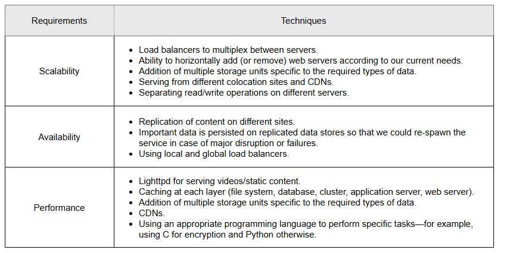
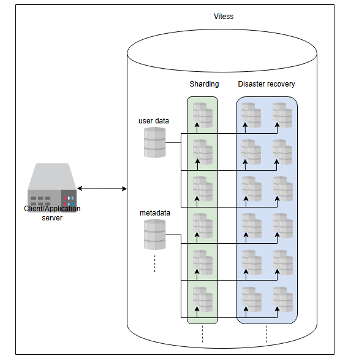
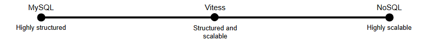

# Оценка проектирования YouTube

Давайте разберемся, как наши проектные решения выполняют требования.

## Выполнение требований

Предложенная нами архитектура должна соответствовать требованиям, которые мы упоминали в предыдущих уроках. Наши основные требования — это
плавная потоковая передача (низкая задержка), доступность и надежность. Давайте обсудим их по одному.

1. **Низкая задержка / Плавная потоковая передача (Low latency/Smooth streaming)** может быть достигнута с помощью следующих стратегий:
    * Географически распределенные кэш-серверы на уровне интернет-провайдеров для хранения наиболее просматриваемого контента.
    * Выбор подходящих систем хранения для различных типов данных. Например, мы можем использовать Bigtable для миниатюр, blob-хранилище для
      видео и так далее.
    * Использование кэширования на различных уровнях через систему управления распределенным кэшем.
    * Использование сетей доставки контента (CDN), которые активно используют кэширование и в основном обслуживают видео из оперативной
      памяти. CDN развертывает свои сервисы в непосредственной близости от конечных пользователей для обеспечения низкой задержки.

2. **Масштабируемость (Scalability)**: Мы предприняли различные шаги для обеспечения масштабируемости в нашей архитектуре, как показано в
   таблице ниже. Горизонтальная масштабируемость веб-серверов и серверов приложений не будет проблемой по мере роста числа пользователей.
   Однако хранилище MySQL не может масштабироваться сверх определенной точки. Как мы увидим в следующих разделах, это может потребовать
   некоторой реструктуризации.

3. **Доступность (Availability**: Систему можно сделать доступной за счет избыточности, реплицируя данные на как можно большем количестве
   серверов, чтобы избежать единой точки отказа. Репликация данных между дата-центрами обеспечит высокую доступность, даже если целый
   дата-центр выйдет из строя из-за проблем с питанием или сетью. Кроме того, локальные балансировщики нагрузки могут исключать любые
   неработающие серверы, а глобальные балансировщики нагрузки могут перенаправлять трафик в другой регион, если возникнет такая
   необходимость.

4. **Надежность (Reliability)**: Систему YouTube можно сделать надежной, используя методы партиционирования данных и отказоустойчивости.
   Благодаря партиционированию данных недоступность одного типа данных не повлияет на другие. Мы можем использовать избыточные аппаратные и
   программные компоненты для обеспечения отказоустойчивости. Кроме того, мы можем использовать протокол `heartbeat` для мониторинга
   состояния серверов и исключения неисправных и ошибочных серверов. Мы можем использовать вариант согласованного хеширования для бесшовного
   добавления или удаления серверов и снижения нагрузки на конкретные серверы в случае неравномерной нагрузки.

> #### ❓ Тест
>
> **1. Разве балансировщик нагрузки не является единой точкой отказа (SPOF)?**
>
> <details>
>  <summary><b>Показать</b></summary>
>   Как и в случае с серверами, мы можем использовать несколько балансировщиков нагрузки. Пользователи могут быть случайным образом перенаправлены на разные балансировщики нагрузки из системы доменных имен (DNS)..
> </details>




---

## Компромиссы

Давайте обсудим некоторые компромиссы нашего предложенного решения.

### Согласованность

Наше решение отдает предпочтение высокой доступности и низкой задержке. Однако строгая согласованность может пострадать из-за высокой
доступности теорему CAP. Тем не менее, для такой системы, как YouTube, мы можем позволить
себе отказаться от строгой согласованности. Это связано с тем, что нам не нужно показывать согласованную ленту всем пользователям. Например,
разные пользователи, подписанные на один и тот же канал, могут не увидеть новое загруженное видео одновременно. Важно отметить, что мы будем
поддерживать строгую согласованность пользовательских данных. Это еще одна причина, по которой мы отделили пользовательские данные от
метаданных видео.

### Распределенный кэш

Мы предпочитаем распределенный кэш централизованному в нашей архитектуре YouTube. Это связано с тем, что факторы масштабируемости,
доступности и отказоустойчивости, необходимые для работы YouTube, требуют кэша, который не является единой точкой отказа. Поэтому мы
используем распределенный кэш. Поскольку YouTube в основном обслуживает статический контент (миниатюры и видео), Memcached является хорошим
выбором, так как это открытое ПО, использующее популярный алгоритм LRU (Least Recently Used). Поскольку паттерны доступа к видео на YouTube
имеют длинный хвост распределения, алгоритмы типа LRU подходят для таких наборов данных.

### Bigtable против MySQL

Еще один интересный аспект нашей архитектуры — использование различных технологий хранения для разных наборов данных. Почему мы выбрали
MySQL и Bigtable?

Основная причина выбора — производительность и гибкость. Количество пользователей на YouTube может не расти так же сильно, как количество
видео и миниатюр. Более того, нам необходимо хранить данные о пользователях и метаданные в структурированном виде для удобного поиска.
Поэтому MySQL является подходящим выбором для таких случаев.

Однако количество загружаемых видео и миниатюр для каждого видео будет очень большим. Требования к масштабируемости заставят нас
использовать собственную или NoSQL-подобную архитектуру для этого хранилища. Можно было бы использовать альтернативы GFS и Bigtable, такие
как HDFS и Cassandra.

### Публичный и частный CDN

Наша архитектура полагается на CDN для доставки контента с низкой задержкой. Однако CDN могут быть частными или публичными. YouTube может
выбрать любой из этих двух вариантов.

Этот выбор больше связан с затратами, чем с архитектурой. Однако в регионах с небольшим трафиком YouTube может использовать публичный CDN по
следующим причинам:

1. Создание частного CDN потребует больших капитальных затрат (CAPEX).
2. При внезапном вирусном трафике в определенных регионах не будет времени на развертывание нового CDN.
3. Может не быть достаточного количества пользователей для поддержания бизнеса.

Однако YouTube может рассмотреть возможность создания собственного CDN, если количество пользователей очень велико, поскольку публичные CDN
могут оказаться дорогими при высоком трафике. Частные CDN также можно оптимизировать для внутреннего использования, чтобы лучше обслуживать
клиентов.

### Дубликаты видео

Текущая архитектура YouTube не обрабатывает дубликаты видео, загруженные пользователем или спамерами. Дублирующиеся видео занимают
дополнительное место, что приводит к компромиссу. В результате мы либо тратим впустую место для хранения, либо сталкиваемся с дополнительной
сложностью в процессе загрузки для обработки дубликатов.

Давайте выполним некоторые расчеты, чтобы решить эту проблему. Предположим, что 50 из 500 часов видео, загружаемых на YouTube, являются
дубликатами. Учитывая, что одна минута видео требует 6 МБ дискового пространства, дублированный контент займет следующее место:

```
(50 x 60) минут x 6 МБ/мин = 18 ГБ
```

Если мы избежим дублирования видео, мы сможем сэкономить до 9,5 петабайт дискового пространства в год. Расчеты следующие:

```
18 ГБ/мин x (60 x 24 x 365) общее количество минут в году = 9,5 Петабайт
```

Потеря места для хранения и другие вычислительные затраты — не единственные проблемы с дубликатами видео. Важным аспектом дубликатов
является проблема авторских прав. Ни один создатель контента не захочет, чтобы его контент был сплагиачен. Поэтому целесообразно добавить в
архитектуру YouTube сложность обработки дубликатов видео.

Дублирование можно решить с помощью простых методов, таких как локально-чувствительное хеширование (locality-sensitive hashing). Однако
могут существовать и более сложные методы, такие как алгоритмы сопоставления блоков (Block Matching Algorithms, BMAs) и фазовая корреляция
для поиска дубликатов. Реализация этого решения может быть довольно сложной в огромной базе данных видео. Возможно, нам придется
использовать технологии, такие как искусственный интеллект (ИИ).

---

## Будущее масштабирование

До сих пор мы фокусировались на проектировании и анализе предложенной архитектуры YouTube. В действительности архитектура YouTube довольно
сложна и требует передовых систем. В этом разделе мы сосредоточимся на прагматичной структуре хранилищ данных и веб-сервера.

Мы начнем наше обсуждение с некоторых ограничений в плане масштабирования YouTube. В частности, мы рассмотрим, какие изменения в архитектуре
нам придется внести, если нагрузка на наш сервис возрастет, скажем, в несколько раз.

Мы уже знаем, что нам придется масштабировать нашу существующую инфраструктуру, которая включает следующие элементы:

* Веб-серверы
* Серверы приложений
* Хранилища данных
* Размещение балансировщиков нагрузки между каждым из вышеуказанных уровней
* Внедрение распределенных кэшей

Любая из упомянутых выше инфраструктур требует некоторых модификаций и адаптации логики на уровне приложения. Например, если мы продолжим
увеличивать объем данных на серверах MySQL, это может стать узким местом. Для эффективного использования шардированной базы данных нам,
возможно, придется внести изменения в наш клиент базы данных, чтобы достичь хорошего уровня производительности и поддерживать свойства
ACID (атомарность, согласованность, изоляция, долговечность). Однако даже если мы продолжим изменять клиент базы данных по мере
масштабирования, его сложность может достичь точки, когда он станет неуправляемым. Также обратите внимание, что мы еще не включили в нашу
архитектуру механизм аварийного восстановления.

Для решения вышеуказанных проблем YouTube разработал решение под названием **Vitess**.

A

Ключевая идея Vitess заключается в том, чтобы создать абстракцию поверх всех слоев базы данных, создавая у клиента иллюзию, что он общается
с одним сервером базы данных. В данном случае единой базой данных является система Vitess. Таким образом, вся сложность клиента базы данных
переносится и обрабатывается Vitess. Это поддерживает свойства ACID, поскольку внутренняя используемая база данных — MySQL. Однако мы можем
обеспечить масштабирование за счет партиционирования. В результате мы получим структурированную базу данных MySQL, которая обеспечивает
производительность системы хранения NoSQL. В то же время нам не придется мириться со сложным клиентом базы данных (логикой приложения).
Следующая иллюстрация показывает, как Vitess удается достичь и масштабируемости, и структурированности.




Можно было бы представить использование таких методов, как денормализация данных, вместо системы Vitess. Однако денормализация данных не
сработает, поскольку она достигается за счет снижения производительности записи. Даже если наша работа в основном связана с чтением, по мере
масштабирования системы производительность записи ухудшится до невыносимого предела.

## Веб-сервер

**Веб-сервер** — чрезвычайно важный компонент, и по мере масштабирования собственный веб-сервер может стать жизнеспособным решением. Это
связано с тем, что большинство коммерческих или открытых решений являются универсальными и разработаны с учетом широкого круга
пользователей. Поэтому для такого успешного сервиса желателен собственный веб-сервер.

Давайте проведем интересный эксперимент, чтобы увидеть, какой сервер YouTube использует в настоящее время. Нажмите на терминал ниже и
выполните следующую команду:

```bash
lynx -head -dump http://www.youtube.com | grep ^Server
```

> **Примечание:** ESF — это собственный веб-сервер, разработанный Google, и по состоянию на начало 2022 года он широко используется в
> экосистеме Google, поскольку готовых решений было недостаточно для нужд YouTube.
