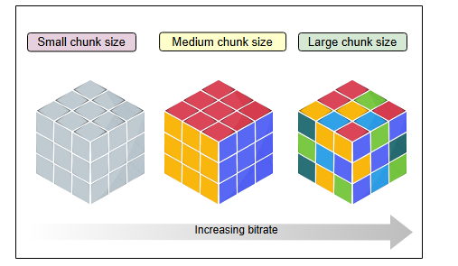
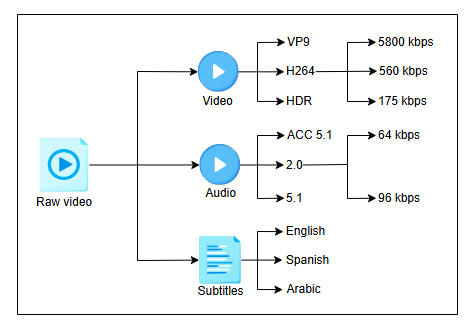
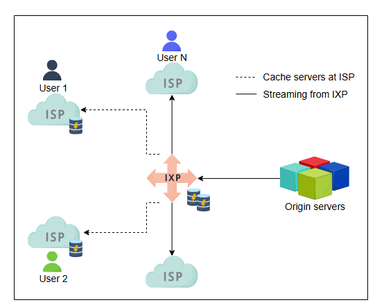
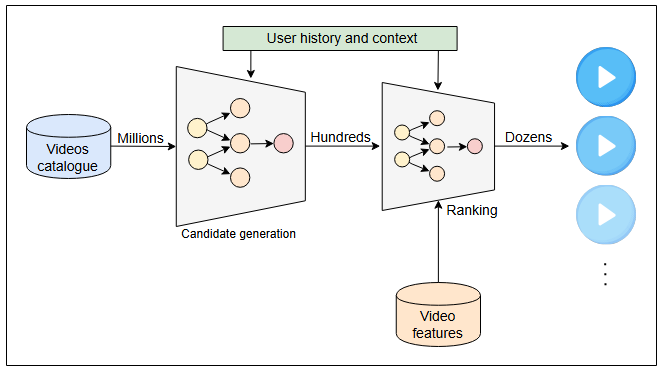
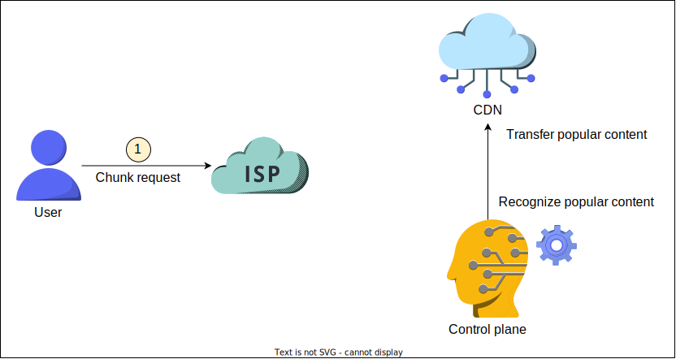
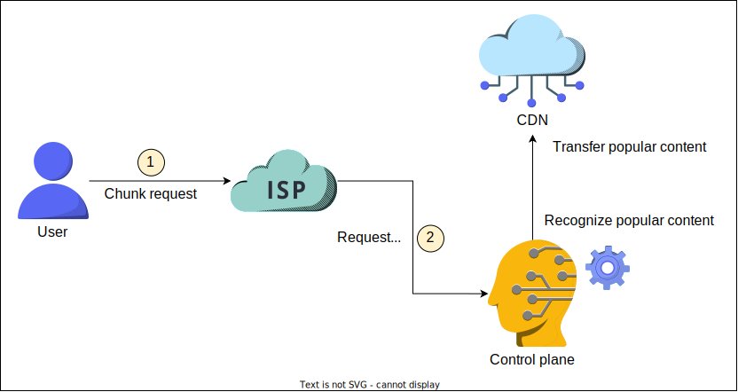
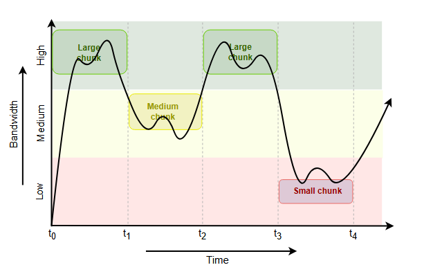
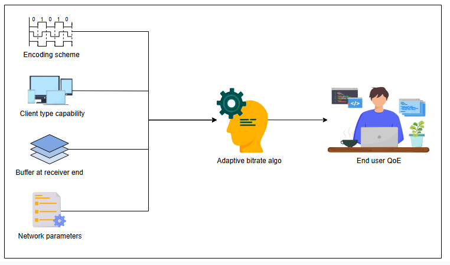

# Реальность сложнее

Узнайте, как YouTube может использовать различные методы для эффективной доставки контента конечному пользователю.

## Введение

Теперь, когда мы хорошо разобрались в архитектуре, давайте посмотрим, как YouTube может оптимизировать использование хранилища и сетевых ресурсов, сохраняя при этом хорошее **качество восприятия (QoE)** для конечного пользователя.

Когда речь идет об эффективном предоставлении услуг конечным пользователям, важны следующие три шага:
 
> Качество восприятия  - это показатель удовлетворенности клиента получением конкретной услуги.

*   **Кодирование**: Необработанные видео, загруженные на YouTube, требуют значительного объема хранилища. Можно использовать различные схемы кодирования для уменьшения размера этих необработанных видеофайлов. Помимо сжатия, выбор схемы кодирования также будет зависеть от типов конечных устройств, используемых для потоковой передачи видеоконтента. Поскольку для просмотра одного и того же видео могут использоваться несколько устройств, нам, возможно, придется кодировать одно и то же видео с использованием разных схем, что приведет к преобразованию одного исходного видеофайла в несколько файлов, каждый из которых закодирован по-своему. Эта стратегия приведет к хорошему восприятию пользователем по двум причинам: пользователи сэкономят трафик, поскольку видеофайл будет закодирован и сжат до определенного предела, а закодированный видеофайл будет подходить для клиента, обеспечивая плавное воспроизведение.
*   **Развертывание**: Для низкой задержки контент должен быть разумно развернут так, чтобы он находился ближе к большому количеству конечных пользователей. Это не только уменьшит задержку, но и снизит нагрузку на сети, а также на основные серверы YouTube.
*   **Доставка**: Доставка клиенту требует знаний о клиенте или устройстве, используемом для воспроизведения видео. Эти знания помогут адаптироваться к условиям клиента и сети. Таким образом, мы сможем эффективно доставлять контент.

Давайте теперь подробно разберем каждый этап.

## Кодирование

До сих пор мы рассматривали кодирование одного видео с помощью разных схем. Однако, если мы будем кодировать видео покадрово (per-shot), мы разделим видео на более мелкие временные отрезки и будем кодировать их индивидуально. Мы можем разделить видео на короткие временные отрезки и называть их сегментами. Каждый сегмент будет закодирован с использованием нескольких схем кодирования для создания различных файлов, называемых фрагментами (chunks). Выбор схемы кодирования для сегмента будет основываться на детализации внутри сегмента, чтобы получить оптимальное качество при меньших требованиях к хранилищу. В конечном итоге каждый кадр будет закодирован в несколько фрагментов разного размера в зависимости от содержимого сегмента и используемой схемы кодирования. Разделив исходное видео на сегменты, мы увидим преимущества этого на этапах развертывания и доставки.

Давайте разберемся, как будет работать кодирование по сегментам. Для любого видео с динамичными цветами и высокой глубиной мы будем кодировать его иначе, чем видео с меньшим количеством цветов. Это означает, что не очень динамичный сегмент будет закодирован так, чтобы он был сжат сильнее для экономии дополнительного места в хранилище. В итоге нам придется передавать файлы меньшего размера и экономить пропускную способность на этапах развертывания и потоковой передачи.

Используя вышеописанную стратегию, нам придется кодировать отдельные кадры видео в различных форматах. Альтернативой этому было бы хранение целого видео (без сегментации) после кодирования его в различных форматах. Если мы кодируем покадрово, мы сможем оптимально уменьшить размер всего видео, выполняя кодирование на гранулярном уровне. Мы также можем кодировать аудио в различных форматах, чтобы оптимально обеспечить потоковую передачу для различных клиентов, таких как телевизоры, мобильные телефоны и настольные компьютеры. В частности, для таких сервисов, как Netflix, кодирование аудио более полезно, поскольку аудио предлагается на разных языках.

---

## Развертывание

Как обсуждалось в разделах проектирования и оценки, мы должны приблизить контент к пользователю. У этого есть три основных преимущества:

1.  Пользователи смогут быстро просматривать видео.
2.  Нагрузка на **исходные серверы** будет снижена.
3.  У интернет-провайдеров (ISP) появится свободная пропускная способность.

Таким образом, вместо того чтобы транслировать видео напрямую из наших дата-центров, мы можем развертывать фрагменты популярных видео в CDN и **точках присутствия (PoP)** интернет-провайдеров. В местах, где сотрудничество с интернет-провайдерами невозможно, наш контент может быть размещен в **точках обмена интернет-трафиком (IXP)**. Размещение контента в IXP не только приблизит его к пользователям, но и поможет заполнять кэш в PoP интернет-провайдеров.

Следует помнить, что кэширование на уровне ISP или IXP выполняется только для популярного или умеренно популярного контента из-за ограниченной емкости хранилища. Поскольку наша схема кодирования по кадрам экономит место, мы сможем предоставлять больше контента, используя кэширующую инфраструктуру, расположенную ближе к конечным пользователям.

Кроме того, на исходных серверах у нас может быть два типа хранилищ:

1.  **Flash-серверы**: Эти серверы хранят популярный и умеренно популярный контент. Они оптимизированы для доставки с низкой задержкой.
2.  **Серверы хранения**: Этот тип хранит большую часть видео, которые не являются популярными. Эти серверы оптимизированы для хранения больших объемов данных.

> **Примечание:** При передаче потокового контента это может привести к перегрузке сетей. Поэтому мы должны передавать контент интернет-провайдерам в часы наименьшей нагрузки.

### Рекомендации

YouTube рекомендует видео пользователям на основе их профиля, учитывая такие факторы, как их интересы, история просмотров и поиска, подписанные каналы, связанные темы с уже просмотренным контентом и активность, связанная с контентом, такая как комментарии и лайки.

Приблизительная схема работы механизма рекомендаций YouTube представлена ниже. YouTube фильтрует видео в два этапа:

1.  **Генерация кандидатов**: На этом этапе миллионы видео на YouTube отфильтровываются до сотен на основе истории пользователя и текущего контекста.
2.  **Ранжирование**: На этапе ранжирования видео оцениваются по их характеристикам и в соответствии с интересами и историей пользователя. Сотни видео фильтруются и ранжируются до нескольких десятков на этом этапе.

**YouTube использует технологию машинного обучения** на обоих этапах для предоставления рекомендаций пользователям.

> #### 🤔 Для размышления
>
> **1. Ранее мы говорили, что популярный контент отправляется в ISP, IXP и CDN. Теперь мы обсудили функцию рекомендаций YouTube. В чем разница между популярным и рекомендованным контентом на YouTube?**
>
> 

>  
<b>Показать</b>

>   Рекомендации зависят от профилей и интересов пользователей, в то время как популярный контент определяется на региональной или глобальной основе. Популярный контент можно представлять широкой аудитории.
> 

>
> **2. Можете ли вы привести какое-нибудь шаблонное представление о том, как будет работать алгоритм YouTube для популярного контента?**
>
> 

>  
<b>Показать</b>

>
>Для аппроксимации формулы мы можем принять пороговое значение, которое является взвешенной суммой всех рассматриваемых факторов, например, так:
>
> $$
> Th_{reg} = Comments_{wt} \times Comments_{num} + Likes_{wt} \times Likes_{num} + Links_{wt} \times Links_{num} \cdots
> $$
>
>Где:
>
>*   $Th_{reg}$ — это число, которое будет использоваться для определения, является ли видео вирусным в определенном регионе.
>*   $Comments_{wt}$ — это вес комментариев.
>*   $Comments_{num}$ — это количество комментариев.
>*   $Likes_{wt}$ — это вес лайков.
>*   $Likes_{num}$ — это количество лайков.
>*   $Links_{wt}$ — это вес ссылок (например, когда на видео ссылаются с других сайтов).
>*   $Links_{num}$ — это количество ссылок.
>
>Сумма всех весов равна 1.
>
>Мы также можем предположить, что для разных регионов могут быть установлены разные пороговые уровни. Наконец, мы можем считать видео глобально популярным, если сумма пороговых значений для разных регионов превышает глобальное пороговое значение. YouTube также может принять решение размещать некоторые видео напрямую в CDN в зависимости от канала, с которого они были загружены.
> 

>
> **3. Что касается вопроса 2, как часто, по вашему мнению, будет производиться приблизительный расчет популярности контента? По каждому клику, лайку или комментарию?**
>
> 

>  
<b>Показать</b>

>
> Вычисление для каждого клика, лайка или комментария требует специальной инфраструктуры для корректного выполнения расчетов в реальном времени. Эту процедуру следует ограничить:
>
> *   Самыми популярными каналами.
> *   Либо использовать определенную метрику, которая запускает вычисление каждый раз, когда ее значение пересекает определенный порог. Хорошим триггером может быть растущее число запросов к конкретному видео за короткий промежуток времени.
> 

---

## Доставка

Давайте посмотрим, как конечный пользователь получает контент на свое устройство. Поскольку у нас уже есть фрагменты видео, развернутые рядом с пользователями, мы перенаправляем пользователей к ближайшим доступным фрагментам. Как показано ниже, всякий раз, когда пользователь запрашивает контент, который YouTube распознал как популярный, YouTube перенаправляет пользователя на ближайший CDN.

Однако в случае непопулярного контента пользователь обслуживается с колокейшн-сайтов или из дата-центра YouTube, где контент хранится изначально. Мы уже узнали, как YouTube может сократить время задержки за счет распределенных кэшей на разных уровнях архитектуры.

1) Пользователь запрашивает блок данных у интернет-провайдера.
   

2) Интернет-провайдер перенаправляет запрос на панель управления YouTube.
   

3) Панель управления перенаправляет пользователя на ближайший CDN.
   

4) Пользователь начинает потоковую передачу с ближайшего CDN.
   

### Адаптивная потоковая передача

Пока контент доставляется, пропускная способность сети пользователя постоянно отслеживается. Поскольку видео разделено на фрагменты разного качества, но одинаковой длительности, фрагменты предоставляются клиентам в зависимости от меняющихся условий сети.

Как показано ниже, при высокой пропускной способности клиенту отправляется фрагмент более высокого качества, и наоборот.

Алгоритм адаптивного битрейта зависит от следующих четырех параметров:

1.  Доступная пропускная способность от начала до конца (от CDN/серверов до конкретного клиента).
2.  Возможности устройства пользователя.
3.  Используемые методы кодирования.
4.  Размер буфера у клиента.

---

> #### 💡 Задание
>
> **Укажите способы, которыми мы достигаем низкой задержки в архитектуре YouTube.**
>
> 

>  
<b>Показать</b>
> 
> Низкая задержка в нашей архитектуре достигается за счет:
> 1.  **Использования сетей доставки контента (CDN):** Размещение популярного контента на серверах, географически близких к пользователям.
> 2.  **Кэширования на различных уровнях:** Кэширование в точках присутствия (PoP) интернет-провайдеров (ISP) и точках обмена трафиком (IXP).
> 3.  **Разделения хранилищ:** Использование быстрых Flash-серверов для популярного контента и серверов хранения для менее востребованного.
> 4.  **Адаптивного кодирования:** Уменьшение размера видеофайлов путем их разделения на сегменты и оптимального кодирования каждого, что сокращает время передачи данных.
> 5.  **Адаптивной потоковой передачи:** Динамический выбор качества видеофрагментов на основе текущей пропускной способности сети пользователя, что предотвращает буферизацию.
> 

---

## Возможные дополнительные вопросы

Существует множество различных аспектов системного проектирования YouTube, поскольку эта тема очень глубока. Поэтому может возникнуть много вопросов. Некоторые вопросы и направления для ответов на них:

1.  **Вопрос**: Можно ли количественно оценить доступность, указав такие цифры, как 99,99% или 99,999% доступности? В таком случае, какие изменения в архитектуре потребуются?
   
**Ответ**: Это сложный вопрос. В действительности такие цифры являются частью SLA сервиса и генерируются на основе моделей или долгосрочных эмпирических исследований. Хотя полезно знать, как получаются эти цифры и как организации используют мониторинг для поддержания высокой доступности, лучшей стратегией может быть обсуждение отказоустойчивости системы — что произойдет при сбоях программного обеспечения, отказах серверов, полных отказах дата-центров и так далее. Если система устойчива к сбоям, это означает, что у нее будет хорошая доступность.

2.  **Вопрос**: Мы использовали некоторые разумные средние значения для определения общих требований к ресурсам. Например, мы сказали, что средняя длина видео составляет пять минут. В этом случае мы проектируем для среднего поведения? Что произойдет с пользователями, которые не соответствуют среднему профилю?

**Ответ**: Возможный ответ заключается в том, что эти цифры, скорее всего, со временем изменятся. Наша системная архитектура должна быть горизонтально масштабируемой, чтобы при увеличении числа пользователей система продолжала работать адекватно. На практике системы могут не масштабироваться, когда какой-то аспект системы увеличивается на порядок (например, в 10 раз). Когда какой-то аспект системы увеличивается на порядок, обычно требуется новая, другая архитектура. Стоимость проектирования для масштабов 10x и 100x очень разная.

3.  **Вопрос**: Почему мы не обсуждали и не оценивали ресурсы для комментариев и лайков к видео?
    
**Ответ**: Обработка комментариев от одновременных пользователей к видео по сложности примерно соответствует проектированию системы обмена сообщениями. Мы обсудим эту проблему в другом месте курса.

4.  **Вопрос**: Как управлять неожиданными всплесками нагрузки на систему?
    
**Ответ**: Возможный ответ: поскольку наша архитектура горизонтально масштабируема, мы можем перенести часть нагрузки в публичное облако благодаря его эластичным возможностям. Однако публичные облака не являются бесконечно масштабируемыми. Они часто требуют предварительных бизнес-контрактов, которые могут устанавливать лимит на максимальное одновременное использование ресурсов в разных дата-центрах.

5.  **Вопрос**: Как мы будем развертывать глобальную сеть для соединения дата-центров и сайтов CDN?
    
**Ответ**: На практике YouTube использует сеть Google, которая создана для этой цели и имеет пиринговые соглашения со многими интернет-провайдерами мира. Это увлекательная область исследований, которую мы оставили за рамками этого курса для дальнейшего изучения.

6.  **Вопрос**: Почему нет более подробной информации о кодировании аудио/видео?
    
**Ответ**: Существует множество вариантов кодирования аудио/видео, многие из которых общеизвестны, а некоторые являются проприетарными. Из-за избыточности в мультимедийном контенте кодирование часто позволяет значительно уменьшить размер исходного контента (например, с 600 МБ до 30 МБ). Мы оставили детали таких алгоритмов кодирования вам для дальнейшего изучения, если вам это интересно.

7.  **Вопрос**: Можем ли мы использовать специализированное оборудование (или ускорители, такие как GPU) для ускорения некоторых аспектов вычислений на YouTube?

**Ответ**: Когда мы оценивали количество серверов, мы предполагали, что любой сервер может выполнять любую требуемую функциональность. В действительности, с замедлением **закона Мура**, у нас есть специализированное оборудование (например, аппаратные кодеры/декодеры, ускорители машинного обучения, такие как Tensor Processing Units, и многое другое). Все такие платформы требуют отдельных курсов, чтобы отдать должное материалу. Поэтому мы избежали этого обсуждения в данной задаче проектирования.

8.  **Вопрос**: Следует ли выполнять сжатие на стороне клиента или на стороне сервера на этапе загрузки контента?
    
**Ответ**: Мы могли бы использовать какое-либо быстрое сжатие без потерь (например, Google Snappy) на стороне клиента, чтобы уменьшить объем данных для загрузки. Это может означать, что нам понадобится "богатый" клиент, или нам придется вернуться к передаче несжатых данных, если компрессор недоступен. Оба этих варианта усложняют систему.

9.  **Вопрос**: Есть ли какие-либо другие преимущества в создании видеофрагментов, кроме адаптивного битрейта?
    
**Ответ**: Мы обсуждали видеофрагменты только в контексте адаптивного битрейта. Такие фрагменты также помогают распараллелить любую предварительную обработку, что важно для соблюдения требований реального времени, особенно для прямых трансляций. Параллельная обработка — это опять же полноценная тема сама по себе, и мы оставили ее вам для дальнейшего изучения.

