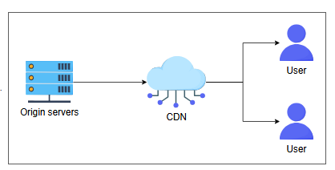

**1. Какими двумя требованиями нельзя пренебрегать при проектировании Netflix?**

-   <input type="radio" > **A. Низкая задержка и высокая доступность**

-   <input type="radio"> **B. Низкая задержка и HD-видео**

-   <input type="radio"> **C. Высокая доступность и HD-видео**

-   <input type="radio"> **D. Стабильность и HD-видео**

> 

>  
<b>Показать</b>

>   A:    Стриминговые сервисы в значительной степени зависят от этих двух целей проектирования, чтобы обеспечить конечному пользователю хорошее качество восприятия (QoE).
> 

Конечно, вот перевод второго вопроса викторины в формате Markdown:

**2. Рассмотрите следующую архитектуру для загрузки контента в сервис Netflix:**

**Обратите внимание, что есть два компонента без названий. Выберите правильный вариант, чтобы завершить схему.**

-   <input type="radio"> **A.**
  
-   <input type="radio"> **B.**

-   <input type="radio"> **C.**

-   <input type="radio"> **D.**

> 

>  
<b>Показать</b>

>   C:   Запросы пользователей распределяются между серверами загрузки с помощью балансировщиков нагрузки. Кроме того, мы можем использовать хранилище данных для сохранения (мета)данных с серверов загрузки и MapReduce.
> 

**3. Какой метод кодирования наиболее эффективен для потоковой передачи конечным пользователям?**

-   <input type="radio"> **A.** Использовать единый метод кодирования для всех типов контента для достижения простоты в проектировании.

-   <input type="radio"> **B.** Кодировать всё видео целиком в зависимости от его содержимого — например, кодировать боевик с динамичными цветами иначе, чем 2D-мультфильм.

-   <input type="radio" > **C.** Использовать разные методы кодирования для разных сцен или сегментов внутри одного видео. Например, высокодинамичные сцены следует кодировать иначе, чем менее динамичные сцены в одном и том же видео.

-   <input type="radio"> **D.** Кодирование вообще не имеет значения.

Конечно, вот перевод четвертого вопроса викторины в формате Markdown:

**4. Потоковая передача с адаптивным битрейтом** — это распространенный метод, используемый для обеспечения хорошего качества стриминга для пользователя. Он работает путем определения пропускной способности сети и вычислительной мощности процессора устройства пользователя в реальном времени и соответствующей корректировки качества медиапотока.

**Учитывая вышеприведенное объяснение, какая диаграмма лучше всего объясняет адаптивный битрейт?**

-   <input type="radio"> **A.**

-   <input type="radio"> **B.**

-   <input type="radio"> **C.**

-   <input type="radio"> **D.**

> 

>  
<b>Показать</b>

>   D      Кодировщик преобразует видео в несколько форматов, а сервер потоковой передачи отправляет их клиенту.
> 

**5. Какова наиболее подходящая последовательность действий для потоковой передачи контента от разработки до доставки конечному пользователю?**

-   <input type="radio" > **A.** Кодирование, преобразование битрейта, добавление субтитров и развертывание.
    
-   <input type="radio"> **B.** Развертывание, преобразование битрейта, субтитры и кодирование.

-   <input type="radio"> **C.** Кодирование, преобразование битрейта, загрузка в CDN и развертывание.

-   <input type="radio"> **D.** Загрузка в CDN, кодирование и преобразование битрейта.

> 

>  
<b>Показать</b>

>   A
> 

**6. Предположим, что 100 000 пользователей пытаются смотреть прямую трансляцию футбольного матча в разрешении 1080p в густонаселенном городе. Если точка присутствия CDN (PoP) в этом районе может обеспечить пропускную способность в 300 Гбит/с для конечных пользователей, какая архитектура лучше всего обслужит клиентов без проблем с буферизацией?**

-   <input type="radio"> **A.**

-   <input type="radio"> **B.**

-   <input type="radio" > **C.**

  
-   <input type="radio"> **D.**

> 

>  
<b>Показать</b>

>   C   Кэш-серверы, поддерживаемые интернет-провайдером, обеспечат покрытие для всех пользователей, снижая требования к пропускной способности как для CDN, так и для исходных серверов.
> 
