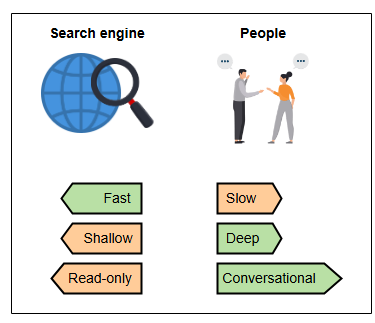
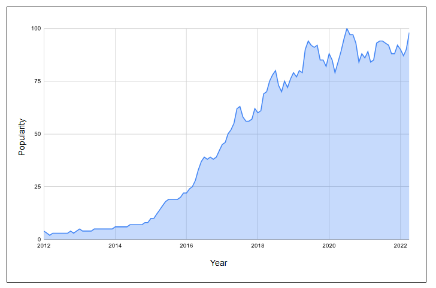

# Проектирование системы: Quora

Узнайте об основах проектирования Quora.

## Введение

При таком объеме информации в интернете поиск ответов на вопросы может быть сложной задачей. Именно поэтому обмен информацией в сети стал
таким распространенным. Поисковые системы помогают нам находить информацию по всему вебу. Например, поисковая система Google достаточно
умна, чтобы отвечать на вопросы, извлекая информацию с веб-страниц. Хотя у поисковых систем есть свои преимущества, иногда найти нужную
информацию — не такой уж и простой процесс. Давайте рассмотрим иллюстрацию ниже, чтобы понять, чем поиск информации через поисковые системы
отличается от поиска через людей.

*
Сравнение поиска информации через поисковые системы и через людей
*

Иллюстрация выше показывает, что поиск информации через других людей может быть более поучительным, даже если это требует дополнительного
времени. Поиск информации через поисковые системы может завести в тупик из-за отсутствия контента по теме. Вместо этого мы можем задавать
вопросы другим.

## Что такое Quora?

**Quora** — это социальный сервис вопросов и ответов, который позволяет пользователям задавать вопросы другим пользователям. Quora была
создана из-за проблемы, что вопросы к поисковым системам дают быстрые ответы, но поверхностную информацию. Вместо этого мы можем спросить у
широкой публики, что ощущается более как разговор и может привести к более глубокому пониманию, даже если это медленнее. Quora позволяет
любому задавать вопросы, и любой может на них ответить. Кроме того, существуют эксперты в определенных областях, которые обладают глубокими
знаниями по конкретной теме и время от времени делятся своим опытом, отвечая на вопросы.

Следующий график показывает глобальные тенденции поиска по запросу «Quora» с использованием Google:

*
Популярность Quora по годам согласно Google
*

Более 300 миллионов активных пользователей в месяц ежедневно публикуют тысячи вопросов по более чем 400 000 тем на Quora.

В этой главе мы спроектируем Quora и оценим, как она соответствует функциональным и нефункциональным требованиям.

## Как мы будем проектировать Quora?

Мы спроектируем Quora, разделив задачу на следующие четыре урока.

1. **Требования**: Этот урок будет
   посвящен функциональным и нефункциональным требованиям к проектированию Quora. Мы также оценим ресурсы, необходимые для проектирования
   системы.

2. **Начальный дизайн**: В этом уроке мы
   создадим начальный дизайн, который будет соответствовать всем функциональным требованиям Quora, а также сформулируем дизайн API. В
   основном мы обсудим строительные блоки системы, другие компоненты, участвующие в завершении дизайна, их интеграцию и рабочий процесс.

3. **Финальный дизайн**: В этом уроке мы
   начнем с выявления ограничений начального дизайна. Затем мы обновим наш финальный дизайн, чтобы он соответствовал всем функциональным и
   нефункциональным требованиям, устраняя эти ограничения. Мы также сосредоточимся на некоторых интересных аспектах нашего дизайна, таких
   как вертикальное шардирование базы данных.

4. **Оценка**: Мы оценим наш дизайн с
   точки зрения нефункциональных требований и обсудим некоторые компромиссы. В этом уроке мы также обсудим некоторые идеи о том, как мы
   можем улучшить доступность нашего дизайна.