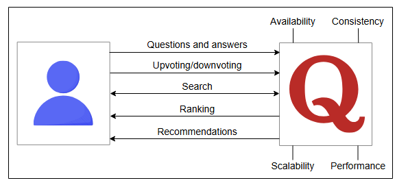
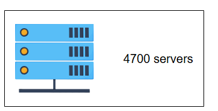
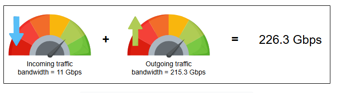
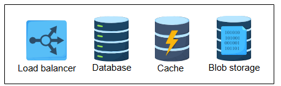

# Требования к дизайну Quora

Узнайте о требованиях к проектированию Quora.

## Требования

Давайте разберемся с функциональными и нефункциональными требованиями ниже:

### Функциональные требования

Пользователь должен иметь возможность выполнять следующие функции:

* **Вопросы и ответы**: Пользователи могут задавать вопросы и давать ответы. Вопросы и ответы могут содержать изображения и видео.
* **Голосование "за"/"против" и комментарии**: Пользователи могут голосовать "за" или "против" ответов, а также комментировать их.
* **Поиск**: Пользователям должна быть доступна функция поиска для нахождения вопросов, уже заданных на платформе другими пользователями.
* **Система рекомендаций**: Пользователь может просматривать свою ленту, которая включает интересующие его темы. Лента также может содержать
  вопросы, требующие ответов, или ответы, которые могут быть интересны читателю. Система должна способствовать обнаружению контента с
  помощью рекомендательной системы.
* **Ранжирование ответов**: Мы улучшаем пользовательский опыт, ранжируя ответы в соответствии с их полезностью. Самый полезный ответ будет
  иметь самый высокий ранг и отображаться вверху списка.

### Нефункциональные требования

* **Масштабируемость (Scalability)**: Система должна хорошо масштабироваться по мере роста числа функций и пользователей. Это означает, что
  производительность и удобство использования не должны страдать от увеличения числа пользователей.
* **Согласованность (Consistency)**: Дизайн должен обеспечивать согласованность отображения одного и того же контента для разных
  пользователей. В частности, критически важный контент, такой как вопросы и ответы, должен быть одинаковым для любой группы зрителей.
  Однако не обязательно, чтобы все пользователи Quora видели новый вопрос, ответ или комментарий сразу после публикации.
* **Доступность (Availability)**: Система должна обладать высокой доступностью. Это относится к случаям, когда серверы получают большое
  количество одновременных запросов.
* **Производительность (Performance)**: Система должна обеспечивать плавный пользовательский опыт без заметных задержек.

## Оценка ресурсов

В этом разделе мы сделаем оценку требований к ресурсам для сервиса Quora. Мы сделаем допущения, чтобы получить практичную и выполнимую
оценку. Мы оценим количество серверов, объем хранилища и пропускную способность, необходимые для обслуживания большого числа пользователей.

**Допущения**: Важно основывать нашу оценку на некоторых предположениях. Поэтому мы предполагаем следующее:

* Общее количество пользователей — 1 миллиард, из которых 300 миллионов — ежедневно активные пользователи.
* Предположим, что 15% вопросов содержат изображение, а 5% — встроенное видео. Вопрос не может содержать и то, и другое одновременно.
* Мы будем считать, что размер изображения составляет 250 КБ, а видео — 5 МБ.

### Оценка количества серверов

Поскольку у Quora 300 миллионов ежедневно активных пользователей. Учитывая наше предположение об использовании ежедневно активных
пользователей как прокси для количества запросов в секунду, чтобы найти количество серверов для пиковых нагрузок, мы получаем 300 миллионов
запросов в секунду. Затем мы используем следующую формулу для расчета количества серверов:

Необходимое количество серверов при пиковой нагрузк = Количество запросов в секунду / RPS сервера

Используя 64 000 как примерное количество RPS, которое может обработать сервер, необходимое количество серверов оценивается следующим
образом:

Необходимое количество серверов при пиковой нагрузке} = 300миллионов / 64,000 = 4687.5 = 4.7 K серверов

### Оценка хранилища

Давайте помнить наше предположение о том, что 15% вопросов содержат изображения, а 5% — видео. Итак, мы сделаем следующие допущения для
оценки требований к хранилищу для нашего дизайна:

* Каждый из 300 миллионов активных пользователей публикует 1 вопрос в день, и на каждый вопрос в среднем приходится 2 ответа, 10 голосов "
  за" и 5 комментариев.
* Общий объем хранилища, необходимый для текстового контента одного вопроса (включая текст вопроса, ответов и комментариев), равен 100 КБ.

#### Калькулятор оценки требований к хранилищу

| Параметр                              | Значение  | Единица   |
|:--------------------------------------|:----------|:----------|
| Вопросов на пользователя              | 1         | в день    |
| Всего вопросов в день                 | 300       | миллионов |
| Размер текстового контента на вопрос  | 100       | КБ        |
| Размер изображения                    | 250       | КБ        |
| Размер видео                          | 5         | МБ        |
| Вопросы с изображениями               | 15        | процентов |
| Вопросы с видео                       | 5         | процентов |
| **Хранилище для текстового контента** | **30**    | **ТБ**    |
| **Хранилище для изображений**         | **11.25** | **ТБ**    |
| **Хранилище для видеоконтента**       | **75**    | **ТБ**    |

> 💡 **Подсказка: Стандартные расчеты**
>
> Ниже приведены стандартные расчеты:
>
> * **Общее количество вопросов:** 300 млн \ 1 = 300 * 10^6 вопросов в день.
> * **Хранилище для текстового контента** всех вопросов за один день: 300 * 10^6 * 1 * 100 * 10^3 Б = 30 ТБ
> * **Хранилище для изображений** за один день: (300 * 10^6 * 15)/100 * 250 * 10^3 Б = 11.25 ТБ
> * **Хранилище для видеоконтента** за один день: (300 * 10^6 * 5)/ 100 * 5 * 10^6 Б = 75 ТБ
> *

> Общий объем хранилища, необходимый за один день 116.25 ТБ в день

Ежедневные требования к хранилищу Quora кажутся очень высокими. Но для сервиса с 300 миллионами DAU годовое требование в 116.25 ТБ * 365 = 42.43 ПБ является выполнимым. Практические требования будут значительно выше, потому что мы не учли хранилище для ряда
вещей. Например, данные неактивных пользователей (из 1 миллиарда) также потребуют места для хранения.

### Оценка пропускной способности

Оценка пропускной способности требует расчета входящих и исходящих данных через сеть.

* **Входящий трафик**: Требуемая пропускная способность для входящего трафика в день будет равна (116.25 ТБ / 86400) * 8 =
  10.9  Гбит/с или 11  Гбит/с
* **Исходящий трафик**: Мы предположили, что 300 миллионов активных пользователей просматривают 20 вопросов в день, поэтому общие требования
  к пропускной способности можно найти в калькуляторе ниже:

#### Калькулятор оценки требований к пропускной способности

| Параметр                                        | Значение  | Единица    |
|:------------------------------------------------|:----------|:-----------|
| Общее требуемое хранилище в день                | 116.25    | ТБ         |
| **Пропускная способность входящего трафика**    | **11**    | **Гбит/с** |
| Просмотрено вопросов на пользователя            | 20        | в день     |
| Всего просмотрено вопросов                      | 69444     | в секунду  |
| Пропускная способность для текста всех вопросов | 55.56     | Гбит/с     |
| Пропускная способность для 15% изображений      | 20.83     | Гбит/с     |
| Пропускная способность для 5% видеоконтента     | 138.89    | Гбит/с     |
| **Пропускная способность исходящего трафика**   | **215.3** | **Гбит/с** |

> ** Детальные расчеты**
>
> *   $300 млн * 20  вопросов = 6$ миллиардов вопросов просматривается в день.
> *   Количество просмотренных вопросов в секунду: (6 * 10^9) / 86400 =  69.4 * 10^3 вопросов просматривается в секунду.
> *   Пропускная способность для текстового контента всех вопросов и их ответов: 69.4 * 10^3 * 100 * 10^3 * 8 бит = 55.56 Гбит/с
> *   Пропускная способность для 15% контента с изображениями в секунду: 69.4 * 10^3 * 15/100 * 250 * 10^3 * 8 бит = 20.83 Гбит/с
> *   Пропускная способность для 5% контента с видео в секунду: 69.4 * 10^3 * 5/100 * 5 * 10^6 * 8 бит = 138.9 Гбит/с
> *   Общая пропускная способность исходящего трафика: 55.56 Гбит/с + 20.82 Гбит/с + 138.9 Гбит/с = 215.3 Гбит/с
>
> Мы используем округление на каждом шаге этого объяснения. Ответы в калькуляторе выше немного отличаются из-за округления.

Общее требование к пропускной способности Quora равно:

> Пропускная способность входящего + исходящего трафика = $11  Гбит/с + 215.3  Гбит/с = 226.3  Гбит/с}$

## Строительные блоки, которые мы будем использовать

Мы будем использовать следующие строительные блоки для начального дизайна Quora:

*Строительные блоки, необходимые для нашего дизайна*

* **Балансировщики нагрузки** будут
  использоваться для распределения нагрузки между хостами сервиса.
* **Базы данных** необходимы для хранения
  всех видов данных, таких как вопросы и ответы пользователей, комментарии, лайки и дизлайки. Также в базах данных будут храниться данные
  пользователей. Мы можем использовать разные типы баз данных для хранения разных данных.
* **Распределенная система кэширования** будет использоваться для
  хранения часто запрашиваемых данных. Мы также можем использовать кэширование для хранения счетчиков просмотров для разных вопросов.
* **Хранилище BLOB-объектов (Blob store)** будет хранить файлы изображений и
  видео.
