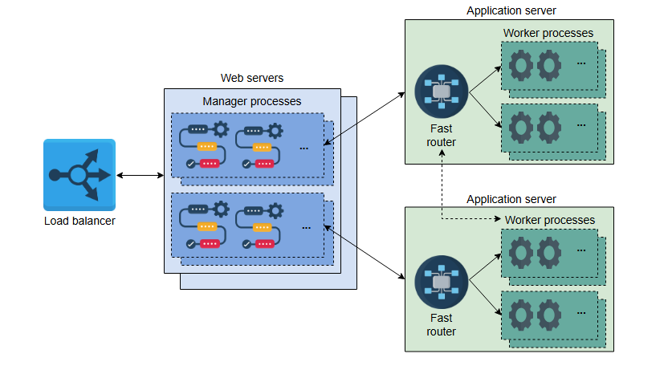
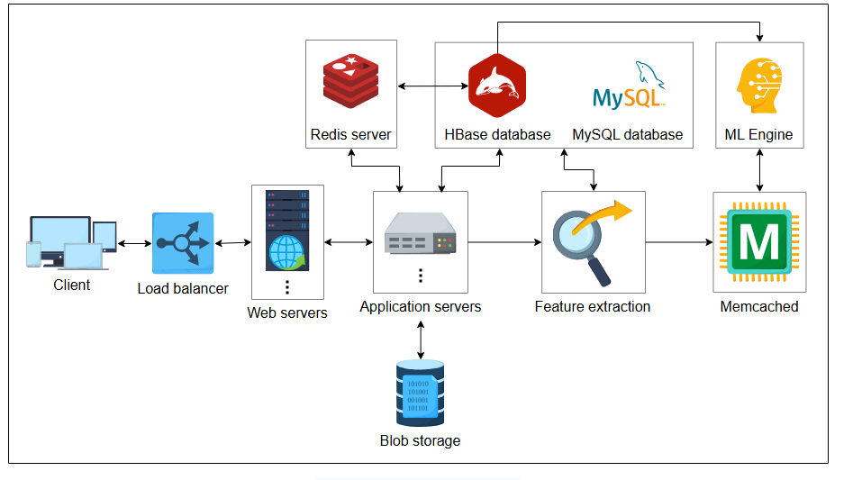

# Начальный дизайн Quora

Преобразуйте требования Quora в высокоуровневый дизайн.

## Начальный дизайн

Начальный дизайн Quora будет состоять из следующих строительных блоков и компонентов:

* **Веб-серверы и серверы приложений**: Типичная страница Quora генерируется различными сервисами. Веб-серверы и серверы приложений
  поддерживают различные процессы для генерации веб-страницы. На веб-серверах есть процессы-менеджеры, а на серверах приложений — рабочие
  процессы для обработки различных запросов. Процессы-менеджеры распределяют работу между рабочими процессами с помощью библиотеки
  маршрутизации. Задачи помещаются в очередь библиотеки маршрутизации процессами-менеджерами и извлекаются из нее рабочими процессами.
  Каждый сервер приложений поддерживает несколько очередей в памяти для обработки различных запросов пользователей. Следующая иллюстрация
  представляет абстрактное представление веб-серверов и серверов приложений:

  


* **Хранилища данных**: Разные типы данных требуют хранения в разных хранилищах. Мы можем использовать критически важные данные, такие как
  вопросы, ответы, комментарии и голоса "за"/"против", в реляционной базе данных, такой как MySQL, поскольку она обеспечивает более высокую
  степень согласованности. Базы данных NoSQL, такие как HBase, можно использовать для хранения количества просмотров страницы, оценок для
  ранжирования ответов и извлеченных из данных признаков для последующего использования в рекомендациях. Поскольку пересчет признаков — это
  дорогостоящая операция, HBase может быть хорошим вариантом для хранения и извлечения данных с высокой пропускной способностью. Нам
  требуется высокая пропускная способность чтения/записи, поскольку системы обработки больших данных используют высокий параллелизм для
  эффективного получения необходимой статистики. Также для хранения видео и изображений, размещенных в вопросах и ответах, требуется
  хранилище BLOB-объектов.

> Quora была основана в 2009 году, в то время как HBase был разработан в 2008 году Apache. Поскольку он имеет открытый исходный код и создан
> по образцу Google BigTable, он подходит для хранения большого количества данных небольшого размера. Кроме того, он обладает высокой
> пропускной способностью для чтения/записи. Поэтому при создании Quora его использование было естественным выбором.

* **Распределенный кэш**: Для повышения производительности используются две системы распределенного кэширования: Memcached и Redis.
  Memcached в основном используется для хранения часто запрашиваемых критически важных данных, которые в противном случае хранятся в MySQL.
  С другой стороны, Redis в основном используется для хранения онлайн-счетчика просмотров ответов, поскольку он позволяет выполнять
  инкременты в хранилище. Таким образом, используются две системы кэширования в соответствии с их назначением. Помимо этих двух, CDN
  обслуживают часто запрашиваемые видео и изображения.

* **Вычислительные серверы**: Набор вычислительных серверов необходим для обеспечения таких функций, как рекомендации и ранжирование на
  основе набора атрибутов. Эти функции могут вычисляться в **онлайн** или **офлайн** режиме. Вычислительные серверы используют технологию
  машинного обучения (ML) для предоставления эффективных рекомендаций. Естественно, эти вычислительные серверы имеют значительно больший
  объем оперативной памяти и вычислительной мощности.

Конечно, другие базовые строительные блоки, такие как балансировщики нагрузки, службы мониторинга и ограничители скорости, также будут
частью дизайна. Высокоуровневый дизайн представлен ниже:




> **Интерактивный виджет:**
>
> **Вопрос:** Почему Quora использует в своей архитектуре и Memcached, и Redis? Каковы сильные стороны каждой из систем? Можете ли вы
> объяснить конкретные преимущества использования обеих систем?
>
> <details>
>  <summary><b>Показать</b></summary>
>  Quora использует как Memcached, так и Redis, чтобы максимально использовать их уникальные преимущества. Memcached отлично подходит для простого и высокоскоростного кэширования статических данных, таких как вопросы и ответы, обеспечивая быстрый поиск и простоту использования. Redis предлагает расширенные возможности, такие как атомарные операции и структуры данных, которые полезны для функций реального времени, таких как счетчики просмотров. Использование обеих систем позволяет Quora оптимизировать производительность и функциональность без ущерба для возможностей, необходимых для различных типов данных.
>  </details>

## Рабочий процесс

Дизайн Quora сложен, поскольку у нас есть большое количество функциональных и нефункциональных требований. Поэтому мы объясним рабочий
процесс на основе каждой функции:

* **Публикация вопросов, ответов, комментариев**: Веб-серверы получают запросы пользователей через балансировщик нагрузки и направляют их на
  серверы приложений. Тем временем веб-серверы генерируют часть веб-страницы, а рабочие процессы на серверах приложений занимаются
  генерацией остальной части страницы. Данные вопросов и ответов хранятся в базе данных MySQL, в то время как любые видео и изображения
  хранятся в хранилище BLOB-объектов. Аналогичный подход используется для публикации комментариев и голосования за/против ответов.
  Приоритезация задач выполняется с помощью различных очередей для разных задач. Мы выполняем приоритезацию, потому что некоторые задачи
  требуют немедленного внимания — например, извлечение данных из базы данных по запросу пользователя, — в то время как другие не так
  срочны — например, отправка еженедельного дайджеста по электронной почте. Рабочие процессы будут выполнять задачи, извлекая их из этих
  очередей.

> **Вопросы для размышления**
>
>1. Когда сервису типа Quora может понадобиться функция уведомлений?
>
> <details>
>  <summary><b>Показать</b></summary>
>
> Quora потребуется служба уведомлений в следующих случаях:
>
>  *   Пользователь публикует вопрос по теме, на которую подписан потенциальный респондент.
> *   Пользователь публикует ответ на вопрос, заданный другим пользователем.
> *   Публикация, которая интересует пользователя или которую он написал, получила новые комментарии или голоса "за"/"против" и так далее.
>
>  </details>

* **Система ранжирования ответов**: Ответы на вопросы можно сортировать по дате. Хотя удобно разрабатывать систему ранжирования на основе
  даты (используя временные метки), пользователи предпочитают видеть самый подходящий ответ вверху. Поэтому Quora использует ML для
  ранжирования ответов. Со временем извлекаются различные признаки и сохраняются в HBase для каждого типа вопроса. Эти признаки передаются в
  ML-движок для ранжирования самого полезного ответа наверх. Мы не можем использовать количество голосов "за" как единственный показатель
  для ранжирования ответов, потому что большое количество ответов может быть шутками — и такие ответы также получают много голосов "за".
  Хорошо реализовывать систему ранжирования в офлайн-режиме, потому что хорошие ответы со временем получают голоса "за" и просмотры. Кроме
  того, офлайн-режим создает меньшую нагрузку на инфраструктуру. Реализация системы ранжирования в офлайн-режиме и потребность в специальном
  оборудовании для ML делают целесообразным использование некоторых эластичных облачных сервисов.

* **Система рекомендаций**: Система рекомендаций отвечает за несколько функций. Например, нам может потребоваться разработать ленту
  пользователя, находить связанные вопросы и рекламу, рекомендовать вопросы потенциальным респондентам и даже выделять дублирующийся контент
  и контент, нарушающий условия использования сервиса. В отличие от системы ранжирования ответов, система рекомендаций должна предоставлять
  как **онлайн**, так и **офлайн**-сервисы. Эта система получает запросы от сервера приложений и передает выбранные признаки в ML-движок.

* **Функция поиска**: Со временем, по мере поступления вопросов и ответов в систему Quora, можно создать индекс в HBase. Поисковые запросы
  пользователей сопоставляются с индексом, и пользователю предлагается связанный контент. Часто используемые индексы могут обслуживаться из
  кэша для низкой задержки. Индекс может быть построен из вопросов, ответов, меток тем и имен пользователей. Токенизация поискового индекса
  также возвращает те же результаты для слов с измененным порядком (см. раздел 'Масштабирование поиска и индексации' в главе 'Распределенный
  поиск' для более подробной информации).

> **Вопрос:** Как Quora использует и индексацию HBase, и кэширование для оптимизации своей поисковой функциональности? Какие конкретные
роли играет каждая из систем в балансировке точности и производительности поиска?
>
> <details>
>  <summary><b>Показать</b></summary>
> Quora использует как индексацию, так и кэширование HBase для оптимизации функций поиска. Индексация HBase предполагает создание индексов для маркированного контента из вопросов, ответов, тем и имен пользователей, что позволяет получать быстрые и полные результаты поиска. В кэшировании хранятся результаты частых запросов, что значительно сокращает задержку и нагрузку на систему. Индексация обеспечивает точность и полноту поиска, а кэширование повышает производительность, обеспечивая быстрый доступ к популярным данным. Такое сочетание эффективно уравновешивает точность и скорость поиска, обеспечивая удобство работы пользователя. Вы также можете получить ответ, нажав на кнопку "Показать решение"
>  </details>


## Дизайн API

В этом разделе мы спроектируем вызовы API для Quora. Мы определим API только для следующих функций:

* Опубликовать вопрос
* Опубликовать ответ
* Проголосовать за/против вопроса или ответа
* Прокомментировать ответ
* Поиск

> **Примечание:** Мы не рассматриваем API для системы рекомендаций или ранжирования, поскольку они не являются явным запросом от
> пользователя. Вместо этого веб-сервер координирует работу с другими компонентами для обеспечения сервиса.

### Опубликовать вопрос

Метод POST протокола HTTP используется для вызова API `/postQuestion`:

```
postQuestion(user_id, question, description, topic_label, video, image)
```

Давайте разберемся с каждым параметром вызова API:

| Параметр      | Описание                                                             |
|:--------------|:---------------------------------------------------------------------|
| `user_id`     | Это уникальный идентификатор пользователя, который публикует вопрос. |
| `question`    | Это текст вопроса, заданного пользователем.                          |
| `description` | Это описание вопроса. Это необязательное поле.                       |
| `topic_label` | Это список областей, к которым относится вопрос пользователя.        |
| `video`       | Это видеофайл, встроенный в вопрос пользователя.                     |
| `image`       | Это изображение, являющееся частью вопроса пользователя.             |

Параметры `video` и `image` могут быть `NULL`, если в вопросе нет встроенного изображения или видео. В противном случае они загружаются как
часть вопроса.

### Опубликовать ответ

Для публикации ответа метод POST является подходящим выбором для API `/postAnswer`:

```
postAnswer(user_id, question_id, answer_text, video, image)
```

| Параметр      | Описание                                          |
|:--------------|:--------------------------------------------------|
| `question_id` | Это относится к вопросу, на который дается ответ. |
| `answer_text` | Это текстовый ответ, опубликованный респондентом. |

Остальные параметры понятны из контекста.

### Проголосовать за ответ

API `/upvote` выглядит следующим образом:

```
upvote(user_id, question_id, answer_id)
```

| Параметр    | Описание                                                                                                    |
|:------------|:------------------------------------------------------------------------------------------------------------|
| `user_id`   | Это пользователь, голосующий за ответ.                                                                      |
| `answer_id` | Это идентификатор ответа, за который голосуют, для конкретного вопроса, идентифицируемого по `question_id`. |

> **Примечание:** API для голосования "против" такой же, как и для голосования "за", поскольку это схожие функции.

### Прокомментировать ответ

API `/comment` имеет следующую структуру:

```
comment(user_id, answer_id, comment_text)
```

| Параметр       | Описание                                                                                |
|:---------------|:----------------------------------------------------------------------------------------|
| `user_id`      | Это пользователь, комментирующий ответ.                                                 |
| `comment_text` | Это текст, который пользователь публикует к ответу, идентифицированному по `answer_id`. |

### Поиск

API `/search` имеет следующие детали:

```
search(user_id, search_text)
```

| Параметр      | Описание                                                                                                                                                            |
|:--------------|:--------------------------------------------------------------------------------------------------------------------------------------------------------------------|
| `user_id`     | Это `user_id` пользователя, выполняющего поисковый запрос. В данном случае это необязательно, так как незарегистрированный пользователь также может искать вопросы. |
| `search_text` | Это поисковый запрос, введенный пользователем.                                                                                                                      |

> Мы используем секвенсор для генерации
> различных ID, упомянутых в вызовах API.

> **Вопрос для размышления**
>
> 1. Почему между веб-серверами и серверами приложений используется пользовательский уровень маршрутизации, а не уровень балансировки
     нагрузки?
>
> <details>
>  <summary><b>Показать</b></summary>
>  Основная причина — производительность. Обычный уровень балансировки нагрузки будет иметь слабое понимание логики приложения и более высокую задержку.
>
>  Как было сказано, процессы-менеджеры генерируют «скелет» веб-страницы и оставляют большую часть работы рабочим процессам. Таким образом, один процесс-менеджер может создавать множество задач для рабочих процессов. Специализированная **библиотека маршрутизации** представляет собой очередь между менеджером и рабочим процессом, откуда любой рабочий процесс может забрать задачу, созданную процессом-менеджером.
>
>  Такой дизайн улучшает общую производительность и поддерживает масштабируемость.
> </details>