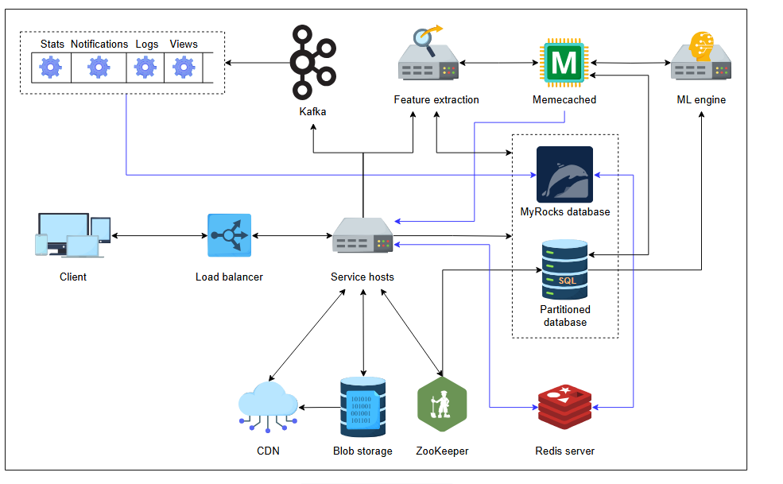
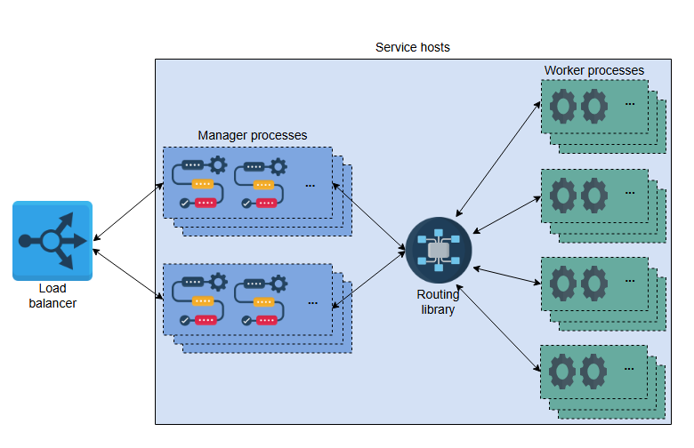
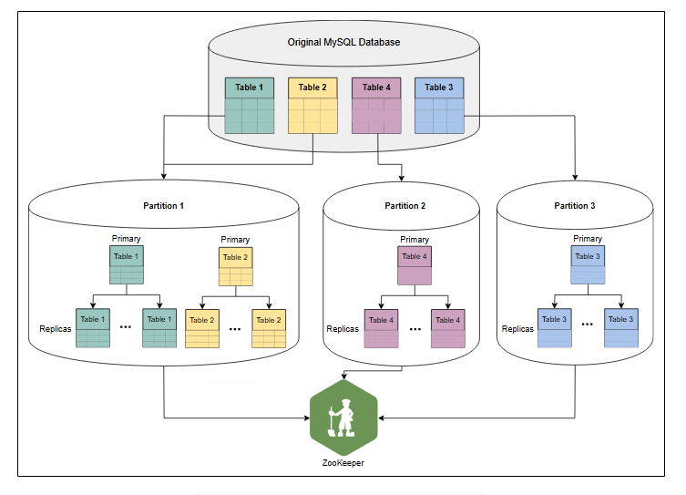
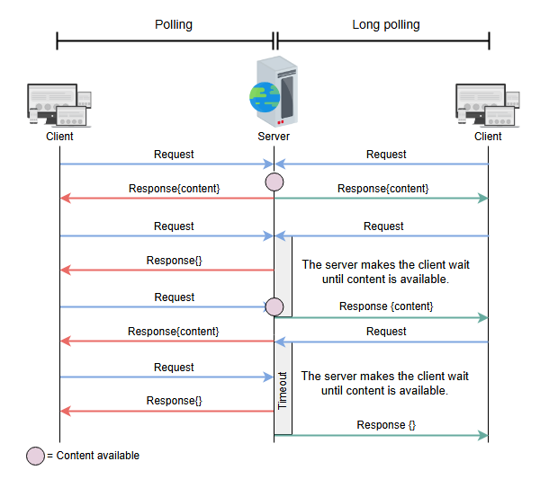

# Финальный дизайн Quora

Узнайте об ограничениях дизайна Quora и улучшите его.

## Ограничения предложенного дизайна

Предложенный дизайн удовлетворяет всем функциональным требованиям. Однако у него есть ряд серьезных недостатков, которые проявляются по мере
масштабирования. Это означает, что мы не можем выполнить нефункциональные требования. Давайте рассмотрим основные недостатки ниже:

* **Ограничения веб-серверов и серверов приложений**: Для обработки запросов пользователя полезные данные передаются между веб-серверами и
  серверами приложений, что увеличивает задержку из-за сетевого ввода-вывода между этими двумя типами серверов. Даже если мы достигаем
  параллельных вычислений, разделяя веб-серверы и серверы приложений (то есть процессы менеджера и рабочие процессы), добавленная задержка
  из-за дополнительного сетевого соединения ухудшает пользовательский опыт. Помимо передачи данных, управляющая связь между библиотекой
  маршрутизации, менеджером и рабочими процессами также накладывает дополнительные штрафы на производительность.

* **Сбой очередей в памяти**: Внутренняя архитектура серверов приложений регистрирует задачи и передает их в очереди в памяти, которые
  обслуживают их для рабочих процессов. Эти очереди в памяти с разными приоритетами могут быть подвержены сбоям. Например, если очередь
  теряется, все задачи в этой очереди также теряются, и для восстановления этих задач требуется ручное вмешательство инженеров. Это
  значительно снижает производительность системы. С другой стороны, репликация этих очередей требует увеличения объема оперативной памяти.
  Кроме того, с учетом количества функций (функциональных требований), которые предлагает наша система, может накапливаться много задач, что
  приводит к нехватке памяти. В то же время нежелательно перегружать серверы приложений не очень срочными задачами. Например, серверы
  приложений не должны быть обременены такими задачами, как хранение счетчиков просмотров ответов, добавление статистики в базу данных для
  последующего анализа и так далее.

* **Увеличение QPS (запросов в секунду) на MySQL**: Поскольку наша система предлагает большое количество функций, некоторые таблицы MySQL
  получают много запросов от пользователей. Это приводит к увеличению QPS на определенных серверах MySQL, что может привести к увеличению
  задержки. Кроме того, в нашем дизайне не определена схема управления аварийным восстановлением.

* **Задержка HBase**: Хотя HBase обеспечивает высокую пропускную способность в реальном времени, его задержка **P99** не является одной из
  лучших. Ряд функций Quora требуют использования ML-движка, который имеет свою собственную задержку. Из-за добавления более высокой
  задержки HBase общая производительность системы со временем снижается.

Выделенные выше проблемы требуют изменений в ранее предложенном дизайне. Поэтому мы внесем следующие корректировки и обновим наш дизайн:

## Детальный дизайн Quora

Давайте разберемся с улучшениями в нашем дизайне:

### Хосты сервисов

Мы объединяем веб-серверы и серверы приложений в одну мощную машину, которая может обрабатывать все процессы одновременно. Этот метод
устраняет сетевой ввод-вывод и задержку, возникающую из-за сетевых переходов, необходимых между процессами менеджера, рабочего процесса и
библиотеки маршрутизации. Иллюстрация ниже представляет абстрактное представление обновленной архитектуры веб-сервера:

### Вертикальное шардирование MySQL

Таблицы на сервере MySQL преобразуются в отдельные шарды, которые мы называем **партициями**. Партиция имеет один главный сервер (primary) и
несколько серверов-реплик.

Цель состоит в том, чтобы улучшить производительность и уменьшить нагрузку из-за растущего числа запросов к одной таблице базы данных. Для
этого мы выполняем вертикальное шардирование двумя способами:

1. Мы разделяем таблицы одной базы данных на несколько партиций. Эта концепция изображена в Партициях 2 и 3, которые содержат Таблицы 4 и 3
   соответственно.
2. Мы объединяем несколько таблиц в одну партицию, где ожидаются операции `join`. Эта концепция изображена в Партиции 1, которая содержит
   Таблицы 1 и 2.

Таким образом, мы можем размещать связанные данные вместе и уменьшать трафик на "горячие" данные. Иллюстрация ниже изображает вертикальное
шардирование в Quora.

После завершения партиционирования нам требуются два типа сопоставлений или метаданных для завершения процесса масштабирования:

1. Какие партиции содержат какие таблицы и столбцы?
2. Какие хосты являются главными и репликами для конкретной партиции?

Оба этих сопоставления поддерживаются сервисом, таким как ZooKeeper.

Вышеупомянутый шардированный дизайн обеспечивает масштабируемость, поскольку мы можем размещать связанные данные в одной партиции, и,
следовательно, это устраняет необходимость запрашивать данные из нескольких шардов. Также количество реплик для чтения может быть увеличено
для "горячих" шардов, или может быть выполнено дальнейшее шардирование. В крайних случаях, когда может понадобиться объединение (`join`), мы
можем выполнить его на уровне приложения.

> **Примечание:** Вертикальное шардирование представляет особый интерес в дизайне Quora, поскольку горизонтальное шардирование более
> распространено в сообществе баз данных. Основная идея вертикального шардирования — достичь масштабируемости путем тщательного разделения или
> перемещения таблиц и устранения операций объединения между различными шардами. Тем не менее, вертикально шардированная партиция или таблица
> может расти горизонтально до такой степени, что для сохранения приемлемой производительности потребуется горизонтальное шардирование.

### MyRocks

Новый дизайн использует MyRocks в качестве хранилища ключ-значение вместо HBase. Мы используем версию MyRocks от RocksDB по двум основным
причинам:

1. MyRocks имеет более низкую задержку P99 по сравнению с HBase. Quora утверждает, что снизила задержку P99 с 80 мс до 4 мс с помощью
   MyRocks.
2. Существуют операционные инструменты, которые могут передавать данные между MyRocks и MySQL.

> **Примечание:** Quora обслуживает ML-движок, извлекая признаки из вопросов и ответов, хранящихся в MySQL. В этом случае операционные
> инструменты оказываются полезными для передачи данных между MyRocks и MySQL.

### Kafka

Наш обновленный дизайн снижает нагрузку на хосты сервисов, отделяя не очень срочные задачи от обычных вызовов API. Для этой цели мы
используем Kafka, которая может распределять задания между различными очередями для таких задач, как счетчик просмотров (
см. Шардированные счетчики),
система уведомлений, аналитика и выделение тем для пользователя. Каждое из этих заданий выполняется через **cron jobs**.

### Использование технологий

Сервисы, которые быстро масштабируются, имеют мало времени на разработку новых функций и обработку растущего числа запросов от
пользователей. Такие сервисы используют облачную инфраструктуру для обработки всплесков трафика. Также важен выбор языка программирования.
Подобно тому, как мы упоминали, что YouTube выбрал Python для более быстрой разработки, мы можем применить ту же логику к Quora. Фактически,
Quora использует веб-фреймворк Python Paste.

Желательно использовать более быстрый язык программирования, такой как C++, для разработки **сервиса извлечения признаков**. Для
онлайн-сервисов рекомендаций через ML-движок сервис извлечения признаков должен быть быстрым, чтобы ML-движок мог делать точные
рекомендации. Кроме того, уменьшение нагрузки на ML-движок по задержкам позволяет ему предоставлять более широкий набор услуг. Мы можем
использовать сервис Thrift для поддержки взаимодействия между языками программирования в разных компонентах.

Такие функции, как комментарии, голоса "за" и "против", требуют частых обновлений страницы со стороны клиента. **Polling** (опрос) — это
техника, при которой клиент (браузер) часто запрашивает у сервера новые обновления. У сервера могут быть или не быть обновления, но он все
равно отвечает клиенту. Таким образом, сервер может быть бесполезно перегружен. Чтобы решить эту проблему, Quora использует технику под
названием **long polling** (длинный опрос), при которой, если клиент запрашивает обновление, сервер может не отвечать до 60 секунд, если
обновлений нет. Однако, если есть обновление, сервер ответит немедленно и позволит клиенту сделать новые запросы.

*Опрос (polling) vs. длинный опрос (long polling)*

Наконец, Memcached может использовать `multiget()` для получения нескольких ключей из шардов кэша, чтобы уменьшить задержку при извлечении
нескольких ключей.

---

**Викторина**

**1. Какой подход будет считаться хорошим для коммуникации между различными процессами менеджера и рабочего процесса внутри хостов сервисов?**

  
Показать ответ

Два подхода являются целесообразными для коммуникации:

1. Сокеты UNIX
2. TCP-соединения

Сокеты (Unix или TCP) позволяют осуществлять потоковую передачу данных между отправителем и получателем с соответствующим контролем потока (
и контролем перегрузки в случае TCP). Это означает, что отправитель и получатель могут отправлять данные переменного размера независимо друг
от друга.

Другие методы межпроцессного взаимодействия, такие как общая память, могут быть нецелесообразны, поскольку они требуют оценки размера
необходимого сегмента памяти, что делает участников более связанными. Также это не будет работать между физическими серверами.

Поэтому мы предпочитаем сокеты из-за их высокой степени независимости, контроля потока и способности работать как на одном сервере, так и по
сети.

**2. При детальном проектировании мы использовали Kafka для обработки нашего счетчика просмотров ответов. Как вы думаете, почему мы приняли такое решение?**

  
Показать ответ

В зависимости от метки темы, многие пользователи могут одновременно просматривать ответ на вопрос. Это может перегрузить серверы. Мгновенное обновление счетчика просмотров также не является важной функцией продукта. Поэтому для обработки таких задач подходит Kafka.

Quora обрабатывает эти задачи за две минуты или меньше.

Тем не менее, в качестве эффективного решения проблемы счетчика просмотров мы можем использовать шардированные счетчики (sharded counters).

**3. В чем основное преимущество использования длительного опроса вместо простого самоопроса?**

  
Показать ответ

Длинный опрос (long polling) передает управление серверной стороне, а не клиентской, у которой нет информации об обновлениях контента. Когда управление находится у сервера, он может ответить сразу же, как только появится свежий контент. В результате это снижает нагрузку от запросов на сам сервер. Однако длинный опрос — это ресурсоемкое решение, поскольку он поддерживает соединение активным в течение более длительного периода времени.

WebSockets — это еще одно решение с низкой задержкой и низкими накладными расходами. Однако использование WebSockets может быть избыточным для функций, предлагаемых Quora.

