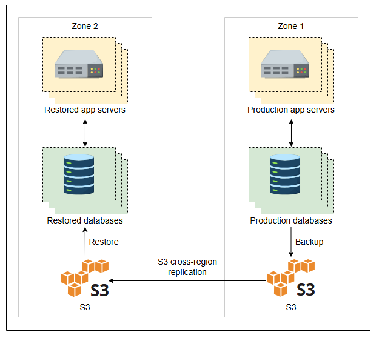

# Оценка дизайна Quora

Узнайте, как предложенный дизайн выполняет нефункциональные требования.

### Выполнение требований

Мы использовали различные методы для выполнения наших функциональных требований. Однако нам необходимо определить, выполнили ли мы нефункциональные требования. Мы выделим некоторые из механизмов, которые мы использовали для решения нефункциональных требований:

*   **Масштабируемость:** Наша система обладает высокой масштабируемостью по нескольким причинам. Обновленный дизайн использует **мощные и однородные хосты сервисов**. Quora использует мощные машины, потому что хосты сервисов используют кэш в памяти, некоторый уровень очередей, поддерживают процессы менеджера, рабочего процесса и библиотеку маршрутизации. Горизонтальное масштабирование этих хостов сервисов удобно, потому что они однородны.

    Со стороны баз данных наш дизайн вертикально шардирует базы данных MySQL, что позволяет избежать проблем с масштабируемостью из-за перегруженных серверов MySQL. Для уменьшения сложных запросов `join`, таблицы, в которых ожидаются операции `join`, размещаются в одном шарде или партиции.

    > **Примечание:** Как упоминалось ранее, вертикального шардирования может быть недостаточно, поскольку каждый шард может сильно вырасти горизонтально. Для больших таблиц MySQL запись становится узким местом. Поэтому нашему дизайну, возможно, придется прибегнуть к горизонтальному шардированию, что является хорошо известной практикой в масштабировании баз данных.

*   **Согласованность:** Из-за разнообразия функциональности, предлагаемой Quora, для разных типов данных могут быть выбраны разные схемы согласованности. Например, некоторые критически важные данные, такие как вопросы и ответы, должны храниться синхронно. В этом случае производительность может пострадать, поскольку пользователи не ожидают мгновенных ответов на свои вопросы. Это означает, что пользователь может получить ответ через пять минут, час, день или вообще не получить ответа, в зависимости от вопроса пользователя и доступности потенциальных респондентов.

    Другие данные, такие как счетчики просмотров, не обязательно хранить синхронно, поскольку целью сервиса Quora не является обеспечение того, чтобы все пользователи видели одинаковое количество просмотров сразу после публикации вопроса. В таких случаях для повышения производительности предпочтительна конечная согласованность (eventual consistency).

    > **Примечание:** В целом, наш дизайн оснащен надежными методами для снижения воспринимаемой пользователем задержки в целом.

*   **Доступность:** Некоторые из основных идей по улучшению доступности включают изоляцию между различными компонентами, наличие избыточных экземпляров, использование CDN, использование сервисов конфигурации, таких как ZooKeeper, и балансировщиков нагрузки для сокрытия сбоев от пользователей.

    > 💡 **Подсказка:**
    > Разделение сервисов помогает в обслуживании, обновлении и восстановлении во время сбоев отдельных сервисов или хостов. Если сервисы размещены на одном узле или хосте, сбой узла приводит к потере нескольких сервисов одновременно.

Наш дизайн, однако, не предусматривает управления аварийным восстановлением, которое мы рассмотрим в следующем разделе.

*   **Производительность:** Этот дизайн имеет высокую производительность, потому что мы применили правильную технологию для каждой конкретной функции. Например, мы использовали несколько хранилищ данных по разным причинам. Кроме того, мы использовали различные распределенные кэши в зависимости от сценария использования и частоты доступа. Также мы задействовали Kafka для организации очередей схожих задач и назначения их cron-заданиям, которые в противном случае занимали бы много времени при выполнении через вызовы API.

    > **Примечание:** Quora утверждает, что с помощью своего собственного решения для очередей она может обрабатывать примерно 15 000 задач в секунду.

    > 💡 **Подсказка:**
    > 1. Quora разработала собственную систему кэширования в памяти под названием Pycache, которая может хранить десятки ГБ кэша на локальной машине. API Pycache содержит простые, но эффективные функции, такие как `pycache.get(key)`, `pycache.set(key, value)`, `pycache.delete(key)`, `pycache.iteritems()` и `pycache.update()`. Функции `set` и `delete` имеют варианты для установки и удаления нескольких записей одновременно.
    > 2. Quora разработала инструмент с открытым исходным кодом под названием **Asynq**, который упрощает пакетирование запросов к кэшу Memcached. Таким образом, разработчики могут писать код быстрее, а задержка на круговой путь до службы кэширования сокращается.

### Соответствие нефункциональным требованиям

| Требования | Методы |
| :--- | :--- |
| **Масштабируемость** | <ul><li>Основано на AWS, который поддерживает автоматическое масштабирование.</li><li>Используются одинаковые серверы для уменьшения сложности горизонтального масштабирования.</li><li>Шардирование базы данных MySQL.</li><li>Используются различные хранилища данных для разных целей.</li><li>Asynq позволяет разработчикам быстрее кодировать, пакетируя запросы к кэшу.</li><li>Отдельные модули вычислений и извлечения признаков. Таким образом, универсальный механизм извлечения признаков позволяет масштабировать различные системы рекомендаций.</li></ul> |
| **Согласованность** | <ul><li>Используется MySQL и синхронная репликация в пределах одного дата-центра для критически важных данных.</li><li>Предлагается конечная согласованность для некритических данных, таких как счетчик просмотров.</li></ul> |
| **Доступность** | <ul><li>Использование различных хранилищ данных предотвращает одновременный сбой нескольких сервисов.</li><li>Использование шардирования и реплик баз данных.</li><li>Использование CDN в качестве резерва для обслуживания статических/динамических данных в случае сбоев.</li><li>ZooKeeper позволяет хостам сервисов получать обновления о шардах MySQL.</li><li>Балансировщики нагрузки скрывают сбои серверов от конечных пользователей.</li><li>AWS поддерживает доступность выше 99%.</li><li>Thrift изолирует сервисы и, следовательно, сбои.</li></ul> |
| **Производительность** | <ul><li>MyRocks имеет гораздо более низкую задержку P99.</li><li>Используется правильный язык программирования для быстрой доставки задач, например C++ для библиотеки маршрутизации.</li><li>Используется `Multiget()` для получения нескольких записей из Memcached за один раз.</li><li>Устраняется время кругового пути по сети с помощью Asynq.</li><li>Kafka повышает производительность хостов сервисов.</li><li>Шардирование улучшает QPS для MySQL.</li><li>Собственная система кэширования в памяти снижает задержку для часто запрашиваемых данных.</li></ul> |

## Аварийное восстановление

Наш предложенный и детальный дизайн не учитывает ситуацию **стихийных бедствий**. Хотя мы выполнили другие нефункциональные требования, долговечность, отказоустойчивость и доступность неполны без плана аварийного восстановления. В этом разделе мы рассмотрим некоторые механизмы, обеспечивающие устойчивость к катастрофам.

Первый и самый важный подход к управлению катастрофами — это частое резервное копирование. Частота резервного копирования зависит от объема данных. Ежедневное резервное копирование подходит для нашего дизайна, поскольку мы можем без проблем создавать резервные копии отдельных хранилищ данных и шардов. Конечно, резервные копии будут храниться в удаленных местах, поскольку стихийные бедствия могут уничтожить все оборудование в одной локации.

> **Примечание:** Регулярного резервного копирования в удаленные места недостаточно. План аварийного восстановления завершается возможностью быстрого восстановления данных из резервной копии.

Ниже приведены важные вопросы для разработки плана аварийного восстановления:

*   Какие данные и системы считаются критически важными для восстановления после катастроф?
*   Насколько быстро происходит восстановление из резервного хранилища?
*   Можно ли восстановить все системы с помощью резервных копий?
*   Как мы можем справиться с потенциальной потерей данных, которые мы не смогли реплицировать до катастрофы?

Иллюстрация ниже показывает простую архитектуру того, как работает схема аварийного восстановления:

Подход довольно прост. Данные, серверы приложений и конфигурации резервируются в хранилище Amazon S3 в той же зоне. Зональная репликация между хранилищами S3 облегчает передачу в другую зону. Позже серверы приложений и баз данных могут быть восстановлены из хранилища S3 в другой зоне.

Стратегия восстановления проста и эффективна, но имеет пару недостатков:

*   Мы можем потерять некоторые данные, которые не были зарезервированы, поскольку мы делаем резервные копии ежедневно. Однако эту проблему можно смягчить, если мы будем делать синхронную репликацию между регионами.
*   Восстановление может занять много времени (несколько часов), и большинство баз данных не обслуживают запросы во время восстановления данных.

> **Примечание:** В целом, Amazon предоставляет сервис с высокой надежностью и доступностью. Например, сервис S3 сообщает о 99.999999999% долговечности и 99.9% доступности в течение года.

## Заключение

В ходе этого проектирования мы узнали, как Quora способна масштабировать свои сервисы по мере увеличения числа пользователей. Одним из интересных аспектов дизайна является вертикальное шардирование базы данных MySQL. Кроме того, дизайн Quora обсуждает различные методы для выполнения функциональных и нефункциональных требований. Однако в наши рамки не входило использование таких техник, как обработка естественного языка (NLP) для исправления орфографических ошибок в вопросах пользователей или сервисов автодополнения (typeahead) при поиске.

---
**Вопрос для размышления**

**1. Какую пользу может принести использование различных хранилищ данных для разных типов данных при аварийном восстановлении?**

  
Показать ответ

  Когда мы используем разные хранилища данных, это означает, что мы можем восстанавливать различные формы данных одновременно, а не один большой блок данных. Поскольку мы восстанавливаем хранилища данных с переменным временем восстановления, конечное время восстановления равно максимальному времени восстановления среди всех хранилищ данных.

Однако использование большого количества баз данных также означает, что администраторам необходимо знать подробности их установки или восстановления.

