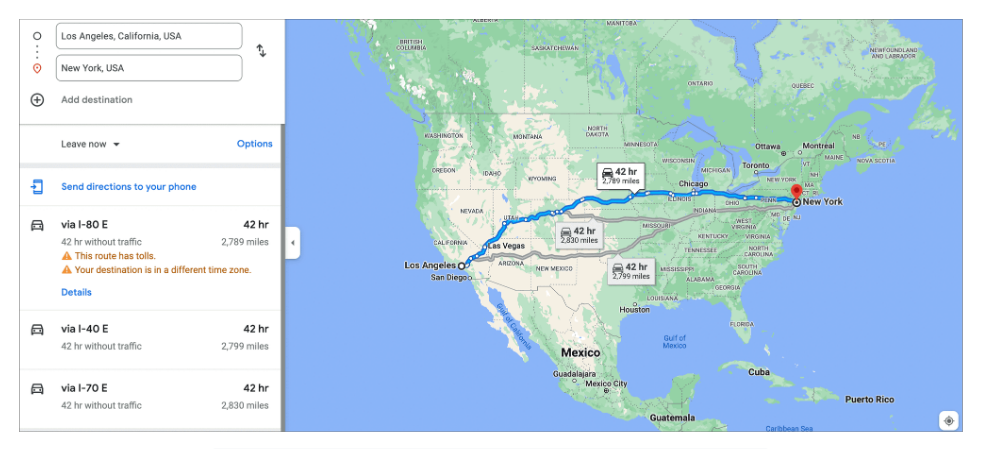

# System Design: Google Maps

Поймите основы системы Google Maps.

---

## Что такое Google Maps?

Давайте представим проблему, предположив, что мы хотим добраться из одного места в другое. Вот возможные вещи, которые мы хотели бы знать:

* Каковы наилучшие возможные маршруты до нашего пункта назначения в зависимости от типа транспортного средства, которое мы используем?
* Какова протяженность каждого маршрута в милях?
* Сколько времени займет каждый маршрут, чтобы добраться до пункта назначения?

Картографическое приложение (например, Google Maps или Apple Maps) позволяет пользователям легко отвечать на все вышеперечисленные вопросы.
На следующей иллюстрации показаны маршруты, рассчитанные Google Maps из «Лос-Анджелеса, США» в «Нью-Йорк, США».

*(Три маршрута, предложенные Google Maps для путешествия из Лос-Анджелеса в Нью-Йорк)*

## Когда мы используем картографический сервис?

Люди и организации полагаются на данные о местоположении для навигации по всему миру. Карты помогают в следующих случаях:

* Люди могут быстро находить местоположение и маршруты к новым местам, вместо того чтобы тратить время и деньги на поездки, например, на
  бензин.
* Люди используют карты, чтобы узнать свое **расчетное время прибытия (ETA)** и кратчайший путь на основе текущих данных о трафике.
* Многие современные приложения активно используют карты, например, сервисы заказа такси, автономные транспортные средства и карты для пеших
  прогулок. Например:
    * Система беспилотного автомобиля Waymo использует Google Maps для эффективной, быстрой и безопасной навигации.
    * Uber использует Google Maps как часть своего приложения, чтобы помогать водителям и предоставлять клиентам визуальное представление их
      поездки.
* Компании, занимающиеся маршрутизацией и логистикой, сокращают время, необходимое для доставки. Используя уникальные данные о трафике в
  реальном времени и исторические данные карты, они минимизируют общую стоимость доставок за счет сокращения расхода бензина и времени,
  проведенного в пробках.

В 2022 году более пяти миллионов компаний использовали Google Maps. Он предоставляет API для предприятий, чтобы они могли использовать
картографическую систему в своих приложениях.

---

**(Интерактивное задание)**

Пришло время продемонстрировать ваше понимание! Испытайте себя и посмотрите, насколько хорошо вы можете **определить четыре различных
строительных блока в Google Maps** с помощью нашей интерактивной оценки. Для проектирования системы Google Maps можно рассмотреть несколько
строительных блоков.

* Необходимо искать различные места на карте.
* Хранение метаданных в формате ключ-значение необходимо для эффективного управления данными.
* Система должна уметь генерировать и обрабатывать события, а также уведомлять другие сервисы при необходимости.
* Для эффективного представления дорожных данных система требует структурированного формата графа для хранения и извлечения информации.

> 

>  
<b>Показать</b>

>   а) Распределенный поисковый сервис для поиска различных мест на карте.
>
>   б) Хранилище ключей и значений для хранения информации о метаданных.
> 
>   в) Подсистема pub-sub для генерации важных событий во время навигации и реагирования на них, а также уведомления соответствующих служб.
>
>   d) Графические базы данных для хранения дорожных данных из различных источников в виде графика.
>
>   Эти компоненты работают вместе, обеспечивая эффективный поиск, управление данными, обработку событий и представление географической информации.
>
> 

---

## Как мы будем проектировать Google Maps?

Мы разделим проектирование Google Maps на пять уроков:

1. **Требования**: В этом уроке мы перечислим функциональные и нефункциональные требования к системе Google Maps. Мы также определим
   проблемы, связанные с проектированием такой системы. Наконец, мы оценим ресурсы, такие как серверы и пропускная способность, необходимые
   для обслуживания запросов миллионов пользователей.
2. **Проектирование**: Этот урок состоит из высокоуровневого и API-дизайна системы, подобной Google Maps. Мы опишем сервисы и рабочий
   процесс системы.
3. **Решение проблем**: Мы обсудим, как преодолеть проблемы, которые мы выделили в уроке о требованиях.
4. **Детальное проектирование**: На основе решения проблем мы улучшим наш предыдущий дизайн, а также подробно рассмотрим его различные
   аспекты. Мы опишем детальный дизайн, включая схему хранения данных.
5. **Оценка**: В этом уроке объясняется, как наша спроектированная система Google Maps выполняет все требования.
