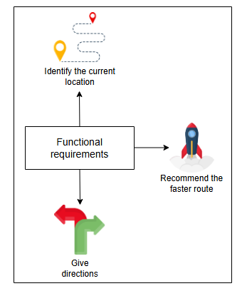
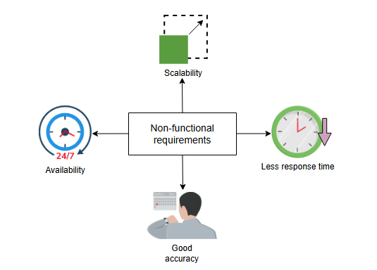
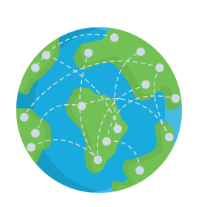
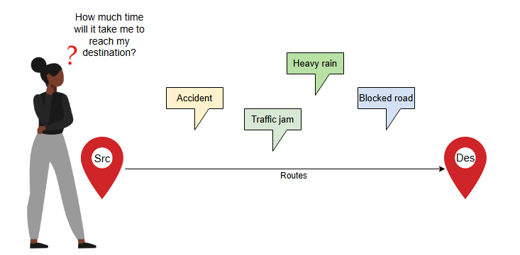
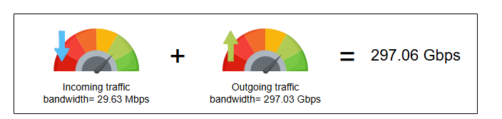
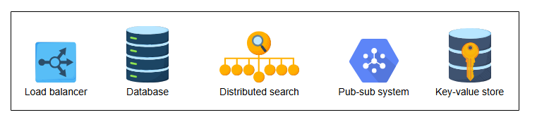

# Требования к дизайну Google Maps

Поймите требования к проектированию картографического приложения, такого как Google Maps.

---

## Требования

Прежде чем мы начнем рассматривать требования, давайте уточним, что мы будем проектировать систему, подобную Google Maps, выбрав несколько
ключевых функций, поскольку настоящие Google Maps очень многофункциональны и сложны.

Давайте перечислим функциональные и нефункциональные требования к проектируемой системе.

### Функциональные требования

Функциональные требования к нашей системе следующие:

* **Определение текущего местоположения**: Пользователи должны иметь возможность приблизительно определять свое текущее местоположение (
  широту и долготу в десятичных значениях) на карте мира.
* **Рекомендация самого быстрого маршрута**: Учитывая начальную и конечную точки (названия мест в текстовом формате), система должна
  рекомендовать оптимальный маршрут по расстоянию и времени в зависимости от типа транспорта.
* **Предоставление указаний**: После того как пользователь выбрал маршрут, система должна предоставить указания в текстовом формате, где
  каждый пункт списка направляет пользователя повернуть или продолжить движение в определенном направлении для достижения цели.

*( Функциональные требования Google Maps)*

### Нефункциональные требования

Нефункциональные требования к нашей системе следующие:

* **Доступность (Availability)**: Система должна быть высокодоступной.
* **Масштабируемость (Scalability)**: Она должна быть масштабируемой, поскольку как частные лица, так и другие корпоративные приложения,
  такие как Uber и Lyft, используют Google Maps для поиска подходящих маршрутов.
* **Малое время отклика (Less response time)**: Расчет **ETA (расчетное время прибытия)** и маршрута при заданных начальной и конечной
  точках не должен занимать более двух-трех секунд.
* **Точность (Accuracy)**: Прогнозируемое нами ETA не должно сильно отличаться от фактического времени в пути.

*(Нефункциональные требования Google Maps)*

> **Примечание:** Мы не будем углубляться в детали того, как мы получаем данные о дорогах и их расположении. Карты предоставляют
> государственные учреждения, а в некоторых местах Google сама использует картографические автомобили для поиска дорог и их пересечений.
> Дорожные сети моделируются с помощью графовой структуры данных, где точки пересечения — это **вершины**, а дороги между пересечениями — это
**взвешенные ребра**.

---

## Проблемы

Некоторые из проблем, на которых нам нужно сосредоточиться при проектировании системы, подобной Google Maps, перечислены ниже:

* **Масштабируемость**: Обслуживание миллионов запросов на различные маршруты в секунду, при наличии графа с миллиардами узлов и ребер,
  охватывающего 194 страны, требует надежных мер по масштабированию. Простой подход, при наличии широты и долготы начальной и конечной
  точек, заключался бы в применении алгоритма, такого как алгоритм Дейкстры, для поиска кратчайшего пути. Однако этот подход не будет хорошо
  масштабироваться для миллиардов пользователей, отправляющих миллионы запросов в секунду. Это связано с тем, что запуск любого алгоритма
  поиска пути на графе с миллиардами узлов миллион раз в секунду неэффективен с точки зрения времени и затрат, что в конечном итоге приводит
  к плохому пользовательскому опыту. Поэтому наше решение должно найти альтернативные методы для хорошего масштабирования.

*(Граф, охватывающий всю мировую сеть)*

* **Расчет ETA**: В идеальной ситуации с пустыми дорогами рассчитать ETA просто, используя расстояние и скорость транспортного средства.
  Однако мы не можем игнорировать такие факторы, как интенсивность движения на дорогах и дорожные условия, которые напрямую влияют на ETA.
  Например, дорога в стадии строительства, аварии и часы пик могут замедлить движение. Количественная оценка вышеуказанных факторов для
  проектирования нашей системы нетривиальна. Поэтому мы классифицируем эти факторы с точки зрения загруженности трафика для завершения
  нашего дизайна.

*( Факторы, влияющие на расчет ETA)*

---

## Оценка ресурсов

Давайте оценим общее количество серверов, объем хранилища и пропускную способность, необходимые для системы.

### Оценка количества серверов

Для оценки количества серверов нам нужно знать количество ежедневных активных пользователей Google Maps. Предположим, у нас 32 миллиона
ежедневных активных пользователей. Используя наше допущение об использовании ежедневных активных пользователей в качестве прокси для
количества запросов в секунду, мы получаем 32 миллиона запросов в секунду. Затем мы используем следующую формулу для расчета количества
серверов:

`Серверы_необходимые_в_пиковой_нагрузке = Количество_запросов_в_секунду / RPS_сервера`

Используя 64 000 в качестве предполагаемого RPS (запросов в секунду), которое может обработать сервер, необходимое количество серверов
оценивается следующим образом:

`Серверы_необходимые_в_пиковой_нагрузке = 32,000,000 / 64,000 = 500 серверов`

*(Количество серверов, необходимых для Google Maps)*

### Оценка хранения данных

Google Maps — это, по сути, система с однократным требованием к хранению. Данные о дорогах из многих стран уже добавлены, и по состоянию на
2022 год их объем превышает 20 петабайт. Поскольку изменения в дорожных сетях минимальны, ежедневные требования к хранению для Google Maps
будут незначительными. Кроме того, краткосрочные изменения в дорожной сети представляют собой небольшой объем данных по сравнению с данными
всей сети. Поэтому наши потребности в хранении данных не меняются быстро.

### Оценка пропускной способности

Мы должны оценить пропускную способность, необходимую для входящего и исходящего трафика нашей системы. Большинство требований к пропускной
способности для Google Maps обусловлено запросами, отправляемыми пользователями. Поэтому мы разработали следующую формулу для расчета
пропускной способности:

`Общая_пропускная_способность = Общее_количество_запросов_в_секунду × Общий_размер_запроса`

**Входящий трафик**
Для оценки пропускной способности входящего трафика запросов мы предполагаем следующие цифры:

* Максимальное количество запросов от одного пользователя в день: 50.
* Размер запроса (источник и назначение): 200 байт.

Общее количество запросов в секунду:
`(32,000,000 пользователей * 50 запросов) / (24 * 60 * 60 секунд) = 18,518 запросов в секунду.`

**Таблица: Пропускная способность для входящего трафика запросов**

| Кол-во запросов в секунду | Размер запроса (Байт) | Пропускная способность (Мб/с) |
|---------------------------|-----------------------|---------------------------------|
| 18,518 | 200 | 29.63 |

**Исходящий трафик**
Исходящий трафик приложения будет включать ответ, который сервер генерирует для пользователя. Ответ состоит из визуальных и текстовых
данных. Мы предполагаем следующие цифры для оценки пропускной способности исходящего трафика:

* Общее количество запросов в секунду: 18,518.
* Размер ответа: 2 МБ (визуальные данные) + 5 КБ (текстовые данные) = 2005 КБ.

**Таблица: Пропускная способность для исходящего трафика приложения**

| Кол-во запросов в секунду | Размер ответа (КБ) | Пропускная способность (Гб/с) |
|---------------------------|--------------------|---------------------------------|
| 18,518 | 2005 | 297.03 |

*(Обобщение требований к пропускной способности для Google Maps)*

---

## Строительные блоки, которые мы будем использовать

Теперь, когда мы завершили оценку необходимых ресурсов, давайте определим строительные блоки, которые станут неотъемлемой частью нашего
дизайна системы Google Maps. Ниже приведены ключевые строительные блоки:

* **Балансировщики нагрузки** необходимы для распределения пользовательских запросов между различными серверами и службами.
* **Базы данных** требуются для хранения данных в виде графа вместе с метаданными.
* **Распределенный поиск** необходим для поиска различных мест на карте.
* **Система "издатель-подписчик" (pub-sub)** требуется для генерации и реагирования на важные события во время навигации и уведомления
  соответствующих служб.
* **Хранилище "ключ-значение"** также используется для хранения некоторой метаинформации.

Помимо вышеупомянутых строительных блоков, для проектирования нашей картографической системы потребуются и другие компоненты. Эти компоненты
будут обсуждаться в уроках по дизайну. Теперь мы готовы изучить системный и API-дизайн Google Maps.