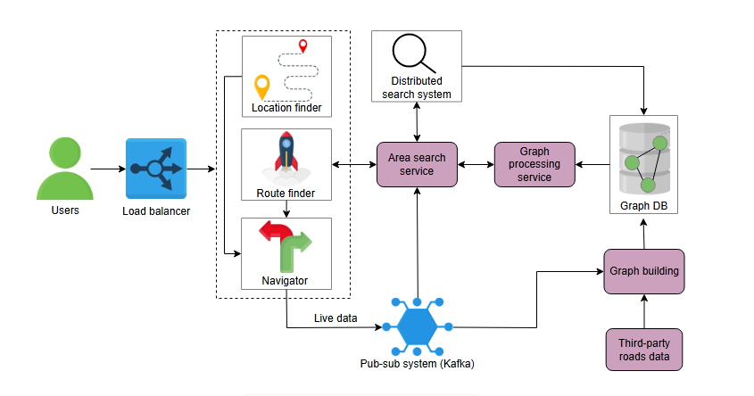

# Дизайн Google Maps

---

## Высокоуровневый дизайн

Давайте начнем с высокоуровневого дизайна картографической системы. Мы разделим обсуждение на две части:
1.  Компоненты, которые нам понадобятся в нашем дизайне.
2.  Рабочий процесс, который связывает эти компоненты.

### Компоненты

Мы будем использовать следующие компоненты в нашем дизайне:

*   **Определитель местоположения (Location finder):** Это сервис, используемый для определения текущего местоположения пользователя и его отображения на карте, поскольку мы не можем помнить широту и долготу каждого места в мире.
*   **Поисковик маршрутов (Route finder):** Этот сервис используется для поиска путей между двумя местоположениями или точками. Он показывает маршрут на карте пользователям, которые находятся в новом месте и нуждаются в помощи с навигацией.
*   **Навигатор (Navigator):** Простого предложения маршрута через поисковик маршрутов недостаточно. Пользователь может отклониться от оптимального пути. В этом случае используется сервис навигатора. Этот сервис отслеживает поездки пользователей и отправляет обновленные указания и уведомления, как только они отклоняются от предложенного маршрута.
*   **Технологии GPS/Wi-Fi/Сотовой связи:** Это технологии, которые мы используем для определения местоположения пользователя на земле.
*   **Распределенный поиск (Distributed search):** Для преобразования названий мест в значения широты/долготы нам нужна система преобразования. Распределенный поиск поддерживает индекс, состоящий из названий мест и их сопоставления с широтой и долготой. Этот сервис используется для поиска местоположения на карте по введенным пользователем ключевым словам.
*   **Сервис поиска по области (Area search service):** Этот сервис координирует работу между распределенным поиском и сервисами обработки графов. Он эффективно находит кратчайший путь между двумя точками, сужая пространство поиска до определенной области, охватывающей начальную и конечную точки.
*   **Сервис обработки графов (Graph processing service):** Может быть несколько путей из одного места в другое. Сервис обработки графов запускает алгоритм поиска кратчайшего пути на уменьшенном графе, основанном на области, охватывающей начальную и конечную точки, и помогает определить, по какому пути следовать.
*   **База данных (Database):** Как обсуждалось в предыдущем уроке, у нас есть данные о дорогах из различных источников, хранящиеся в виде графа. Мы будем использовать графовую базу данных, такую как DataStax Graph, для хранения графа нашего дизайна.
*   **Система "издатель-подписчик" (Pub-sub system):** Пользователи могут отклоняться от первоначально предложенного пути. В этом случае им потребуется информация о новом пути к месту назначения. Pub-sub — это система, которая прослушивает различные события от одного сервиса и соответствующим образом запускает другой. Мы будем использовать Kafka в качестве pub-sub системы.
*   **Данные о дорогах от третьих сторон:** Мы не можем создать картографическую систему без данных о дорожных сетях. Нам нужно собирать данные о дорогах из сторонних ресурсов и предварительно обрабатывать их для приведения к единому формату.
*   **Построение графа (Graph building):** Мы будем использовать сервис, который строит граф из предоставленных данных, собранных либо из сторонних ресурсов, либо от пользователей.
*   **Пользователь (User):** Это человек или программа, которые используют сервисы картографической системы.
*   **Балансировщик нагрузки (Load balancer):** Это система, которая используется для распределения запросов пользователей между различными серверами и сервисами.

*( Высокоуровневый дизайн картографической системы)*

### Рабочий процесс

Мы объясним рабочий процесс, предполагая, что пользователю нужно добраться из одной точки в другую, но он не знает своего текущего местоположения или как добраться до пункта назначения.

> Для этого упражнения мы предполагаем, что данные о дорожных сетях и картах уже собраны от третьих сторон, а граф построен и сохранен в графовой БД.

*   Пользователь вводит начальную и конечную точки. Для начальной точки используется сервис определения текущего местоположения.
*   Определитель местоположения определяет текущее местоположение с помощью GPS, Wi-Fi и сотовых технологий.
*   Для конечной точки пользователь вводит адрес в текстовом формате.
*   Запрос на поиск оптимального пути направляется в поисковик маршрутов, который передает его в сервис поиска по области.
*   Сервис поиска по области использует распределенный поиск для получения координат, определяет область на карте, охватывающую обе точки, и запрашивает у сервиса обработки графов найти оптимальный путь в этом подграфе.
*   Сервис обработки графов находит кратчайший путь и возвращает его поисковику маршрутов, который визуализирует маршрут, расстояние, время и пошаговые инструкции.
*   Для получения пошаговых указаний во время движения используется навигатор.
*   Навигатор отслеживает движение пользователя. Если пользователь отклоняется от маршрута, генерируется событие, которое передается в Kafka.
*   Kafka уведомляет сервис поиска по области, который пересчитывает оптимальный маршрут.

---

 > Как можно собирать данные о пробках в реальном времени и бесшовно интегрировать их в процесс поиска маршрута в картографической системе, такой как Google Maps?
 > 

 >  
<b>Показать</b>

 >   Для сбора данных о дорожных заторах в режиме реального времени системы обычно собирают информацию из показаний GPS с пользовательских устройств (соблюдая при этом конфиденциальность), дорожных датчиков, установленных на дорогах, и отчетов о происшествиях от властей или пользователей. Затем эти данные интегрируются в процесс поиска маршрута путем обновления весовых коэффициентов ребер в графическом представлении карты, часто с использованием зависящего от времени алгоритма кратчайшего пути, отражающего текущие условия дорожного движения
 > 

---

## Дизайн API

Давайте рассмотрим различные API для картографического сервиса.

**Показать текущее местоположение пользователя на карте**
Функция `currLocation` отображает местоположение пользователя на карте.

`currLocation(location)`

| Параметр  | Описание                                                                                                                                                                 |
|:----------|:-------------------------------------------------------------------------------------------------------------------------------------------------------------------------|
| `location` | Определяет, включено ли местоположение пользователя. Этот вызов устанавливает постоянное соединение между клиентом и сервером для периодического обновления местоположения. |

**Найти оптимальный маршрут**
Функция `findRoute` помогает найти оптимальный маршрут между двумя точками.

`findRoute(source, destination, transport_type)`

| Параметр                   | Описание                                                                                |
|:---------------------------|:----------------------------------------------------------------------------------------|
| `source`                   | Место (в текстовом формате), откуда пользователь хочет начать свой путь.                 |
| `destination`              | Место (в текстовом формате), куда пользователь хочет добраться.                         |
| `transport_type` (необязат.)| Может быть велосипед, автомобиль, самолет и т.д. По умолчанию используется автомобиль. |

**Получить указания**
Функция `directions` помогает получать оповещения о том, когда и куда повернуть.

`directions(curr_location)`

| Параметр           | Описание                                                            |
|:-------------------|:--------------------------------------------------------------------|
| `current_location` | Значение широты/долготы текущего местоположения пользователя на карте.|

---

Мы описали высокоуровневый дизайн, объяснив необходимые сервисы, а также обсудили дизайн API. Далее мы обсудим, как мы решили проблему масштабируемости с помощью сегментов.
