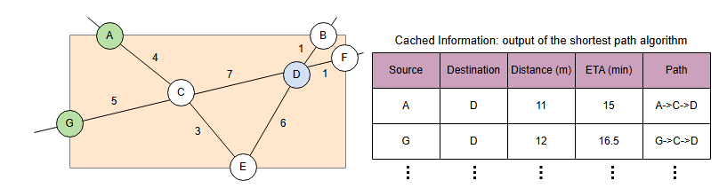
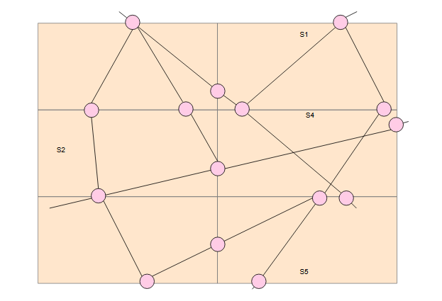

# Проблемы дизайна Google Maps

Давайте разберемся и решим ключевые проблемы при проектировании системы, подобной Google Maps.

## Решение проблем

В предыдущем уроке мы перечислили две проблемы: масштабируемость и расчет ETA (расчетного времени прибытия). Давайте посмотрим, как мы их решаем.

### Масштабируемость

**Масштабируемость** — это способность эффективно обрабатывать огромный граф дорожной сети. У нас есть граф с миллиардами вершин и ребер, и ключевые проблемы заключаются в неэффективной загрузке, обновлении и выполнении вычислений. Например, нам приходится обходить весь граф, чтобы найти кратчайший путь. Это приводит к увеличению времени ответа для пользователя. Каким может быть решение этой проблемы?

Идея состоит в том, чтобы разбить большой граф на меньшие подграфы или разделы. Подграфы можно обрабатывать и запрашивать параллельно. В результате время построения графа и обработки запросов значительно сократится. Итак, мы делим земной шар на небольшие части, называемые сегментами. Каждый сегмент соответствует подграфу.

#### Сегмент

**Сегмент** — это небольшая область, с которой мы можем легко работать. Поиск путей в этих сегментах работает, потому что граф дорожной сети сегмента мал и может быть легко загружен в основную память, обновлен и пройден. Город, например, можно разделить на сотни сегментов, каждый размером `5x5` миль.

> **Примечание:** Сегмент не обязательно является квадратом. Он также может быть многоугольником. Однако для простоты объяснения мы предполагаем квадратные сегменты.

Каждый сегмент имеет четыре координаты (широта и долгота), которые помогают определить, в каком сегменте находится пользователь.

*(Разделение земного шара на небольшие сегменты, и у каждого сегмента есть четыре координаты со значениями широты и долготы)*

Давайте поговорим о поиске путей между двумя точками внутри сегмента. У нас есть граф, представляющий дорожную сеть в этом сегменте. Каждое пересечение/развязка выступает в роли вершины, а каждая дорога — в роли ребра. Граф взвешенный, и у каждого ребра может быть несколько весов — например, расстояние, время и трафик — для поиска оптимального пути. Для заданных начальной и конечной точек может быть несколько путей. Мы можем использовать любой из алгоритмов для графов, чтобы найти кратчайшие пути. Самый распространенный алгоритм поиска кратчайшего пути — это **алгоритм Дейкстры**.

> Традиционный алгоритм Дейкстры выполняет направленный поиск для нахождения кратчайшего пути. Однако это происходит за счет увеличения времени запроса. Мы должны установить ограничение на время запроса, потому что мы не хотим, чтобы пользователь слишком долго ждал результатов.
>
> Алгоритм **A*** — это расширение алгоритма Дейкстры, которое использует эвристику для направления своего поиска. Вместо нахождения кратчайшего пути, A* находит оптимальный путь, минимизируя функцию `f(n) = g(n) + h(n)`.
>
> **Примечание:** Существуют алгоритмы, специально разработанные для дорожных сетей, которые нацелены на сокращение времени запроса. К ним относятся A*, Arc flags, contraction hierarchies, transit node routing, reach-based routing и hub labeling.

После запуска алгоритма поиска кратчайшего пути на графе сегмента мы сохраняем его вывод в распределенном хранилище, чтобы избежать повторных вычислений и кэшировать наиболее запрашиваемые маршруты. Вывод алгоритма — это кратчайшее расстояние между каждыми двумя вершинами в графе, время в пути и список вершин вдоль каждого кратчайшего пути. Вся эта обработка выполняется в автономном режиме (не на критическом пути пользователя).

*(Поиск пути между вершинами внутри сегмента)*

На иллюстрации выше показано, как мы можем найти кратчайшее расстояние в милях между двумя точками. Например, минимальное расстояние между точками A и D составляет 11 миль по пути A->C->D. ETA составляет 15 минут.

А что, если нам нужно найти путь между двумя точками, которые лежат на ребрах? Мы находим вершины ребра, на котором лежат точки, вычисляем расстояние от точки до этих вершин и выбираем те вершины, которые делают общее расстояние короче.

*(Выбор пути между точками, которые лежат на ребре)*

Теперь посмотрим, что происходит, когда начальная и конечная точки принадлежат разным сегментам.

#### Соединение двух сегментов

Каждый сегмент имеет уникальное имя и координаты границ. Мы можем легко определить, в каком сегменте находится любая точка (широта, долгота). Для каждого сегмента есть граничные ребра, которые мы называем **точками выхода (exit points)**.

> **Примечание:** Помимо внутренних вершин, мы также рассматриваем точки выхода сегмента как вершины и вычисляем кратчайший путь до них. Информация о кратчайшем пути от каждой вершины до точек выхода сегмента кэшируется.

*(Соединение сегментов путем рассмотрения точек выхода сегмента как вершин)*

Точка выхода соединяет соседние сегменты и является общей для них. Имея все точки выхода для каждого сегмента, мы можем соединить их и найти кратчайшее расстояние между двумя точками в разных сегментах. При соединении сегментов нас не интересует их внутренняя структура, нам нужны только точки выхода и кэшированная информация о них. Это можно представить как граф, состоящий из точек выхода.

*(Граф, состоящий из точек выхода, где линии, соединяющие точки выхода, на самом деле не прямые. Между двумя точками выхода может быть много вершин)*

Поскольку мы не можем запустить алгоритм поиска кратчайшего пути для всех сегментов по всему земному шару, критически важно определить, сколько сегментов нам нужно учесть. **Воздушное расстояние** между двумя точками используется для ограничения количества сегментов. Мы можем найти это расстояние с помощью формулы гаверсинусов.

Предположим, воздушное расстояние между начальной и конечной точками составляет 10 километров. В этом случае мы можем включить сегменты, которые находятся на расстоянии 10 километров от начальной и конечной точек в каждом направлении. Это значительно сокращает граф для поиска.

После ограничения количества сегментов мы можем построить граф, где вершинами являются точки выхода каждого сегмента, а ребрами — рассчитанные пути между ними. Теперь все, что нам нужно сделать, это запустить алгоритм поиска кратчайшего пути на этом графе.

1) Источник S и пункт назначения D находятся в двух разных сегментах, и мы должны найти кратчайший маршрут между ними
   

2) Мы предполагаем, что воздушное расстояние между точками S и D равно 5 милям, рассчитанное по формуле хаверсина
   

3) Поскольку воздушное расстояние составляет 5 миль, мы включаем сегменты, которые находятся на расстоянии 5 миль от S и D во всех направлениях
   

4) Давайте включим точки выхода из новых сегментов в график
   

5) Найдите возможные выходы для S и D из их соответствующих сегментов и кратчайший путь (уже рассчитанный) ко всем точкам выхода
   

6) Мы начнем находить все возможные пути из S в D. Один из маршрутов выделен жирным шрифтом. Расстояние рассчитано как 22 мили
   

7) Найден еще один путь длиной 30 миль.
   

8) Найден еще один путь длиной 36 миль.
   

9) Найден еще один путь длиной 37 миль.
   

10) Мы продолжим поиск возможных путей и вернем пользователю кратчайший путь
    
Таким образом, мы решили проблему масштабируемости: вместо работы с одним огромным графом мы работаем с его частями (сегментами) и соединяем их по мере необходимости.

### Расчет ETA

Для вычисления ETA с разумной точностью мы собираем данные о местоположении в реальном времени `(userID, timestamp, (latitude, longitude))` от навигационного сервиса через систему pub-sub. С помощью потоков данных о местоположении мы можем вычислять и прогнозировать модели трафика на разных дорогах. Например, мы можем рассчитать:

*   Трафик (высокий/средний/низкий) на разных маршрутах или дорогах.
*   Среднюю скорость транспортного средства на разных дорогах.
*   Временные интервалы, в которые повторяется похожая картина трафика (например, на шоссе X будет высокий трафик с 8 до 10 утра).

Эта информация помогает нам предоставлять более точное ETA. Например, если мы знаем, что в определенное время на определенной дороге будет высокий трафик, ETA также должно быть больше обычного.
