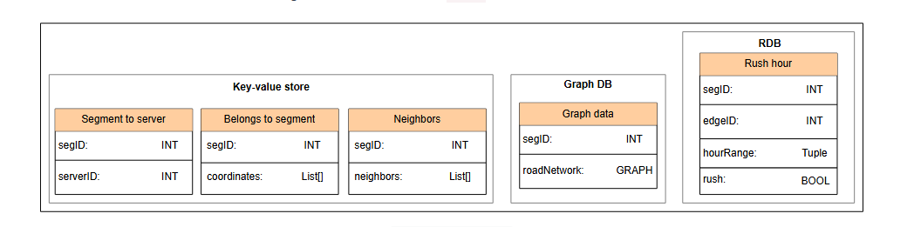
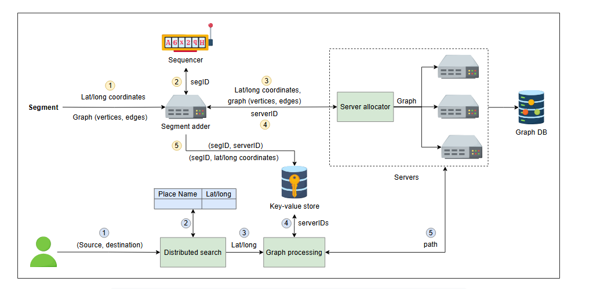
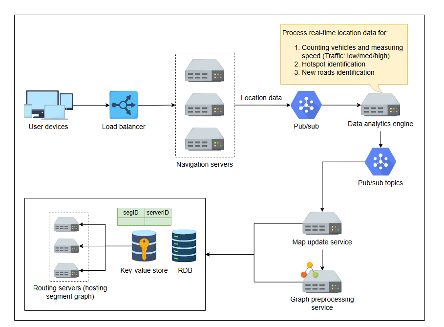

# Детальный дизайн Google Maps

Давайте рассмотрим детальный дизайн картографической системы.

В этом уроке мы обсудим наш детальный дизайн, ответив на следующие вопросы:

1.  Как пользовательские запросы выигрывают от использования сегментов?
2.  Как мы улучшаем пользовательский опыт за счет повышения точности ETA (расчетного времени прибытия)?

## Настройка сегментов и обработка запросов

В этом разделе будет описано, как данные сегментов хранятся в базе данных и как обрабатываются запросы пользователей с использованием уже сохраненных данных.

Начиная со схемы хранения, мы обсудим, как сегменты добавляются и размещаются на серверах, а также как обрабатываются запросы пользователей.

### Схема хранения данных

Мы храним следующую информацию для каждого сегмента:

**Хранилище «ключ-значение» (Key-value store):**
*   `ID` сегмента.
*   `serverID`, на котором размещен сегмент.
*   `coordinates` (координаты) границ (широта/долгота), возможно, в виде списка.
*   Список ID соседних (`neighbors`) сегментов.

**Графовая база данных (Graph database):**
*   Дорожная сеть внутри сегмента в виде `графа (graph)`.

**Реляционная БД (Relational DB):**
Мы храним информацию, чтобы определить, в какой час дня на дорогах есть заторы. Это позже помогает нам решить, обновлять ли граф (веса ребер) на основе данных в реальном времени.
*   `edgeID` идентифицирует ребро.
*   `hourRange` указывает, какой час дня соответствует типичным дорожным условиям.
*   `rush` — это булево значение, которое показывает, есть ли затор на определенной дороге в определенное время.

> **Примечание:** `segID`, `serverID` и `edgeID` — это уникальные идентификаторы, генерируемые генератором уникальных ID.

*(Схема хранения данных)*

### Дизайн

Следующая иллюстрация состоит из двух рабочих процессов. Один добавляет сегменты на карту и размещает их на серверах, а другой показывает, как обрабатывается запрос пользователя на поиск пути между двумя точками.

*(Рабочий процесс 1) Добавление сегментов (желтым цветом) и рабочий процесс 2) Обработка запросов пользователей (синим цветом))*

**Добавление сегмента**
1.  Каждый сегмент имеет свои координаты границ (широта/долгота) и граф своей дорожной сети.
2.  `Segment Adder` (добавитель сегментов) обрабатывает запрос на добавление сегмента. Он присваивает уникальный ID каждому сегменту.
3.  После присвоения ID `Segment Adder` пересылает информацию о сегменте в `Server Allocator` (распределитель серверов).
4.  `Server Allocator` назначает сервер для сегмента, размещает граф этого сегмента на этом сервере и возвращает `serverID` в `Segment Adder`.
5.  После этого `Segment Adder` сохраняет сопоставление сегмента с сервером в хранилище «ключ-значение».

**Обработка запроса пользователя**
1.  Пользователь предоставляет начальную и конечную точки.
2.  Широта и долгота для этих точек определяются с помощью распределенного поиска.
3.  Координаты передаются в `Graph Processing Service` (сервис обработки графов), который находит сегменты, в которых лежат эти точки.
4.  После нахождения ID сегментов сервис находит серверы, на которых размещены эти сегменты, из хранилища «ключ-значение».
5.  `Graph Processing Service` подключается к соответствующим серверам для поиска кратчайшего пути. Если обе точки находятся в одном сегменте, запрос выполняется только на одном сервере. В противном случае он соединяет сегменты с разных серверов, как мы видели в предыдущем уроке.

## Улучшение оценок с использованием данных в реальном времени

В этом разделе описывается, как мы можем повысить точность оценки ETA с использованием данных в реальном времени. Если у нас есть последовательность данных о местоположении для разных устройств, мы можем находить модели движения и выполнять аналитику для прогнозирования различных факторов, которые могут повлиять на поездку пользователя.

*   **WebSocket** — это протокол связи, который обеспечивает двустороннюю интерактивную сессию между пользователями и серверами. Это помогает в передаче данных в реальном времени.
*   **Балансировщик нагрузки** распределяет нагрузку подключений между различными серверами, поскольку существует ограничение на количество WebSocket-соединений на один сервер.

*(Выполнение аналитики на основе данных о местоположении в реальном времени для поддержания карты в актуальном состоянии, а также для улучшения оценок ETA)*

*   **Система «издатель-подписчик» (Pub-sub)** собирает потоки данных о местоположении (устройство, время, местоположение) со всех серверов.
*   Эти данные считываются **движком анализа данных**, таким как Apache Spark. Движок использует методы науки о данных (машинное обучение, кластеризацию и т. д.) для измерения и прогнозирования трафика на дорогах, выявления скоплений людей, горячих точек, событий, поиска новых дорог и так далее.
>   **Примечание:** Объем трафика, дорожные условия и горячие точки напрямую влияют на среднюю скорость движения, что в конечном итоге влияет на ETA пользователей.
*   Движок анализа данных публикует результаты в новой **теме (topic) pub-sub**.
*   **Сервис обновления карты (Map update service)** прослушивает обновления из этой темы. Он обновляет графы сегментов, если была обнаружена новая дорога или изменился вес ребра (средняя скорость, трафик, состояние дороги). В зависимости от местоположения мы знаем, к какому сегменту относится обновление, находим **сервер маршрутизации**, на котором размещен этот сегмент, и обновляем граф на этом сервере.
*   **Сервис предварительной обработки графа (Graph preprocessing service)** пересчитывает новые пути на обновленном графе сегмента.

### Вопрос на размышление

> 1.  Многие дорожные условия являются кратковременными (например, остановка на светофоре), поэтому слишком частое обновление графа не будет хорошо масштабироваться, так как это требует избыточной обработки. Каким может быть решение этой проблемы?
> 

>  
<b>Показать</b>

>       Для эффективной обработки как нормальных, так и кратковременных дорожных условий система поддерживает два набора данных для весов ребер графа маршрутизации: один отражает нормальные (исторические или средние) условия, а другой — временные события, такие как остановки на светофорах или краткосрочные пробки. Этот подход с двумя наборами данных позволяет системе избежать избыточной обработки и постоянных полных обновлений графа при каждом незначительном, мимолетном изменении трафика.
>
> При расчете маршрутов система накладывает временные данные поверх нормальных условий, применяя только актуальные и недавние обновления. По мере истечения или исчезновения временных событий их эффекты автоматически удаляются, гарантируя, что только значительные и постоянные изменения влияют на базовый граф, тем самым поддерживая как точность, так и эффективность в большом масштабе.
>
> 

---

Мы узнали, как работают сегменты, как пользователь находит маршрут между двумя точками и как повышается точность ETA за счет использования данных о местоположении в реальном времени.
