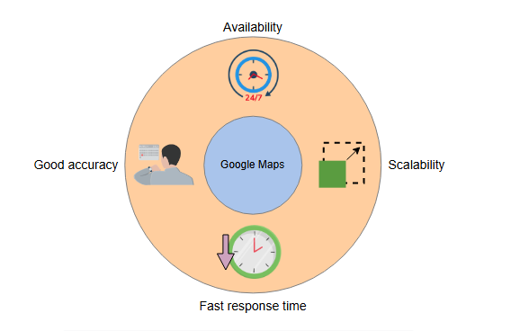

# Оценка дизайна Google Maps

Давайте посмотрим, как наш дизайн карты соответствует требованиям.

---

Давайте посмотрим, как спроектированная нами система будет обрабатывать миллионы запросов в секунду, обеспечивая быстрое время отклика.

## Доступность

При размещении большого графа дорожной сети на одном сервере мы столкнулись бы со следующими проблемами:

*   Мы не смогли бы обрабатывать запросы пользователей, так как было бы невозможно загрузить такой большой граф в память, что сделало бы систему недоступной.
*   Было бы невозможно установить постоянное двустороннее соединение (для навигации) между сервером и миллионами пользователей в секунду.
*   Это также была бы единая точка отказа.

Мы решили вышеуказанные проблемы, разделив мир на небольшие сегменты. Каждый маленький сегмент состоит из графа, который можно легко загрузить в память сервера. С помощью сегментов мы достигли следующих целей:

*   Мы разместили каждый сегмент на отдельном сервере, что решило проблему загрузки большого глобального графа.
*   Балансировщик нагрузки распределяет нагрузку запросов по разным серверам сегментов в зависимости от области поиска пользователя. Это решает проблему перегрузки одного сервера, которая влияла на доступность системы.
*   Мы не обсуждали репликацию, но мы можем реплицировать каждый сегмент, что поможет справиться с проблемой единой точки отказа сервера сегмента и распределить нагрузку запросов для сегмента между репликами.

> **Примечание:** Google Maps использует **ленивую загрузку (lazy loading)** данных, что снижает нагрузку на систему и повышает доступность.

Ленивая загрузка сокращает начальное время загрузки, уменьшая объем загружаемого контента, экономит пропускную способность, доставляя контент пользователям по мере необходимости, и сохраняет ресурсы сервера и клиента, отображая только часть контента.

*( Нефункциональные требования, выполненные нашей картографической системой)*

## Масштабируемость

Мы масштабировали нашу систему для больших дорожных сетей. Масштабируемость можно рассматривать в двух аспектах:

*   Способность системы обрабатывать растущее количество запросов пользователей.
*   Способность системы работать с большим объемом данных (сегментов).

Мы разделили мир на небольшие сегменты. Каждый сегмент размещается на отдельном сервере в распределенной системе. Запросы пользователей на разные маршруты обслуживаются с разных серверов сегментов. Таким образом, мы можем обслуживать миллионы запросов пользователей.

> **Примечание:** Было бы невозможно обслуживать миллионы запросов пользователей, если бы у нас был один большой граф, охватывающий всю дорожную сеть. Возникли бы проблемы с памятью при загрузке и обработке огромного графа.

Мы также можем легко добавлять новые сегменты, потому что нам не нужно изменять весь граф. Мы можем дополнительно улучшить масштабируемость, выбирая размеры сегментов неравномерно — меньшие размеры в густонаселенных районах и большие сегменты на окраинах.

## Малое время отклика

Мы выполняем запросы пользователей на небольших подграфах. Обработка небольшого подграфа из сотен вершин намного быстрее, чем графа из миллионов вершин. Мы можем кэшировать обработанный небольшой подграф в основной памяти и быстро отвечать на запросы пользователей. Так наша система отвечает пользователю за меньшее время.

Есть еще один аспект, который помогает нашей системе быстро отвечать — это хранение информации о сегментах в хранилище «ключ-значение». Это хранилище помогает различным сервисам быстро получать необходимую информацию.

*   Сервис обработки графов проверяет релевантные сегменты, запрашивая в хранилище «ключ-значение» `segmentID`.
*   Для балансировки нагрузки запросов пользователей между различными серверами сегментов запрашивается `serverID` для нужного сегмента.

## Точность

Помимо исходных данных о дорогах, мы также собираем данные о местоположении пользователей в реальном времени, на основе которых мы проводим аналитику с использованием методов науки о данных. Наша система повышает точность результатов (маршрут, ETA) с помощью этой аналитики. На основе анализа моделей трафика карты обновляются, а маршруты и оценки ETA улучшаются.

---

### **Выполнение нефункциональных требований**

| Требования            | Методы                                                                                                        |
|:----------------------|:--------------------------------------------------------------------------------------------------------------|
| **Доступность**       | - Обработка запросов на малых графах (сегментах). - Балансировка нагрузки. - Репликация серверов сегментов. |
| **Масштабируемость**    | - Разделение больших графов на малые. - Размещение сегментов на разных серверах.                         |
| **Малое время отклика** | - Кэширование обработанных графов. - Использование хранилища «ключ-значение».                               |
| **Точность**          | - Сбор данных в реальном времени. - Проведение анализа данных.                                              |

---

## Заключение

Google Maps — одно из самых широко используемых приложений в мире. Картографическая система моделирует дорожную сеть с помощью графовой структуры данных. Для поиска маршрута по графу выполняется алгоритм поиска кратчайшего пути. Мы рассмотрели проблемы масштабируемости с большим графом дорожной сети и решили их, разделив мир на небольшие сегменты. Каждый сегмент состоит из небольшого графа, который можно быстро загрузить в память для поиска путей. Мы также увидели, что расчетное время прибытия можно улучшить, анализируя данные о местоположении в реальном времени.
