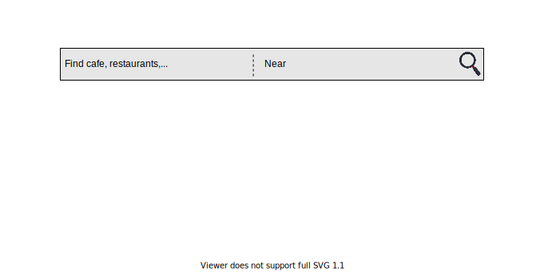
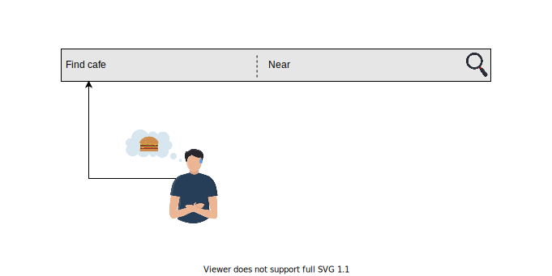
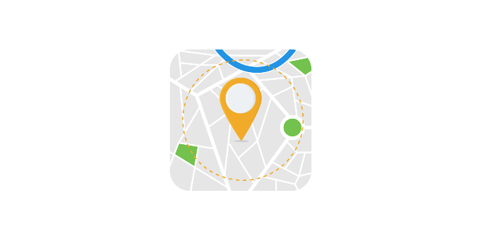
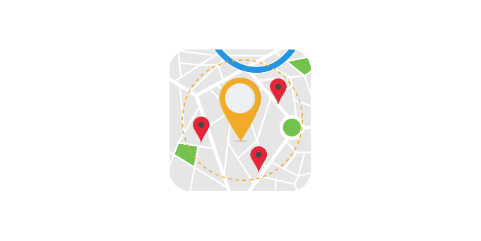

# Системный дизайн: Yelp

Узнайте о требованиях к сервису поиска поблизости, такому как Yelp.

---

## Что такое Yelp?

**Yelp** — это универсальная платформа для потребителей, позволяющая находить местные компании, связываться с ними и совершать транзакции. С ее помощью пользователи могут встать в очередь, забронировать столик, записаться на прием или легко приобрести товары. Yelp также предоставляет информацию, фотографии и отзывы о местных компаниях.

Пользователь указывает название места или его GPS-координаты, и система находит заведения поблизости. Пользователь также может загружать свои мнения на эту платформу в виде текста, фотографий или оценок для места, которое он посетил. Другие сервисы, основанные на местоположении, включают Foursquare и Google Nearby.

Сервисы, основанные на **серверах близости (proximity servers)**, полезны для поиска близлежащих достопримечательностей, таких как рестораны, театры или места отдыха. Проектирование такой системы является сложной задачей, поскольку нам необходимо эффективно находить все возможные места в заданном радиусе с минимальной задержкой. Это означает, что нам нужно сузить поиск среди всех мест в мире, которых могут быть миллиарды, и указать только релевантные.

1) Пользователь может искать конкретное место рядом с собой
   

2) Пользователь вводит “кафе” в качестве входных данных
   

3) Пользователь хочет найти кафе в окрестностях Сиэтла
   

4) Проксимити-сервер будет искать места в заданном радиусе, сохраняя местоположение пользователя в качестве центральной точки
   

5) Сервер определения местоположения вернет пользователю информацию о соответствующих местах в окрестностях Сиэтла.
   

6) Сервер определения местоположения определит возможные места, которые соответствуют введенным пользователем данным
   

## Как мы будем проектировать Yelp?

Вот план нашего разбора дизайна Yelp:

1.  **Требования**: В этом уроке мы определим требования и оценим необходимое количество серверов, хранилища и пропускную способность нашей системы.
2.  **Дизайн**: В этом уроке мы определим дизайн API, схему базы данных, компоненты нашей системы и рабочий процесс Yelp.
3.  **Особенности дизайна**: В этом уроке мы углубимся в детали дизайна системы Yelp.
4.  **Тест**: В этом уроке мы пройдем тест, чтобы проверить наши знания по дизайну Yelp.

