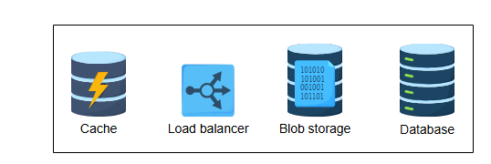

# Требования к дизайну Yelp

Узнайте о требованиях к сервису поиска поблизости, такому как Yelp.

---

## Требования

Давайте определим требования к нашей системе.

### Функциональные требования

Функциональные требования к нашей системе следующие:

*   **Учетные записи пользователей**: У пользователей будут учетные записи, где они смогут выполнять различные действия, такие как вход, выход, добавление, удаление и обновление информации о местах.
    > **Примечание:** Может быть два типа пользователей: владельцы бизнеса, которые могут добавлять свои заведения на платформу, и другие пользователи, которые могут искать, просматривать и оценивать места.
*   **Поиск**: Пользователи должны иметь возможность искать близлежащие места или достопримечательности на основе их GPS-местоположения (долгота, широта) и/или названия места.
*   **Обратная связь**: Пользователи должны иметь возможность добавлять отзывы о месте. Отзыв может состоять из изображений, текста и оценки.

*(Функциональные требования)*

### Нефункциональные требования

Нефункциональные требования к нашей системе:

*   **Высокая доступность (High availability)**: Система должна быть высокодоступной для пользователей.
*   **Масштабируемость (Scalability)**: Система должна иметь возможность масштабироваться в зависимости от количества запросов. Количество запросов может варьироваться в зависимости от времени и дня. Например, в обеденное время обычно больше поисковых запросов, чем в полночь. Аналогично, во время туристического сезона наша система будет получать больше запросов.
*   **Согласованность (Consistency)**: Система должна быть согласованной для пользователей. Все пользователи должны иметь одинаковое представление данных о местах, отзывах и изображениях.
*   **Производительность (Performance)**: При поиске система должна отвечать предложениями с минимальной задержкой.

## Оценка ресурсов

Давайте предположим, что у нас есть:

*   Всего 178 миллионов уникальных пользователей.
*   60 миллионов ежедневно активных пользователей.
*   500 миллионов заведений (мест).

### Оценка количества серверов

Используя наше допущение о том, что количество ежедневно активных пользователей является примерным количеством запросов в секунду, мы получаем 60 миллионов запросов в секунду. Затем мы используем следующую формулу для расчета количества серверов:

`Серверы_в_пиковой_нагрузке = Количество_запросов_в_секунду / RPS_сервера`

Используя 64,000 как предполагаемое количество запросов в секунду (RPS), которое может обработать один сервер, необходимое количество серверов в пиковые моменты оценивается следующим образом:

`Серверы_в_пиковой_нагрузке = 60,000,000 / 64,000 = 937.5 ≈ 1000 серверов`

*(Количество серверов, необходимых для Yelp)*

### Оценка хранения данных

Давайте рассчитаем необходимый объем хранилища для наших данных. Сделаем следующие предположения:
*   У нас 500 миллионов заведений.
*   Для каждого заведения нам нужно 1,296 байт хранилища.
*   К каждому заведению прикреплена одна фотография, итого 500 миллионов фотографий.
*   Для каждой фотографии нам нужно 280 байт хранилища (имеется в виду размер строки в таблице, содержащей ссылку на фактическое фото в blob-хранилище).
*   Ежедневно добавляется не менее 1 миллиона отзывов.
*   Для каждого отзыва нам нужно 537 байт.
*   У нас 178 миллионов пользователей.
*   Для каждого пользователя нам нужно 264 байта.

**Таблица: Оценка требований к хранилищу**

| Тип информации        | Размер одной записи (байт) | Количество (млн) | Общий размер (ГБ) |
|:----------------------|:---------------------------|:-----------------|:------------------|
| Заведение             | 1296                       | 500              | 648               |
| Фото                  | 280                        | 500              | 140               |
| Отзыв (за день)       | 537                        | 1                | 0.54              |
| Пользователь          | 264                        | 178              | 46.99             |
| **Общий объем**         |                            |                  | **835.53**        |

*(Общий объем хранилища, необходимый для Yelp)*

> **Примечание:** Оценка в 0.54 ГБ для отзывов относится только к отзывам за один день. Для долгосрочного хранения в течение 10 лет нам нужно умножить это значение на количество дней (365×10), что дает примерно 2 ТБ. Это также увеличит общий объем хранилища примерно до 2.8 ТБ.

### Оценка пропускной способности

Для оценки требований к пропускной способности мы разделим расчет на входящий и исходящий трафик.

**Входящий трафик**, предположим следующее:
*   В среднем ежедневно добавляется 5 новых заведений.
*   Каждое заведение занимает 1,296 байт.
*   К каждому заведению прикрепляется фото размером 3 МБ.
*   Ежедневно добавляется 1 миллион отзывов, каждый по 537 байт.

**Таблица: Оценка требований к входящей пропускной способности**

| Параметр                                         | Значение                                      |
|:-------------------------------------------------|:----------------------------------------------|
| Среднее кол-во добавляемых заведений в день      | 5                                             |
| Общий размер информации о заведениях (байты/день) | 15,006,480 (включая фото по 3 МБ)             |
| Среднее кол-во отзывов в день (млн)              | 1                                             |
| Общий размер отзывов (байты/день)                  | 537,000,000                                   |
| **Общая входящая пропускная способность (Кбит/с)** | **51.12**                                     |

**Исходящий трафик**, предположим следующее:
*   Один поиск в среднем возвращает 20 заведений.
*   Каждое заведение имеет одно фото среднего размера 3 МБ.
*   Каждая возвращаемая запись содержит информацию о заведении и фото.

**Таблица: Оценка требований к исходящей пропускной способности**

| Параметр                                        | Значение                                    |
|:------------------------------------------------|:--------------------------------------------|
| Среднее кол-во заведений в ответе на запрос     | 20                                          |
| Общий размер информации в ответе (байты)        | 60,025,920 (включая фото по 3 МБ)           |
| Ежедневно активных пользователей (млн)          | 60                                          |
| **Общая исходящая пропускная способность (Гбит/с)** | **331.2**                                   |

Общие требования к пропускной способности = `51 Кбит/с + 331 Гбит/с ≈ 331 Гбит/с`.

*(Общая пропускная способность, необходимая для Yelp)*

## Строительные блоки, которые мы будем использовать

Процесс проектирования Yelp использует множество строительных блоков, которые уже обсуждались. Мы будем учитывать следующие концепции при проектировании Yelp:

*   **Кэширование**: Мы будем использовать кэш для хранения информации о популярных местах.
*   **Балансировщик нагрузки**: Мы будем использовать балансировщик нагрузки для управления большим количеством запросов.
*   **Blob-хранилище**: Мы будем хранить изображения в blob-хранилище.
*   **База данных**: Мы будем хранить информацию о местах и пользователях в базе данных.

Мы также будем опираться на дизайн **Google Maps** для понимания функции поиска мест в определенном радиусе.
