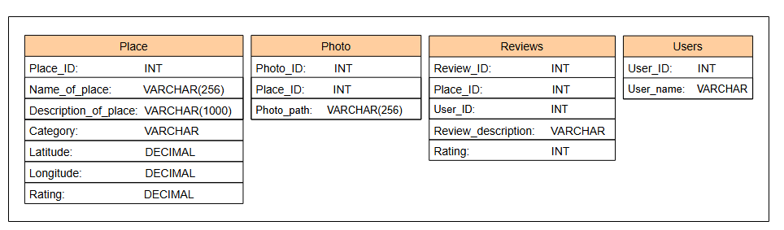
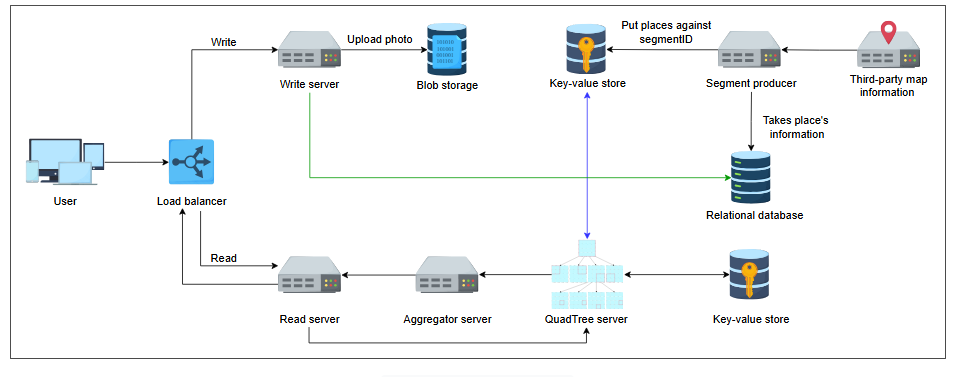

# Дизайн Yelp

Научитесь выполнять требования к дизайну системы Yelp.

---

В предыдущем уроке мы определили требования и рассчитали оценки для нашей системы Yelp. В этом уроке мы обсудим дизайн API, рассмотрим схему хранения данных, а затем углубимся в детали строительных блоков системы и дополнительных компонентов.

## Дизайн API

Давайте обсудим дизайн API для Yelp.

### Поиск

Нам нужно реализовать функцию `search`. Вызов API для поиска по категориям, таким как «кафе», будет выглядеть так:

`search(category, user_location, radius)`

| Параметр | Описание |
|---|---|
| `category` | Это тип поиска, который выполняет пользователь, например, поиск ресторанов, кинотеатров, кафе и т.д. |
| `user_location` | Содержит местоположение пользователя, который ищет в Yelp. |
| `radius` | Это указанный радиус, в котором пользователь пытается найти требуемую категорию. |

Этот процесс возвращает JSON-объект, содержащий список всех возможных объектов в указанной категории, которые также находятся в указанном радиусе. Каждая запись содержит название места, адрес, категорию, рейтинг и миниатюру.

Вызов API для поиска по названию места, например, «Burger Hut», будет таким:

`search(name_of_place, user_location, radius)`

| Параметр | Описание |
|---|---|
| `name_of_place` | Содержит название места, которое пользователь хочет найти. |

Этот процесс возвращает JSON-объект, содержащий информацию об указанном месте.

### Добавление места

Вызов API для добавления места:

`add_place(name_of_place, description_of_place, category, latitude, longitude, photo)`

| Параметр | Описание |
|---|---|
| `name_of_place` | Содержит название места, например, "Burger Hut". |
| `description_of_place` | Содержит описание места, например, "В Burger Hut продаются самые вкусные бургеры". |
| `category` | Указывает категорию места, например, "кафе". |
| `latitude` | Сообщает широту места. |
| `longitude` | Сообщает долготу места. |
| `photo` | Содержит фотографии места. Может быть одна или несколько фотографий. |

Этот процесс возвращает ответ, сообщающий, что место было добавлено, или соответствующую ошибку, если добавить место не удалось.

### Добавление отзыва

Вызов API для добавления отзыва:

`add_review(place_ID, user_ID, review_description, rating)`

| Параметр | Описание |
|---|---|
| `place_ID` | Содержит ID места, отзыв о котором добавляется. |
| `user_ID` | Содержит ID пользователя, который добавляет отзыв. |
| `review_description` | Содержит текст отзыва о месте, например, "еда и атмосфера были превосходны". |
| `rating` | Содержит оценку места, например, 4 из 5. |

Этот процесс возвращает ответ о том, что отзыв был добавлен, или соответствующую ошибку.

## Схема хранения данных

Давайте определим схему хранения для нашей системы. Нам могут понадобиться таблицы «Place», «Photos», «Reviews» и «Users».

**Таблица "Place" (Место):**
*   **Place_ID**: 8 байт
*   **Name_of_Place**: 256 байт
*   **Description_of_Place**: 1000 байт
*   **Category**: 8 байт
*   **Latitude**: 8 байт
*   **Longitude**: 8 байт
*   **Rating**: 1 байт
*   **Общий размер**: 1289 байт

**Таблица "Photos" (Фотографии):**
*   **Photo_ID**: 8 байт
*   **Place_ID**: 8 байт (внешний ключ)
*   **Photo_path**: 256 байт (путь к фото в blob-хранилище)
*   **Общий размер**: 280 байт

**Таблица "Reviews" (Отзывы):**
*   **Review_ID**: 8 байт
*   **Place_ID**: 8 байт (внешний ключ)
*   **User_ID**: 8 байт (внешний ключ)
*   **Review_description**: 512 байт
*   **Rating**: 1 байт
*   **Общий размер**: 537 байт

**Таблица "Users" (Пользователи):**
*   **User_ID**: 8 байт
*   **User_name**: 256 байт
*   **Общий размер**: 264 байта

*(Схема хранения данных)*

## Дизайн

Теперь мы обсудим отдельные строительные блоки и компоненты, используемые в дизайне Yelp, и то, как они взаимодействуют для выполнения различных функциональных требований.

### Компоненты

Вот компоненты нашей системы:

*   **Segments producer (Создатель сегментов)**: Этот компонент отвечает за взаимодействие со сторонними картографическими сервисами. Он берет эти данные и делит мир на меньшие регионы, называемые сегментами.
*   **QuadTree servers (Серверы QuadTree)**: Это набор серверов, на которых хранятся деревья, содержащие места в сегментах. Сервер QuadTree находит список мест на основе заданного радиуса и местоположения пользователя.
*   **Aggregators (Агрегаторы)**: QuadTree-серверы собирают все места и отправляют их агрегаторам, которые объединяют результаты и возвращают их пользователю.
*   **Read servers (Серверы чтения)**: Мы используем набор серверов для обработки всех запросов на чтение, поскольку их гораздо больше, чем запросов на запись.
*   **Write server (Сервер записи)**: Мы используем набор серверов для обработки всех запросов на запись (добавление места, отзыва и т.д.).
*   **Storage (Хранилище)**: Мы будем использовать два типа хранилищ:
    *   **SQL база данных**: Для хранения реляционных данных, таких как пользователи, места, отзывы. Это обеспечивает согласованность данных.
    *   **Key-value stores (Хранилища "ключ-значение")**: Для эффективного извлечения мест в сегменте и хранения данных QuadTree.
*   **Load balancer (Балансировщик нагрузки)**: Распределяет входящие запросы пользователей по всем серверам.

*(Детальный дизайн Yelp)*

### Рабочий процесс

*   **Поиск места**: Балансировщики нагрузки направляют запросы на чтение на серверы чтения. Серверы чтения обращаются к серверам QuadTree для поиска мест в заданном радиусе. Серверы QuadTree отправляют результаты агрегаторам для уточнения и отправки пользователю.
*   **Добавление места или отзыва**: Балансировщики нагрузки направляют запросы на запись на серверы записи. Серверы записи добавляют запись в реляционную базу данных и помещают все связанные изображения в blob-хранилище.
*   **Создание сегментов**: Создатель сегментов делит карту мира на меньшие сегменты. Места внутри каждого сегмента хранятся в хранилище «ключ-значение». Этот процесс периодически повторяется для добавления новых сегментов и мест (например, раз в месяц).

Мы обсудили дизайн Yelp, его API и соответствующую схему хранения. В следующем уроке мы поговорим об особенностях дизайна.
