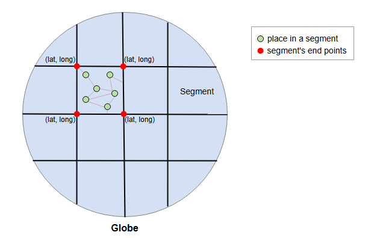
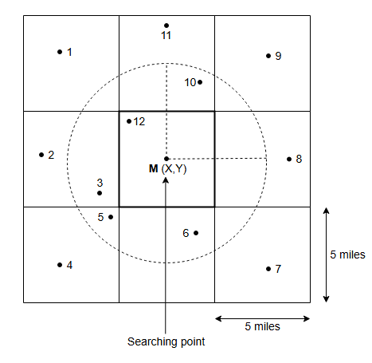
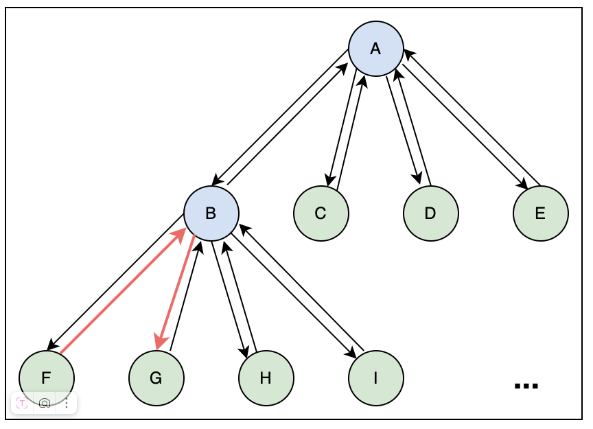
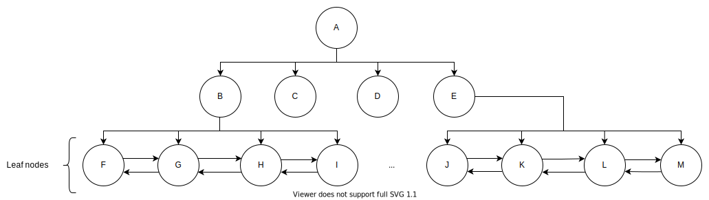
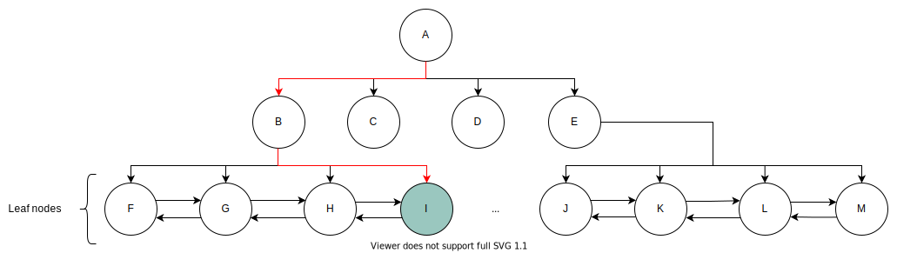
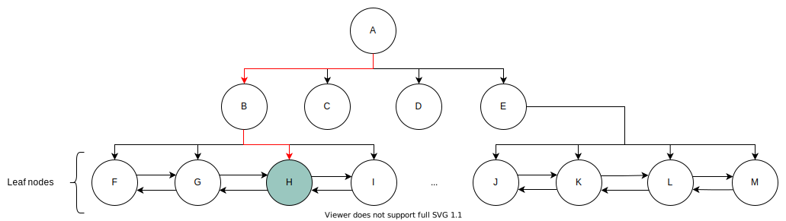
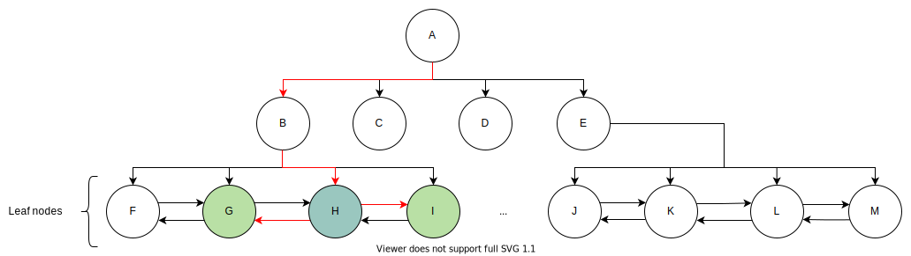
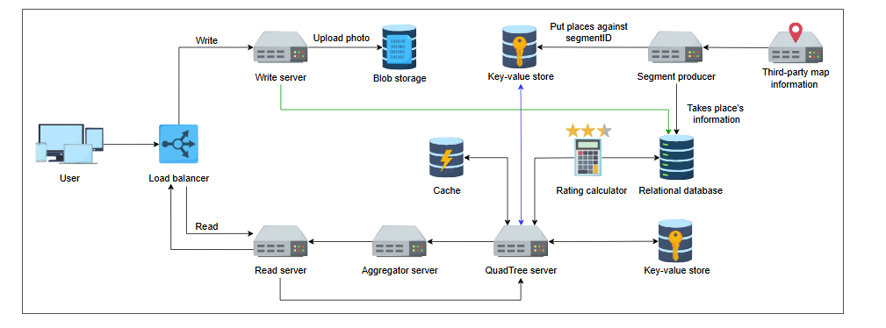

# Особенности дизайна Yelp

Узнайте о различных аспектах дизайна системы Yelp.

## Введение

В предыдущем уроке мы обсудили дизайн, строительные блоки, компоненты и весь рабочий процесс нашей системы, что подняло ряд интересных
вопросов, на которые теперь нужно ответить. Например, какой подход мы используем для поиска мест, или как мы ранжируем места на основе их
популярности? Этот урок рассматривает важные аспекты дизайна, подобные тем, что мы только что упомянули. Таблица ниже подводит итоги целей
этого урока.

**Краткое содержание урока**

| Раздел/Подраздел                                   | Цель                                                                                                                                                      |
|:---------------------------------------------------|:----------------------------------------------------------------------------------------------------------------------------------------------------------|
| **Поиск**                                          | Этот процесс делит мир на сегменты для оптимизации поиска, чтобы можно было идентифицировать все близлежащие объекты в заданном местоположении и радиусе. |
| &nbsp;&nbsp;&nbsp;Хранение индексов                | Мы индексируем места для улучшения производительности запросов и оцениваем хранилище, необходимое для всех индексов.                                      |
| &nbsp;&nbsp;&nbsp;Поиск с использованием сегментов | Мы ищем все желаемые места, комбинируя сегменты.                                                                                                          |
| **Динамические сегменты**                          | Мы решаем ограничения статических сегментов с помощью динамических.                                                                                       |
| &nbsp;&nbsp;&nbsp;Поиск с использованием QuadTree  | Мы исследуем функциональность поиска с использованием QuadTree.                                                                                           |
| &nbsp;&nbsp;&nbsp;Оценка места для QuadTree        | Мы оцениваем хранилище, необходимое для QuadTree.                                                                                                         |
| &nbsp;&nbsp;&nbsp;Разделение данных                | Мы рассматриваем варианты, которые можно использовать для разделения данных.                                                                              |
| &nbsp;&nbsp;&nbsp;Обеспечение доступности          | Мы рассматриваем, как обеспечить доступность системы.                                                                                                     |
| &nbsp;&nbsp;&nbsp;Вставка нового места             | Мы рассматриваем, как будем вставлять место в QuadTree.                                                                                                   |
| &nbsp;&nbsp;&nbsp;Ранжирование популярных мест     | Мы ранжируем места в системе.                                                                                                                             |
| **Оценка**                                         | Мы оцениваем, как наша система выполняет нефункциональные требования.                                                                                     |

## Поиск

Из дизайна Google Maps мы узнали, как соединять сегменты и решать проблему масштабируемости для эффективной обработки большого графа. Мы
разделили весь мир на небольшие сегменты/подграфы для их одновременной обработки и запроса. Сегментация помогает нам улучшить
масштабируемость системы.

Каждый сегмент будет размером `5x5` миль и будет содержать список мест, которые в нем находятся. Мы ищем только в нескольких сегментах,
чтобы найти близлежащие пункты назначения.

*(Разделение земного шара на небольшие сегменты, где каждый сегмент имеет четыре координаты (широта, долгота) и все сегменты содержат
координаты различных мест)*

> 1. Как мы будем находить близлежащие места, если создадим таблицу для хранения всех мест?
> 

>  
<b>Показать</b>

>   Мы можем составить таблицу мест с уникальным идентификатором Place_ID и сохранить в ней каждое место. Столбцы долготы и широты помогают нам указать точное местоположение. Индексация обоих этих столбцов может помочь нам эффективно извлекать данные. Мы можем указать каждое местоположение в виде пары значений широты (M) и долготы (N). Мы также можем выполнить поиск места в пределах заданного радиуса R, найдя все места между широтами M-R и M+R и долготами N-R и N+R. Мы можем применить алгоритм Дейкстры, чтобы найти расстояние между двумя точками.
> 
   
>
> 2. Насколько эффективным будет наш поиск на основе таблицы?
> 

>  
<b>Показать</b>

>  У нас может быть несколько списков мест в пределах (M-R, M+R) и (N-R, N+R). Обработка одновременных запросов будет сложной задачей. Когда запросы, используемые для получения информации о местах, будут поступать с высокой скоростью для разных сегментов, это повлияет на время отклика и производительность.
> 
   

Мы можем хранить все места в таблице и однозначно идентифицировать сегмент по `segment_ID`. Мы можем проиндексировать каждый сегмент в базе
данных. Теперь, когда мы ограничили количество сегментов для поиска, запрос будет оптимизирован и быстро вернет результаты.

### Улучшение извлечения данных

Мы используем хранилище «ключ-значение» для быстрого доступа к местам в сегментах. Ключом является `segment_ID`, а `значение` содержит
список мест в этом сегменте. Давайте оценим, сколько места нам нужно для хранения индексов.

> Обычно мы можем хранить несколько МБ в значении хранилища «ключ-значение». Если предположить, что в каждом сегменте 500 мест, то это
> займет `500 × 1296 байт = 0.648 МБ`.

Общая площадь суши на Земле составляет около 60 миллионов квадратных миль. Если мы рассмотрим радиус в десять миль, у нас будет 6 миллионов
сегментов. Каждый сегмент будет идентифицироваться 8-байтным идентификатором.

**Калькулятор необходимой памяти:**

* Общая площадь Земли (млн кв. миль): 60
* Радиус поиска (мили): 10
* Количество сегментов (млн): 6
* `Segment_ID` (байты): 8
* `Place_ID` (байты): 8
* Количество мест (млн): 500
* **Общее необходимое пространство (ГБ): 4.048**

### Поиск с использованием сегментов

Пользователь может выбрать радиус для поиска мест, которые не находятся в одном сегменте. Поэтому нам нужно объединить несколько сегментов,
чтобы найти места в указанном радиусе.

Сначала мы ограничиваем количество сегментов. Это уменьшает размер графа и делает процесс поиска оптимизируемым. Затем мы идентифицируем все
релевантные местоположения, вычисляем расстояние от точки поиска и показываем его пользователю.

*(Поиск местоположений с использованием сегментов)*

> ### Вопрос на размышление
> 1. Можете ли вы определить проблему в текущем подходе?
> 

>  
<b>Показать</b>

>   Наши локации распределены по сегментам неравномерно, и такой подход может занять много времени при работе с большим количеством объектов. Например, в таком городе, как Нью-Йорк, у нас может быть много объектов даже в небольшом радиусе, потому что это густонаселенный район. А в менее населенных районах в том же радиусе может не хватить мест, и нам, возможно, придется расширить наш радиус, чтобы найти больше.
> 

## Динамические сегменты

Мы решаем проблему неравномерного распределения мест в сегменте, динамически изменяя их размер. Мы делаем это, ориентируясь на количество
мест. Мы разделяем сегмент на четыре новых, если количество мест достигает определенного предела. Мы принимаем 500 мест за наш предел. При
использовании этого подхода нам нужно решить следующие вопросы:

1. Как мы будем отображать сегменты?
2. Как мы будем соединяться с другими сегментами?

Мы используем **QuadTree (квадродерево)** для управления нашими сегментами. Каждый узел содержит информацию о сегменте. Если количество мест
превышает 500, мы разделяем этот сегмент на четыре дочерних узла и распределяем места между ними. Таким образом, листовые узлы будут теми
сегментами, которые нельзя разделить дальше. Каждый листовой узел также будет содержать список мест.

> Дерево квадрантов - это древовидная структура данных, в которой каждый внутренний узел имеет ровно четыре дочерних элемента. Деревья квадрантов являются двумерным аналогом октадеревьев и чаще всего используются для разбиения двумерного пространства путем рекурсивного разделения его на четыре квадранта или области. Данные, связанные с листовой ячейкой, различаются в зависимости от приложения, но листовая ячейка представляет собой “единицу интересной пространственной информации”

### Поиск с использованием QuadTree

Мы начинаем поиск с корневого узла и продолжаем посещать узлы, чтобы найти наш желаемый сегмент. Мы проверяем каждый узел, чтобы увидеть,
есть ли у него дочерние узлы. Если у узла больше нет дочерних элементов, мы прекращаем поиск, потому что этот узел является искомым. Мы
также соединяем каждый дочерний узел с его соседними узлами с помощью двусвязного списка. Все дочерние узлы всех родительских узлов
соединены через двусвязный список. Этот список позволяет нам находить соседние сегменты, когда мы можем двигаться вперед и назад в
соответствии с нашими требованиями. После идентификации сегментов у нас есть необходимые `PlaceID` мест, и мы можем запросить нашу базу
данных, чтобы найти более подробную информацию о них.

> Существует ли альтернативный подход для поиска соседних сегментов?
> 

>  
<b>Показать</b>

>   Мы можем использовать указатели родительских узлов, чтобы найти соседние сегменты. В каждом узле мы можем сохранить указатель, указывающий на родительский узел. Каждый родительский узел имеет указатели на свои дочерние узлы, поэтому мы можем использовать их для поиска соседних конечных узлов. Мы можем расширить наш поиск, перейдя по родительским указателям вверх.
>
> На следующем рисунке узел F может найти соседний узел G, сначала перейдя к родительскому узлу B, а затем к G.

> > 

1) Все конечные узлы в дереве квадрантов связаны, как в двусвязном списке
   

2) Мы искали кафе и нашли требуемое количество кафе — скажем, 20 — в том же конечном узле, поэтому не нужно перебирать какие-либо другие
   узлы
   

3) Мы искали кафе, но нашли только, скажем, шесть кафе в конечном узле
   

4) Конечный узел будет исследовать соседние узлы, чтобы найти больше кафе.
   

### Оценка места для хранения QuadTree

Давайте рассчитаем хранилище, необходимое для хранения QuadTree:

* Мы храним `PlaceID`, `Latitude` и `Longitude` для каждого места в узле. Каждое из этих значений имеет размер 8 байт. Для 500 миллионов
  мест нам понадобится: `(8+8+8) × 10^6 × 500 = 12 ГБ`.
* У нас будет 500 мест в одном узле. Таким образом, для 500 миллионов мест нам понадобится `500M / 500 = 1M` листовых узлов.
* QuadTree с 1 миллионом листовых узлов имеет примерно 1/3 внутренних узлов от числа листовых. Каждый внутренний узел имеет четыре указателя
  на дочерние узлы. Если мы предположим 8 байт для каждого указателя, то нам понадобится `1M * 1/3 * 4 * 8 = 10.67 МБ` места для внутренних
  узлов.
* Мы можем получить общее пространство, необходимое для хранения всех узлов, сложив `12 ГБ` и `10.67 МБ`, что составляет
  примерно `12.01 ГБ`.

### Разделение данных

Учитывая 20% ежегодного роста, количество мест будет увеличиваться. Мы можем разделять данные на следующей основе:

1. **Регионы**: Мы можем разделить наши места на регионы на основе почтовых индексов. Это может привести к перегрузке сервера для популярных
   регионов.
2. **`PlaceID`**: Мы можем разделять данные на основе `PlaceID`, чтобы избежать перегрузки. Мы будем использовать хранилище «ключ-значение»,
   где ключ — это `PlaceID`, а значение — сервер, на котором хранится это место. Мы выберем этот вариант.

### Обеспечение доступности

Рассмотрим сценарий, когда несколько человек в одном радиусе отправляют поисковый запрос. Если у нас один QuadTree, это повлияет на
доступность. Чтобы решить эту проблему, мы реплицируем наши QuadTree на нескольких серверах.

> Как подход "лидер-последователь" поможет нам в репликации?
> 

>  
<b>Показать</b>

>   У нас будет один ведущий и два подписчика. У ведущего будет дерево квадрантов, и он будет обрабатывать все запросы на запись. Он будет синхронно информировать подписчиков о любых изменениях, внесенных в деревья квадрантов, поэтому будет возможность задержки. Подписчики будут обрабатывать все запросы на чтение. В случае, если подписчик умрет, мы выберем другого подписчика и скопируем ему данные. Если ведущий не работает, мы выберем любого из подписчиков, который займет его место. Таким образом, мы сможем реплицировать наши квадранты на три сервера.
> 

### Вставка нового места

Мы вставляем новое место как в базу данных, так и в наш QuadTree. Мы находим сегмент для нового места, и если QuadTree распределен по разным
серверам, мы добавляем его в этот сегмент. При необходимости мы разделяем сегмент и соответствующим образом обновляем QuadTree.

### Ранжирование популярных мест

Нам нужен сервис, **калькулятор рейтинга**, который вычисляет общий рейтинг заведения. Мы можем хранить рейтинг места в базе данных, а также
в QuadTree вместе с ID, широтой и долготой. QuadTree возвращает топ-50 или топ-100 популярных мест в заданном радиусе. **Сервис-агрегатор**
определяет фактические лучшие места и возвращает их пользователю.
> **Примечание:** Мы не ожидаем, что рейтинг будет обновляться ежечасно, так как такие частые изменения в QuadTree или базах данных могут
> быть дорогостоящими. Мы обновляем их раз в день, когда нагрузка минимальна.

## Итоговый дизайн

Мы добавили несколько новых компонентов в наш дизайн. Мы ввели кэши для хранения популярных мест. Это позволяет нам извлекать места гораздо
быстрее. Кроме того, мы добавили калькулятор рейтинга, который сортирует места по их рейтингам. Это улучшит пользовательский опыт.

*(Подпись к изображению: Обновленный детальный дизайн Yelp)*

## Оценка

* **Доступность**: Мы разделили данные на небольшие сегменты и реплицировали данные QuadTree для обеспечения высокой доступности.
* **Масштабируемость**: Мы разделили мир на небольшие динамические сегменты и использовали QuadTree, что сделало систему масштабируемой.
* **Производительность**: Мы сократили задержку за счет использования кэшей для популярных мест.
* **Согласованность**: Пользователи имеют согласованное представление данных благодаря использованию надежных баз данных.

### Интерактивный вопрос

В предыдущем уроке мы выбрали **SQL базу данных** и **хранилище «ключ-значение»** для дизайна Yelp. Как замена SQL на NoSQL повлияет на
дизайн? Обсудите влияние на нефункциональные требования, такие как масштабируемость и согласованность. Также обсудите гибкость схемы и
влияние на производительность сложных запросов.

> 

>  
<b>Показать</b>

> Замена SQL на NoSQL в системе Yelp значительно влияет на нефункциональные требования. Базы данных NoSQL превосходно справляются с масштабируемостью, обеспечивая горизонтальное масштабирование для обработки больших объемов данных и высокого трафика, что повышает общую масштабируемость системы. Однако они часто отдают приоритет доступности и устойчивости к разделению сети (partition tolerance) перед строгой согласованностью данных (consistency), что приводит к моделям конечной согласованности (eventual consistency), которые могут вызывать временные несоответствия данных — это необходимо учитывать, если точность в реальном времени является критически важной.
>
> Гибкость схемы — еще одно преимущество, позволяющее использовать динамические модели данных без заранее определенных схем, которые могут легко адаптироваться по мере развития системы. С другой стороны, сложные запросы, такие как объединение (joining) нескольких таблиц или выполнение детального анализа данных, как правило, менее эффективны в NoSQL по сравнению с базами данных SQL, которые оптимизированы для таких операций.
>
> > 

## Заключение

Серверы на основе близости позволяют пользователю искать определенное место или места поблизости. Данные карты мира огромны, и их разделение
на сегменты и поиск нужного сегмента были сложной задачей. Мы использовали QuadTree для оптимизации нашего поиска и предоставления
пользователю списка мест с минимальной задержкой.

