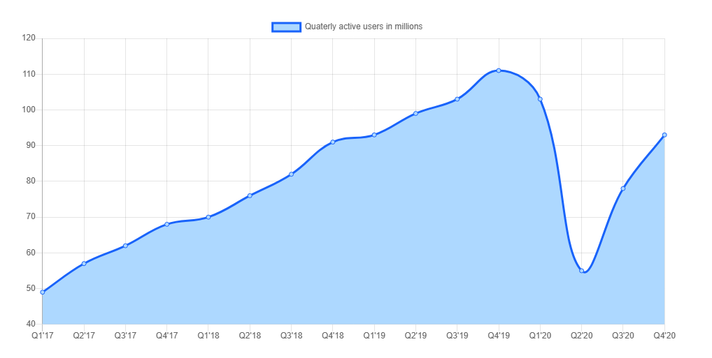

# Проектирование систем: Uber

Узнайте об основах проектирования сервиса Uber.

## Что такое Uber?

**Uber** — это приложение, предоставляющее своим пользователям услуги по вызову такси. Любой, кому нужна поездка, может зарегистрироваться и заказать автомобиль для поездки из пункта А в пункт Б. Любой, у кого есть автомобиль, может зарегистрироваться в качестве водителя и возить пассажиров к месту назначения. Водители и пассажиры могут общаться через приложение Uber на своих смартфонах.

1) Пользователь запрашивает поездку
   

2) Водители, находящиеся поблизости, получают запрос; один из них принимает его
   

3) Выбранный водитель заберет пользователя из указанного места.
   

4) Водитель движется в направлении желаемого пункта назначения.
   

5) Водитель высаживает пользователя, завершает поездку и получает оплату
   

На иллюстрации ниже показано количество активных пользователей Uber с начала 2017 по 2020 год (источник: Statista):

Ежемесячное количество активных пользователей Uber по всему миру с 2017 по 2020 год (по кварталам).

> Давайте оценим ваше понимание функциональных и нефункциональных требований к Uber. Определите **три функциональных и три нефункциональных требования** для Uber в виджете ниже. Обоснуйте необходимость каждого требования в одной строке.
> 

>  
<b>Показать ответ</b>

>
>   Для Uber функциональные требования включают в себя такие вещи, как запрос поездки, обновление местоположения водителя и управление платежами. Нефункциональные требования могут касаться надежности, масштабируемости и безопасности системы.
> 

## Как мы будем проектировать Uber?

Существует много вопросов без ответов относительно Uber. Как это работает? Как водители связываются с пассажирами? Это лишь два из многих вопросов. В этой главе мы спроектируем систему, подобную Uber, и найдем ответы на такие вопросы.

Мы разделили проектирование Uber на шесть разделов:

1.  **Требования**: В этом уроке будут описаны функциональные и нефункциональные требования к системе, подобной Uber. Мы также оценим потребности в различных аспектах Uber, таких как хранилище, пропускная способность и вычислительные ресурсы.
2.  **Высокоуровневое проектирование**: В этом уроке мы обсудим высокоуровневое проектирование Uber. Кроме того, мы кратко объясним дизайн API сервиса Uber.
3.  **Детальное проектирование**: В этом уроке мы рассмотрим детальное проектирование Uber. Более того, мы также обсудим работу различных компонентов, используемых при проектировании Uber.
4.  **Платежный сервис и обнаружение мошенничества**: Мы узнаем, как работает платежная система в Uber. Кроме того, мы обсудим, как можно выявлять различные мошенничества, связанные с платежами в системах, подобных Uber.
5.  **Оценка**: В этом уроке будет объяснено, как Uber может выполнить все нефункциональные требования с помощью предложенного дизайна.
6.  **Викторина**: Мы закрепим основные концепции проектирования Uber с помощью викторины.

Давайте перейдем к требованиям для проектирования системы, подобной Uber, в следующем уроке.
