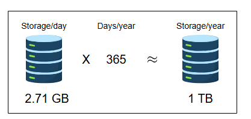
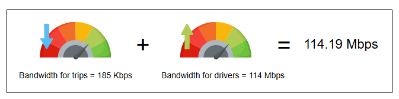
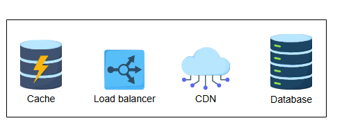

# Требования к дизайну Uber

Узнайте о требованиях к проектированию сервиса Uber.

## Требования

Давайте начнем с требований к проектированию системы, подобной Uber.

### Функциональные требования

Функциональные требования нашей системы следующие:

*   **Обновление местоположения водителя**: Водитель — это движущийся объект, поэтому его местоположение должно автоматически обновляться через регулярные промежутки времени.
*   **Поиск ближайших водителей**: Система должна находить и показывать пассажиру ближайших доступных водителей.
*   **Запрос поездки**: Пассажир должен иметь возможность запросить поездку, после чего ближайший водитель должен быть уведомлен о запросе пассажира.
*   **Управление платежами**: В начале поездки система должна инициировать процесс оплаты и управлять платежами.
*   **Показ предполагаемого времени прибытия (ETA) водителя**: Пассажир должен видеть предполагаемое время прибытия водителя.
*   **Подтверждение посадки**: Водители должны иметь возможность подтвердить, что они забрали пассажира.
*   **Показ обновлений о поездке**: Как только водитель и пассажир соглашаются на поездку, они должны постоянно видеть обновления, такие как ETA и текущее местоположение, до завершения поездки.
*   **Завершение поездки**: Водитель по прибытии в пункт назначения отмечает поездку как завершенную, после чего становится доступным для следующей поездки.

---
**Вопрос на размышление**

1.  Что, если два водителя находятся на одинаковом расстоянии от пассажира? Как мы выберем водителя, которому отправим запрос?

> 

>  
<b>Показать ответ</b>

>
>    Это решение будет приниматься на основе нескольких факторов, таких как расстояние, тип транспортного средства, рейтинг водителя и так далее. Тем не менее, если два водителя идентичны, мы можем случайным образом выбрать одного и отправить запрос этому водителю. Если один водитель не принимает поездку в течение нескольких секунд, мы отзываем предложение у этого водителя и предлагаем его новому.
> 

---

### Нефункциональные требования

Нефункциональные требования нашей системы следующие:

*   **Доступность (Availability)**: Система должна быть высокодоступной. Простой даже на долю секунды может привести к сбою поездки, к тому, что водитель не сможет найти пассажира, или пассажир не сможет связаться с водителем.
*   **Масштабируемость (Scaleability)**: Система должна быть масштабируемой, чтобы справляться с постоянно растущим числом водителей и пассажиров.
*   **Надежность (Reliability)**: Система должна предоставлять быстрые и безошибочные услуги. Запросы на поездки и обновления местоположения должны происходить без сбоев.
*   **Согласованность (Consistency)**: Система должна быть строго согласованной. Водители и пассажиры в одном районе должны иметь одинаковое представление о состоянии системы.
*   **Обнаружение мошенничества (Fraud Detection)**: Система должна иметь возможность обнаруживать любую мошенническую деятельность, связанную с оплатой.

## Оценка ресурсов

Теперь давайте оценим ресурсы для нашего дизайна. Предположим, у нас около 500 миллионов пассажиров и около пяти миллионов водителей. Для наших оценок мы будем использовать следующие цифры:

*   У нас 20 миллионов ежедневно активных пассажиров и три миллиона ежедневно активных водителей.
*   У нас 20 миллионов поездок в день.
*   Все активные водители отправляют уведомление о своем текущем местоположении каждые четыре секунды.

### Оценка хранения данных

Давайте оценим требуемый объем для хранения данных нашей системы:

#### Метаданные пассажира

Предположим, нам нужно около 1000 байт для хранения информации о каждом пассажире (ID, имя, email и т.д.). Для хранения 500 миллионов пассажиров нам потребуется 500 ГБ:
`500 × 10^6 × 1000 = 500 ГБ`
Кроме того, если у нас ежедневно регистрируется около 500 000 новых пассажиров, нам понадобится еще 500 МБ для их хранения.

#### Метаданные водителя

Предположим, нам нужно около 1000 байт для хранения информации о каждом водителе (ID, имя, email, тип автомобиля и т.д.). Для хранения пяти миллионов водителей нам потребуется 5 ГБ:
`5 × 10^6 × 1000 = 5 ГБ`
Кроме того, если у нас ежедневно регистрируется около 100 000 новых водителей, нам понадобится около 100 МБ для их хранения.

#### Метаданные о местоположении водителя

Предположим, нам нужно около 36 байт для хранения обновлений о местоположении водителя. Если у нас три миллиона водителей, нам потребуется около 108 МБ только для хранения их местоположений.

#### Метаданные о поездке

Предположим, нам нужно около 100 байт для хранения информации об одной поездке (ID поездки, ID пассажира, ID водителя и т.д.). Если у нас 20 миллионов поездок в день, нам потребуется около 2 ГБ для данных о поездках.

Давайте рассчитаем общий объем хранения, необходимый для Uber за один день:

**Оценка требуемого объема хранения (за день)**
*   Общее хранилище для местоположений водителей: 108 МБ
*   Общее хранилище для поездок: 2 ГБ
*   Хранилище для новых пассажиров: 500 МБ
*   Хранилище для новых водителей: 100 МБ
*   **Итоговый объем хранения (в день): 2.71 ГБ**

**Примечание:** Мы можем изменять значения в таблице, чтобы увидеть, как меняются оценки.

### Оценка пропускной способности

Мы будем учитывать только обновления местоположения водителей и данные о поездках для расчета пропускной способности, так как другие факторы не требуют значительной пропускной способности. У нас 20 миллионов поездок в день, что означает примерно 232 поездки в секунду.

`20,000,000 / 86,400 ≈ 232 поездки в секунду`

Каждая поездка занимает около 100 байт. Таким образом, это требует около 23 КБ/с пропускной способности.

`232 × 100 = 23 КБ × 8 = 185 кбит/с`

Как уже говорилось, местоположение водителя обновляется каждые четыре секунды. Если мы получаем ID водителя (3 байта) и местоположение (16 байт), наше приложение будет использовать следующую пропускную способность:

`(3М активных водителей × (3 + 16) Байт) / 4с = 114 Мбит/с`

Эти требования к пропускной способности скромны, потому что мы не включили потребности в пропускной способности для карт и других компонентов, которые присутствуют в реальном сервисе Uber.

**Оценка требуемой пропускной способности**
*   Общая пропускная способность для поездок: 185.6 кбит/с
*   Пропускная способность для водителей: 114 Мбит/с
*   **Общая пропускная способность: 114.19 Мбит/с**

*(Общая пропускная способность, требуемая Uber)*

**Примечание:** Мы проигнорировали пропускную способность от сервиса Uber к пользователям, так как она очень мала. Больше пропускной способности потребуется для отправки данных карт от сервиса Uber пользователям, что мы также обсуждали в главе о Google Maps.

### Оценка количества серверов

Предположим, у нас 20 миллионов ежедневно активных пассажиров и три миллиона ежедневно активных водителей, что в сумме составляет 23 миллиона ежедневно активных пользователей. Учитывая наше допущение об использовании ежедневно активных пользователей в качестве прокси для количества запросов в секунду в пиковые часы, мы получаем 23 миллиона запросов в секунду. Затем мы используем следующую формулу для расчета количества серверов:

`Необходимое количество серверов в пик нагрузки = (Количество запросов в секунду) / (RPS одного сервера)`

Используя 64 000 в качестве оценочного RPS, который может обработать сервер, необходимое количество серверов оценивается следующим образом:

`Необходимое количество серверов = 23,000,000 / 64,000 ≈ 360 серверов`

*(Количество серверов, необходимое для сервиса Uber)*

## Компоненты, которые мы будем использовать

Дизайн Uber использует следующие компоненты:

*(Компоненты в высокоуровневом дизайне Uber)*

*   **Кэш** хранит наиболее запрашиваемые данные для быстрых ответов.
*   **Балансировщик нагрузки** распределяет запросы на чтение/запись между соответствующими сервисами.
*   **CDN (сети доставки контента)** используются для эффективной доставки контента конечным пользователям, уменьшая задержку и нагрузку на конечные серверы.
*   **Базы данных** хранят метаданные пассажиров, водителей и поездок.

Устройства пассажиров и водителей должны иметь достаточную пропускную способность и GPS-оборудование для плавной навигации с картами.
