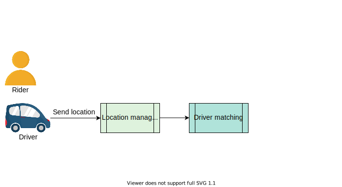
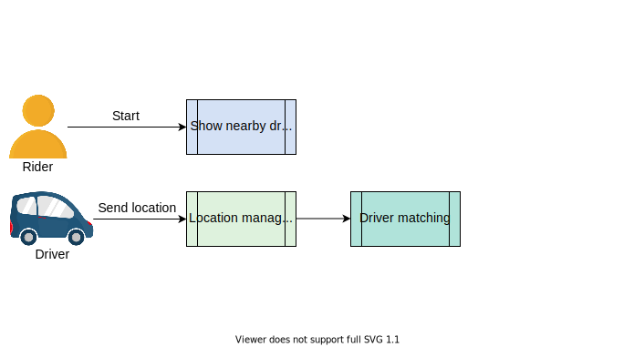
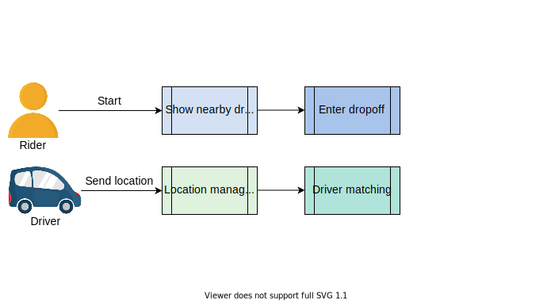
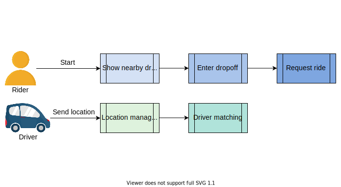
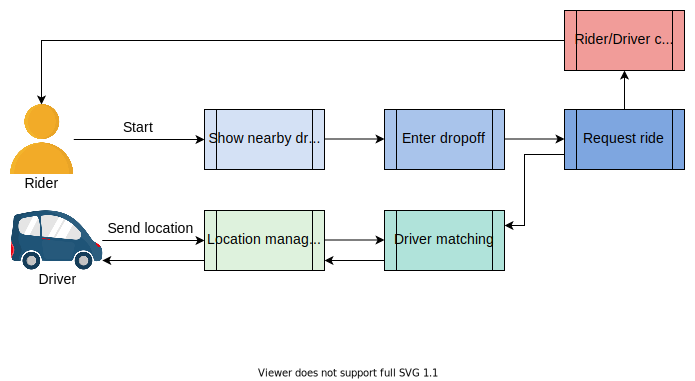
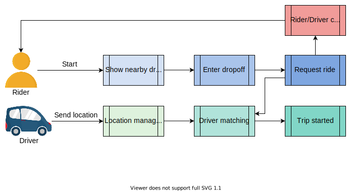
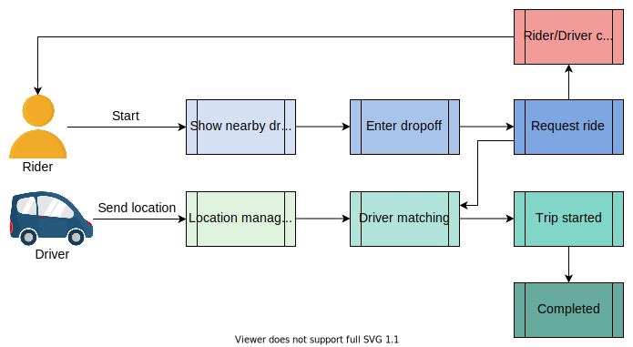
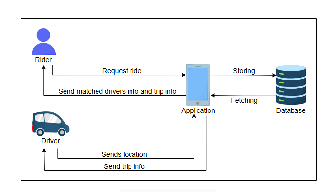

# Высокоуровневое проектирование Uber

Узнайте, как спроектировать систему Uber.

## Рабочий процесс нашего приложения

Прежде чем углубляться в проектирование, давайте разберемся, как работает наше приложение. Следующие шаги показывают рабочий процесс нашего приложения:

1.  Когда пассажир запускает наше приложение, он видит всех ближайших водителей, за исключением тех, кто уже выполняет поездки.
2.  Пассажир вводит место высадки и запрашивает поездку.
3.  Приложение получает запрос и находит подходящего водителя.
4.  До тех пор, пока не будет найден подходящий водитель, статус будет «Ожидание ответа водителя».
5.  Водители сообщают о своем местоположении каждые четыре секунды. Приложение находит информацию о поездке и возвращает ее водителю.
6.  Водитель принимает или отклоняет запрос:
    *   Водитель принимает запрос, и информация о статусе изменяется в приложениях как пассажира, так и водителя. Пассажир видит, что ему успешно нашли водителя, и получает информацию о нем.
    *   Водитель отклоняет запрос на поездку. Пассажир снова начинает с шага 2, и происходит повторный поиск другого водителя.

1) Пассажир еще не открыл приложение. Водитель постоянно обновляет свое местоположение.
   


2) Пассажир видит ближайших водителей, когда открывает приложение.
   


3) Пассажир вводит место высадки.
   


4) Пассажир запрашивает поездку.
   


5) Водитель получает запрос. На этом этапе пассажир или водитель могут отменить запрос.
   


6) Водитель принимает запрос и начинает поездку.
   


7) Поездка завершена
   

## Высокоуровневое проектирование Uber

На высоком уровне наша система должна уметь принимать запросы на поездку от пассажира и возвращать пассажиру информацию о найденном водителе и поездке. Она также регулярно получает местоположение водителя. Кроме того, она возвращает информацию о поездке и пассажире водителю, когда водитель назначен на поездку.



*(Высокоуровневое проектирование Uber)*

## Проектирование API

Давайте обсудим дизайн API в соответствии с предоставляемыми нами функциями. Мы спроектируем API, чтобы перевести наш набор функций в технические спецификации.

Мы не будем повторять описание повторяющихся параметров в следующих API.

### Обновление местоположения водителя

```
updateDriverLocation(driverID, oldlat, oldlong, newlat, newlong)
```

| Параметр    | Описание                                 |
|-------------|------------------------------------------|
| `driverID`  | ID водителя                              |
| `oldlat`    | Предыдущая широта водителя               |
| `oldlong`   | Предыдущая долгота водителя              |
| `newlat`    | Новая широта водителя                    |
| `newlong`   | Новая долгота водителя                   |

API `updateDriverLocation` используется для отправки координат водителя на серверы местоположения водителей. Здесь обновляется местоположение водителя и сообщается пассажирам. Отправка `oldlat` и `oldlong` в вызове API упрощает логику на стороне сервера, уменьшая необходимость извлекать эти данные из базы данных. Это также позволяет сервису отслеживать фактический пройденный маршрут, даже если клиент не мог отправить эти данные и ставил их в локальную очередь. Для клиентов с очень низкой пропускной способностью можно использовать альтернативный API без `oldlat` и `oldlong`.

### Поиск ближайших водителей

```
findNearbyDrivers(riderID, lat, long)
```

| Параметр  | Описание                     |
|-----------|------------------------------|
| `riderID` | ID пассажира                 |
| `lat`     | Широта пассажира             |
| `long`    | Долгота пассажира            |

API `findNearbyDrivers` используется для отправки местоположения пассажира, для которого мы хотим найти ближайших водителей.

### Запрос поездки

```
requestRide(riderID, lat, long, dropOfflat, dropOfflong, typeOfVehicle)
```

| Параметр        | Описание                                               |
|-----------------|--------------------------------------------------------|
| `lat`           | Текущая широта пассажира                               |
| `long`          | Текущая долгота пассажира                              |
| `dropOfflat`    | Широта места высадки пассажира                         |
| `dropOfflong`   | Долгота места высадки пассажира                        |
| `typeOfVehicle` | Тип транспортного средства, требуемый пассажиром, например, бизнес, эконом и т.д. |

API `requestRide` используется для отправки местоположения пассажира и типа необходимого ему транспортного средства.

### Показ ETA водителя

```
showETA(rider_lat, rider_lng, destination_lat, destination_lng, ride_type)
```

| Параметр          | Описание                                                 |
|-------------------|----------------------------------------------------------|
| `rider_lat`       | Широта текущего местоположения пассажира.                |
| `rider_lng`       | Долгота текущего местоположения пассажира.               |
| `destination_lat` | Широта пункта назначения (необязательно, для ETA поездки). |
| `destination_lng` | Долгота пункта назначения (необязательно, для ETA поездки).|
| `ride_type`       | Тип запрошенной поездки (например, "эконом", "премиум", "велосипед"). |

API `showEta` используется для отображения предполагаемого времени прибытия пассажиру.

### Подтверждение посадки

```
confirmPickup(driverID, riderID, timestamp)
```

| Параметр    | Описание                                  |
|-------------|-------------------------------------------|
| `timestamp` | Время, когда водитель забрал пассажира    |

API `confirmPickup` используется для определения момента, когда водитель забрал пассажира.

### Показ обновлений о поездке

```
showTripUpdates(tripID, riderID, driverID, driverlat, driverlong, time_elapsed, time_remaining)
```

| Параметр         | Описание                                                      |
|------------------|---------------------------------------------------------------|
| `tripID`         | ID поездки                                                    |
| `driverlat`      | Широта водителя                                               |
| `driverlong`     | Долгота водителя                                              |
| `time_elapsed`   | Общее время поездки                                           |
| `time_remaining` | Оставшееся время (вычитается текущее время из ETA) до прибытия в пункт назначения |

API `showTripUpdates` используется для отображения обновлений о поездке, включая положение водителя и оставшееся время до прибытия в пункт назначения.

### Завершение поездки

```
endTrip(tripID, riderID, driverID, time_elapsed, lat, long)
```

API `endTrip` используется для завершения поездки.
