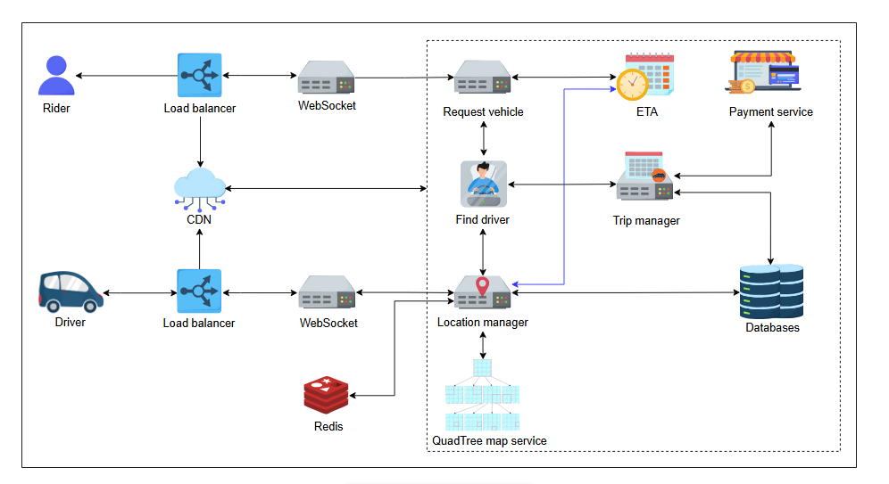
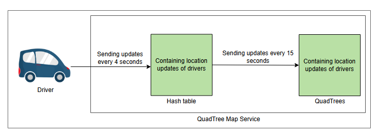
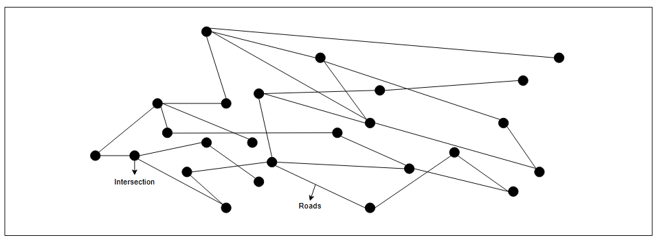
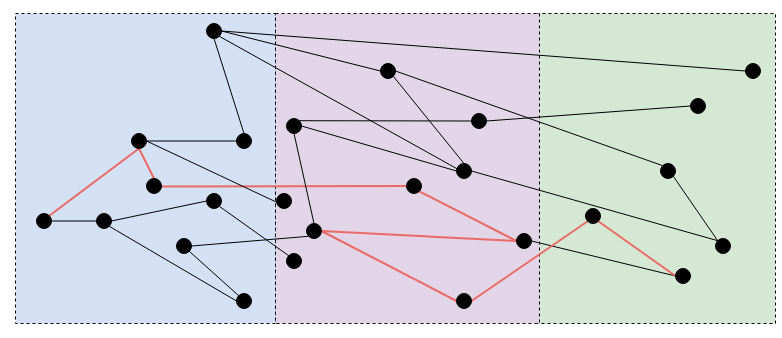
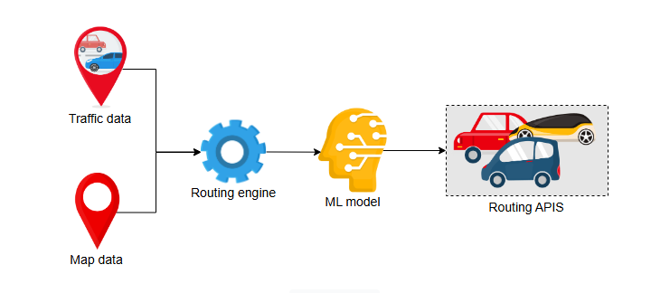
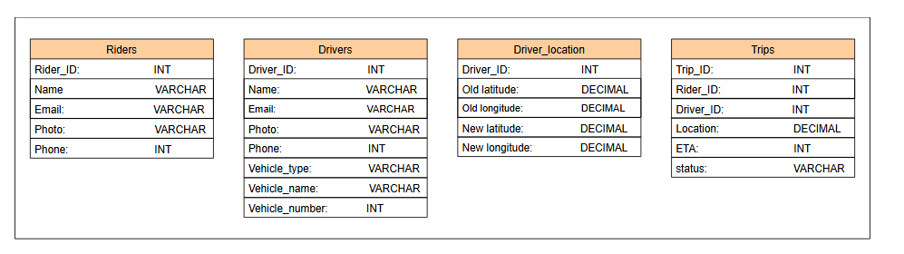

# Детальное проектирование Uber

Узнайте о детальном проектировании системы Uber.

Давайте рассмотрим детальное проектирование нашей системы Uber и узнаем, как различные компоненты работают вместе, чтобы предложить функционирующий сервис:

## Компоненты

Давайте подробно обсудим компоненты нашего дизайна системы Uber.

### Менеджер местоположений (Manager Locations)

Пассажиры и водители подключены к сервису **менеджера местоположений**. Этот сервис показывает пассажирам ближайших водителей, когда они открывают приложение. Сервис также получает обновления местоположения от водителей каждые четыре секунды. Затем местоположение водителей передается в сервис карт на основе QuadTree, чтобы определить, к какому сегменту на карте принадлежит водитель. Менеджер местоположений сохраняет последнее местоположение всех водителей в базе данных и сохраняет маршрут, по которому следовали водители во время поездки.

### Сервис карт на основе QuadTree (QuadTree Map Service)

**Сервис карт на основе QuadTree** обновляет местоположение водителей. Основная проблема заключается в том, как эффективно находить ближайших водителей.

Мы изменим решение, обсуждавшееся в главе о Yelp, в соответствии с нашими требованиями. В Yelp мы использовали **QuadTrees** для определения местоположения. QuadTrees помогают разделить карту на сегменты. Если количество водителей превышает определенный лимит, например, 500, то мы разделяем этот сегмент на четыре дочерних узла и распределяем водителей по ним.

Каждый листовой узел в QuadTrees содержит сегменты, которые нельзя разделить дальше. Мы можем использовать те же QuadTrees для поиска водителей. Самое существенное отличие сейчас заключается в том, что наш QuadTree не был разработан с учетом регулярных обновлений. Таким образом, у нас возникают следующие проблемы с нашим решением для динамических сегментов.

Мы должны обновлять наши структуры данных, чтобы отражать, что все активные водители обновляют свое местоположение каждые четыре секунды. Изменение QuadTree при каждом изменении положения водителя занимает много времени. Чтобы определить новое местоположение водителя, мы должны сначала найти соответствующую сетку на основе предыдущего положения водителя. Если новое местоположение не соответствует текущей сетке, мы должны удалить водителя из текущей сетки и переместить его в правильную. Нам придется переразбивать новую сетку, если она превысит лимит водителей, который мы установили изначально для каждого региона. Кроме того, наша платформа должна сообщать как водителю, так и пассажиру о текущем местоположении автомобиля во время поездки.

Чтобы преодолеть вышеуказанную проблему, мы можем использовать хэш-таблицу для хранения последнего положения водителей и обновлять наш QuadTree время от времени, скажем, через 10–15 секунд. Мы можем обновлять местоположение водителя в QuadTree примерно каждые 15 секунд вместо четырех, и использовать хэш-таблицу, которая обновляется каждые четыре секунды и отражает последнее местоположение водителей. Таким образом, мы используем меньше ресурсов и времени.

### Запрос транспортного средства (Request vehicle)

Пассажир обращается к сервису **запроса транспортного средства**, чтобы запросить поездку. Здесь пассажир добавляет место высадки. Затем сервис запроса транспортного средства связывается с сервисом поиска водителя, чтобы забронировать автомобиль и получить его детали, используя сервис менеджера местоположений.

### Поиск водителя (Find driver)

Сервис **поиска водителя** находит водителя, который может выполнить поездку. Он отправляет информацию о выбранном водителе и информацию о поездке обратно в сервис запроса транспортного средства, чтобы передать детали пассажиру. Сервис поиска водителя также связывается с менеджером поездок для управления информацией о поездке.

### Менеджер поездок (Trip manager)

Сервис **менеджера поездок** управляет всеми задачами, связанными с поездками. Он создает поездку в базе данных и хранит всю информацию о ней.

### Сервис ETA

**Сервис ETA** занимается расчетом предполагаемого времени прибытия. Он показывает пассажирам ETA подачи автомобиля, когда их поездка запланирована. Этот сервис учитывает такие факторы, как маршрут и трафик. Двумя основными компонентами для прогнозирования ETA для заданных начальной и конечной точек в дорожной сети являются:

*   Расчет кратчайшего маршрута от начальной до конечной точки.
*   Расчет времени, необходимого для прохождения маршрута.

Вся дорожная сеть представляется в виде графа. Перекрестки представлены узлами, а ребра — участками дорог. Граф также отображает улицы с односторонним движением, ограничения на повороты и скоростные лимиты.

Для определения кратчайшего пути между источником и пунктом назначения мы можем использовать алгоритмы маршрутизации, такие как алгоритм Дейкстры. Однако алгоритм Дейкстры или любой другой алгоритм, работающий на необработанном графе, довольно медленный для такой системы. Поэтому этот метод непрактичен в масштабах, в которых работают платформы вызова такси.

Чтобы решить эти проблемы, мы можем разбить весь граф на разделы. Мы предварительно обрабатываем оптимальный путь внутри разделов, используя **иерархии сжатия (contraction hierarchies)**, и работаем только с границами разделов. Эта стратегия может значительно сократить временную сложность, поскольку она разбивает граф на слои небольших ячеек, которые в значительной степени независимы друг от друга. Этап предварительной обработки выполняется параллельно в разделах, когда это необходимо для увеличения скорости. На иллюстрации ниже все разделы обрабатывают лучший маршрут параллельно. Например, если каждый раздел находит путь за одну секунду, мы можем получить полный путь за одну секунду, поскольку все разделы работают параллельно.

После того как мы определим лучший маршрут, мы рассчитываем ожидаемое время проезда по участку дороги с учетом трафика. Данные о трафике будут весами ребер между узлами.

#### DeepETA

Мы используем компонент машинного обучения под названием **DeepETA**, чтобы обеспечить немедленное улучшение метрик в продакшене. Он создает основу модели, которую можно повторно использовать для множества потребительских сценариев.

Мы также используем движок маршрутизации, который использует информацию о трафике в реальном времени и данные карт для прогнозирования ETA прохождения лучшего пути между источником и пунктом назначения. Мы используем модель машинного обучения для постобработки, которая учитывает пространственные и временные параметры, такие как источник, пункт назначения, время запроса и знания о трафике в реальном времени, для прогнозирования остаточного ETA.

### База данных

Давайте выберем базу данных в соответствии с нашими требованиями:

*   База данных должна иметь возможность горизонтального масштабирования. Новые клиенты и водители появляются регулярно, поэтому мы должны иметь возможность без проблем добавлять больше хранилища.
*   База данных должна обрабатывать большое количество чтений и записей, поскольку местоположение водителей обновляется каждые четыре секунды.
*   Наша система никогда не должна простаивать.

Мы уже обсуждали различные типы баз данных и их спецификации в главе Базы данных. Итак, в соответствии с нашим пониманием и требованиями (высокая доступность, высокая масштабируемость и отказоустойчивость), мы можем использовать **Cassandra** для хранения последнего известного местоположения водителя и информации о поездке после ее завершения, когда в нее больше не будет вноситься обновлений. Мы используем Cassandra, потому что объем хранимых нами данных огромен и постоянно растет.

Мы можем использовать базу данных MySQL для хранения информации о поездках, пока они находятся в процессе выполнения. Мы используем MySQL для текущих поездок из-за частых обновлений, так как информация о поездке является реляционной и должна быть согласованной между таблицами.

> **Примечание:** Недавно Uber перенесла свое хранилище данных на Google Cloud Spanner. Он предоставляет глобальные транзакции, строго согласованные чтения, а также функции автоматической репликации между несколькими сайтами и аварийного переключения.

---
>Мы используем как MySQL, так и Cassandra в дизайне Uber. Почему мы не можем использовать **только** MySQL или **только** Cassandra? Другими словами, в чем необходимость использования обеих баз данных?
>
> 

>  
<b>Показать ответ</b>

>
> Uber использует как MySQL, так и Cassandra, потому что каждая база данных оптимизирована для разных типов данных и нагрузок. MySQL отлично подходит для хранения высокореляционных данных, требующих согласованности, таких как детали поездок и информация о пользователях, где целостность данных между несколькими таблицами имеет решающее значение. Cassandra, с другой стороны, предназначена для обработки больших объемов данных с высокой пропускной способностью записи и масштабируемостью, что делает ее идеальной для хранения данных, меняющихся в реальном времени, таких как последние известные местоположения водителей и статусы поездок после их завершения. Использование обеих баз данных позволяет Uber использовать сильные стороны каждой из них, обеспечивая надежное управление данными и масштабируемую производительность. 
> 

---

#### Схема хранения

На базовом уровне в приложении Uber нам нужны следующие таблицы:

*   **Riders:** Мы храним информацию, связанную с пассажиром, такую как ID, имя, email, фото, номер телефона и т.д.
*   **Drivers:** Мы храним информацию, связанную с водителем, такую как ID, имя, email, фото, номер телефона, название автомобиля, тип автомобиля и т.д.
*   **Driver_location:** Мы храним последнее известное местоположение водителя.
*   **Trips:** Мы храним информацию, связанную с поездкой, такую как ID поездки, ID пассажира, ID водителя, статус, ETA, местоположение автомобиля и т.д.

Следующая иллюстрация визуализирует модель данных:

### Отказоустойчивость

Для обеспечения доступности нам необходимо иметь реплики нашей базы данных. Мы используем модель репликации "основной-вторичный" (primary-secondary). У нас есть одна основная база данных и несколько вторичных. Мы синхронно реплицируем данные с основной на вторичные базы данных. Всякий раз, когда наша основная база данных выходит из строя, мы можем использовать вторичную базу данных в качестве основной.

---

> Как мы будем справляться с медленной и прерывающейся сетью у водителя?
> 
> 

>  
<b>Показать ответ</b>

>
>    Мы можем использовать телефон водителя в качестве локального хранилища и сохранять там состояние поездки каждые несколько секунд. Все запросы и последнее записанное состояние хранятся на локальном диске, что гарантирует их сохранность даже при перезапуске приложения. Предположим, водитель выходит из приложения, когда есть несколько запросов, ожидающих синхронизации с сервером. При повторном запуске запросы и последнее известное состояние загружаются с локального диска. Когда водитель перезапускает приложение, он остается в той же ситуации, что и раньше. Запросы ставятся в очередь для поддержания актуальности данных на сервере.
> 

---

### Балансировщики нагрузки

Мы используем балансировщики нагрузки между клиентами (водителями и пассажирами) и серверами приложений для равномерного распределения нагрузки между серверами. Запросы направляются на указанный сервер, предоставляющий запрошенную услугу.

### Кэш

Миллион водителей должны отправлять обновленное местоположение каждые четыре секунды. Миллион запросов к сервису QuadTree влияет на его производительность. Для этого мы сначала сохраняем обновленное местоположение в хэш-таблице, хранящейся в Redis. В конечном итоге эти значения копируются в постоянное хранилище каждые 10–15 секунд.

Мы обсудили детальное проектирование Uber и то, как различные компоненты работают вместе для выполнения требований. В следующем уроке мы узнаем, как работает платежный сервис для перевода денег от пассажиров водителям и для обнаружения мошенничества.
