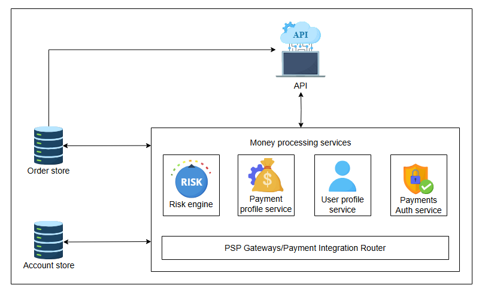
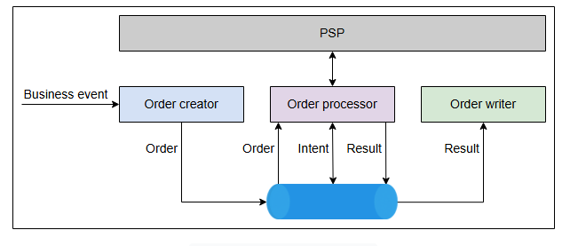
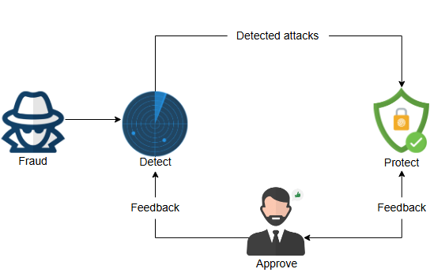

# Платежный сервис и обнаружение мошенничества в дизайне Uber

Узнайте, как работает платежный сервис Uber и как они борются с мошенничеством в платежах.

Цель этого урока — подчеркнуть необходимость защиты системы от злонамеренных действий. Мы обсудим мошеннические действия в контексте платежей. Сначала мы кратко рассмотрим, как работает платежная система, а затем расскажем, как защитить нашу систему от злонамеренных действий.

Платежный сервис занимается платежной стороной приложения Uber. Он включает в себя сбор оплаты с пассажира для передачи ее водителю. По завершении поездки он собирает информацию о поездке, рассчитывает стоимость и инициирует процесс оплаты.

## Основные функции

Платежная платформа Uber включает следующие функции:

*   **Новые способы оплаты**: Добавляет новые способы оплаты для пользователей.
*   **Авторизация**: **Авторизует** платежи по транзакциям.
*   **Возврат**: Возвращает ранее авторизованный платеж.
*   **Списание средств (Charging)**: Переводит деньги со счета пользователя на счет Uber.

## Что необходимо предотвращать

Для успешной работы платежной системы нам необходимо предотвращать следующие сценарии:

*   Отсутствие платежа
*   Дублирующиеся платежи
*   Некорректный платеж
*   Неправильная конвертация валюты
*   "Зависшая" авторизация

Платежная платформа Uber основана на методе **двойной записи (double-entry bookkeeping)**.

> Бухгалтерский учет с двойной записью, также известный как двойная бухгалтерия, - это метод ведения бухгалтерского учета, который основан на двусторонней бухгалтерской записи для хранения финансовой информации. Каждая запись по счету требует соответствующей и противоположной записи по другому счету.
> 
## Проектирование

Давайте рассмотрим дизайн платежной платформы в Uber и узнаем, как различные компоненты работают вместе для завершения транзакций:

Ключевыми компонентами, используемыми в платежном сервисе, являются:

*   **API**: API Uber используется для доступа к платежному сервису.
*   **Хранилище заказов (Order store)**: Здесь хранятся все заказы. Заказы собирают платежи и содержат информацию о движении денег между разными пассажирами и водителями.
*   **Хранилище счетов (Account store)**: Здесь хранятся все счета пассажиров и водителей.
*   **Движок оценки рисков (Risk engine)**: Движок оценки рисков анализирует различные риски, связанные со сбором платежа от конкретного пассажира. Он проверяет историю пассажира — например, его рейтинг, достаточно ли средств на его счету, наличие задолженностей, частоту отмен поездок и так далее.
*   **Сервис платежных профилей (Payment profile service)**: Предоставляет информацию о платежных механизмах, таких как кредитные и дебетовые карты.
*   **Сервис профилей пользователей (User profile service)**: Предоставляет информацию о платежах пользователей.
*   **Сервис авторизации платежей (Payment authorization service)**: Предлагает услуги аутентификации платежей.
*   **Шлюзы PSP (PSP gateways)**: Связывается с поставщиками платежных услуг.

### Рабочий процесс

Следующие шаги показывают рабочий процесс платежного сервиса:

1.  Когда пассажир запрашивает поездку, приложение Uber через API обращается к движку оценки рисков для проверки рисков.
2.  Движок оценки рисков получает информацию о пользователе из сервиса профилей пользователей и оценивает риски.
3.  Если риски высоки, запрос пассажира не обрабатывается.
4.  Если риски низки, движок создает токен авторизации и отправляет его в сервис платежных профилей (для учета), который получает этот токен и отправляет его в сервис авторизации платежей.
5.  Сервис авторизации платежей отправляет этот запрос в шлюз PSP, который связывается с поставщиком услуг для авторизации.
6.  Шлюз PSP отправляет токен авторизации обратно в сервис авторизации платежей, который, в свою очередь, отправляет токен в приложение Uber, подтверждая, что запрос на поездку одобрен.
7.  После завершения поездки приложение Uber через API отправляет запрос на оплату в шлюз PSP с данными авторизации.
8.  Шлюз PSP связывается с поставщиком услуг и отправляет статус обратно в приложение Uber через API.

Платежный сервис Uber построен на наборе микросервисов, сгруппированных в архитектуру потоковой обработки.

### Apache Kafka

**Kafka** — это программная платформа с открытым исходным кодом для **потоковой обработки**. Это основная технология, используемая в платежных сервисах. Давайте посмотрим, как Kafka помогает обработать заказ:

Создатель заказа (Order creator) получает бизнес-событие — например, поездка завершена. Создатель заказа формирует информацию о движении денег и метаданные. Затем он публикует эту информацию в Kafka. Kafka обрабатывает этот заказ и отправляет его обработчику заказов (Order processor). Обработчик заказов затем берет эту информацию из Kafka, обрабатывает ее и отправляет в Kafka как намерение (intent). После этого обработчик заказов снова обрабатывает его и связывается с PSP. Затем обработчик заказов получает ответ от PSP и передает его в Kafka как результат (result). Результат затем сохраняется писателем заказов (Order writer).

Ключевые возможности Kafka, которые использует платежный сервис:

*   Работает как очереди сообщений для публикации и подписки на них.
*   Хранит записи отказоустойчивым образом.
*   Обрабатывает платежные записи асинхронно.

## Обнаружение мошенничества

Обнаружение мошенничества является критически важным операционным компонентом нашего дизайна. Убытки от мошеннических платежей рассчитываются как процент от валовых сумм. Несмотря на то что мошеннические действия составляют небольшую часть валовых заказов, эти убытки значительно влияют на доходы. Более того, если злонамеренное поведение не будет своевременно обнаружено и пресечено, оно может быть использовано в дальнейшем, что приведет к значительным убыткам для бизнеса. Ранее мы обсуждали движок оценки рисков, который обнаруживает мошенничество до начала поездки. Здесь мы сосредоточимся на обнаружении мошенничества, которое происходит во время или в конце поездок.

Обнаружение мошенничества является сложной задачей, поскольку многие случаи мошенничества похожи на обнаружение уязвимостей нулевого дня. Поэтому нашей системе необходим интеллект для выявления аномалий, а также ответственность за автоматизированные решения в виде аудитов, проводимых человеком.

Действия, которые Uber считает мошенническими:

*   Водитель намеренно и нечестным образом увеличивает время или расстояние поездки, например, выбирая значительно более длинный маршрут.
*   Водитель манипулирует данными GPS или использует приложения с поддельным местоположением.
*   Водитель подтверждает поездки без намерения их выполнять, вынуждая пассажиров отменять их.
*   Водитель создает поддельные аккаунты водителей или пассажиров в мошеннических целях.
*   Водитель предоставляет неверную или неточную информацию о себе при открытии аккаунта.
*   Водитель использует автомобиль, не одобренный Uber.
*   Водитель требует мошеннические сборы или платежи, такие как необоснованные сборы за уборку.
*   Водитель умышленно подтверждает или завершает мошеннические поездки.

### RADAR

Uber представил **RADAR**, решение для обнаружения и предотвращения мошенничества на базе ИИ с участием человека, чтобы справляться с обсуждаемыми сценариями мошенничества. Система RADAR обнаруживает мошенничество, анализируя временные ряды активности платежной системы. Затем она генерирует правило для этого и останавливает дальнейшую обработку. Этот проактивный подход помогает обнаруживать невиданное ранее мошенничество в реальном времени. Эта модель обнаружения также использует человеческие знания для постоянного совершенствования. Здесь мы кратко обсудим, как работает RADAR:

RADAR распознает начало попытки мошенничества и создает правило для ее предотвращения. На следующем этапе подключается аналитик по мошенничеству. Он рассматривает правило и, при необходимости, утверждает или отклоняет его. Затем он отправляет обратную связь (одобрено или не одобрено) в систему защиты. Обратная связь также отправляется аналитиками в систему обнаружения мошенничества для улучшения ее работы.

Кроме того, система анализирует данные в следующих временных измерениях:

*   Она анализирует время поездки после ее завершения. В мониторинге поездок в реальном времени участвует множество факторов. Например, система может проверить, совпадают ли местоположения водителя и пассажира. Система также может отслеживать скорость и анализировать реальный трафик, чтобы проверить, едет ли водитель намеренно медленно или есть пробка.
*   Время расчета по платежу относится к получению данных об обработке платежа. На это могут уйти дни или недели.

Мы только что обсудили основные детали того, насколько важна защита от злонамеренных действий в больших масштабах для успеха бизнеса. В предложенной модели участвуют эксперты-люди, что потенциально снижает масштабируемость системы. Ведутся исследования о том, как обеспечить справедливость и этичность решений, принимаемых системой ИИ.
